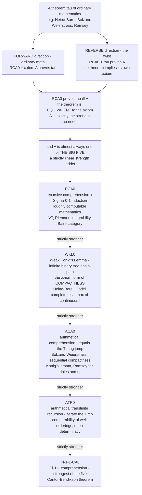

# 🪞 Reverse Mathematics

> [!abstract] TL;DR
> Ordinary mathematics runs *forward*: fix your axioms, then prove theorems. **Reverse mathematics** — the **Friedman–Simpson program** — runs the movie *backward*. It fixes a deliberately **weak base theory** (`RCA₀`, "recursive comprehension" ≈ *computable mathematics*) and asks, for each famous theorem `τ` of ordinary math, exactly **which axioms are necessary** to prove it. The signature move is the **reverse implication**: not only "axioms `A` ⟹ theorem `τ`", but also "`τ` ⟹ `A`" *over the base* — so `RCA₀` proves `τ ⟺ A`, meaning **the theorem is logically equivalent to the very axiom that proves it** (the steel *is* the bridge). The astonishing empirical payoff: nearly every theorem of classical mathematics turns out equivalent to one of just **five** standard subsystems — **`RCA₀ ⊂ WKL₀ ⊂ ACA₀ ⊂ ATR₀ ⊂ Π¹₁-CA₀`**, the **"Big Five"** — a mysterious, robust *linear* ordering of the logical strength hidden inside mathematics.

---

## Intuition

**Analogy — reading the recipe backward to find the one irreplaceable ingredient.** Normally you *follow* a recipe forward: given flour, eggs, and heat, you get a cake. Reverse mathematics starts from the *finished cake* and asks a strange question — *which single ingredient could I not have skipped?* — and then discovers something wilder still: for this cake, **having the cake is the same as having that ingredient**. If you handed someone the cake, they could hand you back exactly that much flour; the two are *interchangeable*. That two-way street — theorem ⟹ axiom, not merely axiom ⟹ theorem — is the "reverse" in reverse mathematics.

Now the deep part. Take a hundred cornerstone theorems of analysis, algebra, and combinatorics — the intermediate value theorem, Heine–Borel compactness, Bolzano–Weierstrass, Ramsey's theorem, the comparability of well-orderings. For each, dig out the *minimum* axiomatic strength it truly consumes, working over one fixed weak base. You would expect a sprawling, tangled zoo of strengths. Instead, **almost every theorem lands on one of only five rungs**, and those five rungs are **linearly ordered** — each strictly stronger than the last. It is as if all of mathematics, when weighed on the logician's scale, quantizes into five discrete weights. That empirical regularity — nobody *designed* it — is the great surprise of the subject, and the reason it feels less like bookkeeping and more like discovering a hidden law.

---

## How It Works

### Core Mechanics

1. **The arena: second-order arithmetic.** The objects are **natural numbers** (first-order variables `n, m, …`) and **sets of natural numbers** (second-order variables `X, Y, …`). This two-sorted language is expressive enough to *encode* the real numbers (as Cauchy sequences of rationals), continuous functions, open sets, countable groups, complete separable metric spaces — essentially all of "ordinary" (non-set-theoretic) mathematics. A **subsystem** is second-order arithmetic with the **set-existence axioms restricted**: it agrees on numbers but disagrees on *which sets are guaranteed to exist*.

2. **The base theory `RCA₀`.** "Recursive Comprehension Axiom." It provides basic arithmetic, **Σ⁰₁ induction**, and set existence **only for computable (Δ⁰₁-definable) sets**. Morally, `RCA₀` is *computable mathematics*: you may form a set only if there is an algorithm that decides membership. It is strong enough to develop basic number theory and elementary analysis, yet too weak to prove most compactness/limit theorems — which is exactly what makes it a good *measuring stick*.

3. **Calibrating a theorem `τ`.** Two directions:
   - **Forward (ordinary):** find axioms `A` with `RCA₀ + A ⊢ τ` — `A` *suffices* to prove `τ`.
   - **Reverse (the twist):** show `RCA₀ + τ ⊢ A` — the theorem *implies* the axiom back, over the base.
   Combine them: `RCA₀ ⊢ (τ ⟺ A)`. Now `τ` is **provably equivalent to `A`** — the theorem and the axiom carry *identical logical strength*. You have found not an upper bound on `τ`'s cost, but its **exact price**.

4. **The "Big Five" ladder.** In practice the axiom `A` is almost always one of five canonical set-existence principles, strictly increasing in strength:
   - **`RCA₀`** — recursive/computable sets. (IVT, Riemann integrability live here.)
   - **`WKL₀`** — `RCA₀` + **Weak König's Lemma**: every infinite subtree of the binary tree `2^{<ℕ}` has an infinite path. This is the axiomatic form of **compactness**.
   - **`ACA₀`** — `RCA₀` + **Arithmetical Comprehension**: sets definable by arbitrary arithmetical (first-order) formulas exist. Equivalent to the **Turing jump** being total; captures limits/suprema of sequences.
   - **`ATR₀`** — `RCA₀` + **Arithmetical Transfinite Recursion**: you may *iterate* the jump along any countable well-ordering. The realm of comparing well-orderings.
   - **`Π¹₁-CA₀`** — comprehension for `Π¹₁` (one universal set-quantifier) formulas. The strongest of the five; handles Cantor–Bendixson-style theorems.

5. **The empirical "Main Theme."** Across thousands of theorems, the overwhelming majority are provably equivalent (over `RCA₀`) to exactly one of these five. This robustness is unexplained at a deep level — there is no theorem *forcing* mathematics to quantize this way — yet it holds with remarkable consistency. A handful of important exceptions (notably **Ramsey's theorem for pairs**, `RT²₂`) live *between* the rungs and drive much modern research.

6. **The computability bridge.** `WKL₀`'s content is precisely computability-theoretic: there exist infinite computable binary trees with **no computable path** (the tree of "stages that avoid coding the halting set"), so `WKL₀` genuinely exceeds `RCA₀`. Yet by the **Low Basis Theorem** every such tree has a path of *low* Turing degree — so `WKL₀` adds compactness *without* adding the full jump. `ACA₀` corresponds to closure under the **Turing jump**; `ATR₀` to iterating it along ordinals. Reverse math and **recursion theory** (see *[[Computability_and_Recursion_Theory]]*) are two faces of the same measurements — often studied via **ω-models** whose second-order part is a Turing ideal.

7. **What this is philosophically.** It is **foundational reductionism made quantitative**: "which axioms does ordinary mathematics *really need*?" `WKL₀` and `RCA₀` are **conservative** over weak base theories for large classes of sentences, realizing a partial version of **Hilbert's program** and **predicativity** — showing that big chunks of analysis are secretly *finitistically* or *predicatively* reducible.

### Flow / Architecture



*Forward and reverse implications together pin a theorem to an axiom of equal strength; that axiom is nearly always one of the five linearly-ordered subsystems.*

---

## Key Concepts

### Secondary (intuitive, no advanced background needed)

- **Forward vs reverse.** Forward math proves theorems *from* axioms. Reverse math starts from a theorem and hunts down the *exact* axiom it is secretly equivalent to.
- **"Equivalent," not just "provable."** The headline is a *two-way* street: the axiom proves the theorem **and** the theorem proves the axiom. They are logically interchangeable.
- **A weak starting point on purpose.** You must measure from a low, fixed baseline (`RCA₀`, "computable mathematics") — otherwise a strong theory would prove everything and you could measure nothing.
- **The surprise.** Weigh the great theorems of math and they don't scatter — almost all fall onto **one of five discrete weights**, neatly stacked from weakest to strongest.

### Undergraduate (a first course in logic / foundations)

- **Second-order arithmetic (`Z₂`).** Two sorts: numbers and *sets* of numbers. Reals, continuous functions, and open sets are all *coded* into it. Subsystems weaken the **comprehension** (set-existence) axioms.
- **`RCA₀` = the base.** Δ⁰₁ (computable) comprehension + Σ⁰₁ induction. Proves IVT and Riemann integrability of continuous functions but **not** Heine–Borel or Bolzano–Weierstrass.
- **`WKL₀` and compactness.** Weak König's Lemma (infinite binary tree ⟹ infinite path) is *equivalent over `RCA₀`* to Heine–Borel compactness of `[0,1]`, to the **Gödel completeness theorem**, to "a continuous function on `[0,1]` attains its maximum," and to Cauchy–Peano existence for ODEs.
- **`ACA₀` and limits.** Arithmetical comprehension is *equivalent* to Bolzano–Weierstrass, to sequential compactness, to (full, finitely-branching) König's Lemma, and to Ramsey's theorem for triples and higher.
- **The reverse implication is the work.** Proving `A ⟹ τ` is standard; proving `τ ⟹ A` (that the theorem is *at least as strong* as the axiom) is the characteristic reverse-math step and usually the hard one.

### Graduate (proof theory / recursion theory depth)

- **ω-models and Turing ideals.** An **ω-model** has the true natural numbers but a chosen family of sets closed under Turing reducibility and join (a *Turing ideal*). `RCA₀` ↔ ideals closed under `≤_T`; `ACA₀` ↔ closure under the **Turing jump**; `WKL₀` ↔ ideals meeting every infinite computable binary tree (Low Basis / `WKL` semantics).
- **`RT²₂`, the famous exception.** Ramsey's theorem for pairs and two colors is **not** equivalent to any of the Big Five: it lies strictly between `RCA₀` and `ACA₀`, does **not** imply `WKL₀`, is `Π¹₁`-conservative over `RCA₀ + IΣ⁰₂`, and its Turing-degree analysis (Seetapun, Cholak–Jockusch–Slaman) launched a whole industry. Robustness has genuine limits.
- **Proof-theoretic ordinals & consistency strength.** Each subsystem has an associated **proof-theoretic ordinal**: `RCA₀`/`WKL₀` sit at `ω^ω`, `ACA₀` at `ε₀` (matching **Peano arithmetic**), `ATR₀` at the **Feferman–Schütte** ordinal `Γ₀` (the predicativity boundary), `Π¹₁-CA₀` far above. Ordinal analysis measures the *consistency strength* these systems consume (see the sibling *Proof_Theory_and_Ordinal_Analysis*).
- **Conservation results.** `WKL₀` is `Π¹₁`-conservative over `RCA₀` and `Π⁰₂`-conservative over primitive recursive arithmetic — a precise realization of a partial **Hilbert program**: the compactness-heavy analysis provable in `WKL₀` proves no new arithmetic facts, so it is *finitistically reducible*.
- **Connection to constructive/computable math.** `RCA₀` proofs carry **computable content** (a function proved to exist is computable); moving up the ladder tracks exactly *where* classical mathematics is forced to invoke non-constructive principles (choice fragments, `WKL` as a compactness/König crutch, the law of excluded middle over infinite sets).

---

## Python Demo

The demo makes two things concrete: (a) the **Big Five as a linear strength ladder** with famous theorems placed at their equivalence level (the reverse-math *calibration*), and (b) one equivalence *flavor* computed by hand — **Weak König's Lemma**: an infinite, finitely-branching binary tree must contain an infinite path, which is exactly the combinatorial content of **Heine–Borel compactness** (both are `WKL₀` over `RCA₀`).

```python
# ============================================================================
# REVERSE MATHEMATICS -- calibrating theorems by AXIOMATIC STRENGTH.
# numpy + matplotlib only.
#
# PART A: the "BIG FIVE" subsystems of second-order arithmetic drawn as a
#         LINEAR strength ladder, with famous theorems placed at the exact
#         subsystem they are provably EQUIVALENT to (over the base RCA0).
#
# PART B: one concrete equivalence FLAVOR -- Weak Konig's Lemma (WKL).
#         WKL says every infinite binary tree has an infinite path. That
#         existence claim IS the content of Heine-Borel compactness of [0,1];
#         over RCA0 the two are PROVABLY EQUIVALENT (both are exactly WKL0).
#         We build a concrete infinite binary tree and extract a path by
#         Konig's argument (always descend into a still-infinite subtree).
# ============================================================================

import numpy as np
import matplotlib.pyplot as plt
from matplotlib.patches import Rectangle

# ---- PART A data: the five subsystems, ordered by increasing strength ------
BIG_FIVE = [
    ("RCA0",       1, "recursive comprehension"),
    ("WKL0",       2, "Weak Konig's Lemma"),
    ("ACA0",       3, "arithmetical comprehension"),
    ("ATR0",       4, "arith. transfinite recursion"),
    ("Pi-1-1-CA0", 5, "Pi-1-1 comprehension"),
]

# theorem calibrations (from Simpson, Subsystems of Second-Order Arithmetic)
THEOREMS = {
    1: ["Intermediate Value Theorem",
        "Riemann integrability of continuous f",
        "Baire Category Theorem"],
    2: ["Heine-Borel compactness of [0,1]",
        "Godel Completeness Theorem",
        "continuous f on [0,1] attains its max",
        "Cauchy-Peano ODE existence"],
    3: ["Bolzano-Weierstrass theorem",
        "sequential compactness of [0,1]",
        "Konig's Lemma (finitely branching)",
        "Ramsey's theorem for triples and up"],
    4: ["comparability of well-orderings",
        "open (Sigma-0-1) determinacy",
        "perfect set theorem"],
    5: ["Cantor-Bendixson theorem"],
}
COLORS = ["#2ecc71", "#16a085", "#2980b9", "#8e44ad", "#c0392b"]

print("=" * 70)
print("REVERSE MATHEMATICS -- theorems calibrated by axiomatic strength")
print("=" * 70)
for name, lvl, desc in BIG_FIVE:
    print(f"\nLevel {lvl}  {name:11s} ({desc})")
    for th in THEOREMS[lvl]:
        print(f"     RCA0 proves:  <theorem>  <==>  {th}")

# ---------------------------------------------------------------------------
# PART B -- WEAK KONIG'S LEMMA and compactness, computed.
# Tree T over {0,1}* := every binary string with NO '11' substring.
# T is INFINITE (e.g. 010101... stays in it) and binary-branching, so WKL
# guarantees an infinite path. Konig's construction: at each node, descend
# into a child whose subtree is STILL infinite.
# ---------------------------------------------------------------------------
def in_tree(s):
    "Membership in the tree: no two consecutive 1s."
    return "11" not in s

def subtree_infinite(s, look=16):
    "Honest finite check: does some descendant of s survive to depth len(s)+look?"
    frontier = [s]
    for _ in range(look):
        frontier = [c + b for c in frontier for b in "01" if in_tree(c + b)]
        if not frontier:
            return False          # the subtree died out -> finite
    return True                    # still alive after 'look' levels -> infinite

# Konig's argument: prefer '1' (to expose the '11' pruning), fall back to '0'.
path, node = [], ""
for _ in range(9):
    chosen = None
    for b in ("1", "0"):
        child = node + b
        if in_tree(child) and subtree_infinite(child):
            chosen = child
            break
    if chosen is None:
        break
    path.append(chosen)
    node = chosen

print("\n" + "-" * 70)
print("WEAK KONIG'S LEMMA in action  (tree = binary strings with no '11'):")
print("  infinite path found by Konig's argument:", path[-1] if path else "(none)")
print("  EXISTENCE of this path  ==  Heine-Borel compactness of [0,1];")
print("  over RCA0 the two statements are PROVABLY EQUIVALENT (both are WKL0).")

# ---------------------------------------------------------------------------
# VISUALIZATION
# ---------------------------------------------------------------------------
fig, (axL, axR) = plt.subplots(1, 2, figsize=(15, 7.4))

# ---- LEFT: the Big Five strength ladder ----
axL.set_xlim(-0.4, 10); axL.set_ylim(0.3, 5.9)
for (name, lvl, desc), col in zip(BIG_FIVE, COLORS):
    axL.add_patch(Rectangle((0.2, lvl - 0.34), 2.9, 0.68,
                            facecolor=col, edgecolor="black", alpha=0.9))
    axL.text(1.65, lvl + 0.10, name, ha="center", va="center",
             fontsize=12, fontweight="bold", color="white")
    axL.text(1.65, lvl - 0.16, desc, ha="center", va="center",
             fontsize=6.3, color="white")
    axL.text(3.35, lvl, "\n".join("- " + t for t in THEOREMS[lvl]),
             ha="left", va="center", fontsize=7.4)
    if lvl < 5:
        axL.annotate("", xy=(1.65, lvl + 0.66), xytext=(1.65, lvl + 0.34),
                     arrowprops=dict(arrowstyle="-|>", color="black", lw=1.3))
        axL.text(2.35, lvl + 0.5, "strictly\nstronger", fontsize=5.6, va="center")
axL.annotate("", xy=(-0.15, 5.7), xytext=(-0.15, 0.5),
             arrowprops=dict(arrowstyle="-|>", color="black", lw=2))
axL.text(-0.32, 3.1, "increasing logical strength", rotation=90,
         ha="center", va="center", fontsize=9, fontweight="bold")
axL.set_title("The BIG FIVE ladder: theorems of ordinary mathematics\n"
              "each EQUIVALENT to a subsystem of Z2 (over RCA0)", fontsize=10.5)
axL.axis("off")

# ---- RIGHT: the WKL infinite-path tree ----
def layout(s):
    x, step = 0.5, 0.25
    for b in s:
        x += (step if b == "1" else -step)
        step /= 2.0
    return x, -len(s)

Dmax, level = 6, [""]
present = {""}
for _ in range(Dmax):
    level = [c + b for c in level for b in "01" if in_tree(c + b)]
    present |= set(level)

pathset = set(path)
for s in sorted(present, key=len):
    if s == "":
        continue
    x0, y0 = layout(s[:-1]); x1, y1 = layout(s)
    onpath = (s in pathset) and (s[:-1] in pathset or s[:-1] == "")
    axR.plot([x0, x1], [y0, y1],
             color="#c0392b" if onpath else "#bdc3c7",
             lw=2.6 if onpath else 1.0, zorder=1)
for s in present:
    x, y = layout(s)
    onp = (s in pathset) or (s == "")
    axR.scatter([x], [y], s=90 if onp else 42,
                color="#c0392b" if onp else "#7f8c8d",
                edgecolor="black", linewidth=0.5, zorder=2)
axR.text(0.5, 0.55, "root", ha="center", fontsize=8)
axR.text(0.5, -6.9,
         "infinite finitely-branching tree (no '11')  ->  WKL yields an infinite path (red)\n"
         "that path IS the Heine-Borel compactness content -- both are WKL0 over RCA0",
         ha="center", fontsize=8.2)
axR.set_title("Weak Konig's Lemma: an infinite binary tree\n"
              "MUST contain an infinite path (red)", fontsize=10.5)
axR.set_xlim(0, 1); axR.set_ylim(-7.4, 0.9)
axR.axis("off")

plt.tight_layout()
plt.savefig("reverse_mathematics.png", dpi=130)
print("\nSaved figure -> reverse_mathematics.png")
```

Part A prints and draws the calibration table as a ladder: IVT and Riemann integrability sit on `RCA₀`; Heine–Borel, Gödel completeness, and "a continuous function attains its max" all land together on `WKL₀`; Bolzano–Weierstrass, sequential compactness, and Ramsey-for-triples cluster on `ACA₀`; comparability of well-orderings on `ATR₀`; Cantor–Bendixson on `Π¹₁-CA₀`. Seeing genuinely different theorems *pile onto the same rung* is the visual form of the Main Theme. Part B then *computes* one equivalence: it builds a concrete infinite binary tree, runs König's argument (always step into a child whose subtree is still infinite), and extracts the alternating path `1010…` — a hands-on instance of the principle whose axiomatic form, `WKL₀`, is provably equivalent over `RCA₀` to Heine–Borel compactness.

---

## Real-World Applications

> **Example — pinning down exactly how much "infinite" a proof secretly uses.** When a numerical analyst proves that a continuous function on `[0,1]` attains its maximum, they invoke compactness *without noticing*. Reverse mathematics reveals that this innocuous step is precisely `WKL₀` — strictly stronger than the computable base — and, via the **Low Basis Theorem**, that the witnessing point can always be taken of *low* complexity. That is not idle: it tells you the theorem has **no algorithm** producing the maximizer in general, yet its non-computability is *shallow*, which is exactly the kind of guarantee that constructive/computable-analysis toolchains (and their extraction of programs from proofs) depend on.

- **Constructive and computable mathematics / proof mining.** Because `RCA₀` proofs carry **computable content**, knowing a theorem's calibration tells you whether an algorithm (and what complexity) can be *extracted* from a classical proof — the engine behind **proof mining** (Kohlenbach's program) that turns ineffective analysis proofs into explicit bounds used in optimization and ergodic theory.
- **Foundations of practice: which axioms does mathematics *need*?** Reverse math gives a *quantitative* answer to reductionist questions — showing large tracts of analysis are `WKL₀`-reducible (hence finitistically justified) realizes a partial **Hilbert program**, and the `ATR₀` boundary marks the frontier of **predicative** mathematics (Feferman–Schütte `Γ₀`).
- **Combinatorics and computability of Ramsey theory.** The stubborn `RT²₂` case fuels a rich program in **recursion theory** (degrees of solutions to combinatorial problems), directly informing *how hard it is to compute* a monochromatic set — a concern echoed in algorithm design for Ramsey-type guarantees.
- **Automated reasoning and formalization.** Projects formalizing analysis in proof assistants must choose a logical strength; reverse-math calibrations tell library designers exactly which comprehension principle a given theorem forces, guiding minimal-axiom developments.
- **Teaching the anatomy of theorems.** It supplies a precise vocabulary — "this is a `WKL₀` fact, that is an `ACA₀` fact" — that classifies the *character* of arguments (compactness vs limit-existence vs transfinite recursion) far more sharply than informal intuition.

---

## Common Pitfalls

- **Forgetting that "equivalent" is relative to the base `RCA₀`.** The whole subject is *provable equivalence over the base theory*. "`τ ⟺ WKL₀`" is a statement inside `RCA₀`; change the base and the calibration can change. Never quote an equivalence without its base — reverse math without `RCA₀` (or another fixed weak base) is meaningless.
- **Treating the reverse direction as automatic.** "`A ⟹ τ`" (an ordinary proof) is only half. The *reverse* — `RCA₀ + τ ⊢ A`, the theorem re-deriving its own axiom — is the substantive, often difficult, and easily-overlooked half. Skipping it gives an upper bound on strength, **not** an equivalence.
- **Expecting *every* theorem to be one of the Big Five.** The robustness is empirical, not a law. Important exceptions live *between* the rungs — most famously **Ramsey's theorem for pairs `RT²₂`**, which is not equivalent to any Big Five system and does not even imply `WKL₀`. Do not over-claim the linearity.
- **Confusing logical strength with difficulty or importance.** A `Π¹₁-CA₀` theorem is *logically stronger* than an `RCA₀` theorem, not "harder to understand" or "more useful." Strength measures set-existence demands, nothing else.
- **Ignoring the computability reading.** `WKL₀ > RCA₀` *because* there are infinite computable binary trees with no computable path; `ACA₀` corresponds to the **Turing jump**. Missing this makes the ladder look like arbitrary syntax rather than the calibrated hierarchy of *computable content* it actually is — the tie to *[[Computability_and_Recursion_Theory]]* is not decoration, it is the mechanism.
- **Mistaking `WKL₀`'s completeness link for Gödel's incompleteness.** `WKL₀` proving the Gödel *completeness* theorem (a `⊢ = ⊨` result, see *[[Soundness_and_Completeness]]*) is unrelated to the *incompleteness* theorems; conflating the two is a classic error.

---

## Related Concepts

- [[Computability_and_Recursion_Theory]] — the computability backbone: `WKL₀ > RCA₀` because computable infinite binary trees can lack computable paths, and `ACA₀` corresponds to the Turing jump; ω-models are Turing ideals.
- [[Soundness_and_Completeness]] — the Gödel **completeness** theorem is one of the canonical statements *equivalent to `WKL₀`* over `RCA₀`; a headline reverse-math calibration in logic itself.
- [[Ordinals_and_Cardinals]] — proof-theoretic ordinals (`ε₀` for `ACA₀`, the Feferman–Schütte `Γ₀` for `ATR₀`) measure each subsystem's consistency strength; `ATR₀` is *about* comparing well-orderings.
- [[Ramsey_Theory]] — Ramsey's theorem for triples-and-up is equivalent to `ACA₀`, while the pairs case `RT²₂` is the famous exception living *between* the Big Five rungs.
- [[Mathematical_Logic_and_Set_Theory]] — situates reverse math within the broader foundations; second-order arithmetic is the arena where "which axioms does math need?" becomes precise.
- [[The_Axiom_of_Choice_and_Equivalents]] — reverse math tracks exactly where classical proofs invoke choice/compactness fragments; `WKL₀` is a weak, arithmetic cousin of choice-flavored existence principles.
- [[Metric_Spaces]] — Heine–Borel compactness of `[0,1]`, coded in second-order arithmetic, is equivalent to `WKL₀`; the calibration of compactness is the flagship example.
- [[Sequences_and_Limits_in_Analysis]] — the Bolzano–Weierstrass theorem is a canonical statement equivalent to `ACA₀` (limit/supremum existence needs the jump).
- [[Continuity_and_Uniform_Continuity]] — the Intermediate Value Theorem is provable already in the weak base `RCA₀`; "continuous ⟹ attains max on `[0,1]`" jumps up to `WKL₀`.
- [[Riemann_Integration_Analysis]] — Riemann integrability of continuous functions sits at the base level `RCA₀`, a benchmark for "computable analysis."
- [[Logic_and_Proof_Techniques]] — the forward/reverse implication structure is a study in the *direction* of proof; reverse math is proof-direction taken to its logical extreme.

*Prose-only siblings in this section (notes not yet in the vault): **Second_Order_and_Higher_Order_Logic** (the logic whose subsystems reverse math dissects), **Proof_Theory_and_Ordinal_Analysis** (the ordinals `ε₀`, `Γ₀` that gauge each subsystem's strength), **Godels_Incompleteness_Theorems** (why the base must be weak and effectively axiomatized), **Peano_Arithmetic_and_Formal_Number_Theory** (`ACA₀` is conservative over PA, sharing the ordinal `ε₀`), and **Turing_Degrees_and_the_Priority_Method** (the degree-theoretic machinery behind `RT²₂` and ω-model constructions).*

---

## Review Questions

### Secondary

1. In your own words, what makes reverse mathematics "reverse"? Using the cake/ingredient analogy, explain the difference between "axiom `A` proves theorem `τ`" and "`τ` is *equivalent* to `A`."
2. Why must reverse mathematics measure everything from a deliberately *weak* base theory rather than from a strong one? What goes wrong if the base is already very powerful?
3. What is the single most surprising empirical finding of the field, and why would a mathematician find it unexpected?

### Undergraduate

1. State precisely what it means for a theorem `τ` to be "equivalent to `WKL₀` over `RCA₀`," naming *both* implications you must establish. Which direction is the characteristically reverse-math step, and why is it usually the harder one?
2. Give three theorems that are provably equivalent to `WKL₀` and three that are equivalent to `ACA₀`. What informal *character* distinguishes the two rungs (what kind of mathematical move forces the jump from `WKL₀` up to `ACA₀`)?
3. Explain why the Intermediate Value Theorem is provable in `RCA₀` but "a continuous function on `[0,1]` attains its maximum" is not — and what compactness principle the latter secretly needs.

### Graduate

1. Explain the computability-theoretic reason `WKL₀` is strictly stronger than `RCA₀` (exhibit the phenomenon), and then explain, via the **Low Basis Theorem**, why `WKL₀` is nonetheless *weaker* than `ACA₀`. Frame both in terms of **ω-models / Turing ideals**.
2. Ramsey's theorem for pairs `RT²₂` is the celebrated exception to the "Big Five." Summarize its known position: why it does not imply `WKL₀`, its `Π¹₁`-conservativity over `RCA₀ + IΣ⁰₂`, and why its analysis is done in the **Turing degrees** rather than by a clean equivalence.
3. Relate the Big Five to **proof-theoretic ordinals** (`ε₀` for `ACA₀`, `Γ₀` for `ATR₀`) and to **conservation results** (`WKL₀` is `Π¹₁`-conservative over `RCA₀`). Explain how these facts realize a *partial* Hilbert program and mark the boundary of **predicative** mathematics.

---

## Sources

- Simpson, S. G. *Subsystems of Second Order Arithmetic*, 2nd ed. Perspectives in Logic, Cambridge University Press / ASL, 2009 — the definitive reference; defines the Big Five and proves the core equivalences.
- Friedman, H. "Some Systems of Second Order Arithmetic and Their Use." *Proceedings of the International Congress of Mathematicians* (Vancouver, 1974), Vol. 1, 235–242 — the founding paper of the program.
- Stillwell, J. *Reverse Mathematics: Proofs from the Inside Out*. Princeton University Press, 2018 — accessible narrative introduction to the Big Five and the calibration idea.
- Dzhafarov, D. D. and Mummert, C. *Reverse Mathematics: Problems, Reductions, and Proofs*. Theory and Applications of Computability, Springer, 2022 — modern graduate text emphasizing the computability-theoretic and `RT²₂`-era developments.
- Simpson, S. G. (ed.). *Reverse Mathematics 2001*. Lecture Notes in Logic 21, ASL, 2005 — survey volume mapping the field's landscape beyond the Big Five.

---

#mathematical-logic #reverse-mathematics #second-order-arithmetic #big-five #proof-theory
