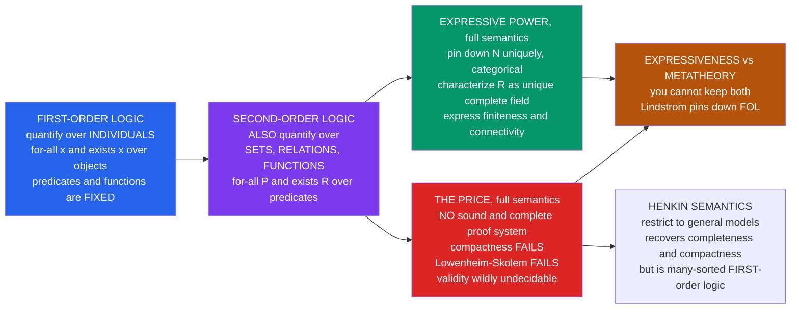

# 🪜 Second-Order and Higher-Order Logic

> [!abstract] TL;DR
> **First-order logic** lets you quantify over *individuals* — "for all numbers $x$…". **Second-order logic (SOL)** lifts the ceiling: you can quantify over *properties, relations, sets, and functions* themselves — "for all subsets $P$ of the numbers…". This tiny-looking upgrade is enormously powerful: SOL can **pin down $\mathbb{N}$ uniquely** (the second-order induction axiom is *categorical* — no nonstandard models) and **characterize $\mathbb{R}$ exactly** (the unique Dedekind-complete ordered field), and it can express finiteness, well-ordering, and connectivity — all *provably impossible* in first-order logic. But there is a devil's bargain. With its intended (**full / standard**) semantics, SOL **loses** the completeness theorem, compactness, and Löwenheim-Skolem; its validity is not even arithmetically definable. **Henkin semantics** restores good behavior — but at that point SOL is just many-sorted first-order logic in disguise. Expressive power and well-behaved metatheory are in fundamental tension.

---

## Intuition

**Analogy — the librarian who can finally talk about *shelves*, not just *books*.** Picture a library. A *first-order* librarian can make statements about individual books: "every book has an author," "there exists a book longer than 500 pages," "for all books $x$, if $x$ is on loan then $x$ is not on the shelf." What she *cannot* say, in that language, is anything ranging over *collections* of books — "there is a **set** of books that between them cover every topic," or "**every property** a book can have is either shared by infinitely many books or by finitely many." To talk about arbitrary *shelves* (sets), *pairings* (relations), and *cataloguing rules* (functions) as objects you can quantify over, she needs to climb one level up. That climb is exactly what **second-order logic** provides: alongside `∀x` over books it adds `∀P` and `∃R` ranging over all possible *properties and relations* of books.

That one extra rung is deceptively powerful. In first-order arithmetic you can only assert induction one formula at a time (an *infinite schema*), and the theorem of Löwenheim-Skolem guarantees sneaky "nonstandard" models with infinite integers slip through (see *Compactness_and_Lowenheim_Skolem* in this vault). The **second-order** induction axiom says "**for every set $P$ of naturals**, if $0 \in P$ and $P$ is closed under successor then $P$ is everything" — a *single* sentence that quantifies over all $2^{\aleph_0}$ subsets at once. It leaves nowhere for a nonstandard integer to hide: second-order Peano arithmetic has **exactly one** model up to isomorphism, the real $\mathbb{N}$. The same move nails down $\mathbb{R}$ as the *unique* complete ordered field.

Here is the twist that makes this a genuine trade and not a free lunch. Everything that made first-order logic *tame* — a sound and complete proof system (Gödel), compactness, the ability to control model sizes — was **purchased by first-order logic's weakness**. Climb the rung to full second-order logic and those guarantees collapse: there is **no** effective proof system that derives exactly the valid second-order sentences, and second-order validity is so undecidable it is not even definable in arithmetic. **Expressiveness and metatheoretic good behavior pull in opposite directions**, and Lindström's theorem makes that tension a precise theorem: first-order logic is the *strongest* logic that keeps both compactness and Löwenheim-Skolem.

---

## How It Works

### Core mechanics

1. **What gets quantified.** In first-order logic, variables $x, y, z$ range over the domain of *individuals*; predicate and function symbols are *fixed* by the interpretation. In **second-order logic** you add new variables that range over *relations and functions on the domain*: monadic set variables $P, Q$ (subsets of the domain), $k$-ary relation variables $R$, and function variables $f$ — and you may write $\forall P\,\varphi$ and $\exists R\,\varphi$. Atomic formulas now include $P(x)$ ("$x$ is in the set $P$") and $R(x,y)$ with $R$ a *variable*.
2. **Full (standard) semantics.** In the intended reading, $\forall P$ ranges over the *entire* powerset of the domain — *all* $2^{|D|}$ subsets, whether or not any formula defines them. This is where the power comes from: you are quantifying over genuinely arbitrary sets, so you can say "there exists a subset with property $\Phi$" and mean it absolutely.
3. **Monadic second-order logic (MSO).** Restrict the second-order quantifiers to *set* variables (unary predicates) only — no binary-or-higher relation variables. MSO is far weaker than full SOL yet still expresses connectivity, 2-colorability, and reachability on graphs, and it is the logic behind the automata-theoretic decidability results in computer science.
4. **The categoricity payoff.** Second-order induction — $\forall P\,\big[(P(0) \wedge \forall n\,(P(n)\!\to\!P(Sn))) \to \forall n\,P(n)\big]$ — is a *single* axiom that forces every model of second-order Peano arithmetic to be isomorphic to $\mathbb{N}$ (Dedekind, 1888). Likewise the second-order **completeness axiom** "every nonempty bounded set has a least upper bound" forces every model of the ordered-field axioms plus it to be isomorphic to $\mathbb{R}$. Full SOL is **categorical** for these structures; first-order logic *cannot* be (Löwenheim-Skolem).
5. **The price — metatheory collapses.** With full semantics: (i) there is **no** sound, complete, *effective* proof system (the set of validities is not recursively enumerable); (ii) **compactness fails** (there are unsatisfiable second-order theories every finite subset of which is satisfiable); (iii) **Löwenheim-Skolem fails** ("the domain is uncountable" and even "the domain has size exactly $\aleph_{17}$" become expressible); (iv) second-order validity is **not arithmetical** — it is more undecidable than the halting problem, sitting far up the analytical hierarchy (full second-order validity is $\Pi_2$ over the reals and encodes all of second-order arithmetic).
6. **Henkin semantics — buying back good behavior.** Instead of ranging over the *full* powerset, restrict $\forall P$ to a *chosen* collection of "admissible" subsets attached to each model (a **general model** or **Henkin model**), required only to be closed under the operations definable in the language. Under this reading SOL regains a **complete proof system, compactness, and Löwenheim-Skolem** — because it is now, structurally, **many-sorted first-order logic** (individuals in one sort, "sets" in another, with a membership relation). Categoricity of $\mathbb{N}$ evaporates: Henkin models include ones whose "set sort" is too sparse to enforce induction, letting nonstandard models sneak back in.
7. **Higher-order logic.** Iterate the climb. *Third*-order logic quantifies over sets of sets (properties of properties); $n$-th order over the $n$-th type level; and **simple type theory** (Church) organizes all levels into a typed hierarchy. Practical **HOL provers** (Isabelle/HOL, HOL Light, HOL4) are built on such a typed higher-order logic — and, crucially, they use *Henkin-style* semantics so that a complete calculus exists to mechanize.

### Flow / architecture



---

## Key Concepts

### Secondary (intuitive)
- **The one-line difference:** first-order logic quantifies over *things*; second-order logic *also* quantifies over *properties of things and collections of things*.
- **Why it matters:** with second-order power you can write a *single* sentence that says "these are exactly the whole numbers and nothing more," which first-order logic can never do — first-order axioms always leak extra "nonstandard" models.
- **The catch:** the more your logic can *say*, the less you can *mechanically prove* in it. Full second-order logic is so expressive that no computer program can list all its truths.

### Undergraduate (formal statements)
- **Syntax.** Add relation variables $X^k$ (ranging over $k$-ary relations) and function variables; new atomic formulas $X(t_1,\dots,t_k)$; new quantifiers $\forall X$, $\exists X$. **Monadic** SOL uses only unary (set) variables.
- **Second-order Peano axioms (PA$^2$) are categorical.** With full semantics, all models of PA$^2$ are isomorphic to $(\mathbb{N},0,S)$ (**Dedekind's theorem**). The single second-order induction axiom does the work an infinite first-order schema cannot.
- **Second-order theory of $\mathbb{R}$ is categorical.** The ordered-field axioms plus the second-order completeness axiom (least-upper-bound property) have $(\mathbb{R},+,\cdot,<)$ as their *unique* model up to isomorphism.
- **New expressive power (all impossible in FOL).** SOL can define: "the domain is finite," "the domain is countable/uncountable," "$<$ is a well-ordering," "the graph is connected," "the graph is 2-colorable," "$P$ and $Q$ are equinumerous." Each is provably *not* first-order expressible via compactness / Löwenheim-Skolem.
- **The metatheorems that fail.** Full SOL has **no** completeness theorem (Gödel's completeness theorem is a *first-order* result), **no** compactness, and **no** Löwenheim-Skolem. First-order logic keeps all three precisely *because* it is weaker.
- **Henkin (general) semantics.** Quantifiers range over a designated subfamily of the powerset. This turns SOL into (many-sorted) FOL, restoring completeness, compactness, and Löwenheim-Skolem — and dissolving categoricity.

### Graduate (mechanisms and reach)
- **Lindström's theorem — the deep reason.** Among "abstract logics" satisfying reasonable regularity conditions, first-order logic is the *maximal* one enjoying **both** the (countable) compactness property **and** the downward Löwenheim-Skolem property. So *any* logic strictly more expressive than FOL — SOL included — must sacrifice at least one. Categoricity of $\mathbb{N}$ and compactness are literally incompatible.
- **The undecidability ladder.** First-order validity is $\Sigma_1$ (recursively enumerable — Gödel completeness gives a proof search). Full **second-order validity is not arithmetical at all**: it is $\Pi_2^1$-complete and interprets full second-order arithmetic (analysis), hence dwarfs the arithmetical hierarchy — no oracle for the halting problem, nor for any finite iterate of the Turing jump, decides it.
- **Fagin's theorem (descriptive complexity).** A property of finite structures is in **NP** iff it is definable by an **existential second-order** sentence ($\exists R_1\dots\exists R_k\,\varphi$ with $\varphi$ first-order). This is the founding result of descriptive complexity: SOL is not merely a foundational curiosity but the native language of computational complexity over finite models. Full SOL captures the polynomial hierarchy PH.
- **Courcelle's theorem (MSO + treewidth).** Every graph property definable in **monadic second-order logic** is decidable in *linear time* on graphs of bounded **treewidth**. MSO on strings/trees corresponds exactly to *regular* / *tree-regular* languages (Büchi-Elgot-Trakhtenbrot theorem), giving a decidable theory — the automata-theoretic taming of a second-order logic.
- **The "set theory in sheep's clothing" debate.** **Quine** argued full SOL is *not logic* but "set theory in disguise": its $\forall P$ smuggles in a commitment to the full powerset, whose behaviour (e.g., the truth value of the second-order Continuum Hypothesis) is entangled with unsettled set-theoretic axioms. **Shapiro** (*Foundations without Foundationalism*) defends full SOL as genuine logic and the right vehicle for capturing mathematical practice's *determinate* structures. The practical takeaway: virtually all "morally second-order" mathematics (real analysis, "every subset…", "the smallest set closed under…") is actually *done* inside **first-order ZFC**, where quantifying over sets is quantifying over first-order individuals of set theory.
- **Higher-order logic and type theory.** Church's simple theory of types stratifies quantification into a typed hierarchy; it underlies HOL provers and connects, via the Curry-Howard-Lambek correspondence, to typed lambda calculi and topos-theoretic internal logic (see *Type_Theory_and_the_Foundations_of_Mathematics*). System-F-style impredicative polymorphism is the proof-theoretic sibling of second-order quantification over propositions.
- **Where SOL is provably needed.** *Reverse mathematics* is carried out in subsystems of **second-order arithmetic** (RCA$_0$, WKL$_0$, ACA$_0$, …), calibrating exactly how much second-order comprehension each theorem of ordinary mathematics requires (see *Reverse_Mathematics*).

---

## Python Demo

```python
# The expressiveness-vs-behavior trade-off, made concrete.
#
#  (a) EXPRESSIVE POWER: a genuinely SECOND-ORDER (monadic) property that
#      first-order logic PROVABLY cannot express -- "the graph is
#      connected" and "the graph is 2-colorable". We check them by
#      QUANTIFYING OVER ALL 2^n SUBSETS of vertices (the second-order
#      move); first-order logic can only quantify over the n individuals.
#      Same flavour as the second-order induction axiom that pins N down
#      uniquely (no nonstandard models) where first-order PA cannot.
#
#  (b) THE COST: full second-order VALIDITY has no sound+complete
#      effective proof system -- we tabulate which metatheorems each
#      logic keeps, and plot the 2^n powerset-quantification blow-up.
import numpy as np
import matplotlib.pyplot as plt
from itertools import combinations

# ---------- (a) MSO properties via powerset (2^n) quantification -------
def is_connected_MSO(n, edges):
    """Connectivity is NOT first-order expressible. In MSO:
       connected  <=>  NO nonempty proper subset S has zero crossing edges.
       We literally range over every subset S of the n vertices."""
    E = [frozenset(e) for e in edges]
    for r in range(1, n):                         # |S| = 1 .. n-1
        for S in combinations(range(n), r):
            S = set(S)
            if not any(len(e & S) == 1 for e in E):   # no edge crosses out
                return False                      # S is a disconnected cut
    return True

def is_two_colorable_MSO(n, edges):
    """2-colorability (bipartiteness): EXISTS a subset S (the 'red' set)
       with every edge bichromatic -- exactly one endpoint in S. Again a
       second-order 'exists a set' quantifier over the full powerset."""
    E = [frozenset(e) for e in edges]
    for r in range(n + 1):
        for S in combinations(range(n), r):
            S = set(S)
            if all(len(e & S) == 1 for e in E):
                return True
    return False

graphs = {
    "path P6":      [(0,1),(1,2),(2,3),(3,4),(4,5)],           # conn, bipartite
    "two pieces":   [(0,1),(1,2),(3,4),(4,5)],                 # disconnected
    "2 triangles":  [(0,1),(1,2),(2,0),(3,4),(4,5),(5,3)],     # odd cycles
}
print("SECOND-ORDER properties checked over all 2^6 = 64 subsets:")
for name, E in graphs.items():
    print(f"  {name:12s} connected={str(is_connected_MSO(6,E)):5s} "
          f"2-colorable={str(is_two_colorable_MSO(6,E)):5s}")

# ---------- (b) the 2^n powerset blow-up + the trade-off table ---------
ns       = np.arange(1, 21)
subsets  = 2.0 ** ns          # SECOND-order: quantify over the powerset
objects  = ns.astype(float)   # FIRST-order:  quantify over individuals

# rows = metatheoretic properties; cols = the three logics
props = ["Pin down N (categorical)",
         "Pin down R (categorical)",
         "Express finiteness / connectivity",
         "Compactness theorem",
         "Lowenheim-Skolem",
         "Sound+complete effective proofs"]
FOL    = ["NO",  "NO",  "NO",           "YES", "YES", "YES"]
SOLful = ["YES", "YES", "YES",          "NO",  "NO",  "NO"]
SOLhen = ["NO",  "NO",  "NO (~ FOL)",   "YES", "YES", "YES"]

# ------------------------------- plotting ------------------------------
fig, (axL, axR) = plt.subplots(1, 2, figsize=(14, 5.5))

# LEFT: first-order (n objects) vs second-order (2^n subsets) reach
axL.semilogy(ns, subsets, "o-", color="#7c3aed", lw=2.2,
             label="second-order: 2^n SUBSETS to quantify")
axL.semilogy(ns, objects, "s--", color="#2563eb", lw=2.0,
             label="first-order: n individuals to quantify")
axL.set_title("Why second-order logic is so powerful (and so wild):\n"
              "one 'for all P' ranges over the ENTIRE powerset")
axL.set_xlabel("domain size  n")
axL.set_ylabel("objects the quantifier ranges over  (log scale)")
axL.set_xticks(ns[::2])
axL.grid(alpha=0.3, which="both")
axL.legend(loc="upper left")
axL.annotate("the 2^n subsets give categoricity\n"
             "(second-order induction pins N down\n"
             "uniquely -- NO nonstandard models)",
             xy=(ns[-1], subsets[-1]), xytext=(2.0, subsets[-1] * 0.02),
             arrowprops=dict(arrowstyle="->", color="crimson"),
             color="crimson", fontsize=9)

# RIGHT: the expressiveness-vs-metatheory table
axR.axis("off")
axR.set_title("The devil's bargain: expressiveness vs good behavior")
cell_colors = []
for row_FOL, row_full, row_hen in zip(FOL, SOLful, SOLhen):
    def col(v):  # green for YES, red for NO
        return "#c8e6c9" if v.startswith("YES") else "#ffcdd2"
    cell_colors.append([col(row_FOL), col(row_full), col(row_hen)])
tbl = axR.table(cellText=list(zip(FOL, SOLful, SOLhen)),
                rowLabels=props,
                colLabels=["First-order", "Full 2nd-order", "Henkin 2nd-order"],
                cellColours=cell_colors,
                cellLoc="center", rowLoc="right", loc="center")
tbl.auto_set_font_size(False)
tbl.set_fontsize(9)
tbl.scale(1.0, 1.9)
axR.text(0.5, -0.06,
         "Full 2nd-order buys categoricity by surrendering every metatheorem;\n"
         "Henkin semantics buys them back by collapsing to (many-sorted) FOL.",
         transform=axR.transAxes, ha="center", fontsize=9, color="#444")

plt.tight_layout()
plt.savefig("second_order_and_higher_order_logic.png", dpi=120)
plt.show()
```

The printout shows genuine second-order reasoning: `is_connected_MSO` and `is_two_colorable_MSO` decide properties by ranging over *all* $2^6$ subsets of the vertex set — the "$\exists$ a set $S$…" / "$\neg\exists$ a cut $S$…" quantification that first-order logic cannot even *state* (compactness forbids it). The left panel dramatizes the source of both the power and the danger: a single `∀P` sweeps over $2^n$ subsets (violet) versus first-order logic's $n$ individuals (blue) — that exponential reach is exactly what pins $\mathbb{N}$ down categorically and exactly what makes full second-order validity undecidable. The right panel is the ledger of the bargain: green where a logic keeps a desirable property, red where it loses it. Full second-order logic is green on categoricity and red on every metatheorem; Henkin semantics flips the colours back by becoming first-order in structure.

---

## Real-World Applications

- **Verification and theorem proving (HOL provers).** Isabelle/HOL, HOL Light, and HOL4 mechanize mathematics and hardware/software proofs in a *higher-order* logic. HOL Light was used in Hales's **Flyspeck** project to formally verify the Kepler conjecture; seL4 (a formally verified microkernel) and floating-point/hardware correctness proofs rely on higher-order specification. These systems use **Henkin-style** semantics precisely so that a sound *and complete enough* calculus exists to automate.
- **Program specification and monadic second-order model checking.** MSO over strings and trees is decidable and coincides with regular / tree-automata languages; tools like **MONA** compile MSO formulas to automata to decide reachability, pointer-structure, and hardware properties. **Courcelle's theorem** turns MSO-expressible graph properties into linear-time algorithms on bounded-treewidth inputs — the theoretical engine behind many parameterized algorithms.
- **Descriptive complexity.** **Fagin's theorem** (NP = existential second-order) and its relatives (full SOL = PH) let complexity classes be *defined logically* rather than by machines, guiding query-language design and the theory of database expressiveness (SQL-like query power maps to logical fragments).
- **Foundations of mathematics.** The categoricity of second-order $\mathbb{N}$ and $\mathbb{R}$ is the standard argument that these structures are *determinate* — a cornerstone of the philosophy-of-mathematics debate about whether the Continuum Hypothesis has a definite truth value.
- **Reverse mathematics.** Working in subsystems of **second-order arithmetic**, logicians measure the exact set-existence (comprehension) strength each classical theorem needs — a practical, decades-long research program built directly on second-order machinery.

---

## Common Pitfalls

- **Confusing full/standard semantics with Henkin semantics.** The dramatic facts — categoricity of $\mathbb{N}$, failure of completeness/compactness — hold for **full** (standard) semantics, where quantifiers range over the *entire* powerset. Under **Henkin (general-model)** semantics, SOL is essentially many-sorted first-order logic: it *regains* completeness, compactness, and Löwenheim-Skolem, and *loses* categoricity. Always state which semantics you mean; almost every "surprising" second-order claim is semantics-dependent.
- **Expecting a complete proof system for full SOL.** There is none, and there *cannot* be one — the valid second-order sentences are not even recursively enumerable. A "second-order proof system" you meet in practice (natural deduction with comprehension) is *sound* but necessarily *incomplete* for full semantics; it is complete only for Henkin semantics.
- **Thinking real mathematicians "do second-order logic."** Talk of "for every subset of the reals…" is *morally* second-order, but it is almost always formalized inside **first-order ZFC**, where sets are first-order objects and $\in$ is a first-order relation. The expressive strength comes from set-theoretic axioms, not from adopting second-order *logic*. Quine's "set theory in sheep's clothing" jibe targets exactly this conflation.
- **Assuming second-order validity is decidable or arithmetical.** It is neither — it is more undecidable than the halting problem and every Turing jump, encoding full second-order arithmetic. Do not expect any algorithm, even a nonterminating semi-decision procedure, for full second-order validity.
- **Over-claiming MSO's power.** *Monadic* second-order logic (set variables only) already gives connectivity and 2-colorability and stays decidable on strings/trees — but it is much weaker than *full* SOL (which has relation and function variables and captures all of PH). "Second-order" without qualification usually means the full logic; MSO is a deliberately tame fragment.
- **Believing categoricity makes the theory decidable.** Second-order PA pins down $\mathbb{N}$ *up to isomorphism*, yet the *set of second-order truths of $\mathbb{N}$* is wildly undecidable (it includes all of arithmetic truth and far more). Categoricity fixes the *model*, not the *provability* of what holds in it.

---

## Related Concepts

- [[Mathematical_Logic/01_Foundations_of_Formal_Logic/First_Order_Predicate_Logic|First-Order Predicate Logic]] — the base system second-order logic extends by adding quantifiers over relations and sets; every contrast here is FOL-versus-SOL.
- [[Mathematical_Logic/02_Model_Theory/Categoricity_and_Morley_Theorem|Categoricity and Morley's Theorem]] — first-order categoricity is subtle (Morley) and never absolute in the infinite; full second-order logic achieves categoricity of $\mathbb{N}$ and $\mathbb{R}$ outright, at the metatheoretic cost documented here.
- [[Mathematical_Logic/03_Set_Theory/Axiomatic_Set_Theory_ZFC|Axiomatic Set Theory (ZFC)]] — where "morally second-order" reasoning ("for every subset…") is actually carried out, as *first-order* quantification over set-theoretic individuals; the heart of the "SOL is disguised set theory" debate.
- [[Mathematics/08_Real_Analysis/Real_Numbers_and_Completeness|Real Numbers and Completeness]] — the least-upper-bound (completeness) axiom is genuinely *second-order*; it is what makes $\mathbb{R}$ the unique complete ordered field and what no first-order theory can pin down.
- [[Mathematics/14_Advanced_Topics/Mathematical_Logic_and_Set_Theory|Mathematical Logic and Set Theory]] — situates second-order logic within the broader landscape of logics and the foundational role of set theory.
- [[Logic_and_Critical_Thinking/02_Deductive_Reasoning/Predicate_Logic_and_Quantifiers|Predicate Logic and Quantifiers]] — the quantifier machinery ($\forall, \exists$) whose *range* is exactly what second-order logic expands from individuals to properties.
- [[Logic_and_Critical_Thinking/02_Deductive_Reasoning/Modal_Logic|Modal Logic]] — a different way of extending first-order logic (over *worlds* rather than *properties*); a useful comparison for the general theme "expressive extensions trade metatheoretic tameness."
- [[Programming_Language_Theory/04_Curry_Howard_and_Logic/Proof_Assistants_and_Dependent_Type_Theory|Proof Assistants and Dependent Type Theory]] — HOL provers (Isabelle/HOL, HOL Light) implement Henkin-semantics higher-order logic; the practical face of this note.
- [[Programming_Language_Theory/03_Type_Systems/Dependent_Types_and_Advanced_Type_Systems|Dependent Types and Advanced Type Systems]] — the typed hierarchy of higher-order logic connects to type theory and impredicative polymorphism (System F) as a foundation for mathematics.
- [[Theory_of_Computation/04_Complexity_Theory/The_Class_NP_and_Verification|The Class NP and Verification]] — Fagin's theorem identifies NP with *existential second-order logic*, making SOL the native language of descriptive complexity.

_Siblings within this vault (planned / cross-referenced in prose):_ Soundness_and_Completeness (the completeness theorem is a *first-order* result that fails for full SOL), Compactness_and_Lowenheim_Skolem (both metatheorems fail for full SOL and hold under Henkin semantics), Peano_Arithmetic_and_Formal_Number_Theory (first-order PA has nonstandard models; second-order PA is categorical), Type_Theory_and_the_Foundations_of_Mathematics (the higher-order / typed continuation), and Reverse_Mathematics (calibration within subsystems of second-order arithmetic).

---

## Review Questions

**Secondary.** Explain, in your own words, the difference between what a first-order sentence and a second-order sentence can quantify over. Give one everyday statement (about a library, a school, a graph) that needs to talk about *collections* or *properties* and therefore cannot be said in first-order terms.

**Undergraduate.** State the second-order induction axiom and explain why it makes second-order Peano arithmetic *categorical* (only $\mathbb{N}$, no nonstandard models), whereas first-order PA — with induction as an infinite schema — always has nonstandard models. What three metatheorems (name them) does full second-order logic surrender in exchange for this categoricity?

**Graduate (scenario / trade-off).** You are designing a specification logic and must choose between (a) full second-order logic, (b) Henkin-semantics second-order (≈ many-sorted first-order) logic, and (c) first-order ZFC. (i) Using Lindström's theorem, explain why no logic strictly stronger than FOL can keep both compactness and Löwenheim-Skolem. (ii) A HOL theorem prover must have a sound and complete calculus to be mechanizable — which semantics must it therefore adopt, and what does it lose? (iii) Assess Quine's charge that full second-order logic is "set theory in sheep's clothing," and contrast it with Shapiro's defense; where does the second-order Continuum Hypothesis fit into this dispute?

---

## Sources

- Shapiro, S. (1991). *Foundations without Foundationalism: A Case for Second-Order Logic.* Oxford University Press — the definitive philosophical defense of full second-order logic.
- Väänänen, J. (2001). "Second-Order Logic and Foundations of Mathematics." *Bulletin of Symbolic Logic* 7(4), and the *Stanford Encyclopedia of Philosophy* entry "Second-order and Higher-order Logic" — modern surveys of semantics, expressiveness, and the metatheory.
- Manzano, M. (1996). *Extensions of First Order Logic.* Cambridge University Press — systematic treatment of second-order, many-sorted, and higher-order logics and Henkin general models.
- Enderton, H. B. (2001). *A Mathematical Introduction to Logic* (2nd ed.), Academic Press — second-order logic, categoricity of $\mathbb{N}$/$\mathbb{R}$, and the failure of completeness.
- Fagin, R. (1974). "Generalized First-Order Spectra and Polynomial-Time Recognizable Sets" — the theorem NP = existential second-order logic, founding descriptive complexity.

---

#mathematical-logic #second-order-logic #expressiveness #categoricity #higher-order-logic
