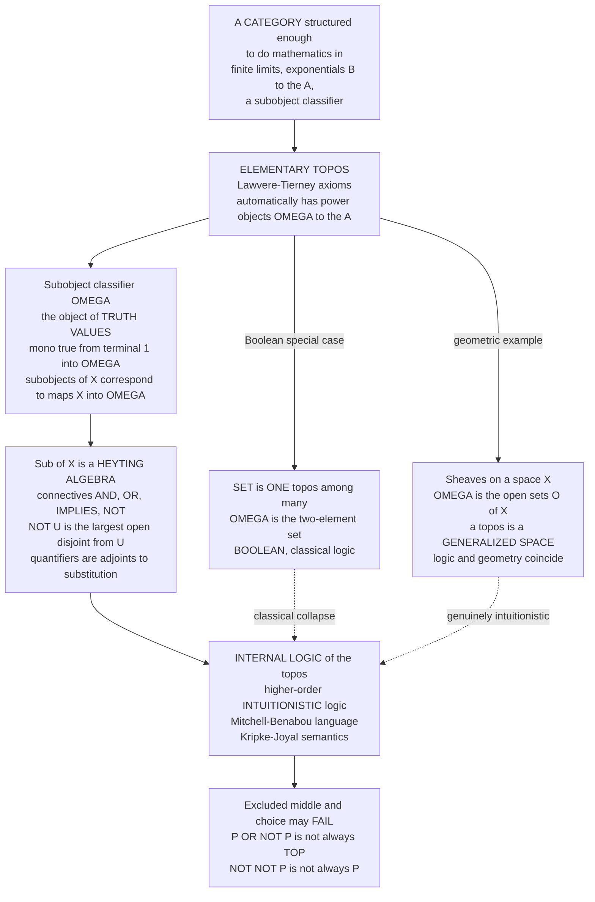

# 🌌 Category-Theoretic Logic and Topos Theory

> [!abstract] TL;DR
> Ordinary logic treats "true" and "false" as fixed, universe-independent absolutes. **Topos theory dissolves that assumption**: an **(elementary) topos** is any category "structured enough to do mathematics in" — it has finite **limits**, **exponentials** (it is cartesian closed), and a distinguished object `Ω`, the **subobject classifier**, that *is* the object of **truth values**. In the topos `Set`, `Ω = {true, false}` and logic is classical. But `Set` is just **one topos among many**, and in a general topos `Ω` is a **Heyting algebra**, not a two-element set — so the **internal logic** is **higher-order intuitionistic** logic in which **excluded middle** `P ∨ ¬P` and **choice** generally *fail*. **Lawvere's** program makes this a *foundation*: mathematics done structurally (ETCS instead of ZFC), with the **quantifiers `∃/∀` themselves realised as adjoints** to substitution. The **Mitchell–Bénabou** internal language and **Kripke–Joyal** semantics let you reason *inside* a topos as if in set theory. And because **sheaf (Grothendieck) toposes** are "generalized spaces," topos theory reveals **logic and geometry as two faces of one structure** — the setting in which Kripke models, forcing, constructive mathematics, and the categorical semantics of type theory all become one subject.

---

## Intuition

**Analogy — what if logic weren't a fixed law of the cosmos, but a *property of the mathematical universe you happen to be standing in*?** We are trained to think there is *one* logic: every statement is either true or false, `P ∨ ¬P` always holds, a double negative always cancels. But imagine there were **many mathematical universes** — each self-contained, each with its own furniture of sets, functions, and subsets — and imagine that **each universe came with its own built-in logic**, read off from the shape of its "truth-value object." In the familiar universe (the topos `Set`), that object has exactly two points, `{true, false}`, and the logic is the classical one we know. But step into a universe of **sets varying over time**, or of **sets spread over a space**, or of **only-computable functions**, and the truth-value object suddenly has *more than two points* — it becomes a whole **lattice** of graded truth values. In such a universe "half true" is a legitimate truth value, `P ∨ ¬P` can come out short of "fully true," and `¬¬P` need not return you to `P`.

A **topos** is exactly such a universe, and the astonishing discovery of Lawvere, Tierney, and Grothendieck is that **the logic is not imposed from outside — it is *emergent* from the category's own structure.** The single object `Ω` (the **subobject classifier**) plays the role of "the type of propositions": a subset of `X` *is* a map `X → Ω` (a predicate assigning to each element its truth value). Change the internal shape of `Ω` from two points to a richer lattice, and the ambient logic quietly stops being Boolean and becomes **intuitionistic** — without altering a single other rule. The deepest payoff: because `Ω` for a topos of **sheaves** over a space `X` turns out to be built from the **open sets** of `X`, **logic and geometry are literally the same structure viewed from two directions**. Topology *is* a logic; a logic *is* a generalized space.

---

## How It Works

### Core Mechanics

Topos theory is the observation that a handful of *category-theoretic* axioms are enough to reconstruct all of "doing mathematics" — and that once you have them, a logic comes along for free.

1. **A topos is a category with the shape of `Set`.** An **elementary topos** `E` is a category that has (i) **all finite limits** (a terminal object `1`, products, and pullbacks), (ii) **exponentials** `B^A` — it is **cartesian closed**, so "function sets" live inside the category ([[Exponentials_and_Cartesian_Closed_Categories]]), and (iii) a **subobject classifier** `Ω`. These are the **Lawvere–Tierney axioms**. From them alone one *derives* power objects `P(A) = Ω^A`, image factorizations, an internal notion of function set — everything you expect of a universe of sets. `Set` is the prototype, but presheaf and sheaf categories, `G`-sets, and realizability universes are toposes too.

2. **The subobject classifier `Ω` is the object of truth values.** A "subset" of an object `X` is a **monomorphism** `m : A ↪ X` (a **subobject**). The classifier `Ω` comes with a map `true : 1 → Ω` such that **every** subobject `A ↪ X` arises as the **pullback of `true`** along a *unique* **characteristic map** `χ_A : X → Ω`. In symbols this is a natural bijection `Sub(X) ≅ Hom(X, Ω)` — the categorical form of "**a subset is the same data as a predicate**." So `Ω` *is* the type of propositions. In `Set`, `Ω = {⊤, ⊥}` (two elements) and `χ_A` is just the indicator function; in a general topos `Ω` has many more "points," and that is where non-classical logic enters.

3. **`Sub(X)` is a Heyting algebra, so the internal logic is intuitionistic.** Order the subobjects of any object `X` by inclusion. In *any* topos this poset is a **Heyting algebra**: it has meets `∧` (pullback/intersection), joins `∨` (union via images), a top `X` and bottom `0`, and a **Heyting implication** `⇒` characterised by `C ≤ (A ⇒ B) ⟺ C ∧ A ≤ B`. **Negation is derived**, not primitive: `¬A := (A ⇒ 0)`. A Heyting algebra is **Boolean only when** `A ∨ ¬A = ⊤` for every `A`; in a general topos this **fails**, and with it fail the two hallmarks of classical reasoning — **excluded middle** `P ∨ ¬P = ⊤` and **double-negation elimination** `¬¬P = P` (you keep only `P ≤ ¬¬P`). Hence a topos reasons **intuitionistically by default** (the setting of the sibling *Intuitionistic_and_Constructive_Logic*).

4. **The Lawvere insight — quantifiers are adjoints.** For a morphism `f : I → J`, "substitution along `f`" is the **pullback** functor `f^* : Sub(J) → Sub(I)`. Lawvere's discovery is that the **existential and universal quantifiers are precisely its two adjoints**: `∃_f ⊣ f^* ⊣ ∀_f`. "There exists an `i` with…" is the *left* adjoint to substitution; "for all `i`…" is the *right* adjoint. Logic's connectives and quantifiers are not primitive symbols but **universal constructions** — `∧` is a product of propositions, `⇒` is an exponential, `∃/∀` are adjoints to reindexing ([[Adjunctions]]). This is the seed of **categorical logic**: syntax and proofs become objects and morphisms.

5. **You can reason *inside* a topos.** Because a topos has all this structure, it carries an **internal language** — the **Mitchell–Bénabou language** — a higher-order type theory whose types are objects, whose terms are morphisms, and whose formulas take values in `Ω`. Its models are interpreted by **Kripke–Joyal semantics** (a "forcing" relation `x ⊩ φ`, the topos-theoretic generalization of Kripke models and of Cohen forcing). You prove theorems in the topos *exactly as in ordinary set theory* — defining functions, quantifying, chaining inferences — provided you stay **constructive**. `Set` is the special **Boolean** topos where this internal logic collapses to the classical one you already know.

### Sheaves, geometry, and foundations

- **Toposes are generalized spaces.** A **Grothendieck topos** is a category of **sheaves** `Sh(C, J)` on a site. The leading example: sheaves `Sh(X)` on a topological space `X`. Here the global truth values are the **open sets `O(X)`** — and `O(X)` is a Heyting algebra with `¬U = int(X ∖ U)` (the interior of the complement). This is why **geometry and logic coincide**: the *topology* of `X` literally *is* the *logic* of `Sh(X)`. Grothendieck's slogan "a topos is a generalized space" and Lawvere's "a topos is a universe of variable sets" are the same statement.
- **Kripke models and forcing are sheaf semantics.** A Kripke model for intuitionistic logic is a presheaf on a poset of "worlds"; Cohen's **forcing** (the machinery behind the independence of CH — see the set-theory sibling *Forcing_and_Independence_Proofs*) is Boolean-valued / sheaf semantics over a poset of conditions. Topos theory is their common home.
- **Classifying toposes and geometric logic.** For a suitable ("geometric") theory `T` there is a **classifying topos** `Set[T]` — a single "generic model" such that a `T`-model in *any* topos `E` is the same thing as a geometric morphism `E → Set[T]`. Logic becomes geometry: *models are maps of spaces*.
- **A foundation without `∈`.** Lawvere's **ETCS** (Elementary Theory of the Category of Sets) axiomatizes `Set` as a topos, giving a **structural** foundation for mathematics — objects, morphisms, and universal properties, *not* the membership relation `∈` (contrast the sibling *Axiomatic_Set_Theory_ZFC*). Its modern descendant, **Homotopy Type Theory** and the theory of **(∞,1)-toposes**, extends the picture from truth values to *homotopy types* ([[Homotopy_Type_Theory]]).

### Flow / Architecture



*Each solid arrow adds structure and derives the next layer; the dotted arrows show the same internal logic specializing to classical logic in `Set` and to genuinely intuitionistic, geometry-flavoured logic in sheaf toposes.*

---

## Key Concepts

### Secondary Level

- **A topos is a "possible world" for mathematics.** It has elements, functions, subsets, and truth — but its rules can differ from ordinary set theory. `Set` (the world of ordinary sets) is just one of them.
- **`Ω` is the "type of truth values."** In `Set` it is `{true, false}`, and *a subset is just a predicate* — a rule saying `true`/`false` for each element. In other toposes `Ω` has **more than two values**, so a statement can be "partly true."
- **When `Ω` is richer than two points, `P or not-P` can fail.** The logic stops being "either/or" (classical) and becomes **intuitionistic** (constructive): you cannot conclude a thing is true just because assuming it false led to a contradiction.
- **Logic can *be* geometry.** For sheaves on a space, the truth values are the **open sets** of that space, and "not `U`" means "the interior of everything outside `U`" — which can leave a boundary uncovered, so `U or not-U` misses the edge.

### Undergraduate Level

- **Elementary topos** = a category with (i) all finite limits, (ii) cartesian closure (exponentials `B^A`), and (iii) a **subobject classifier** `true : 1 → Ω`. Power objects `Ω^A` come for free.
- **Subobject classifier property**: every mono `A ↪ X` is the **pullback of `true`** along a *unique* `χ_A : X → Ω`; hence `Sub(X) ≅ Hom(X, Ω)`. In `Set`, `χ_A` is the indicator function of `A ⊆ X`.
- **Internal logic**: `Sub(X)` is a **Heyting algebra**. Connectives are categorical operations; `¬A = (A ⇒ 0)`; a topos validates **intuitionistic** higher-order logic. Boolean toposes are exactly those where `¬¬ = id`.
- **Quantifiers as adjoints (Lawvere)**: for `f : I → J`, `∃_f ⊣ f^* ⊣ ∀_f` where `f^*` is pullback/substitution. `∃` is a left adjoint, `∀` a right adjoint.
- **`O(X)` as a truth-value algebra**: the opens of a space form a Heyting algebra; `U ∧ V = U ∩ V`, `U ∨ V = U ∪ V`, `¬U = int(Uᶜ)`, `U ⇒ V = int(Uᶜ ∪ V)`. This is the internal logic of `Sh(X)`.

### Graduate Level

- **Lawvere–Tierney topologies** `j : Ω → Ω` (idempotent, order-preserving, `∧`-preserving nucleus) carve out **sheaf subtoposes** as the `j`-closed subobjects; **double-negation** `¬¬ : Ω → Ω` is the topology whose sheaves are the *Boolean* reflection — the topos-theoretic form of the **Gödel–Gentzen negative translation**.
- **Mitchell–Bénabou language & Kripke–Joyal semantics**: the internal higher-order language of a topos, with a forcing relation `x ⊩ φ` computed via the Heyting structure of `Sub`; specializes to Kripke forcing (presheaf toposes) and Cohen/Boolean forcing (double-negation sheaves over a poset of conditions).
- **Grothendieck toposes** `Sh(C, J)` = categories of sheaves on a **site**; Giraud's theorem characterizes them intrinsically. **Geometric morphisms** `f^* ⊣ f_*` (left-exact inverse image) are the "continuous maps"; **classifying toposes** represent models of **geometric theories** (`⋁`, `∧`, `∃`, no `⇒`/`∀`), so `Mod_T(E) ≃ Topos(E, Set[T])`.
- **ETCS and structural set theory**: `Set` axiomatized as a well-pointed topos with a natural-numbers object and (external) choice; equiconsistent with bounded Zermelo, a *categorical* rival to ZFC (contrast the `∈`-based sibling *Axiomatic_Set_Theory_ZFC*).
- **Beyond truth values**: **(∞,1)-toposes** replace `Ω` with an object of *propositions inside* a hierarchy of homotopy types; **HoTT/univalent foundations** is their internal language, upgrading "subset ↔ predicate" to "type ↔ ∞-groupoid" ([[Homotopy_Type_Theory]]).

---

## Python Demo

```python
# ============================================================================
# THE INTERNAL LOGIC OF A TOPOS IS INTUITIONISTIC, NOT CLASSICAL.
#
# We realize the truth-value object Omega concretely as the HEYTING ALGEBRA of
# OPEN SETS O(X) of a topological space X -- exactly the global truth values of
# the sheaf topos Sh(X).  In Set, Omega = {false, true} is Boolean; here Omega =
# O(X) is a richer lattice, and the LOGICAL CONNECTIVES become open-set ops:
#
#     P AND Q  =  P  cap  Q                    (intersection of opens is open)
#     P OR  Q  =  P  cup  Q                    (union of opens is open)
#     TOP      =  X ,      BOT = empty set
#     P => Q   =  interior( (X \ P) cup Q )     (largest open inside Pc cup Q)
#     NOT P    =  P => BOT = interior(X \ P)     (largest open DISJOINT from P)
#
# Because NOT is "interior of the complement," EXCLUDED MIDDLE  P OR NOT P = TOP
# and DOUBLE NEGATION  NOT NOT P = P  can FAIL: an open set together with the
# interior of its complement can MISS the shared boundary. That missing boundary
# is the intuitionistic gap -- the same phenomenon that makes P OR NOT P fail on
# the real line for  U = R \ {point}.
# ============================================================================
import numpy as np
import matplotlib.pyplot as plt

# ---- A concrete space X and its topology (the collection of open sets) ------
# X = {1, 2, 3};  opens = { {}, {1}, {2}, {1,2}, X }.  Point 3 is a "generic"
# (closed) point glued above the two open points 1 and 2.
X     = frozenset({1, 2, 3})
OPENS = [frozenset(s) for s in (set(), {1}, {2}, {1, 2}, {1, 2, 3})]
OPENSET = set(OPENS)
BOT, TOP = frozenset(), X

def interior(S):
    """Largest open set contained in S = union of all opens that fit inside S."""
    inside = [U for U in OPENS if U <= S]
    return frozenset().union(*inside) if inside else BOT

# ---- The Heyting-algebra operations on Omega = O(X) ------------------------
def meet(P, Q):    return P & Q
def join(P, Q):    return P | Q
def implies(P, Q): return interior((X - P) | Q)     # largest open in (Pc cup Q)
def hneg(P):       return implies(P, BOT)           # NOT P = interior(Pc)

# Sanity check: O(X) really is closed under the Heyting operations (a frame).
for P in OPENS:
    assert hneg(P) in OPENSET
    for Q in OPENS:
        assert meet(P, Q) in OPENSET and join(P, Q) in OPENSET
        assert implies(P, Q) in OPENSET

def show(S):
    return "{}" if not S else "{" + ",".join(map(str, sorted(S))) + "}"

print(f"Omega = O(X) has {len(OPENS)} truth values "
      f"(a BOOLEAN Set would allow only 2):")
print("   " + "   ".join(show(U) for U in OPENS), "\n")

# ---- Where do EXCLUDED MIDDLE and DOUBLE NEGATION fail? --------------------
hdr = ["P", "NOT P", "P OR NOT P", "NOT NOT P", "classical?"]
print(f"{hdr[0]:>7} {hdr[1]:>7} {hdr[2]:>12} {hdr[3]:>11}   {hdr[4]}")
lem_fail, dne_fail = [], []
for P in OPENS:
    nP, lem = hneg(P), join(P, hneg(P))       # negation and excluded-middle value
    nnP     = hneg(hneg(P))                    # double negation
    classical = (lem == TOP) and (nnP == P)
    if lem != TOP: lem_fail.append(P)
    if nnP != P:   dne_fail.append(P)
    flag = "yes" if classical else "NO  <-- fails"
    print(f"{show(P):>7} {show(nP):>7} {show(lem):>12} {show(nnP):>11}   {flag}")

print(f"\nExcluded middle  (P OR NOT P = X) FAILS for: "
      f"{[show(P) for P in lem_fail]}")
print(f"Double negation  (NOT NOT P = P) FAILS for: "
      f"{[show(P) for P in dne_fail]}")
dense = [P for P in OPENS if hneg(hneg(P)) == TOP and P != TOP]
print(f"'Dense' truth values (NOT NOT P = X but P != X): "
      f"{[show(P) for P in dense]}")
print("=> the internal logic of this topos is INTUITIONISTIC, not classical.")

# ===========================================================================
# VISUALIZE.
#   Left : the truth-value lattice Omega = O(X) as a Hasse diagram, nodes
#          coloured by whether excluded middle holds there.
#   Right: the SAME phenomenon on the real line -- U = [0,1] \ {1/2} is open,
#          NOT U = interior of {1/2} = empty, so U OR NOT U misses the point.
# ===========================================================================
fig, (axL, axR) = plt.subplots(1, 2, figsize=(14, 6.2))

# ---- Left: Hasse diagram of Omega = O(X) ----------------------------------
pos = {frozenset():          (0.0, 0.0),
       frozenset({1}):      (-1.0, 1.0),
       frozenset({2}):       (1.0, 1.0),
       frozenset({1, 2}):    (0.0, 2.0),
       X:                    (0.0, 3.0)}
covers = [(frozenset(), frozenset({1})), (frozenset(), frozenset({2})),
          (frozenset({1}), frozenset({1, 2})), (frozenset({2}), frozenset({1, 2})),
          (frozenset({1, 2}), X)]
for a, b in covers:
    axL.plot(*zip(pos[a], pos[b]), color="#90a4ae", lw=1.6, zorder=1)
for U, (x, y) in pos.items():
    em_holds = (join(U, hneg(U)) == TOP)
    face = "#c8e6c9" if em_holds else "#ffcdd2"          # green = EM holds
    axL.scatter([x], [y], s=2600, color=face,
                edgecolors="#455a64", linewidths=1.8, zorder=2)
    axL.text(x, y, show(U), ha="center", va="center",
             fontsize=11, fontweight="bold", zorder=3)
# annotate the dense-but-not-top element where double negation fails
xd, yd = pos[frozenset({1, 2})]
axL.annotate("NOT NOT {1,2} = X  !=  {1,2}\ndouble negation FAILS here",
             xy=(xd, yd), xytext=(xd + 1.15, yd - 0.15),
             fontsize=9, color="#6a1b9a", fontweight="bold",
             arrowprops=dict(arrowstyle="-|>", color="#6a1b9a", lw=1.5))
axL.scatter([], [], s=180, color="#c8e6c9", edgecolors="#455a64",
            label="excluded middle HOLDS")
axL.scatter([], [], s=180, color="#ffcdd2", edgecolors="#455a64",
            label="excluded middle FAILS")
axL.legend(loc="upper left", fontsize=9, frameon=False)
axL.set_xlim(-2.4, 2.6); axL.set_ylim(-0.6, 3.6); axL.axis("off")
axL.set_title("Omega = O(X): a non-Boolean Heyting algebra of truth values",
              fontsize=11.5)

# ---- Right: the same failure on the real line -----------------------------
t = np.linspace(0.0, 1.0, 1001)
hole = np.argmin(np.abs(t - 0.5))
U    = np.ones_like(t, dtype=bool); U[hole] = False   # U = [0,1] minus a point
notU = np.zeros_like(t, dtype=bool)                   # int(complement) = empty
nnU  = np.ones_like(t, dtype=bool)                    # NOT NOT U = whole space
bands = [("U = [0,1] \\ {1/2}", U,   "#1565c0", 3.0),
         ("NOT U = int({1/2}) = empty", notU, "#c62828", 2.0),
         ("U OR NOT U = U  (still missing 1/2)", U, "#6a1b9a", 1.0),
         ("NOT NOT U = [0,1]  !=  U", nnU, "#2e7d32", 0.0)]
for label, mask, color, y in bands:
    seg = np.where(mask, y, np.nan)
    axR.plot(t, seg, color=color, lw=7, solid_capstyle="butt")
    axR.text(1.02, y, label, va="center", fontsize=9, color=color)
axR.scatter([0.5], [3.0], s=60, facecolors="white",
            edgecolors="#1565c0", zorder=5)                # the missing point
axR.axvline(0.5, color="#9e9e9e", ls=":", lw=1)
axR.text(0.5, 3.45, "the boundary point\nexcluded middle cannot cover",
         ha="center", fontsize=8.5, color="#616161")
axR.set_xlim(0, 1.9); axR.set_ylim(-0.6, 3.9)
axR.set_yticks([]); axR.set_xticks([0, 0.5, 1]); axR.set_xlabel("x in [0,1]")
axR.set_title("Excluded middle fails on the line:\n"
              "U OR NOT U leaves the boundary uncovered", fontsize=11.5)

fig.suptitle("The internal logic of a topos is INTUITIONISTIC: "
             "Omega is a Heyting algebra, not {true, false}", fontsize=13)
fig.tight_layout(rect=(0, 0, 1, 0.96))
plt.savefig("topos_internal_logic.png", dpi=130, bbox_inches="tight")
print("\nSaved figure to topos_internal_logic.png")
```

Running it makes every claim concrete. The truth-value object `Ω = O(X)` has **five** values, not two, and the code verifies `O(X)` is closed under all the Heyting operations (a **frame**). The printed table shows that **excluded middle fails** at `{1}`, `{2}`, and `{1,2}` — for example `¬{1,2} = int({3}) = {}`, so `{1,2} ∨ ¬{1,2} = {1,2} ≠ X` — and that **double negation fails** at the *dense* element `{1,2}`, where `¬¬{1,2} = X ≠ {1,2}`. The left plot draws `Ω` as a Hasse diagram with green nodes (excluded middle holds) and red nodes (it fails); the right plot shows the *same* phenomenon on the continuum: `U = [0,1] ∖ {½}` is open, its negation `¬U = int({½}) = ∅`, so `U ∨ ¬U` still misses the single boundary point — the irreducible **intuitionistic gap** that classical logic papers over.

---

## Real-World Applications

> **Example — proof assistants and the categorical semantics of type theory.** Systems like **Coq/Rocq**, **Agda**, and **Lean** implement dependent type theories whose *models* are toposes (and, for the univalent ones, `(∞,1)`-toposes). The Curry–Howard correspondence "propositions = types, proofs = programs" is completed by the Lambek/Lawvere leg "types = objects, contexts = base objects, `∃/∀` = adjoints to substitution" — so a topos is *literally* a semantics for the language a proof assistant checks ([[Categorical_Logic_and_Type_Theory]], [[Dependent_Types_and_Advanced_Type_Systems]]). Because that logic is **intuitionistic**, these tools are constructive by default: a proof of `∃x. φ(x)` yields an actual witness, which is exactly what lets Coq *extract* running programs from proofs.

Beyond verification:

- **Independence and forcing.** Cohen forcing is **double-negation sheaf semantics** over a poset of conditions; Boolean-valued models are `Sh_{¬¬}` of a complete Boolean algebra. Topos theory gives the unified, "coordinate-free" account of why CH is independent of ZFC (the set-theory sibling *Forcing_and_Independence_Proofs* develops the concrete machinery).
- **Constructive and computable mathematics.** The **effective topos** (Hyland) is a universe where "function" means *computable function* and Church's thesis holds internally — the natural home for **realizability** and for extracting algorithms from constructive proofs.
- **Databases and variable sets.** A schema is a small category and an instance is a **presheaf** into `Set`; the presheaf topos supplies a logic for constraints, queries, and data migration — categorical databases are topos logic in production.
- **Synthetic differential geometry & physics.** In the **Kock–Lawvere** topos, infinitesimals `d` with `d² = 0` genuinely exist, letting you do calculus "synthetically"; **quantum logic** and the **Bohr topos** program (Isham, Butterfield, Heunen–Landsman–Spitters) recast quantum observables in a topos whose internal logic is intuitionistic, replacing the non-distributive lattice of von Neumann with a distributive Heyting one.
- **Geometry & cohomology.** Sheaf toposes are "generalized spaces"; étale cohomology, the theory of `∞`-stacks, and much of modern algebraic geometry are written in topos-theoretic language, with the internal logic doing real work.

---

## Common Pitfalls

- **Assuming the internal logic is classical.** A topos is **intuitionistic by default**: `P ∨ ¬P` and `¬¬P = P` can *fail*, and so can the axiom of choice. Only **Boolean** toposes (like `Set`, or `¬¬`-sheaves) validate them. Importing classical shortcuts — proof by contradiction of a *positive* statement, trichotomy, "pick an element" — into internal reasoning is the single most common error and silently breaks proofs.
- **Thinking `Ω = {0, 1}` always.** `Ω` is a *two-element* set **only** in Boolean toposes. In a presheaf topos it is the object of **sieves**; in `Sh(X)` its global points are the **open sets** of `X` — often infinitely many. The *shape* of `Ω` **is** the logic; collapsing it to `{true, false}` erases the entire subject.
- **Confusing internal with external logic.** Statements proved *inside* a topos (in its internal language, valued in `Ω`) obey **intuitionistic** rules; statements we prove *about* the topos, standing in the ambient (classical) metatheory, are ordinary mathematics. "Every function `ℕ → ℕ` is computable" can be *internally* true in the effective topos while *externally* false — mixing the two levels produces paradoxes that are really just level confusions. Kripke–Joyal semantics is precisely the dictionary between the two.
- **Missing the sheaf/forcing connection.** Kripke models, Beth models, Cohen forcing, and Boolean-valued models are **not** separate tricks — they are all **sheaf semantics** over an appropriate site, and their common negation `¬¬` is a **Lawvere–Tierney topology**. Treating forcing as a purely set-theoretic gadget hides that it is the *same* mechanism as intuitionistic Kripke forcing.
- **Believing a cartesian closed category is already a topos.** Cartesian closure is necessary but **not** sufficient: a topos additionally needs **all finite limits** *and* a **subobject classifier**. Many CCCs used for recursion (domains, `ω`-cpos) are **not** toposes — they lack `Ω`.
- **Expecting `¬¬P = P` to define a Boolean topos pointwise.** A topos is Boolean iff the *nucleus* `¬¬ : Ω → Ω` is the identity — a global condition on `Ω`, not a check on isolated elements. In the demo, `¬¬` fixes `{1}, {2}, {}, X` but sends the dense element `{1,2}` to `X`; that single non-fixed point is enough to make the whole topos non-Boolean.

---

## Related Concepts

- [[Cartesian_Closed_and_Topos_Theory]] — the Category-Theory-vault companion to this note: the *categorical* construction of an elementary topos (CCC + finite limits + `Ω`); read alongside this *logic/foundations* angle.
- [[Categorical_Logic_and_Type_Theory]] — the internal language of a topos *is* higher-order intuitionistic type theory; the propositions-as-objects, proofs-as-morphisms leg of the correspondence.
- [[Adjunctions]] — Lawvere's key move: the quantifiers are adjoints, `∃_f ⊣ f^* ⊣ ∀_f`; logical connectives are universal constructions.
- [[Limits_and_Colimits]] — a topos has all finite limits; pullbacks carve out subobjects and *define* the classifier property.
- [[Exponentials_and_Cartesian_Closed_Categories]] — cartesian closure gives function objects and power objects `Ω^A`; implication in `Sub(X)` is an internal exponential.
- [[Presheaves_and_Representables]] — presheaf toposes `Set^(C^op)` are the leading examples; there `Ω` is the presheaf of sieves.
- [[The_Yoneda_Lemma]] — `Sub(X) ≅ Hom(X, Ω)` says `Ω` *represents* the subobject functor — a representability statement à la Yoneda.
- [[Curry_Howard_Lambek_Correspondence]] — the logic ↔ types ↔ categories triangle whose categorical apex is topos-valued semantics.
- [[Intuitionistic_Logic_and_Constructive_Proofs]] — the *default* logic of every topos; `Sub(X)` is a Heyting algebra, so excluded middle and `¬¬`-elimination may fail.
- [[Dependent_Types_and_Advanced_Type_Systems]] — dependent types are interpreted by pullback/substitution and its adjoints; the syntax whose models are (locally cartesian closed) toposes.
- [[Homotopy_Type_Theory]] — the modern extension: `(∞,1)`-toposes and univalence upgrade truth values to homotopy types.
- [[The_Curry_Howard_Correspondence]] — proofs-as-programs; topos logic supplies its categorical semantics.
- [[Topological_Spaces]] — the open sets `O(X)` form the Heyting algebra of truth values of `Sh(X)`; topology *is* the logic (the demo's model).
- [[Mathematical_Logic_and_Set_Theory]] — Lawvere's ETCS offers a *structural* foundation rivaling `∈`-based set theory; Boolean toposes recover classical set theory.
- [[Category_Theory_Overview]] — the umbrella framework of objects, morphisms, functors, and adjunctions that topos logic is built from.
- [[Propositional_Logic_and_Boolean_Semantics]] — the classical Boolean special case (`Ω = {⊤,⊥}`); a topos generalizes Boolean algebras to Heyting algebras.
- [[First_Order_Predicate_Logic]] — the `∃/∀` quantifiers whose categorical meaning is "adjoints to substitution/pullback" in a topos.

*Siblings in this Frontiers & Foundations section, referenced in prose — **Type_Theory_and_the_Foundations_of_Mathematics**, **Intuitionistic_and_Constructive_Logic**, **Axiomatic_Set_Theory_ZFC**, **Forcing_and_Independence_Proofs**, and **Nonclassical_and_Substructural_Logics** — are the natural companions: topos theory is a non-set-theoretic foundation, its internal logic is intuitionistic, forcing is its sheaf semantics, and its truth values live in a non-Boolean lattice.*

---

## Review Questions

### Secondary

1. Explain the "many universes, each with its own logic" picture. What object plays the role of "the type of truth values" in a topos, and what does it look like in the ordinary universe `Set` versus a universe where a statement can be "partly true"?
2. In a topos of sheaves on a space, the truth values are the **open sets**, and "not `U`" is "the interior of everything outside `U`." Using the interval `[0,1]` and `U = [0,1]` with the midpoint removed, describe in words why "`U` or not-`U`" fails to be the whole space.
3. Why can't you use "proof by contradiction" freely inside a general topos? Give the everyday statement of what *does* still hold (`P ⟹ ¬¬P`) and what can *fail* (`¬¬P ⟹ P`).

### Undergraduate

1. State the universal property of the **subobject classifier** as a pullback square, and explain why the *uniqueness* of the characteristic map `χ_A` is what makes `Sub(X) ≅ Hom(X, Ω)` a genuine bijection rather than a mere surjection.
2. On the open-set Heyting algebra of the space `X = {1,2,3}` with opens `{∅, {1}, {2}, {1,2}, X}`, compute `¬{1}`, `¬{1,2}`, `¬¬{1,2}`, and `{1,2} ∨ ¬{1,2}`. Which classical laws fail, and at which elements?
3. Explain Lawvere's slogan "**quantifiers are adjoints**." For a map `f : I → J`, which quantifier is the *left* adjoint of the pullback `f^*` and which is the *right* adjoint, and why does that assignment match the informal meanings of `∃` and `∀`?

### Graduate

1. Define a **Lawvere–Tierney topology** `j : Ω → Ω` and describe how the `j`-sheaves form a subtopos. Show that `j = ¬¬` yields the **Boolean** reflection, and connect this to the Gödel–Gentzen negative translation and to Boolean-valued models of set theory.
2. Explain how **Cohen forcing** is a special case of sheaf semantics: identify the site, the topology, and the sense in which the independence of CH becomes a statement `⟦CH⟧ ∉ {⊥, ⊤}` in the internal Heyting algebra. Why does the double-negation topology make the forcing model *Boolean*?
3. Sketch Lawvere's case that topos theory (ETCS) is a *structural* foundation for mathematics rivaling ZFC. What does "structure, not membership, is fundamental" mean operationally, and how do **geometric morphisms** and **classifying toposes** turn "a model of a theory" into "a map of generalized spaces"? Where do `(∞,1)`-toposes and univalence extend the story?

---

## Sources

- [Mac Lane, S. and Moerdijk, I. (1992). *Sheaves in Geometry and Logic: A First Introduction to Topos Theory.* Springer.](https://link.springer.com/book/10.1007/978-1-4612-0927-0) — the standard modern text; subobject classifier, internal logic, Kripke–Joyal semantics, Grothendieck toposes, and the geometry ↔ logic unity.
- [Johnstone, P. T. (2002). *Sketches of an Elephant: A Topos Theory Compendium* (2 vols).](https://global.oup.com/academic/product/sketches-of-an-elephant-9780198515982) — the encyclopedic reference on elementary and Grothendieck toposes, geometric morphisms, and classifying toposes.
- [Goldblatt, R. (1984). *Topoi: The Categorial Analysis of Logic.* North-Holland (Dover reprint, 2006).](https://store.doverpublications.com/products/9780486450261) — the logic-first introduction: `Ω`, Heyting algebras, and intuitionistic internal logic developed from scratch.
- [Lawvere, F. W. (1964). "An Elementary Theory of the Category of Sets." *PNAS* 52(6), 1506–1511.](https://www.pnas.org/doi/10.1073/pnas.52.6.1506) — the founding paper for a structural (ETCS) categorical foundation; and Lawvere (1969) "Adjointness in Foundations" for quantifiers-as-adjoints.
- [Bell, J. L. (2008). *Toposes and Local Set Theories: An Introduction.* Dover.](https://store.doverpublications.com/products/9780486462868) — the internal language and "local set theory" presentation of topos logic.
- [nLab — "topos", "subobject classifier", "internal logic", "Lawvere–Tierney topology".](https://ncatlab.org/nlab/show/topos) — continually updated cross-referenced encyclopedia entries.

---

#mathematical-logic #topos-theory #categorical-logic #heyting-algebra #foundations
