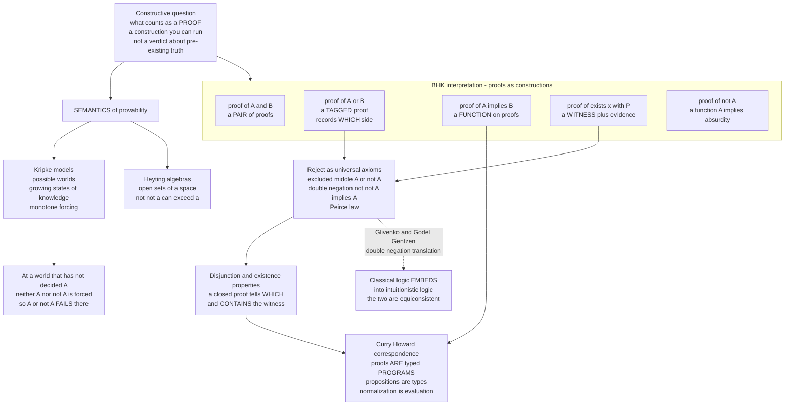

# 🔨 Intuitionistic and Constructive Logic

> [!abstract] TL;DR
> **Classical logic** treats every proposition as *already* true or false, so it will prove "an `x` exists" merely by showing that "*no* `x` exists" leads to contradiction — never producing the `x`. **Intuitionistic (constructive) logic**, born of L.E.J. **Brouwer's** intuitionism and formalized by **Heyting**, rejects that as hollow: to assert `∃x.P(x)` you must **exhibit a witness**, and to assert `A ∨ B` you must know **which disjunct** holds. The technical consequence is that the **law of excluded middle** `A ∨ ¬A` and **double-negation elimination** `¬¬A → A` are dropped as *universal* axioms (though every *decidable* instance survives). Meaning is given by the **Brouwer–Heyting–Kolmogorov (BHK)** interpretation — a proof of `∧` is a *pair*, of `→` a *function*, of `∃` a *witness plus evidence* — which is literally the **Curry–Howard** dictionary that makes every constructive proof a *program*. Its semantics are **Kripke models** (growing states of knowledge) and **Heyting algebras** (open sets of a space); and via the **Gödel–Gentzen / Glivenko double-negation translations**, classical logic *embeds into* intuitionistic logic, so the two are **equiconsistent**. This note is the logic-foundations framing that opens the frontiers of the discipline.

> [!info] Two framings of one idea
> This note is the **mathematical-logic / foundations** view: what excluded middle *is*, why Brouwer rejected it, and how Kripke frames and Heyting algebras give it meaning. Its companion `[[Intuitionistic_Logic_and_Constructive_Proofs]]` (in the Programming Language Theory vault) develops the **proofs-as-programs / type-theory** view. Read them together — same seed, two soils.

---

## Intuition

**Analogy — the map that says "somewhere in here" versus the map with an X on it.** A classical logician stands before two locked rooms and announces: *"The treasure is in room A **or** room B."* Pressed for which, they shrug — "I never claimed to know *which*; I claimed the disjunction is **true**, because the treasure certainly isn't in *neither* room." For classical logic that settles the matter: truth is a property the world already possesses, whether or not anyone can locate it, so `A ∨ ¬A` holds by fiat. Proving a treasure *exists* by ruling out its non-existence is a perfectly good classical proof.

A **constructivist** finds that hollow. Proving a treasure exists is not the same as **handing you the treasure**. To *claim* "the treasure is in A or B," they demand you produce the **key to one specific room** — a proof of `A ∨ B` must be a proof of `A`, or a proof of `B`, *tagged with which one*. To *claim* "a treasure exists somewhere," you must **point at it** — a proof of `∃x.P(x)` must exhibit an actual `x`. A proof, on this view, is not a verdict about a pre-existing Platonic realm; it is a **recipe you can follow**, a construction you can carry out. And a recipe you can follow is exactly a **program you can run** — which is the deep reason constructive proofs turn out to *secretly compute*. Intuitionistic logic demands more of a proof, and in exchange every proof does more: it builds the thing it claims exists.

---

## How It Works

### Core Mechanics

**1. Truth is replaced by proof-by-construction.** Classically, a proposition is *already* true or false and a proof merely *reveals* which; the two truth values `{0,1}` exist independently of us. Constructively, to **assert** `A` is to **exhibit a construction** of `A`. This is *not* a third truth value — intuitionistic logic is not three-valued. Rather, `A ∨ ¬A` is simply **not automatically available**, because possessing *neither* a proof of `A` *nor* a proof of `¬A` is an utterly ordinary situation (think of any unsolved conjecture).

**2. The BHK interpretation — the constructive meaning of each connective.** Brouwer, Heyting, and Kolmogorov defined the connectives by stating what *counts as a proof* of each:

- **`A ∧ B`** — a **pair**: a proof of `A` together with a proof of `B`.
- **`A ∨ B`** — a **tagged** proof: `inl(p)` where `p` proves `A`, or `inr(q)` where `q` proves `B`. The tag records **which side** — a disjunction knows its own answer.
- **`A → B`** — a **function**: an effective procedure turning *any* proof of `A` into a proof of `B`.
- **`∀x.P(x)`** — a **function** sending each element `x` to a proof of `P(x)`.
- **`∃x.P(x)`** — a **witness plus evidence**: a specific `x` bundled with a proof of `P(x)`.
- **`¬A`** — defined as **`A → ⊥`**: a function turning any proof of `A` into a proof of absurdity.
- **`⊥`** — has **no proof at all**; from it, anything follows (*ex falso*).

Read those as data types and Curry–Howard is already visible: `∧` = product, `∨` = sum, `→` = function, `∃` = dependent pair, `∀` = dependent function.

**3. What is dropped — and what survives.** Intuitionistic logic keeps every classically valid rule *except* the ones asserting existence without construction. Three inter-derivable culprits are removed as universal axioms:

- **Law of excluded middle (LEM):** `A ∨ ¬A`. Holding this for *every* `A` would mean you had decided every proposition.
- **Double-negation elimination (DNE):** `¬¬A → A`. Constructively, "A is not refutable" is strictly weaker than "here is a proof of A."
- **Peirce's law:** `((A → B) → A) → A`. A purely implicational classical principle, with no `¬` in sight, that is *equivalent* to LEM over intuitionistic logic — proof that the classical/constructive gap is not "about negation" but about a uniform commitment to decidedness.

What **survives** is telling: `A → ¬¬A` holds, `¬¬(A ∨ ¬A)` holds (LEM is never *refutable*, just not *available*), and `¬(A ∨ B) ↔ (¬A ∧ ¬B)` holds. Intuitionistic logic is classical logic minus the "for free" existence assumptions, not a rejection of reasoning.

**4. The two defining meta-properties.** Well-behaved constructive systems (e.g. **Heyting arithmetic HA**, the intuitionistic counterpart of Peano arithmetic PA) enjoy two theorems classical logic lacks:

- **Disjunction property:** if `⊢ A ∨ B` (no open assumptions), then `⊢ A` or `⊢ B` — and the proof *tells which*.
- **Existence property:** if `⊢ ∃x.P(x)`, then `⊢ P(t)` for some explicit term `t` — and the proof *contains* `t`.

These are the theoretical license for **program extraction**: compile a constructive proof and an algorithm computing the witness falls out.

**5. Proof systems.** Intuitionistic natural deduction (**NJ**) and sequent calculus (**LJ**) are Gentzen's classical **NK/LK** with one structural change: the sequent's right side is restricted to **at most one conclusion** (`Γ ⊢ A` instead of `Γ ⊢ Δ`). That single restriction on multiple conclusions is precisely what disables LEM — it is what forces you to *commit* to one disjunct. See `[[Formal_Systems_and_Proof_Calculi]]`.

**6. Semantics — two complete pictures.** Where classical logic is modelled by **Boolean algebras** (`{0,1}`), intuitionistic logic is modelled by:

- **Heyting algebras** — bounded lattices with an *implication* operation `a → b` (the largest `c` with `c ∧ a ≤ b`), and `¬a = (a → 0)`. The canonical example is the lattice of **open sets** of a topological space: `¬a` is the *interior of the complement*, so `¬¬a` is the interior of the closure — generally *larger* than `a`. That geometric fact is *why* `¬¬a = a` fails.
- **Kripke models** — a partial order of **possible worlds** (growing "states of knowledge") with **monotone forcing**: once `A` is established at a world it holds in all futures; `A → B` must hold at every future world; `¬A` means `A` is refuted in *all* futures. LEM fails at any world that has not yet decided `A`, because a *future* world might still establish it.

**7. Classical logic embeds in — is equiconsistent with — intuitionistic logic.** The **Gödel–Gentzen negative translation** `(·)ᴺ` maps every classical theorem to an intuitionistic one by sprinkling double negations (`A ∨ B ↦ ¬(¬Aᴺ ∧ ¬Bᴺ)`, `∃x.A ↦ ¬∀x.¬Aᴺ`), and **Glivenko's theorem** gives the crisp propositional version: `A` is a classical tautology iff `¬¬A` is an intuitionistic theorem. Consequence: **PA is consistent iff HA is consistent**. Constructive logic is not a *weaker rival* to classical logic; it is a *finer* logic that *contains* classical logic under a translation.

**8. Constructive mathematics as a program.** **Bishop** (1967) rebuilt real analysis constructively, showing that most of usable mathematics needs neither LEM nor the full axiom of choice — see `[[The_Axiom_of_Choice_and_Equivalents]]`. The parts that genuinely *require* non-constructive principles are exactly what **reverse mathematics** and choice-analysis isolate.

### Flow / Architecture



---

## Key Concepts

### Secondary (intuitive, no background needed)
- **A proof is a recipe, not a verdict.** To say something is true, you must be able to *build* it — point at the treasure, hand over the key to a specific room.
- **"A or B" must name a side.** You may not assert "A or B" unless you can say *which*, with evidence.
- **"Something exists" must show the something.** Proving existence means exhibiting an example, not merely showing that "nothing existing" leads to nonsense.
- **Not-not-A is weaker than A.** "I cannot rule it out" is not the same as "here it is."

### Undergraduate (some CS / discrete-math background)
- **The BHK interpretation** of `∧, ∨, →, ∀, ∃, ¬, ⊥` as pairs, tagged sums, functions, witnesses, and refutations.
- **What is dropped:** LEM `A ∨ ¬A`, DNE `¬¬A → A`, Peirce's law, non-constructive existence — and what is kept (`A → ¬¬A`, `¬¬(A ∨ ¬A)`).
- **Decidability rescues instances:** for any *decidable* predicate `P`, `P ∨ ¬P` is a constructive **theorem** — just run the decider and tag the winning side. LEM is dropped only as a *universal* schema.
- **Disjunction and existence properties**, and their payoff: **program extraction** from proofs.
- **Kripke models:** worlds as growing knowledge, monotone (persistent) forcing, and the two-world countermodel to excluded middle.

### Graduate (foundations, proof theory, semantics)
- **Heyting algebras** as algebraic semantics; the **open-sets / topological** model where `¬¬a` is the interior of the closure; **completeness** of both Kripke and Heyting semantics for intuitionistic propositional logic (IPC).
- **HA vs PA:** Heyting arithmetic, its **disjunction/existence properties**, and the **Gödel–Gentzen negative translation** plus **Glivenko's theorem** establishing equiconsistency.
- **Curry–Howard–Lambek trinity:** IPC ≅ simply-typed λ-calculus ≅ **cartesian-closed categories**; first-order and higher constructive logic ≅ dependent type theory ≅ **toposes** (`[[Cartesian_Closed_and_Topos_Theory]]`, `[[Categorical_Logic_and_Type_Theory]]`).
- **Realizability** (Kleene) as a computational semantics; **Griffin's** typing of `call/cc` with Peirce's law, exhibiting classical proofs as **control operators** and the CPS translation as the computational shadow of the double-negation translation.
- **Constructive analysis** (Bishop), **Markov's principle** and the **Church–Turing thesis** internalized, and the fault lines with **choice** and **reverse mathematics**.

---

## Python Demo

Two experiments. **Part (a)** builds a small **Kripke frame** — a partial order of "states of knowledge" — implements **monotone forcing** (the recursive intuitionistic satisfaction relation), and evaluates `p`, `¬p`, `¬¬p`, `p ∨ ¬p`, and `¬¬p → p` at every world. It exhibits worlds where **`¬¬p` holds but `p` does not**, so excluded middle *fails* there. **Part (b)** contrasts the classical non-constructive existence proof ("there exist irrational `a, b` with `a^b` rational," by case analysis on `√2^√2`) with the constructive demand to **exhibit a witness** (`a = √2`, `b = 2·log₂3`, giving `a^b = 3`), illustrating the BHK / proofs-as-programs idea. The figure plots the Kripke model with LEM-failing worlds ringed in red. Pure `numpy` + `matplotlib`.

```python
"""
Intuitionistic logic, made concrete.
 (a) A KRIPKE MODEL (partial order of knowledge states) with monotone forcing:
     find worlds where  ~~p  holds but  p  does NOT  ->  excluded middle FAILS.
 (b) Classical non-constructive existence (case split on sqrt(2)^sqrt(2))
     vs the CONSTRUCTIVE demand to EXHIBIT a witness (BHK / proofs-as-programs).
Pure numpy + matplotlib.
"""
import numpy as np
import matplotlib.pyplot as plt
import matplotlib.patches as mpatches

# ======================================================================
# (a)  KRIPKE MODEL + MONOTONE FORCING
# ======================================================================
# Worlds and COVER relations.  (w -> v) means  w <= v : "v is a possible
# future of w."  A diamond of knowledge states:  0 below 1 and 2, both below 3.
worlds = [0, 1, 2, 3]
covers = [(0, 1), (0, 2), (1, 3), (2, 3)]

# Reflexive-transitive closure  ->  leq[w, v] == 1  iff  w <= v.
n = len(worlds)
leq = np.eye(n, dtype=int)
for a_, b_ in covers:
    leq[a_, b_] = 1
for k in range(n):                       # Floyd-Warshall boolean closure
    for i in range(n):
        for j in range(n):
            if leq[i, k] and leq[k, j]:
                leq[i, j] = 1

def future(w):
    """All worlds v with w <= v (the accessible 'later knowledge')."""
    return [v for v in worlds if leq[w, v]]

# Valuation of atom p, made UPWARD-CLOSED (persistent) by construction:
# p becomes known at world 1, hence forced at 1 and every future of 1.
base_p = {1}
V = {"p": set()}
for w in base_p:
    for v in future(w):
        V["p"].add(v)                    # -> {1, 3}

# Formula AST as nested tuples.
def atom(name): return ("atom", name)
def NEG(f):     return ("neg", f)
def AND(f, g):  return ("and", f, g)
def OR(f, g):   return ("or", f, g)
def IMP(f, g):  return ("imp", f, g)

def forces(w, f):
    """Intuitionistic Kripke forcing  w |- f  (monotone over the future)."""
    t = f[0]
    if t == "atom": return w in V[f[1]]
    if t == "and":  return forces(w, f[1]) and forces(w, f[2])
    if t == "or":   return forces(w, f[1]) or forces(w, f[2])
    # A -> B holds at w iff at EVERY future v, A at v implies B at v.
    if t == "imp":  return all((not forces(v, f[1])) or forces(v, f[2]) for v in future(w))
    # ~A = A -> bottom : NO future world forces A.
    if t == "neg":  return all(not forces(v, f[1]) for v in future(w))
    raise ValueError(t)

p = atom("p")
formulas = {
    "p":        p,
    "~p":       NEG(p),
    "~~p":      NEG(NEG(p)),
    "p v ~p":   OR(p, NEG(p)),           # excluded middle
    "~~p->p":   IMP(NEG(NEG(p)), p),     # double-negation elimination
}

print("Kripke forcing table  (T = forced at that world):")
head = "world | " + " | ".join(f"{k:>7}" for k in formulas)
print(head); print("-" * len(head))
for w in worlds:
    row = " | ".join(f"{'T' if forces(w, f) else 'F':>7}" for f in formulas.values())
    print(f"  {w}   | {row}")

lem = OR(p, NEG(p))
lem_fails = [w for w in worlds if not forces(w, lem)]
print(f"\nWorlds where EXCLUDED MIDDLE (p v ~p) FAILS: {lem_fails}")
for w in lem_fails:
    print(f"  world {w}:  ~~p forced = {forces(w, NEG(NEG(p)))}  "
          f"but  p forced = {forces(w, p)}   ->  ~~p does NOT deliver p")

# ======================================================================
# (b)  CLASSICAL non-constructive vs CONSTRUCTIVE existence
#      Claim: there exist irrationals a, b with a**b rational.
# ======================================================================
r2 = np.sqrt(2.0)
c  = r2 ** r2                            # sqrt(2)^sqrt(2)

# CLASSICAL: by LEM, c is rational OR irrational -> two candidate pairs,
# exactly one valid, but WHICH is left unknown by the proof itself.
classical = {
    "if c rational  ": (r2, r2, r2 ** r2),   # a=b=sqrt(2):  a^b = c
    "if c irrational": (c, r2, c ** r2),     # a=c, b=sqrt(2): c^sqrt(2) = 2
}
print("\nCLASSICAL (non-constructive) case split on sqrt(2)^sqrt(2):")
for case, (a, b, ab) in classical.items():
    print(f"  {case}:  a^b = {ab:.6f}")
print("  -> exactly one branch makes a^b rational, but the proof does NOT")
print("     say which -> NO explicit witness (it leans on excluded middle).")

# CONSTRUCTIVE: EXHIBIT a witness outright (BHK: existence = witness + evidence).
a = r2                                   # sqrt(2), irrational
b = 2.0 * np.log2(3.0)                   # 2*log2(3), irrational
ab = a ** b                              # = 2^(log2 3) = 3 exactly
witness = ("exists", (float(a), float(b)), "a,b irrational and a^b = 3")
print("\nCONSTRUCTIVE witness:")
print(f"  a = sqrt(2) ~ {a:.6f}   b = 2*log2(3) ~ {b:.6f}")
print(f"  a^b = {ab:.6f}  (rational value 3)")
print(f"  witness object (a program's return value) = {witness}")

# ======================================================================
# PLOT: Kripke model (LEM failures ringed red) + existence contrast
# ======================================================================
fig, (axL, axR) = plt.subplots(1, 2, figsize=(14, 6.5))

pos = {0: (0.5, 0.06), 1: (0.16, 0.5), 2: (0.84, 0.5), 3: (0.5, 0.94)}
for a_, b_ in covers:
    x1, y1 = pos[a_]; x2, y2 = pos[b_]
    axL.annotate("", xy=(x2, y2), xytext=(x1, y1),
                 arrowprops=dict(arrowstyle="-|>", color="0.5", lw=1.8))
for w in worlds:
    x, y = pos[w]
    p_here   = forces(w, p)
    lem_here = forces(w, lem)
    fc = "#d8f5d0" if p_here else "#eef2ff"                 # green if p known here
    ec = "#3a7a3a" if lem_here else "#cc2b2b"               # red ring if LEM fails
    lw = 1.6 if lem_here else 3.2
    axL.add_patch(plt.Circle((x, y), 0.12, fc=fc, ec=ec, lw=lw, zorder=3))
    axL.text(x, y,
             f"w{w}\np:{'T' if p_here else 'F'}  ~p:{'T' if forces(w, NEG(p)) else 'F'}\n"
             f"~~p:{'T' if forces(w, NEG(NEG(p))) else 'F'}  "
             f"LEM:{'ok' if lem_here else 'X'}",
             ha="center", va="center", fontsize=8, zorder=4)
axL.set_title("Kripke model: knowledge grows upward\n"
              "red ring = world where  p v ~p  FAILS", fontsize=11)
axL.set_xlim(0, 1); axL.set_ylim(-0.05, 1.05); axL.axis("off")

def box(x, y, w, h, txt, fc):
    axR.add_patch(mpatches.FancyBboxPatch((x, y), w, h,
                  boxstyle="round,pad=0.02", fc=fc, ec="#333", lw=1.5))
    axR.text(x + w / 2, y + h / 2, txt, ha="center", va="center", fontsize=8.5)

axR.set_title("Existence: 'somewhere in here' vs 'here it is'", fontsize=11)
box(0.05, 0.66, 0.9, 0.28,
    "CLASSICAL (non-constructive)\n"
    "by LEM, sqrt(2)^sqrt(2) is rational OR not\n"
    "one of two pairs works -- but WHICH is unknown\n"
    "existence proved, NO witness handed over", "#e7e7ff")
box(0.05, 0.30, 0.9, 0.28,
    "CONSTRUCTIVE (BHK)\n"
    "a = sqrt(2),  b = 2*log2(3)  (both irrational)\n"
    "a^b = 3  exhibited explicitly\n"
    "the proof CONTAINS the witness -> extractable", "#d8f5d0")
box(0.05, 0.03, 0.9, 0.20,
    "Curry-Howard: this constructive proof of\n"
    "'exists a,b ...' IS a program returning (a, b)", "#fff2cc")
axR.set_xlim(0, 1); axR.set_ylim(0, 0.98); axR.axis("off")

fig.suptitle("Intuitionistic logic: excluded middle fails in Kripke worlds; "
             "existence demands a witness", fontsize=12)
fig.tight_layout()
fig.savefig("intuitionistic_constructive_logic.png", dpi=120)
print("\nsaved plot -> intuitionistic_constructive_logic.png")
```

**Expected output (abridged):**

```
Kripke forcing table  (T = forced at that world):
world |       p |      ~p |     ~~p |  p v ~p |  ~~p->p
------------------------------------------------------
  0   |       F |       F |       T |       F |       F
  1   |       T |       F |       T |       T |       T
  2   |       F |       F |       T |       F |       F
  3   |       T |       F |       T |       T |       T

Worlds where EXCLUDED MIDDLE (p v ~p) FAILS: [0, 2]
  world 0:  ~~p forced = True  but  p forced = False   ->  ~~p does NOT deliver p
  world 2:  ~~p forced = True  but  p forced = False   ->  ~~p does NOT deliver p
...
CLASSICAL (non-constructive) case split on sqrt(2)^sqrt(2):
  if c rational  :  a^b = 1.632527
  if c irrational:  a^b = 2.000000
CONSTRUCTIVE witness:
  a = sqrt(2) ~ 1.414214   b = 2*log2(3) ~ 3.169925
  a^b = 3.000000  (rational value 3)
```

At worlds `0` and `2` — knowledge states that have *not yet decided* `p` — the model forces `¬¬p` (p is never refuted anywhere in the future) yet does **not** force `p`, so `p ∨ ¬p` and `¬¬p → p` both *fail* there. That is the failure of excluded middle and double-negation elimination, exhibited concretely. Part (b) shows the same lesson for existence: the classical proof produces two candidate pairs and cannot say which is valid, while the constructive proof *hands you* `(a, b) = (√2, 2·log₂3)` with `a^b = 3` — a witness that is literally a program's return value.

---

## Real-World Applications

- **Proof assistants are constructive by default (Coq, Agda, Lean).** Their logic *is* the type system: to prove `∀n, ∃m, m > n ∧ prime(m)` you write a *function* returning the witness `m` and its certificate. Because the proof is constructive, `Extraction` mechanically emits a real OCaml/Haskell program — the basis of **CompCert** (a verified C compiler) and **seL4** (a verified OS microkernel).
- **Program extraction / correct-by-construction software.** The disjunction and existence properties mean a proof of `∀x.∃y.R(x,y)` yields an algorithm computing a valid `y` from `x`. "Prove it, extract it, run it" is a programming methodology grounded in constructive logic.
- **Total functional programming mirrors the intuitionistic fragment.** Exhaustive pattern matching on a sum type *is* `∨`-elimination; building a tuple *is* `∧`-introduction; a total function *is* `→`. Partiality and non-exhaustive matches are exactly where the correspondence breaks.
- **Classical automated reasoning as the deliberate contrast.** SAT/SMT solvers (Z3, CVC5) reason *classically* — they use `A ∨ ¬A` and prove existence by refuting non-existence. Superb at *deciding validity*, they do **not** return a constructive witness; that trade (automation vs computational content) is the classical/constructive divide in practice — see `[[Logic_in_AI_and_Computation]]`.
- **Categorical / topos-theoretic foundations.** The **internal logic of any topos is intuitionistic**, making constructive logic the native reasoning of sheaf semantics, algebraic geometry's Grothendieck toposes, and models of computation — `[[Cartesian_Closed_and_Topos_Theory]]`.

---

## Common Pitfalls

- **Thinking intuitionistic logic is "weaker" or "worse."** It is *finer*, not weaker: it draws distinctions classical logic collapses (`¬¬A` vs `A`, "not-none" vs "some"). And it is not *contained in* classical logic as a fragment — classical logic **embeds into it** via the double-negation translation. A constructive proof carries *strictly more information* (a witness/algorithm) than its classical counterpart.
- **Believing it "rejects the middle" or is three-valued.** It does **not** assert `A ∨ ¬A` is *false*; it declines to assert it *without a proof of a side*. In fact `¬¬(A ∨ ¬A)` is a theorem — excluded middle is never *refutable*, merely not universally *available*. There is no third truth value.
- **Confusing `¬¬A` with `A`.** `A → ¬¬A` holds; the converse (DNE) does not. Silently applying double-negation elimination — or the equivalent "either it halts or it doesn't, so consider each case…" — smuggles in classical reasoning. Case-splitting on `A ∨ ¬A` is legitimate constructively only when `A` is *decidable*.
- **Forgetting the double-negation translation runs classical → intuitionistic, not the reverse.** Glivenko/Gödel–Gentzen embed *classical* logic *into* intuitionistic logic (`A` classical-valid iff `¬¬A` intuitionistically provable), proving **equiconsistency**. It does *not* let you recover a constructive proof from a classical one — the witness is exactly what the translation cannot manufacture.
- **Muddling LEM, DNE, and Peirce's law.** Over intuitionistic logic these three are **inter-derivable** and each, when added, gives *full classical logic*. Peirce's law `((A → B) → A) → A` contains no negation at all, which is the clean way to see that the classical/constructive gap is about *uniform decidedness*, not about `¬`.
- **Conflating the two semantics.** **Kripke models** (possible worlds + monotone forcing) and **Heyting algebras** (open sets / lattice with `→`) are *different* complete semantics for the *same* logic — the demo above is Kripke; the "interior of the closure" picture is Heyting. Both prove exactly the intuitionistic theorems; do not import Boolean-algebra intuitions (`¬¬a = a`) into either.
- **Assuming decidable propositions lose LEM.** For any *decidable* `P`, `P ∨ ¬P` is a constructive **theorem** — run the decider and tag the side. Constructive logic drops LEM only as a *universal* schema; every instance you can actually settle survives.

---

## Related Concepts

- [[Intuitionistic_Logic_and_Constructive_Proofs]] — the Programming Language Theory companion: the same subject through the proofs-as-programs / type-theory lens, with BHK-as-data-types worked out in code.
- [[The_Curry_Howard_Correspondence]] — propositions-as-types; the reason intuitionistic (not classical) logic is the native logic of typed programs and normalization is evaluation.
- [[Formal_Systems_and_Proof_Calculi]] — Gentzen's NK/LK; restricting the sequent's right side to a single conclusion (NJ/LJ) is precisely what removes excluded middle.
- [[Soundness_and_Completeness]] — the `⊢`/`⊨` bridge; intuitionistic logic is sound and complete for Kripke and Heyting semantics rather than Boolean valuations.
- [[The_Axiom_of_Choice_and_Equivalents]] — choice is the paradigm non-constructive principle (and Diaconescu's theorem shows full choice *implies* excluded middle); constructive analysis carefully avoids it.
- [[Cartesian_Closed_and_Topos_Theory]] — the categorical semantics: the internal logic of a topos is intuitionistic; Heyting algebras are the subobject lattices.
- [[Categorical_Logic_and_Type_Theory]] — the Curry–Howard–Lambek trinity's third leg, tying constructive proofs to cartesian-closed categories.
- [[Propositional_Logic_and_Boolean_Semantics]] — the classical baseline this logic refines; contrast Boolean `{0,1}` truth with Kripke/Heyting constructive meaning.
- [[First_Order_Predicate_Logic]] — the quantifiers whose constructive readings (`∀` a function, `∃` a witness) power the existence property.
- [[Computability_and_Recursion_Theory]] — realizability and program extraction connect constructive proofs to the computable functions; "constructive" means "effectively computable."
- [[Undecidability_and_Reducibility]] — undecidable predicates are exactly the propositions for which `P ∨ ¬P` cannot be constructively asserted.
- [[Mathematical_Logic_and_Set_Theory]] — the foundations backdrop (the Brouwer–Hilbert "foundations crisis") in which intuitionism arose.

> Sibling notes opening this **Frontiers and Foundations** section — referenced in prose above and to be wikilinked once written — are *Type Theory and the Foundations of Mathematics* (the Martin-Löf destination), *Category-Theoretic Logic and Topos Theory* (Heyting-valued semantics scaled up), *Nonclassical and Substructural Logics* (relevance, linear, and modal cousins that also drop structural or classical rules), and *Proof Theory and Ordinal Analysis* (normalization, cut-elimination, and the constructive strength of HA).

---

## Review Questions

### Secondary
1. A friend proves "there is a house on this street painted an unlucky number" by arguing: "suppose *no* house is — that leads to contradiction, so one must be." Why is a constructivist unsatisfied, and what would they demand instead?
2. Explain in plain words why "I cannot rule out that the treasure exists" is a *weaker* claim than "here is the treasure." Which classical principle equates the two?
3. Why is it wrong to say intuitionistic logic "rejects" the law of excluded middle or treats statements as having a third truth value?

### Undergraduate
1. In the demo's Kripke model, worlds `0` and `2` force `¬¬p` but not `p`. Walk through the forcing rules for `¬` and explain *why* `¬p` is forced at no world, and hence why `¬¬p` is forced everywhere while `p` is not — so `p ∨ ¬p` fails at `0` and `2`.
2. For a *decidable* predicate `P`, `P ∨ ¬P` is constructively provable, yet the schema `A ∨ ¬A` is not. Reconcile these two facts, and give an example of an `A` for which no constructive proof of `A ∨ ¬A` is available.
3. State the BHK meaning of `A → B` and `∃x.P(x)`. Given a closed constructive proof of `(A ∨ B) ∧ (A → C) ∧ (B → C)`, describe the *program* that yields a proof of `C`, and say which property lets you branch on the disjunction.

### Graduate
1. State Glivenko's theorem and the Gödel–Gentzen negative translation. Explain precisely in what sense classical logic "embeds into" intuitionistic logic, why this gives *equiconsistency* of PA and HA, and why it does **not** let you extract a constructive witness from a classical existence proof.
2. Over intuitionistic propositional logic, LEM, DNE, and Peirce's law are inter-derivable and each recovers classical logic. Sketch why, and explain what the *negation-free* Peirce's law reveals about the true nature of the classical/constructive gap.
3. Compare Kripke and Heyting-algebra semantics for IPC: state what each takes as a model, how `→` and `¬` are interpreted in each, and give the topological reading of a Heyting algebra under which `¬¬a` is the interior of the closure of `a` — explaining geometrically why double negation need not collapse.

---

## Sources

- L. E. J. Brouwer, *Over de grondslagen der wiskunde* ("On the Foundations of Mathematics"), dissertation, 1907; and "Intuitionism and Formalism" (1912) — reprinted in *Collected Works, Vol. 1* (A. Heyting, ed.), North-Holland, 1975 — the origin of intuitionism and the rejection of excluded middle.
- Arend Heyting, *Intuitionism: An Introduction*, North-Holland, 1956 — the classic exposition of intuitionistic logic and the BHK interpretation by Brouwer's foremost student.
- A. S. Troelstra and D. van Dalen, *Constructivism in Mathematics: An Introduction* (2 vols.), North-Holland, 1988 — the standard graduate reference on constructive mathematics, Heyting algebras, Kripke semantics, and realizability.
- Michael Dummett, *Elements of Intuitionism*, 2nd ed., Oxford University Press, 2000 — a philosophically rich treatment of Brouwer's intuitionism and the meaning-theoretic case for constructive logic.
- Errett Bishop, *Foundations of Constructive Analysis*, McGraw-Hill, 1967 — the demonstration that most usable analysis can be rebuilt constructively without excluded middle or full choice.

---

#mathematical-logic #intuitionistic-logic #constructive-mathematics #curry-howard #kripke-semantics
