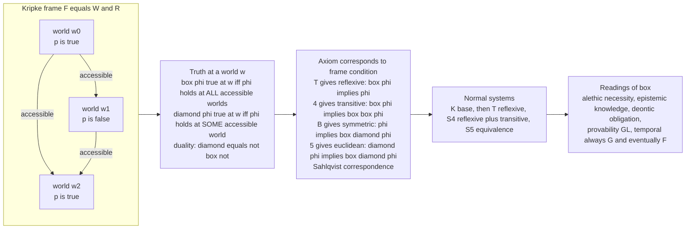

# 🌐 Modal & Temporal Logic

> [!abstract] TL;DR
> **Modal logic** extends ordinary logic with two operators — **□ ("box", necessarily)** and **◇ ("diamond", possibly, with ◇φ ≡ ¬□¬φ)** — and interprets them over **Kripke semantics**: a set of **possible worlds** joined by an **accessibility relation** `R`, where **□φ is true at a world `w` iff φ is true at *every* world accessible from `w`**, and **◇φ iff at *some*** such world (Kripke, 1959–63). Constraining `R` yields the classic **modal systems** — the base **K**, then **T** (reflexive), **S4** (reflexive + transitive), **S5** (equivalence) — via the **axiom ↔ frame-condition correspondence** (T ↔ reflexive, 4 ↔ transitive, B ↔ symmetric, 5 ↔ euclidean; the Sahlqvist theorem generalises this). The *same* box/diamond machinery, reinterpreted, becomes **alethic** (necessity), **epistemic** (knowledge), **deontic** (obligation), **provability** (□ = "provable", the logic GL of incompleteness), and **temporal** logic (□ = always/G, ◇ = eventually/F, plus Next and Until; **linear-time LTL** vs **branching CTL**). That last reading made modal logic a workhorse of computer science: **model checking** proves that a hardware or protocol design satisfies **safety** ("nothing bad ever happens") and **liveness** ("something good eventually happens") properties.

---

## Intuition

**Analogy — a world with shades of truth, not just on and off.** Classical logic is a light switch: every proposition is simply **true** or **false**. But everyday reasoning has *modes* between the poles. "2 + 2 = 4" is not merely true, it is **necessarily** true — true no matter how the world had turned out. "It rains in Lisbon on this date" is **possibly** true. "The train arrives" may be false now but true **tomorrow**. "The password is correct" may be **known** by the server but not by you. "You return the deposit" may be **obligatory** rather than factual. Modal logic keeps ordinary logic and bolts on operators for exactly these shades: **□** ("in every way things could be / at every relevant moment / as far as I know / as required") and its mirror **◇** ("in at least one such way").

To make this rigorous, Kripke pictured a **constellation of possible worlds** — each a complete, consistent way things could be — wired together by an **accessibility relation**: from where you stand, which alternatives *count*? **□φ means φ holds in every accessible world; ◇φ means φ holds in some.** Change the wiring and you change the meaning of "necessary": let every world see every other and □ becomes hard logical necessity (**S5**); let worlds be moments ordered by "later than" and □ becomes **always**, ◇ becomes **eventually** — and now you are doing **temporal logic**. This single idea — quantify over accessible worlds — unifies reasoning about necessity, time, knowledge, obligation, and program execution, and it is why an engineer can *formally guarantee* that a controller **never** enters an unsafe state or **always** eventually answers a request.

---

## How It Works

### Core Mechanics

1. **Syntax.** Take classical propositional (or first-order) logic and add two unary operators. **□φ** ("box φ", necessarily φ) and **◇φ** ("diamond φ", possibly φ). They are **duals**: `◇φ ≡ ¬□¬φ` and `□φ ≡ ¬◇¬φ` — "possibly φ" is "not necessarily not-φ", exactly as `∃ ≡ ¬∀¬` for quantifiers.

2. **Kripke frame and model.** A **frame** is a pair `F = (W, R)` with `W` a non-empty set of **worlds** and `R ⊆ W × W` the **accessibility relation** (`w R v` = "`v` is accessible from `w`"). A **model** `M = (W, R, V)` adds a **valuation** `V` fixing which atomic propositions are true at each world.

3. **Satisfaction (the relational semantics).** Truth is relative to a world `w`:
   - `M, w ⊨ p`  iff  `p ∈ V(w)` (atoms);  the Boolean connectives are local as usual.
   - `M, w ⊨ □φ`  iff  **for all** `v` with `w R v`, `M, v ⊨ φ`.
   - `M, w ⊨ ◇φ`  iff  **there exists** `v` with `w R v` and `M, v ⊨ φ`.
   A formula is **valid on a frame** if it is true at every world under *every* valuation — validity depends only on the *shape* of `R`, not on the atoms.

4. **The correspondence (axioms ↔ frame conditions).** Every world satisfies the base axiom **K**: `□(φ → ψ) → (□φ → □ψ)` (necessity distributes over implication) plus the **Necessitation** rule (`⊢ φ ⟹ ⊢ □φ`). Adding further axioms *forces* structure on `R`:

   | Axiom | Schema | Frame condition |
   |---|---|---|
   | **T** | `□φ → φ` | **reflexive** (`w R w`) |
   | **4** | `□φ → □□φ` | **transitive** |
   | **B** | `φ → □◇φ` | **symmetric** |
   | **5 (E)** | `◇φ → □◇φ` | **euclidean** |
   | **D** | `□φ → ◇φ` | **serial** (every world sees one) |

   Stacking these names the **systems**: **K** (base) ⊂ **T** (reflexive) ⊂ **S4** = KT4 (reflexive + transitive) ⊂ **S5** = KT45 (equivalence relation). The **Sahlqvist theorem** says a large syntactic class of axioms *automatically* corresponds to a first-order frame condition and is *complete* with respect to it.

5. **Completeness and decidability.** Each normal system is **sound and complete** for its frame class, proved by building a **canonical model** out of maximal consistent sets of formulas. Most core systems (K, T, S4, S5) have the **finite model property** — a satisfiable formula has a *finite* model — hence are **decidable**, which is exactly what lets a computer *check* modal/temporal specifications.

6. **The family of readings.** Fix the machinery, reinterpret □:
   - **Alethic** — necessity/possibility (metaphysics; usually S5).
   - **Epistemic** — `□φ` = "the agent *knows* φ"; multi-agent versions add **common knowledge** (links to AI and distributed systems).
   - **Deontic** — `□φ` = "it is *obligatory* that φ", `◇φ` = "permitted" (system **D**, serial: obligations must be jointly satisfiable).
   - **Provability** — `□φ` = "φ is *provable* in Peano Arithmetic"; the logic **GL** (Gödel–Löb) with axiom `□(□φ→φ)→□φ` captures **Löb's theorem** and is the modal logic *of* incompleteness (see the sibling **Godels_Incompleteness_Theorems**).
   - **Temporal** — `□` = **always (G)**, `◇` = **eventually (F)**, plus **X (next)** and **U (until)**; time may be **linear (LTL)** or **branching (CTL)**.

### Flow / Architecture



---

## Key Concepts

### Secondary (intuitive)
- **Box and diamond.** `□φ` = "necessarily / always / known / required φ"; `◇φ` = "possibly / eventually / permitted φ". They mirror each other: something is possible exactly when its negation is not necessary.
- **Possible worlds.** A "world" is a complete way things could be. `□` looks at *all* the worlds you can reach; `◇` needs only *one*.
- **Time as worlds.** Line the worlds up as moments — "now, next, later" — and "necessarily" becomes "always", "possibly" becomes "eventually". That is temporal logic, and it lets us say precisely what a machine should **never** and **always** do.

### Undergraduate (formal)
- **Kripke model `(W, R, V)`.** Worlds `W`, accessibility `R ⊆ W×W`, valuation `V`. Satisfaction: `w ⊨ □φ` iff every `R`-successor satisfies φ; `w ⊨ ◇φ` iff some successor does.
- **System K + Necessitation.** Axiom `K: □(φ→ψ)→(□φ→□ψ)`; rule: from `⊢φ` infer `⊢□φ`. Every **normal** modal logic contains these.
- **Axiom ↔ frame correspondence.** T ↔ reflexive, 4 ↔ transitive, B ↔ symmetric, 5 ↔ euclidean, D ↔ serial. Hence **T ⊂ S4 ⊂ S5**, with S5 having `R` an equivalence relation (so `□`/`◇` behave like universal/existential quantifiers over an equivalence class).
- **LTL basics.** Over a single infinite trace: `Xφ` (next), `Fφ` (eventually), `Gφ` (always), `φ U ψ` (φ holds until ψ). `Gφ ≡ ¬F¬φ` — the temporal box/diamond duality. **Safety** = `G(¬bad)`; **liveness/response** = `G(req → F ack)`.

### Graduate (deep)
- **Canonical models & completeness.** Worlds = maximal `Λ`-consistent sets; `Γ R Δ` iff `{φ : □φ ∈ Γ} ⊆ Δ`. The **Truth Lemma** then gives strong completeness of each normal system for its frame class.
- **Sahlqvist correspondence & completeness.** A syntactically defined class of axioms (Sahlqvist formulas) each define a **first-order** frame condition *and* are automatically **canonical**, hence complete — the theorem behind the whole T/4/B/5 table.
- **Finite model property & complexity.** K, T, S4 satisfiability is **PSPACE-complete**; S5 is **NP-complete** (its equivalence-class collapse). LTL satisfiability/model checking is **PSPACE-complete**; **CTL** model checking is **P** (linear in formula × model). These bounds are what make automated **verification** feasible.
- **Provability logic GL.** `□` = arithmetic provability; **GL** = K + `□(□φ→φ)→□φ` (the Löb axiom) is sound and complete for `Prov_PA` (Solovay 1976). **Löb's theorem** and Gödel's **Second Incompleteness Theorem** live here — see **Godels_Incompleteness_Theorems**.
- **Embeddings and neighbours.** The **Gödel–McKinsey–Tarski translation** faithfully embeds **intuitionistic** propositional logic into **S4**, tying modal logic to the sibling **Intuitionistic_and_Constructive_Logic**; modal logic itself sits among the **Nonclassical_and_Substructural_Logics** as a *conservative extension* of classical logic (unlike relevance or linear logics, it keeps all classical tautologies and adds operators). **Quantified modal logic** layers □/◇ on **First_Order_Predicate_Logic**, where the Barcan formula and constant- vs varying-domain semantics become live issues.
- **Automata connection.** Every LTL formula compiles to a **Büchi automaton** over infinite words; model checking is then language-emptiness of a product automaton — the bridge from logic to the theory of computation.

---

## Python Demo

Three things made concrete with pure `numpy`/`matplotlib`: **(a)** a **Kripke model checker** — build worlds, an accessibility relation, and a valuation, then implement modal satisfaction (`□φ` true at `w` iff φ holds at *all* successors, `◇φ` iff at *some*) and evaluate formulas at every world; **(b)** the **axiom ↔ frame-property correspondence** — check that `T` is valid *exactly on reflexive* frames, `4` *exactly on transitive* ones, and `5` *exactly on euclidean* ones (verified by assertion across several frames); **(c)** a tiny **LTL** check of **safety** `G(¬bad)` and **liveness** `F(ack)` / **response** `G(req → F ack)` over a linear-time trace. The figure plots the Kripke frame with modal truth values, the correspondence matrix, and the temporal trace.

```python
# Modal & Temporal Logic — Kripke model checking, the axiom<->frame
# correspondence, and a tiny LTL safety/liveness check.
import itertools
import numpy as np
import matplotlib.pyplot as plt
from matplotlib.patches import FancyArrowPatch, Circle

# A modal formula is a nested tuple:
#   ('p',)         atom            ('~', a)  not      ('&', a, b) and
#   ('|', a, b) or ('>', a, b) implies
#   ('[]', a)      box a (necessarily)        ('<>', a) diamond a (possibly)
def succ(w, R):
    return [v for (u, v) in R if u == w]

def sat(w, phi, R, val):
    """Modal satisfaction: is phi true at world w in model (R, val)?"""
    op = phi[0]
    if op in val:                                   # atom, e.g. 'p'
        return w in val[op]
    if op == '~':  return not sat(w, phi[1], R, val)
    if op == '&':  return sat(w, phi[1], R, val) and sat(w, phi[2], R, val)
    if op == '|':  return sat(w, phi[1], R, val) or  sat(w, phi[2], R, val)
    if op == '>':  return (not sat(w, phi[1], R, val)) or sat(w, phi[2], R, val)
    if op == '[]': return all(sat(v, phi[1], R, val) for v in succ(w, R))   # ALL
    if op == '<>': return any(sat(v, phi[1], R, val) for v in succ(w, R))   # SOME
    raise ValueError(op)

# ---------- (a) build a Kripke model and model-check formulas ----------
W   = [0, 1, 2, 3]
R   = [(0,1), (0,2), (1,2), (1,3), (2,3), (3,3)]
val = {'p': {1, 3}, 'q': {2, 3}}
box_p, dia_p = ('[]', ('p',)), ('<>', ('p',))
T_inst       = ('>', ('[]', ('p',)), ('p',))        # box p -> p (the T axiom)

print("=== (a) Kripke model checking ===")
print(" world |  p    |  []p    <>p   | []p->p")
truth_box_p = {}
for w in W:
    bp, dp = sat(w, box_p, R, val), sat(w, dia_p, R, val)
    truth_box_p[w] = bp
    p_here = 'p' if w in val['p'] else '.'
    print(f"   w{w}   |  {p_here}    |  {str(bp):<5}  {str(dp):<5} | {sat(w, T_inst, R, val)}")

# ---------- (b) axiom <-> frame-property correspondence ----------
def reflexive(Wc, Rf):  return all((w, w) in Rf for w in Wc)
def transitive(Wc, Rf):
    S = set(Rf); return all((a, c) in S for (a, b) in S for (b2, c) in S if b == b2)
def euclidean(Wc, Rf):
    S = set(Rf); return all((b, c) in S for (a, b) in S for (a2, c) in S if a == a2)

def valid_on_frame(Wc, Rf, phi, atoms=('p',)):
    """phi valid on frame = true at every world under EVERY valuation of atoms."""
    cells = [(a, w) for a in atoms for w in Wc]
    for bits in itertools.product([False, True], repeat=len(cells)):
        v = {a: set() for a in atoms}
        for (a, w), b in zip(cells, bits):
            if b: v[a].add(w)
        if not all(sat(w, phi, Rf, v) for w in Wc):
            return False
    return True

axiom_T = ('>', ('[]', ('p',)), ('p',))                          # box p -> p
axiom_4 = ('>', ('[]', ('p',)), ('[]', ('[]', ('p',))))          # box p -> box box p
axiom_5 = ('>', ('<>', ('p',)), ('[]', ('<>', ('p',))))          # dia p -> box dia p

Wc = [0, 1, 2]
frames = {
    "universal (S5)":      [(a, b) for a in Wc for b in Wc],
    "reflexive only":      [(0,0),(1,1),(2,2),(0,1),(1,2)],
    "transitive not refl": [(0,1),(1,2),(0,2)],
    "euclid+trans not refl":[(0,1),(0,2),(1,1),(1,2),(2,1),(2,2)],
    "empty relation":      [],
}
print("\n=== (b) Sahlqvist correspondence: property <-> axiom-validity ===")
print(f"{'frame':<24}| refl  T  | tran  4  | eucl  5")
rows = []
for name, Rf in frames.items():
    r, t, e = reflexive(Wc, Rf), transitive(Wc, Rf), euclidean(Wc, Rf)
    vT, v4, v5 = (valid_on_frame(Wc, Rf, ax) for ax in (axiom_T, axiom_4, axiom_5))
    assert r == vT and t == v4 and e == v5           # the correspondence, CHECKED
    rows.append((name, r, vT, t, v4, e, v5))
    print(f"{name:<24}| {str(r):<5}{str(vT):<3}| {str(t):<5}{str(v4):<3}| {str(e):<5}{v5}")
print("Every row: reflexive==T, transitive==4, euclidean==5  (assertions passed).")

# ---------- (c) a tiny LINEAR-time (LTL) safety/liveness check ----------
# Trace pi = s0..s4, last state stutters forever (a lasso).
trace = [
    {'req': False, 'ack': False, 'bad': False},   # s0
    {'req': True,  'ack': False, 'bad': False},   # s1  request raised
    {'req': False, 'ack': False, 'bad': False},   # s2
    {'req': False, 'ack': True,  'bad': False},   # s3  acknowledged
    {'req': False, 'ack': False, 'bad': False},   # s4  (loops on itself)
]
n = len(trace)
def F(atom, i=0): return any(trace[j][atom] for j in range(i, n))   # eventually
def G(atom, i=0): return all(trace[j][atom] for j in range(i, n))   # always

safety   = all(not trace[j]['bad'] for j in range(n))               # G(~bad)
liveness = F('ack')                                                 # F(ack)
response = all((not trace[i]['req']) or F('ack', i) for i in range(n))  # G(req -> F ack)
print("\n=== (c) LTL over a linear-time trace ===")
print("safety   G(not bad)      :", safety,   " (nothing bad ever happens)")
print("liveness F(ack)          :", liveness, " (ack happens eventually)")
print("response G(req -> F ack)  :", response, " (every request is eventually acked)")

# ---------------------------- visualization ----------------------------
fig, axes = plt.subplots(1, 3, figsize=(18, 6))

# Panel (a): Kripke frame, node green iff []p is TRUE there
ax = axes[0]
pos = {0:(0.22,0.80), 1:(0.80,0.80), 2:(0.22,0.22), 3:(0.80,0.22)}
def draw_edge(a, b, color="#475569"):
    if a == b:                                     # self-loop
        x, y = pos[a]
        ax.add_patch(FancyArrowPatch((x-0.05, y+0.09), (x+0.05, y+0.09),
                     connectionstyle="arc3,rad=3.2", arrowstyle='-|>',
                     mutation_scale=13, lw=1.6, color=color))
    else:
        ax.add_patch(FancyArrowPatch(pos[a], pos[b], connectionstyle="arc3,rad=0.18",
                     arrowstyle='-|>', mutation_scale=15, lw=1.6, color=color,
                     shrinkA=17, shrinkB=17))
for (a, b) in R:
    draw_edge(a, b)
for w in W:
    x, y = pos[w]
    fill = "#bbf7d0" if truth_box_p[w] else "#fecaca"
    ax.add_patch(Circle((x, y), 0.11, fc=fill, ec="#334155", lw=1.8, zorder=3))
    ax.text(x, y+0.02, f"w{w}", ha='center', va='center', fontsize=12, fontweight='bold', zorder=4)
    ax.text(x, y-0.05, 'p' if w in val['p'] else 'not p', ha='center', va='center',
            fontsize=8, zorder=4)
ax.set_title("(a) Kripke model -- node GREEN iff  []p  is TRUE there\n"
             "[]p = p holds at ALL accessible worlds", fontsize=10, fontweight='bold')
ax.set_xlim(0, 1); ax.set_ylim(0, 1); ax.axis('off')

# Panel (b): correspondence matrix -- paired columns are identical
ax = axes[1]
cols = ["reflexive", "T valid", "transitive", "4 valid", "euclidean", "5 valid"]
M = np.array([[int(r), int(vT), int(t), int(v4), int(e), int(v5)]
              for (_, r, vT, t, v4, e, v5) in rows])
ax.imshow(M, cmap="Greens", vmin=0, vmax=1.4, aspect="auto")
ax.set_xticks(range(len(cols))); ax.set_xticklabels(cols, rotation=45, ha='right', fontsize=8)
ax.set_yticks(range(len(rows))); ax.set_yticklabels([r[0] for r in rows], fontsize=8)
for i in range(M.shape[0]):
    for j in range(M.shape[1]):
        ax.text(j, i, "T" if M[i, j] else "F", ha='center', va='center', fontsize=10,
                fontweight='bold', color="#065f46" if M[i, j] else "#7f1d1d")
ax.set_title("(b) Sahlqvist correspondence\ncolumn PAIRS match:  T=refl, 4=trans, 5=eucl",
             fontsize=10, fontweight='bold')

# Panel (c): LTL linear-time trace (lasso)
ax = axes[2]
xs, y0 = np.linspace(0.10, 0.90, n), 0.58
for i in range(n):
    ax.add_patch(Circle((xs[i], y0), 0.045, fc="#e0e7ff", ec="#3730a3", lw=1.6, zorder=3))
    ax.text(xs[i], y0, f"s{i}", ha='center', va='center', fontsize=9, zorder=4)
    lab = [k for k in ('req', 'ack', 'bad') if trace[i][k]]
    if lab:
        ax.text(xs[i], y0+0.11, ",".join(lab), ha='center', fontsize=9, fontweight='bold',
                color="#b91c1c" if 'bad' in lab else "#1d4ed8")
for i in range(n-1):
    ax.add_patch(FancyArrowPatch((xs[i], y0), (xs[i+1], y0), arrowstyle='-|>',
                 mutation_scale=14, lw=1.6, color="#475569", shrinkA=9, shrinkB=9))
ax.add_patch(FancyArrowPatch((xs[-1]-0.02, y0-0.05), (xs[-1]+0.02, y0-0.05),
             connectionstyle="arc3,rad=-3.0", arrowstyle='-|>', mutation_scale=12,
             lw=1.5, color="#475569"))
ax.text(0.5, 0.22,
        f"safety   G(not bad)   = {safety}\nliveness  F(ack)      = {liveness}\n"
        f"response  G(req -> F ack) = {response}",
        ha='center', fontsize=10, family='monospace',
        bbox=dict(boxstyle='round', fc='#f1f5f9', ec='#475569'))
ax.set_title("(c) LTL on a linear-time trace (lasso)\nG = always,  F = eventually",
             fontsize=10, fontweight='bold')
ax.set_xlim(0, 1); ax.set_ylim(0, 1); ax.axis('off')

plt.tight_layout()
plt.savefig('modal_temporal_logic.png', dpi=120)
plt.show()
```

Panel **(a)** shows some worlds satisfying `□p` (all their successors make `p` true) and some not — modal truth is *local to a world*. Panel **(b)** is the punchline: the "reflexive"/"T valid" columns are identical, as are transitive/4 and euclidean/5 — the `assert` proves the **axiom ↔ frame-condition** biconditionals across every frame. Panel **(c)** verifies a **safety** and a **liveness** property on a temporal trace, exactly the two shapes of guarantee a model checker delivers.

---

## Real-World Applications

> **Example — model checking with temporal logic (Pnueli; Clarke–Emerson–Sifakis).** Amir Pnueli's 1977 insight was that **reactive systems** — controllers, protocols, operating-system kernels that run forever rather than compute-and-halt — are naturally specified in **temporal logic**: safety as `G(¬bad)` and liveness as `G(req → F ack)`. Clarke, Emerson, and Sifakis then made it *automatic*: **model checking** exhaustively explores a system's (finite) state graph and either certifies a temporal property or returns a concrete **counterexample trace**. Tools built on this — **SPIN** (LTL), **NuSMV** (CTL/LTL), and hardware checkers — routinely find deadlocks and race conditions in cache-coherence protocols, avionics, and chip designs that testing misses. The three researchers shared the **2007 Turing Award** for it. Under the hood, an LTL formula is compiled to a **Büchi automaton** and intersected with the system automaton, then checked for language emptiness — the bridge to the theory of computation.

- **Distributed-systems specification (TLA+).** Leslie Lamport's **Temporal Logic of Actions** writes an entire system as one temporal formula `Init ∧ □[Next] ∧ Fairness`; the **TLC** model checker verifies safety and liveness of Paxos, Raft, and production services at AWS and Microsoft.
- **Knowledge in AI and security.** **Epistemic logic** (`Kᵢφ` = "agent *i* knows φ") and **common knowledge** model what agents know about each other — foundational for multi-agent systems, negotiation, cryptographic-protocol analysis (the BAN logic of authentication), and the "muddy children" / Byzantine reasoning about agreement.
- **Legal and normative systems.** **Deontic logic** (`□` = obligatory, `◇` = permitted) formalises regulations, contracts, and access-control policies where the question is what *ought* to hold, not what does.
- **Metaphysics and the philosophy of necessity.** **S5** is the standard logic of metaphysical necessity and possibility; possible-worlds semantics reshaped analytic philosophy's treatment of essence, counterfactuals, and rigid designation (Kripke's *Naming and Necessity*).
- **Provability and the limits of proof.** The logic **GL** captures exactly the schematic truths about "provable in PA", giving a clean modal account of Löb's theorem and Gödel's second incompleteness theorem.

---

## Common Pitfalls

- **Forgetting box/diamond duality.** `◇φ` is definable as `¬□¬φ` and `□φ` as `¬◇¬φ`; treating them as independent primitives double-counts axioms. In temporal logic the same duality is `Fφ ≡ ¬G¬φ` — "eventually" is "not always-not".
- **Confusing axioms with frame conditions.** An **axiom** is a *formula* you assume; a **frame condition** is a *property of `R`* (reflexive, transitive, …). The correspondence links them, but they live on different levels — validity of `T` is a fact *about the class of reflexive frames*, not a truth at a single world. Not every frame property is expressible by an axiom, and not every axiom corresponds to a first-order condition (this is where Sahlqvist's syntactic restriction matters).
- **Using the wrong system.** **K** proves too little (no `□φ → φ`), so `□` needn't even be true; **S5** proves too much (`◇φ → □◇φ`), collapsing iterated modalities — inappropriate for *knowledge over time* or *provability*. Pick the system whose frame class matches your domain: epistemic knowledge often **S4/S5**, belief **KD45**, provability **GL** (which is *not* even reflexive — `□φ → φ` fails, since provable ≠ true for the theory itself), deontic **D**.
- **LTL vs CTL confusion.** **LTL** quantifies over a *single* path ("on this run, always/eventually…"); **CTL** adds explicit path quantifiers `A`/`E` over the *branching tree* of futures ("on **all** paths eventually", `AF`, vs "on **some** path", `EF`). They are **incomparable** in expressiveness — `AG EF p` ("from every reachable state it is *possible* to reach `p`", a reset property) is CTL-only, while the LTL fairness formula `GF p → GF q` is LTL-only. CTL* subsumes both. Their model-checking complexities also differ (CTL is cheaper).
- **Assuming all modal logics are "normal".** The systems above are **normal**: they validate axiom **K** and the Necessitation rule. **Non-normal** modal logics (weaker "classical"/monotone systems using **neighbourhood semantics** instead of relational frames) drop these — used for logics of ability, high-probability, or "most", where `□(φ∧ψ)` need not give `□φ ∧ □ψ`. Kripke frames are a *special case* of neighbourhood models.
- **Reading epistemic `□` as truth.** `Kφ → φ` (knowledge implies truth, the T axiom) is standard for *knowledge* but **not** for *belief* — an agent can believe falsehoods, so doxastic logic drops T and uses **KD45**. Applying alethic intuitions to the epistemic or deontic reading silently smuggles in axioms your domain rejects.

---

## Related Concepts

- [[Modal_Logic]] — the informal/philosophical companion (Logic & Critical Thinking): same box/diamond and Kripke frames, told for reasoning and argumentation rather than the CS/mathematical-completeness treatment here.
- [[Predicate_Logic_and_Quantifiers]] — quantified modal logic layers □/◇ on first-order quantifiers; `□`/`◇` behave like `∀`/`∃` *over accessible worlds*, and the Barcan formula asks whether they commute.
- [[Philosophy_of_Logic]] — is there one "correct" modal system? The status of possible worlds, and whether necessity is metaphysical, logical, or merely linguistic.
- [[What_Is_Metaphysics]] — possible-worlds semantics reshaped metaphysics of modality, essence, and counterfactuals; S5 as the logic of metaphysical necessity.
- [[Formal_Verification_TLA_Plus]] — Lamport's Temporal Logic of Actions and the TLC model checker: safety/liveness of distributed protocols expressed as one temporal formula, exactly the LTL flavour demoed above.
- [[Applications_of_Finite_Automata]] — LTL-to-Büchi translation and automata-theoretic model checking: temporal formulas become ω-automata whose emptiness reveals counterexamples.
- [[Logic_in_AI_and_Computation]] — epistemic/knowledge representation, common knowledge, and logic-based agents where `□` reads as "knows".

Siblings in this section developed in prose (not yet standalone notes here): **Godels_Incompleteness_Theorems** (provability logic GL, Löb's theorem), **First_Order_Predicate_Logic** (the base that quantified modal logic extends), **Intuitionistic_and_Constructive_Logic** (the Gödel–McKinsey–Tarski embedding into S4), and **Nonclassical_and_Substructural_Logics** (modal logic as a conservative nonclassical extension).

---

## Review Questions

**Secondary.** Explain in your own words the difference between "`p` is true" and "`p` is *necessarily* true", and between "`p` is true" and "`p` is *eventually* true". Using the possible-worlds picture, why does `□p` need *every* accessible world to satisfy `p`, while `◇p` needs only *one*?

**Undergraduate.** (a) State the truth conditions for `□φ` and `◇φ` in a Kripke model, and show `◇φ ≡ ¬□¬φ`. (b) Give the frame condition corresponding to each of the axioms T, 4, and 5, and name the system you get by combining T + 4 and T + 4 + 5. (c) Write, in LTL, "no request is ever dropped: every `req` is eventually followed by an `ack`", and separately a *safety* property and a *liveness* property, identifying which is which.

**Graduate.** (a) Sketch the canonical-model construction and explain how the Truth Lemma yields completeness of S4 for reflexive-transitive frames. (b) State Löb's axiom and explain why **GL** is *not* reflexive, and how this encodes Gödel's Second Incompleteness Theorem (provable-in-`T` does not imply true-for-`T`). (c) Give a property expressible in CTL but not LTL and vice versa, and explain why their model-checking complexities differ. (d) Describe the LTL-to-Büchi-automaton pipeline and how language emptiness produces a counterexample trace.

---

## Sources

- Kripke, S. A. (1963). *Semantical Considerations on Modal Logic*. Acta Philosophica Fennica 16, 83–94. — the paper that founded relational (Kripke) semantics for modal logic.
- Blackburn, P., de Rijke, M. & Venema, Y. (2001). *Modal Logic*. Cambridge Tracts in Theoretical Computer Science 53. — the standard graduate text: frames, correspondence, Sahlqvist theory, completeness, computational aspects.
- Hughes, G. E. & Cresswell, M. J. (1996). *A New Introduction to Modal Logic*. Routledge. — thorough coverage of the systems K, T, S4, S5 and their axiomatics.
- Pnueli, A. (1977). *The Temporal Logic of Programs*. Proc. 18th FOCS, 46–57. — introduces temporal logic for reasoning about reactive/concurrent programs.
- Clarke, E. M., Grumberg, O. & Peled, D. (1999). *Model Checking*. MIT Press. — the definitive account of automata-theoretic model checking, LTL/CTL, and safety/liveness verification.

---

#mathematical-logic #modal-logic #temporal-logic #kripke-semantics #verification
