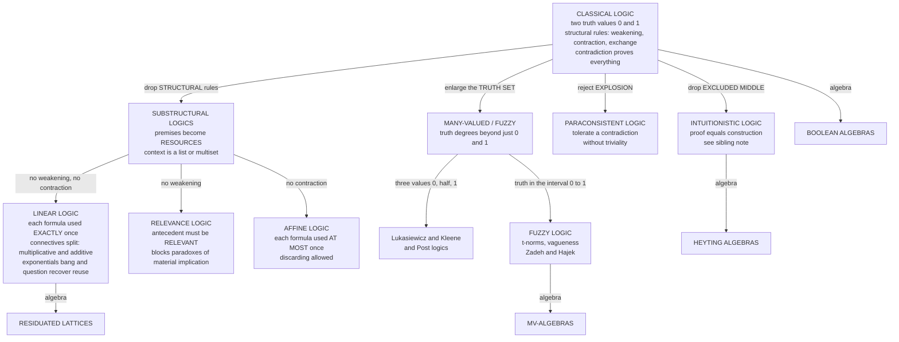

# 🧩 Nonclassical & Substructural Logics

> [!abstract] TL;DR
> **Classical logic quietly assumes three things we rarely question:** that a premise can be reused any number of times, that every proposition is exactly **true or false**, and that a single contradiction lets you prove **anything** (`ex falso quodlibet`). **Nonclassical logics drop these assumptions one at a time.** **Substructural logics** delete a *structural rule* of the sequent calculus — **weakening** (add unused premises), **contraction** (reuse a premise), or **exchange** (reorder) — turning propositions into **resources**: **linear logic** (Girard 1987) forbids both weakening and contraction, so each formula must be used **exactly once**; **relevance logic** forbids weakening, forcing the antecedent to be genuinely *relevant* to the consequent; **affine logic** forbids only contraction (use *at most* once). **Many-valued** and **fuzzy** logics enlarge the truth set — from `{0,1}` to `{0, ½, 1}` (Łukasiewicz) or the whole interval `[0,1]` — to model **vagueness** and degrees of truth. **Paraconsistent** logics reject explosion, so a system can hold a contradiction **without collapsing into triviality**. The unifying picture is **algebraic**: each logic is the theory of a class of algebras (Boolean → Heyting → MV → residuated lattices), and the same drop-a-rule discipline powers **Rust's ownership types**, **fuzzy controllers**, and **inconsistency-tolerant databases**.

---

## Intuition

**Analogy — a recipe versus a mathematical fact.** In classical logic a premise behaves like a **known fact**: once you know "it is raining," you may invoke that fact five times, or never, in any order, and it stays just as true. Proof is *free reuse of eternal truths*. But now imagine a premise is instead an **ingredient in a recipe**. If your proof-recipe says "one egg makes one omelette," then having **one egg** lets you make **one** omelette — not two, no matter how cleverly you argue. Spend the egg and it is **gone**. This single shift — *premises are consumed, not contemplated* — is the heart of **substructural** logic: it re-reads the deduction "`A`, `A → B`, `A → C`, therefore `B` and `C`" as an accounting error, because it silently used the one `A` **twice**.

Two more hidden classical assumptions crack just as easily. First, **truth is not always crisp**: "this room is warm" has no sharp true/false answer at 21 °C — so let truth be a **dial in `[0,1]`**, and watch the sacred law of **excluded middle** (`P ∨ ¬P` is always true) quietly fail when `P` is a half-truth. Second, **a contradiction need not be an apocalypse**: a real database or belief set often holds `p` and `¬p` at once, yet we do *not* want it to therefore "prove" that the moon is cheese — so **paraconsistent** logic disarms the explosion. Each nonclassical logic is what you get by dropping **one** quiet classical assumption, yielding mathematics tailored to reality's messiness: **resources**, **vagueness**, **uncertainty**, and **inconsistency**.

---

## How It Works

### Core Mechanics

Classical logic can be presented as a **sequent calculus** manipulating sequents `Γ ⊢ Δ` ("from the multiset of assumptions `Γ`, one of the conclusions in `Δ` follows"). Beyond the *logical* rules (how to introduce `∧`, `∨`, `→`, `¬`) there are three almost-invisible **structural rules** governing the assumption context `Γ`:

1. **Weakening** — you may add an assumption you never use: `Γ ⊢ Δ` gives `Γ, A ⊢ Δ`. (Monotonicity: more premises never hurt.)
2. **Contraction** — you may collapse two copies of an assumption into one, i.e. **reuse** it: `Γ, A, A ⊢ Δ` gives `Γ, A ⊢ Δ`.
3. **Exchange** — you may reorder assumptions: `Γ, A, B ⊢ Δ` gives `Γ, B, A ⊢ Δ`. (Order is irrelevant.)

**Substructural logics are exactly the logics you get by deleting one or more of these rules.** Removing a structural rule makes the context stop behaving like a *set* of eternal truths and start behaving like a **list or multiset of resources**.

- **Drop weakening + contraction ⟹ Linear Logic (Girard 1987).** No formula can be added unused (no weakening) or reused (no contraction), so **every hypothesis is consumed exactly once**. Because the two "flavours" of conjunction/disjunction that classical logic conflated now come apart, the connectives **split** into **multiplicatives** (`⊗` "times", `⅋` "par" — combine *separate* resources) and **additives** (`&` "with", `⊕` "plus" — offer a *choice* of resource). Genuine reuse is recovered by the **exponentials** `!` ("of course", a resource you may copy freely) and `?` ("why not"). Linear implication is written `A ⊸ B`: "consume one `A` to produce one `B`."
- **Drop weakening only ⟹ Relevance (Relevant) Logic.** Keeping contraction but banning weakening means an antecedent cannot be dead weight: it must actually be **used** to reach the consequent. This blocks the notorious **paradoxes of material implication** such as `A → (B → A)` ("a true statement is implied by anything") and `¬A → (A → B)`.
- **Drop contraction only ⟹ Affine Logic.** Each resource may be used **at most once** (but discarding unused resources is allowed). This is the logic behind **affine type systems** and, loosely, **Rust's ownership**: a value is moved and consumed, though it may be dropped without use.
- **Change the truth values ⟹ Many-Valued / Fuzzy Logic.** Independently of structural rules, replace the two-element Boolean algebra `{0,1}` with a larger ordered set of **truth degrees**: three values `{0, ½, 1}` (Łukasiewicz `Ł₃`, Kleene), finitely many (Post logics), or the entire real interval `[0,1]` (**fuzzy logic**; Zadeh, Hájek). Connectives become numeric operations built from a **t-norm** for `∧`; excluded middle and non-contradiction generally **fail**.
- **Reject explosion ⟹ Paraconsistent Logic.** Deny `ex falso quodlibet` (`A, ¬A ⊢ B` for arbitrary `B`). A contradiction stays **local**; the system tolerates `p ∧ ¬p` without becoming **trivial** (proving everything). The **dialetheist** (Priest) goes further and holds some contradictions are literally *true*.

**The unifying view is algebraic.** Just as classical logic is the theory of **Boolean algebras** and intuitionistic logic (which drops the *law of excluded middle*, developed in the sibling note *Intuitionistic_and_Constructive_Logic*) is the theory of **Heyting algebras**, each nonclassical logic corresponds to a class of algebras: fuzzy/Łukasiewicz logic ↔ **MV-algebras**, and substructural logics in general ↔ **residuated lattices** (a lattice with a monoidal "fusion" `⊗` and a residual `→`). Choosing which lattice laws to keep *is* choosing which structural rules to keep.

### Flow / Architecture



---

## Key Concepts

### Secondary (intuitive)
- **Structural rule.** A bookkeeping permission about *assumptions* — may I add an unused one, reuse one, reorder them? Classical logic grants all three; nonclassical logics revoke some.
- **Resource reading.** In a substructural logic a premise is like an **ingredient**: use it, and it's spent. "One egg ⊸ one omelette" cannot make two omelettes from one egg.
- **Degrees of truth.** Instead of *true/false*, a statement can be **0.7 true**. "The room is warm" is a dial, not a switch — the domain of **fuzzy** logic.
- **Contradiction without catastrophe.** A **paraconsistent** system can note that two of its beliefs clash *without* concluding that therefore *everything* is true.

### Undergraduate (formal)
- **Sequent calculus & the three structural rules.** Weakening (`Γ ⊢ Δ ⟹ Γ, A ⊢ Δ`), contraction (`Γ, A, A ⊢ Δ ⟹ Γ, A ⊢ Δ`), exchange. Substructural = delete some of these. (The calculus itself is developed in the sibling *Formal_Systems_and_Proof_Calculi*.)
- **Linear connectives.** Multiplicatives `⊗` / `⅋` (combine independent resources) vs additives `&` / `⊕` (choose one resource). Linear implication `A ⊸ B`. Units `1, ⊥, ⊤, 0`. The **exponential** `!A` licenses arbitrary copying — reintroducing weakening + contraction *locally*, so classical/intuitionistic logic embeds inside linear logic.
- **Paradoxes of material implication.** Classically `A → (B → A)` and `(A ∧ ¬A) → B` are valid but intuitively wrong. **Relevance logic** rejects them by demanding the antecedent share a *variable* with, and be *used* to derive, the consequent.
- **Many-valued matrices.** Łukasiewicz `Ł₃` on `{0, ½, 1}`: `¬a = 1−a`, `a → b = min(1, 1−a+b)`. **Fuzzy** logic extends this to `[0,1]`. A **t-norm** `T` (associative, commutative, monotone, with `T(a,1)=a`) generalises conjunction — min (Gödel), product, and Łukasiewicz `max(0, a+b−1)` are the three fundamental ones.
- **Explosion / ex falso.** `A, ¬A ⊢ B`. Paraconsistent systems (e.g. Priest's **LP**, da Costa's **C-systems**) invalidate it; the standard classical derivation via disjunctive syllogism is what they block.

### Graduate (deep)
- **Girard's phase & coherence semantics; proof nets.** Linear logic has a denotational semantics in **coherence spaces**, and cut-free proofs are represented by **proof nets** — graph-like objects free of the bureaucratic sequentialisation of sequent proofs, with a geometric **correctness criterion**. Cut-elimination becomes local graph rewriting, tightly linked to the **Geometry of Interaction**.
- **Curry–Howard for resources.** Linear logic is the type theory of **linear λ-calculus**: `⊗` is a tensor pair, `⊸` a use-once function, `!A` a duplicable value. This underlies **session types** for concurrency, **linear/affine type systems**, and **quantitative type theory** — the bridge to the sibling *Type_Theory_and_the_Foundations_of_Mathematics* and to Programming-Language-Theory notes on resource types.
- **Residuated lattices & substructural hierarchy.** All these logics live in the lattice of **substructural logics** whose base is the **Full Lambek calculus (FL)**; adding exchange, weakening, contraction as axioms recovers relevance, affine, and classical logic. **Algebraic completeness**: each logic is sound and complete for a variety of residuated structures (MV-algebras for Łukasiewicz, Heyting for intuitionistic, Boolean for classical).
- **Fuzzy metamathematics (Hájek).** **BL** (Basic fuzzy Logic) is the logic of all continuous t-norms; Łukasiewicz, Gödel, and Product logics are its principal extensions. Hájek's *Metamathematics of Fuzzy Logic* gives Hilbert systems, completeness, and complexity results — fuzzy logic as a rigorous mathematical discipline, not mere "approximate reasoning."
- **Dialetheism & the Liar.** Priest argues the **Liar paradox** ("this sentence is false") is a genuine **dialetheia** — a true contradiction — best handled by a paraconsistent logic like **LP** rather than by hierarchies or truth-value gaps. This reframes Tarski's undefinability and the semantic paradoxes.
- **Quantum logic (brief).** Birkhoff–von Neumann's logic of projections on a Hilbert space is **non-distributive** (`a ∧ (b ∨ c) ≠ (a ∧ b) ∨ (a ∧ c)`) — an **orthomodular lattice** rather than a Boolean one; another way a "quiet classical assumption," distributivity, can be dropped.

---

## Python Demo

Two experiments make the abstractions concrete. **(a)** A **many-valued / fuzzy** logic on `[0,1]` with `¬x = 1−x`, `∧ = min`, `∨ = max`, and **Łukasiewicz implication** `a → b = min(1, 1−a+b)`. We evaluate the **law of excluded middle** `P ∨ ¬P` across all truth degrees and *watch it fail* — it dips to `0.5` at `P = 0.5`, so a classical tautology is **not** valid here. We also map the implication surface. **(b)** A schematic **linear-logic resource ledger**: classical logic reuses `A` to derive **both** `B` and `C`; a resource-counting (linear) reading spends `A` **once**, yielding `B` **or** `C` — never both.

```python
# Nonclassical & Substructural Logics:
#   (a) many-valued / fuzzy logic  -> EXCLUDED MIDDLE fails on [0,1]
#   (b) linear logic  -> a premise A is a RESOURCE spent exactly once
import numpy as np
import matplotlib.pyplot as plt

# ---------------------------------------------------------------
# (a) FUZZY / MANY-VALUED LOGIC on [0,1]  (Zadeh min/max + Lukasiewicz ->)
# ---------------------------------------------------------------
NEG  = lambda x: 1.0 - x                       # negation
AND  = lambda a, b: np.minimum(a, b)           # Goedel conjunction
OR   = lambda a, b: np.maximum(a, b)           # Goedel disjunction
IMPL = lambda a, b: np.minimum(1.0, 1.0 - a + b)   # Lukasiewicz implication

p = np.linspace(0, 1, 501)
lem = OR(p, NEG(p))          # P v not P   -> classically always 1
nc  = NEG(AND(p, NEG(p)))    # not(P and not P) -> classically always 1

print("=== (a) MANY-VALUED / FUZZY LOGIC ===")
print(" P     P v ~P   ~(P & ~P)")
for v in [0.0, 0.25, 0.5, 0.75, 1.0]:
    print(f"{v:4.2f}   {max(v,1-v):6.2f}   {1-min(v,1-v):8.2f}")
print(f"min of excluded-middle P v ~P over [0,1] = {lem.min():.2f}"
      f"  (classical logic demands 1.0)  -> TAUTOLOGY FAILS\n")
# NOTE: with Lukasiewicz STRONG disjunction  a (+) b = min(1, a+b),
#       P (+) ~P = min(1, p + 1-p) = 1, which WOULD restore excluded middle.
#       The failure above uses the max-disjunction -- the choice of connective matters.

# ---------------------------------------------------------------
# (b) LINEAR LOGIC resource accounting
#     Given one token of A, and rules  A -> B  and  A -> C :
#       classical  : A may be REUSED  => derive B AND C
#       linear     : A spent ONCE     => derive B OR C, not both
# ---------------------------------------------------------------
print("=== (b) LINEAR-LOGIC RESOURCE ACCOUNTING (start: 1 x A) ===")
ledger = [
    ("classical (contraction allowed)", "reuse A twice", "B and C", "yes"),
    ("linear   (no contraction)",       "spend A once",  "B or C",  "no"),
]
for name, how, got, both in ledger:
    print(f"  {name:34s} | {how:14s} | derive {got:8s} | both? {both}")

# ---------------------------------------------------------------
# VISUALIZATION
# ---------------------------------------------------------------
fig, (ax1, ax2, ax3) = plt.subplots(1, 3, figsize=(17, 5.2))

# -- Panel 1: excluded middle failing --
ax1.plot(p, lem, lw=2.6, color='#dc2626', label="P v ~P  (fuzzy)")
ax1.plot(p, nc,  lw=2.0, color='#2563eb', ls='--', label="~(P & ~P)  (fuzzy)")
ax1.axhline(1.0, color='#16a34a', lw=2, ls=':', label="classical value = 1")
ax1.scatter([0.5], [0.5], s=90, color='#dc2626', zorder=5)
ax1.annotate("fails hardest\nat P = 0.5  -> 0.5", xy=(0.5, 0.5),
             xytext=(0.55, 0.18), fontsize=10, color='#dc2626',
             arrowprops=dict(arrowstyle="->", color='#dc2626'))
ax1.set_title("(a) Excluded middle is NOT a tautology\nfuzzy truth in [0,1]",
              fontsize=11, fontweight='bold')
ax1.set_xlabel("truth degree of P"); ax1.set_ylabel("truth value of formula")
ax1.set_ylim(-0.03, 1.08); ax1.legend(loc='lower center', fontsize=9)
ax1.grid(True, ls=':', alpha=0.5)

# -- Panel 2: Lukasiewicz implication surface --
A, B = np.meshgrid(p, p)
Z = IMPL(A, B)
im = ax2.imshow(Z, origin='lower', extent=[0, 1, 0, 1],
                cmap='viridis', aspect='auto', vmin=0, vmax=1)
ax2.set_title("Lukasiewicz implication\nA -> B = min(1, 1 - A + B)",
              fontsize=11, fontweight='bold')
ax2.set_xlabel("truth of B"); ax2.set_ylabel("truth of A")
fig.colorbar(im, ax=ax2, fraction=0.046, pad=0.04, label="truth of A -> B")

# -- Panel 3: linear resource ledger (table) --
ax3.axis('off')
ax3.set_title("(b) Linear logic: A is a RESOURCE\nstart with one token of A",
              fontsize=11, fontweight='bold')
cell = [["reuse A twice", "B and C", "YES"],
        ["spend A once",  "B or C",  "no"]]
tbl = ax3.table(cellText=cell,
                rowLabels=["classical\n(contraction)", "linear\n(no contraction)"],
                colLabels=["how A is used", "derivable", "both?"],
                cellLoc='center', rowLoc='center', loc='center')
tbl.scale(1, 3.0); tbl.set_fontsize(11)
for (r, c), cellobj in tbl.get_celld().items():
    if r == 0:
        cellobj.set_facecolor('#e0e7ff'); cellobj.set_text_props(fontweight='bold')
    elif r == 1:
        cellobj.set_facecolor('#fee2e2')   # classical: reuse
    elif r == 2:
        cellobj.set_facecolor('#dcfce7')   # linear: use-once
ax3.text(0.5, 0.06,
         "A , A -> B , A -> C  |-  classical: B & C   vs   linear: B  or  C",
         transform=ax3.transAxes, ha='center', fontsize=9.5,
         family='monospace', color='#334155')

plt.tight_layout()
plt.savefig('nonclassical_substructural_logics.png', dpi=120)
plt.show()
```

The console shows `P ∨ ¬P` sinking to **0.5** at `P = 0.5` — a **classical tautology that is no longer valid** once truth is a degree (Panel 1). The implication heatmap (Panel 2) reveals `A → B` staying at 1 whenever `B ≥ A` and sliding down smoothly otherwise — graded entailment. The ledger (Panel 3) stages linear logic's central lesson: **the same three premises entail `B ∧ C` classically but only `B ⊕ C` when `A` is a resource spent once.** (The commented note flags the crucial subtlety — Łukasiewicz's *strong* disjunction would restore excluded middle, so which connective you pick decides which classical laws survive.)

---

## Real-World Applications

> **Example — Rust's ownership as affine logic in a shipping compiler.** Rust's borrow checker enforces that each value has a single **owner** and that a *move* **consumes** it: after `let b = a;` (for a non-`Copy` type), using `a` again is a compile error. That is precisely an **affine** discipline — every resource used **at most once**, discarding allowed — the substructural rule "**no contraction**" turned into a memory-safety guarantee that eliminates use-after-free and double-free **without a garbage collector**. Linear/affine types are substructural logic *shipping in production*, and the same idea powers **session types** that guarantee a network protocol's messages are sent in the right order exactly once.

- **Fuzzy control systems.** Rice cookers, camera autofocus, anti-lock brakes, and HVAC controllers use **fuzzy rule bases** ("if temperature is *somewhat high* and rising *slowly*, then cooling is *medium*") built from t-norms and defuzzification — robust control from vague, human-readable rules where precise differential-equation models are impractical.
- **Paraconsistent reasoning over inconsistent data.** Real knowledge bases, merged ontologies, and belief revision systems routinely contain contradictions. A **paraconsistent** query engine returns useful answers about the *consistent* part instead of exploding into "everything follows," and belief-revision frameworks localise contradictions rather than trivialising the whole store.
- **Linear logic in language & concurrency semantics.** Beyond types, linear logic models **concurrency** (proof nets ↔ interaction), **quantum** programming (no-cloning ≈ no contraction), and resource-aware **cost analysis**. Its multiplicative/additive split gives a principled vocabulary for "parallel composition" vs "choice."
- **Vagueness and graded reasoning in AI.** Fuzzy description logics, neuro-symbolic systems, and many-valued semantics give machine-reasoning tools for **degrees of membership and confidence** — distinct from probability, which measures *uncertainty about a crisp fact* rather than *graded truth itself*.

---

## Common Pitfalls

- **Not knowing which structural rule each logic drops.** The whole taxonomy hinges on this: **linear** drops *weakening and contraction*, **relevance** drops *weakening*, **affine** drops *contraction*, and all keep *exchange* (drop exchange too and you reach **non-commutative** logics like the Lambek calculus of grammar). Memorise the map or the logics blur together.
- **"Paraconsistent means everything goes / anything is true."** The opposite. Paraconsistency exists *precisely to stop* "everything follows." A paraconsistent theory is **non-trivial** even while inconsistent: it contains `p` and `¬p` yet **not** every sentence. Trivialism (everything true) is the failure mode it is designed to avoid, and **dialetheism** (some contradictions are true) is a separate, stronger philosophical claim, not the same thing.
- **Confusing fuzzy degrees of truth with probability.** A truth value of `0.7` for "the room is warm" is a **degree of the property itself** (graded truth, `∧ = min`), *not* "70% chance the room is definitely warm." Probabilities of exclusive alternatives must sum to 1 and obey Kolmogorov's axioms; fuzzy degrees need not (`P` and `¬P` can both be `0.5`). Fuzzy logic models **vagueness**; probability models **uncertainty about crisp facts** — see the contrast with Bayesian reasoning.
- **Forgetting that linear logic's `!` recovers reuse.** Linear logic is not "you can never reuse anything." The **exponential** `!A` explicitly marks a resource as **duplicable and discardable**, locally restoring weakening + contraction. Via `!`, both intuitionistic and classical logic *embed* in linear logic — so linear logic **refines** classical logic rather than merely restricting it.
- **Assuming excluded middle / non-contradiction hold by default.** In many-valued and fuzzy logics `P ∨ ¬P` and `¬(P ∧ ¬P)` are generally **not** tautologies (as the demo shows), and *which* they are depends on the chosen connectives (max-disjunction vs Łukasiewicz strong `⊕`). Also do not conflate **intuitionistic** logic (drops *excluded middle*, keeps explosion) with **paraconsistent** logic (keeps excluded middle, drops *explosion*) — they are dual departures from classical logic.
- **Treating "nonclassical" as "informal" or "vague."** These logics are fully rigorous, with **algebraic** and **proof-theoretic** completeness theorems (MV-algebras, residuated lattices, Heyting algebras). "Nonclassical" names *which axioms differ*, not a lack of rigour.

---

## Related Concepts

- [[Propositional_Logic_and_Boolean_Semantics]] — the two-valued Boolean baseline whose quiet assumptions (bivalence, free reuse, explosion) every nonclassical logic selectively rejects.
- [[First_Order_Predicate_Logic]] — the classical quantified system these logics generalise; substructural and many-valued variants each have their own predicate-level extensions.
- [[Linear_Logic_and_Resource_Types]] — the Programming-Language-Theory companion: Girard's linear logic as the type theory of use-once resources, `⊗`/`⊸`/`!`, and Curry–Howard for concurrency.
- [[Type_Systems_Fundamentals]] — where linear/affine typing lives operationally; substructural type systems are structural rules enforced by a compiler.
- [[Ownership_and_Borrowing]] — Rust's borrow checker *is* an affine substructural discipline: move-consumes, single-owner, no double-use — memory safety without a GC.
- [[Modal_Logic]] — another family of nonclassical logics (necessity/possibility); linear logic's `!` behaves modally, and both sit in the broader landscape of logics beyond the classical.
- [[Predicate_Logic_and_Quantifiers]] — the classical quantifier theory against which relevance and paraconsistent quantification are defined.
- [[Bayesian_Reasoning]] — the probabilistic account of **uncertainty about crisp facts**, the essential foil to fuzzy logic's **degrees of truth**.
- [[Logic_in_AI_and_Computation]] — where fuzzy control, paraconsistent knowledge bases, and resource logics are put to computational work.
- [[Computability_and_Recursion_Theory]] — decidability/complexity of these logics (e.g. propositional linear logic is undecidable; fuzzy validity has its own complexity landscape).
- [[Mathematical_Logic_and_Set_Theory]] — the wider foundational map into which the algebraic hierarchy Boolean → Heyting → MV → residuated lattices fits.

Siblings developing this section in depth (prose references): **Intuitionistic_and_Constructive_Logic** (the LEM-dropping neighbour whose Heyting-algebra semantics parallels the residuated-lattice story), **Modal_and_Temporal_Logic** (necessity/possibility and time as further nonclassical departures), **Type_Theory_and_the_Foundations_of_Mathematics** (Curry–Howard reading of linear/affine proofs as resource-typed programs), **Formal_Systems_and_Proof_Calculi** (the sequent calculus and its structural rules that this note dismantles), and **Category_Theoretic_Logic_and_Topos_Theory** (the categorical semantics of these logics, e.g. `*`-autonomous categories for linear logic).

---

## Review Questions

**Secondary.** Explain, using the "recipe vs known fact" analogy, why a **linear** logic will *not* let you derive both `B` and `C` from a single `A` together with `A → B` and `A → C`, even though classical logic will. What everyday situation (money, ingredients, energy) does this "use it once" behaviour model well?

**Undergraduate.** State the three **structural rules** of the sequent calculus (weakening, contraction, exchange) and say exactly which one(s) each of the following drops: **linear logic**, **relevance logic**, **affine logic**. Then, using the Łukasiewicz connectives `¬a = 1−a`, `∨ = max`, evaluate `P ∨ ¬P` at `P = 0.5` and explain why the **law of excluded middle** is no longer a tautology.

**Graduate.** (a) Distinguish **intuitionistic** logic from **paraconsistent** logic in terms of *which* classical principle each rejects (excluded middle vs explosion), and give the algebraic semantics of each. (b) Explain how the **exponentials** `!` and `?` allow linear logic to *recover* weakening and contraction locally, and hence embed intuitionistic logic — why does this make linear logic a *refinement* rather than a mere restriction? (c) Sketch the correspondence between substructural logics and **residuated lattices**, naming the algebra class matching Łukasiewicz fuzzy logic. (d) Contrast **fuzzy degrees of truth** with **probability** on a single example, showing where the axioms diverge.

---

## Sources

- Girard, J.-Y. (1987). *Linear Logic*. Theoretical Computer Science **50**(1), 1–101. — the founding paper: resources, multiplicatives/additives, exponentials, proof nets.
- Anderson, A. R. & Belnap, N. D. (1975). *Entailment: The Logic of Relevance and Necessity*, Vol. I. Princeton University Press. — the canonical development of relevance/relevant logic and the paradoxes of material implication.
- Priest, G. (2008). *An Introduction to Non-Classical Logic: From If to Is* (2nd ed.). Cambridge University Press. — broad, rigorous survey covering many-valued, fuzzy, relevant, and paraconsistent logics.
- Hájek, P. (1998). *Metamathematics of Fuzzy Logic*. Kluwer/Trends in Logic. — the mathematical foundations of fuzzy logic: BL, t-norms, MV-algebras, completeness.
- Restall, G. (2000). *An Introduction to Substructural Logics*. Routledge. — the unifying proof-theoretic and algebraic account of dropping structural rules; residuated lattices and the Lambek base.
- Paoli, F. (2002). *Substructural Logics: A Primer*. Kluwer/Trends in Logic. — accessible companion mapping the whole substructural hierarchy.

---

#mathematical-logic #nonclassical-logic #linear-logic #fuzzy-logic #substructural
