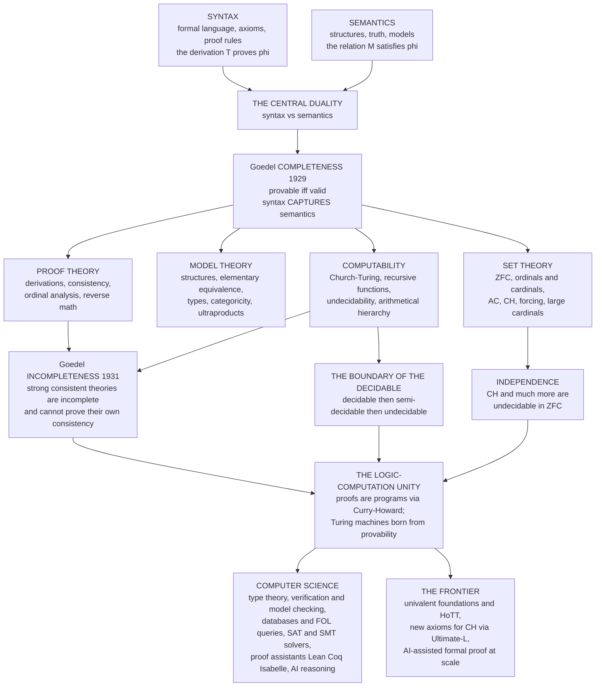

# 🏛️ The Reach and Future of Mathematical Logic

> [!abstract] TL;DR
> Mathematical logic began as **philosophy's attempt to secure mathematics on unshakeable foundations** — and it *failed*, spectacularly and beautifully. Hilbert wanted a single complete, consistent, mechanically-checkable system for all of mathematics; **Gödel** proved no such system can exist, the **continuum's size** is forever undecidable in ZFC, and some truths have no proof. Yet from this "failure" came the **greatest triumph of 20th-century thought**: in pinning down the exact *limits* of formal reasoning, logicians were forced to define **computation itself**. Turing's abstract machines for studying provability became the computers on your desk; the **Curry–Howard correspondence** revealed that *proofs are programs*; logic became the **DNA of computer science**. This capstone synthesizes the whole vault — its four pillars (**model theory, proof theory, set theory, computability**), its great themes (**syntax vs semantics**, the **completeness** of logic against the **incompleteness** of theories, the **boundary of the decidable**, and **independence**), and its living frontier (**homotopy type theory**, **new axioms for CH**, and **AI-assisted formal proof at scale**).

---

## Intuition

**Analogy — the map-maker who discovered the edge of the world was also a doorway.** Imagine cartographers who set out to draw *one perfect map* of all mathematical truth: every theorem placed, every question answerable, the whole territory captured on a single sheet that also certifies its own accuracy. This was **David Hilbert's dream** at the dawn of the 20th century — a *complete, consistent, mechanically-checkable foundation* that would banish paradox forever and make "provable" and "true" the same word.

They failed. In 1931 a 25-year-old named **Kurt Gödel** proved that *any* map rich enough to describe arithmetic must leave true regions uncharted — and worse, no such map can even certify that it contains no contradictions. The dream of the one final map was **impossible**, not by oversight but by a law as firm as any theorem.

Here is the twist that makes logic's story the opposite of a tragedy. To *state* the impossibility precisely, Gödel had to invent a way to encode "proof" and "computation" as arithmetic — and five years later **Alan Turing**, chasing the same question ("is there a machine that decides every mathematical statement?"), built an abstract device to make "mechanical procedure" exact. The answer was *no* — but the **machine he built to prove it was the computer**. Logic went looking for the boundary of the provable and stumbled through a doorway into the **digital age**. The failure to close mathematics was the birth of computer science. That is the reach of mathematical logic: it turned *reasoning itself* into a rigorous object of study, found reasoning's permanent limits, and in doing so built the foundation beneath every machine that now reasons for us.

---

## How It Works

### The whole vault, synthesized

Mathematical logic is organized around a single master move — **make reasoning a mathematical object** — pursued along four interlocking pillars, all bound by Gödel's two great theorems and all draining, in the end, into computer science.

1. **The foundational split: syntax vs semantics.** Every logical system has two faces. **Syntax** is the game of symbols — axioms and inference rules that let you *derive* `T ⊢ φ` with no appeal to meaning (see [[Formal_Systems_and_Proof_Calculi]], [[Propositional_Logic_and_Boolean_Semantics]], [[First_Order_Predicate_Logic]]). **Semantics** is the world of *meaning* — structures `M` in which sentences are true, `M ⊨ φ` ([[Model_Theory_Foundations]]). The founding miracle, **Gödel's Completeness Theorem** ([[Soundness_and_Completeness]]), is that for first-order logic these two coincide: *provable exactly when valid.* Syntax perfectly captures semantics. Its companions — [[Compactness_and_Lowenheim_Skolem]] — reveal the strange elasticity this buys: any theory with arbitrarily large finite models has infinite ones, and no first-order theory can pin down the reals up to size.

2. **Model theory — the semantics pillar.** Study structures through the sentences they satisfy: [[Elementary_Equivalence_and_Embeddings]] (when two structures are logically indistinguishable), [[Types_Omitting_and_Saturation]] (the fine-grained "flavors" of elements), [[Quantifier_Elimination_and_Decidability]] (why the theory of real closed fields is *decidable* while arithmetic is not), [[Categoricity_and_Morley_Theorem]] (theories with one model per cardinality), and [[Ultraproducts_and_Nonstandard_Analysis]] (building infinitesimals as a limit of models). Applied model theory now proves *theorems in number theory and geometry*.

3. **Set theory — the foundational framework.** [[Axiomatic_Set_Theory_ZFC]] is the standard bedrock; on it stand [[Ordinals_and_Cardinals]] (the arithmetic of the infinite), [[The_Axiom_of_Choice_and_Equivalents]], and the vault's most dramatic discovery — [[The_Continuum_Hypothesis]] is **independent** of ZFC. Gödel (1938) and **Cohen's [[Forcing_and_Independence_Proofs]]** (1963) showed ZFC can neither prove nor refute how many reals there are. To reach further, logicians ascend the tower of [[Large_Cardinals_and_the_Higher_Infinite]] — axioms of infinity so strong they measure a theory's very consistency.

4. **Computability — the logic of the mechanical.** [[Computability_and_Recursion_Theory]] pins down "algorithm" via the **Church–Turing thesis**, built from [[Primitive_Recursive_and_Mu_Recursive_Functions]]. It maps the **boundary of the decidable**: [[Undecidability_and_Reducibility]], [[Turing_Degrees_and_the_Priority_Method]] (a whole hierarchy of *unsolvability*), [[The_Arithmetical_Hierarchy]] (classifying problems by quantifier alternations), and [[Algorithmic_Randomness_and_Complexity]] (what it means for an infinite sequence to be *truly random*).

5. **Gödel and proof theory — the binding thread.** [[Godels_Incompleteness_Theorems]] tie the pillars together: any consistent, effectively-axiomatized theory strong enough for [[Peano_Arithmetic_and_Formal_Number_Theory]] is **incomplete** and cannot prove its own consistency. The engine is **arithmetization of syntax and diagonalization** (a sibling note in this vault), which turns provability into an arithmetic predicate. From the ashes of Hilbert's program, **proof theory and ordinal analysis** (sibling note) salvages *relative* consistency via Gentzen's `ε₀`, while [[Second_Order_and_Higher_Order_Logic]] and **reverse mathematics** (sibling note) chart exactly which axioms each theorem needs.

6. **The frontiers.** Beyond classical logic lie **intuitionistic and constructive logic**, **modal and temporal logic**, **type theory and the foundations of mathematics**, **category-theoretic logic and topos theory**, and **nonclassical and substructural logics** (all sibling notes in this vault's frontier section). These are not curiosities — they are the logics running inside proof assistants, model checkers, and programming languages.

The unifying revelation is the **logic–computation unity**: via the **Curry–Howard correspondence**, *propositions are types and proofs are programs*; via Turing and Church, *the study of provability gave birth to the theory of computation*. Logic did not merely *inform* computer science — it is its **mathematical substrate**.

### Flow / Architecture



---

## Key Concepts

### Secondary (the big ideas in plain words)
- **Two sides of logic.** *Syntax* is the rulebook for pushing symbols around; *semantics* is what the symbols mean. Logic's founding triumph was showing these two agree for basic (first-order) logic.
- **Completeness vs incompleteness — not a contradiction.** *Logic* is complete (every valid argument has a proof); a rich *theory* like arithmetic is incomplete (some true statements have no proof). Different subjects, both true.
- **Some questions have no algorithm.** No program can decide whether an arbitrary program halts, or whether an arbitrary math statement is provable. There is a hard **edge to what machines can decide**.
- **Some questions are undecided by our axioms.** How many real numbers are there? ZFC — our standard foundation — **cannot answer**. This is *independence*, a discovery, not ignorance.
- **Proofs are programs.** A proof and a computer program are the same kind of object viewed two ways. This is why logic became the backbone of computer science.

### Undergraduate (the formal machinery)
- **Soundness and completeness.** `T ⊢ φ ⟹ T ⊨ φ` (soundness) and `T ⊨ φ ⟹ T ⊢ φ` (Gödel completeness for first-order logic); together, `⊢` and `⊨` coincide.
- **Compactness and Löwenheim–Skolem.** A set of sentences has a model iff every finite subset does; any theory with an infinite model has models of every infinite cardinality — first-order logic *cannot* control the size of its models.
- **Decidability trichotomy.** A problem is **decidable** (recursive: `Δ₁`), **semi-decidable** (recursively enumerable: `Σ₁`, e.g. the Halting problem and provability), or **undecidable** beyond that. The **arithmetical hierarchy** `Σₙ / Πₙ` classifies by counting quantifier alternations over a decidable core.
- **Incompleteness (Gödel 1931).** Any consistent, effectively-axiomatized `T ⊇ PA` has a true sentence `G` with `T ⊬ G` and `T ⊬ ¬G`; and `T ⊬ Con(T)`. Built by **arithmetizing syntax** and applying the **diagonal lemma** to `¬Prov_T`.
- **Independence (Cohen 1963).** Via **forcing**, `ZFC ⊬ CH` and `ZFC ⊬ ¬CH`; with Gödel's constructible universe `L`, both `CH` and `¬CH` are consistent with ZFC.
- **Quantifier elimination = decidability.** Presburger arithmetic (addition only) and real-closed fields admit QE and are *decidable*; full arithmetic (`+` and `×`) does not and is not.

### Graduate (the deep structure)
- **The great asymmetry: provability vs truth.** Provability `Prov_T(x)` is `Σ₁` and hence *definable*; arithmetic *truth* is **not arithmetically definable** (Tarski). The diagonal lemma tamed as `G` for provability becomes a *paradox* for truth — the reason the Liar cannot be formalized as a theorem.
- **Curry–Howard–Lambek.** *Propositions-as-types, proofs-as-programs, and both-as-objects-in-a-cartesian-closed-category.* Intuitionistic natural deduction ≅ simply-typed λ-calculus ≅ a CCC; dependent type theory ≅ the internal logic of a locally cartesian closed category / topos.
- **Consistency-strength ladder.** Theories are pre-well-ordered by *interpretability* and `Con`: `Q < PRA < PA < ... < Z₂ < ZFC < ZFC + inaccessible < ... < ZFC + Woodin`. Each rung proves the consistency of those below (Second Incompleteness forbids reaching your own rung). **Large cardinals** are the canonical yardstick; **reverse mathematics** calibrates the *bottom* of this ladder with its "Big Five" subsystems of second-order arithmetic.
- **Degrees of unsolvability.** The Turing degrees form an upper semilattice of enormous complexity; the **priority method** builds intermediate degrees `0 < d < 0'` (Friedberg–Muchnik), refuting Post's conjecture that r.e. sets come in only two flavors.
- **New axioms for CH.** Independence is not the end of the story: **Woodin's Ultimate-L** program, forcing axioms (`MM`, `PFA`), and inner-model theory seek *principled* new axioms that would settle CH — mathematics arguing about which foundation to *adopt*.
- **Foundational pluralism.** Set theory (ZFC), type theory (**univalent foundations / HoTT**), and category theory (**topos theory**, ETCS) are three rival-but-interpretable foundations. Machine-checkable mathematics at scale (**Lean's Mathlib**, Coq, Isabelle) is forcing the question of *which* foundation into engineering practice.

---

## Python Demo

A single dashboard capturing the four signature ideas of the vault: **(1) semantics** — a truth table where every row is a *model* and an all-true column is a *tautology* (valid, hence provable by completeness); **(2) incompleteness** — Gödel numbering encoding the self-referential fixed point `G ↔ ¬Prov(#G)`; **(3) computability** — the decidable / semi-decidable / undecidable trichotomy laddered into the arithmetical hierarchy; **(4) independence** — the consistency-strength ladder from Robinson arithmetic up through large cardinals, with CH marked as independent of ZFC.

```python
# Mathematical Logic in one dashboard: SEMANTICS, INCOMPLETENESS,
# COMPUTABILITY, INDEPENDENCE -- the four pillars of the whole vault.
import numpy as np
import matplotlib.pyplot as plt
from itertools import product

fig, ax = plt.subplots(2, 2, figsize=(15, 11))
fig.suptitle("Mathematical Logic: Semantics | Incompleteness | Computability | Independence",
             fontsize=14, fontweight="bold")

# ---------------------------------------------------------------
# (1) SEMANTICS -- a truth table / model checker.
# Tautology (hypothetical syllogism):  ((p->q) & (q->r)) -> (p->r)
# ---------------------------------------------------------------
rows = list(product([0, 1], repeat=3))          # all assignments of p, q, r
imp = lambda a, b: (1 - a) | b                    # material implication a -> b
labels = ["p", "q", "r", "p->q", "q->r", "p->r", "TAUT"]
M = []
for p, q, r in rows:
    pq, qr, pr = imp(p, q), imp(q, r), imp(p, r)
    M.append([p, q, r, pq, qr, pr, imp(pq & qr, pr)])
M = np.array(M)

a0 = ax[0, 0]
a0.imshow(M, cmap="RdYlGn", vmin=0, vmax=1, aspect="auto")
a0.set_xticks(range(len(labels))); a0.set_xticklabels(labels, fontsize=9)
a0.set_yticks(range(len(rows)))
a0.set_yticklabels(["".join(map(str, row)) for row in rows], fontsize=8, family="monospace")
for i in range(M.shape[0]):
    for j in range(M.shape[1]):
        a0.text(j, i, "T" if M[i, j] else "F", ha="center", va="center", fontsize=8)
a0.set_title("1) SEMANTICS: truth table -- each row a MODEL\n"
             "last column all-T => TAUTOLOGY => provable by Completeness",
             fontsize=9, fontweight="bold")
print("Tautology holds in every model:", bool(M[:, -1].all()))

# ---------------------------------------------------------------
# (2) INCOMPLETENESS -- Godel numbering of the fixed point
#     G <-> not Prov(#G).  symbols -> prime powers -> one integer.
# ---------------------------------------------------------------
def first_primes(n):
    pr, c = [], 2
    while len(pr) < n:
        if all(c % p for p in pr):
            pr.append(c)
        c += 1
    return pr

SYM = {"not": 1, "Prov": 2, "(": 3, "#": 4, "G": 5, ")": 6}
tokens = ["not", "Prov", "(", "#", "G", ")"]     # reads: not Prov(#G)
codes = [SYM[t] for t in tokens]
ps = first_primes(len(codes))
heights = [p ** c for p, c in zip(ps, codes)]
G = int(np.prod([np.float64(h) for h in heights]))  # illustrative magnitude

a1 = ax[0, 1]
a1.bar(range(len(codes)), heights, color="#0d9488", zorder=3)
a1.set_yscale("log")
a1.set_xticks(range(len(codes)))
a1.set_xticklabels([f"{t}\n{p}^{c}" for t, p, c in zip(tokens, ps, codes)], fontsize=8)
a1.set_ylabel("prime power (log scale)")
a1.grid(True, axis="y", ls=":", alpha=0.5)
a1.set_title("2) INCOMPLETENESS: Godel numbering of\n"
             "G <-> not Prov(#G)  -- true but unprovable",
             fontsize=9, fontweight="bold")

# ---------------------------------------------------------------
# (3) COMPUTABILITY -- the decidability trichotomy / arithmetical hierarchy
# ---------------------------------------------------------------
a2 = ax[1, 0]
a2.set_xlim(0, 1); a2.set_ylim(0, 1); a2.axis("off")
a2.set_title("3) COMPUTABILITY: the arithmetical hierarchy\n"
             "decidable  <  semi-decidable  <  undecidable  <  higher",
             fontsize=9, fontweight="bold")
levels = [
    ("higher hierarchy: 0', 0'', ...", "Turing jumps and degrees", "#c7d2fe"),
    ("Sigma2 , Pi2 , ...", "is a program TOTAL? (halts on all inputs)", "#e9d5ff"),
    ("Pi1  co-r.e.  (UNDECIDABLE)", "totality, Con(T), Goldbach-form claims", "#fecaca"),
    ("Sigma1  SEMI-DECIDABLE (r.e.)", "Halting problem, provability Prov_T", "#fde68a"),
    ("Delta1  DECIDABLE (recursive)", "primality, Presburger arithmetic", "#bbf7d0"),
]
y = 0.06
for name, ex, color in levels:
    a2.add_patch(plt.Rectangle((0.05, y), 0.9, 0.15, fc=color, ec="#334155"))
    a2.text(0.08, y + 0.105, name, fontsize=9, fontweight="bold", va="center")
    a2.text(0.08, y + 0.04, "e.g. " + ex, fontsize=8, va="center", color="#334155")
    y += 0.185

# ---------------------------------------------------------------
# (4) INDEPENDENCE -- the consistency-strength ladder
# ---------------------------------------------------------------
a3 = ax[1, 1]
a3.set_xlim(0, 1); a3.set_ylim(0, 1); a3.axis("off")
a3.set_title("4) INDEPENDENCE: consistency-strength ladder\n"
             "each theory proves Con of those below; CH is independent of ZFC",
             fontsize=9, fontweight="bold")
theories = [
    "Q  (Robinson arithmetic)",
    "PRA / RCA0  (reverse-math base)",
    "PA  (Peano arithmetic)",
    "Z2  (full second-order arithmetic)",
    "ZFC  --  CH is INDEPENDENT here",
    "ZFC + inaccessible cardinal",
    "ZFC + measurable cardinal",
    "ZFC + Woodin cardinals -> Ultimate-L",
]
n = len(theories)
for i, t in enumerate(theories):
    yy = 0.04 + i * (0.90 / (n - 1))
    w = 0.32 + 0.55 * i / (n - 1)
    a3.add_patch(plt.Rectangle((0.10, yy - 0.028), w, 0.052,
                               fc=plt.cm.viridis(i / (n - 1)), ec="k", alpha=0.9))
    a3.text(0.12, yy, t, fontsize=8, va="center",
            color="white" if i > 3 else "black", fontweight="bold")
a3.annotate("", xy=(0.06, 0.98), xytext=(0.06, 0.02),
            arrowprops=dict(arrowstyle="->", lw=2))
a3.text(0.028, 0.5, "increasing consistency strength", rotation=90,
        va="center", ha="center", fontsize=8)

plt.tight_layout(rect=[0, 0, 1, 0.96])
plt.savefig("mathematical_logic_dashboard.png", dpi=120)
plt.show()
```

The four panels are the vault in miniature: a **tautology** whose all-true final column shows *validity*, which completeness guarantees is *provable*; a **Gödel number** collapsing a self-referential formula into a single integer so arithmetic can speak of its own proofs; the **arithmetical hierarchy** laddering the decidable, semi-decidable, and undecidable; and the **strength ladder** on which ZFC sits with CH suspended, undecided, between the rungs.

---

## Real-World Applications

> **Example — every computer you own descends from a proof about proofs.** Turing's 1936 machine was invented *to study provability* — to answer Hilbert's Entscheidungsproblem, "is there a mechanical procedure deciding every mathematical statement?" The answer was **no** ([[The_Halting_Problem_and_Undecidability]]), but the abstract "machine" built to prove it — the [[Turing_Machines_and_the_Church_Turing_Thesis|Turing machine]] — is the mathematical definition of *computation*. The stored-program computer, the compiler, the CPU: all are engineered realizations of a device logicians designed to map the *limits of formal reasoning*. Logic's failure to complete mathematics **was** the invention of computer science.

- **Programming languages and type theory.** A type checker is a **proof checker**: via the **Curry–Howard correspondence**, "the program type-checks" means "the proof is valid." Static typing, generics/polymorphism (System F), and **dependent types** ([[Type_Systems_Fundamentals]], [[Dependent_Types_and_Advanced_Type_Systems]]) are applied proof theory; Rust's borrow checker is [[Linear_Logic_and_Resource_Types|linear logic]] enforcing resource discipline.
- **Formal verification and model checking.** Hoare logic ([[Axiomatic_Semantics_and_Hoare_Logic]]) and temporal logic drive tools that *prove* programs and hardware correct. Amazon uses TLA+ and the SMT solver-backed prover for cloud infrastructure; Intel and ARM model-check CPU designs; seL4 is a formally verified OS kernel. All are decidability and proof theory cashed out in engineering.
- **Databases and query languages.** Relational algebra and SQL are **first-order logic** over finite structures; query optimization, integrity constraints, and Datalog are model theory and fixed-point logic in production. Codd's relational model *is* applied [[First_Order_Predicate_Logic]].
- **Automated reasoning: SAT and SMT solvers.** Modern **SAT** solvers decide propositional satisfiability for millions of variables; **SMT** solvers (Z3, CVC5) add theories (arithmetic, arrays, bit-vectors). They power verification, symbolic execution, program synthesis, and scheduling — the practical frontier of [[Propositional_Logic_and_Boolean_Semantics|Boolean logic]] and [[Quantifier_Elimination_and_Decidability|decidable theories]].
- **Proof assistants and formalized mathematics.** **Lean** (with **Mathlib**), **Coq**, and **Isabelle/HOL** ([[Proof_Assistants_and_Dependent_Type_Theory]]) let mathematicians build machine-checked proofs — the four-color theorem, the Feit–Thompson theorem, Kepler's conjecture (Flyspeck), and now research-level results — realizing Hilbert's formalization dream at scale, on the *other* side of Gödel.
- **AI and knowledge representation.** Logic programming (Prolog, Datalog), description logics behind OWL and the semantic web, and neuro-symbolic reasoning graft formal logic onto machine learning; LLM-guided tactic search now assists proof assistants, closing a loop between statistical and formal reasoning.
- **Cryptography and complexity.** Zero-knowledge proofs, interactive proof systems, and the entire `P` vs `NP` question ([[P_versus_NP]], [[NP_Completeness_and_the_Cook_Levin_Theorem]]) live at the intersection of logic and computation; [[Algorithmic_Randomness_and_Complexity]] and Kolmogorov complexity ground what "random" and "incompressible" mean.

---

## Common Pitfalls

- **"Incompleteness means mathematics is broken / nothing can be proved."** False. Essentially everything working mathematicians prove *is* provable in ZFC or even PA. Gödel showed only that *any single fixed* consistent, arithmetic-capable system leaves *specific* sentences undecided and cannot self-certify its consistency. The **practice** of mathematics is untouched; the **dream of one final self-certifying axiom set** is what died — see [[Godels_Incompleteness_Theorems]].
- **Confusing completeness with incompleteness.** The **Completeness Theorem** (first-order *logic* captures validity) and the **Incompleteness Theorems** (a strong *theory* leaves truths unproved) are *opposite* results about *different objects* (logic vs a theory). They are constantly conflated; they do not contradict — see [[Soundness_and_Completeness]].
- **Gödel misuses in philosophy and physics.** The **Lucas–Penrose** claim that "humans see `G` is true, so minds transcend machines" is widely rejected: it assumes the mind is a *known consistent formal system*, precisely what Gödel forbids us to certify. Invoking incompleteness to "prove" there is no Theory of Everything, to defend theology, or to settle free will are **category errors** — the theorems concern formal derivability in arithmetic-capable systems, not physics, consciousness, or "truth" in general.
- **Treating independence as ignorance.** That ZFC neither proves nor refutes **CH** is not a gap in our cleverness — it is a *theorem* that CH is **independent** (Gödel + Cohen forcing). Independence is a **discovery about the axioms**, revealing that ZFC underdetermines mathematical truth; the live research question is *which new axioms* to adopt, not "we haven't tried hard enough."
- **Mistaking formalization for mathematical practice.** Logic models *idealized* proof; real mathematics uses intuition, diagrams, and analogy that no formal system fully captures. The gap between `T ⊢ φ` and how humans *find* proofs is real — which is exactly why proof assistants and AI-assisted proving are hard, and interesting.
- **Assuming "decidable in principle" means "feasible."** Presburger arithmetic is decidable but has *doubly-exponential* lower bounds; many decidable logics are intractable. **Decidability is not efficiency** — the boundary studied by computability is coarser than the one studied by complexity theory.
- **Reading Löwenheim–Skolem as paradox.** That a countable model of set theory exists ("Skolem's paradox") is not a contradiction — "countable" is asserted *inside* a model that lacks the bijection witnessing it. First-order logic simply cannot pin down uncountability; that is a *feature* of [[Compactness_and_Lowenheim_Skolem|its expressive limits]], not a flaw.

---

## Related Concepts

**The four pillars (this vault):**
- [[Mathematical_Logic_Overview]] — the entry point this capstone closes the loop on; the four-pillar map made concrete.
- [[Soundness_and_Completeness]] — the founding coincidence of syntax and semantics; the "complete" half that incompleteness famously contrasts.
- [[Compactness_and_Lowenheim_Skolem]] — the elasticity of first-order semantics; why no first-order theory controls the size of its models.
- [[Model_Theory_Foundations]], [[Elementary_Equivalence_and_Embeddings]], [[Types_Omitting_and_Saturation]], [[Quantifier_Elimination_and_Decidability]], [[Categoricity_and_Morley_Theorem]], [[Ultraproducts_and_Nonstandard_Analysis]] — the semantics pillar in full.
- [[Axiomatic_Set_Theory_ZFC]], [[Ordinals_and_Cardinals]], [[The_Axiom_of_Choice_and_Equivalents]], [[The_Continuum_Hypothesis]], [[Forcing_and_Independence_Proofs]], [[Large_Cardinals_and_the_Higher_Infinite]] — the set-theory pillar and the story of independence.
- [[Computability_and_Recursion_Theory]], [[Primitive_Recursive_and_Mu_Recursive_Functions]], [[Undecidability_and_Reducibility]], [[Turing_Degrees_and_the_Priority_Method]], [[The_Arithmetical_Hierarchy]], [[Algorithmic_Randomness_and_Complexity]] — the computability pillar mapping the boundary of the decidable.
- [[Godels_Incompleteness_Theorems]], [[Peano_Arithmetic_and_Formal_Number_Theory]], [[Second_Order_and_Higher_Order_Logic]] — the Gödel/proof-theory thread that binds the whole field.
- **Frontier siblings** (developed elsewhere in this vault's frontier section): *Arithmetization of Syntax and Diagonalization*, *Proof Theory and Ordinal Analysis*, *Reverse Mathematics*, *Intuitionistic and Constructive Logic*, *Modal and Temporal Logic*, *Type Theory and the Foundations of Mathematics*, *Category-Theoretic Logic and Topos Theory*, and *Nonclassical and Substructural Logics*.

**Cross-vault — the logic–computation unity made explicit:**
- [[Theory_of_Computation_Overview]] and [[The_Halting_Problem_and_Undecidability]] — Turing's computational twin of incompleteness, born from the same question.
- [[Turing_Machines_and_the_Church_Turing_Thesis]], [[Decidability_and_Recognizability]], [[Recursive_Functions_and_Lambda_Calculus]] — the three equivalent definitions of "computable" underpinning the Church–Turing thesis.
- [[P_versus_NP]] and [[NP_Completeness_and_the_Cook_Levin_Theorem]] — where logic's decidability boundary meets complexity's feasibility boundary.
- [[The_Curry_Howard_Correspondence]] — *proofs are programs*: the deepest single bridge between logic and computer science.
- [[Type_Systems_Fundamentals]], [[Dependent_Types_and_Advanced_Type_Systems]], [[Proof_Assistants_and_Dependent_Type_Theory]], [[Homotopy_Type_Theory]] — type theory as applied and constructive foundations; HoTT/univalence as the frontier.
- [[Intuitionistic_Logic_and_Constructive_Proofs]], [[Axiomatic_Semantics_and_Hoare_Logic]], [[Linear_Logic_and_Resource_Types]] — constructive logic and verification logics in programming-language theory.
- [[Categorical_Logic_and_Type_Theory]], [[Cartesian_Closed_and_Topos_Theory]], [[Curry_Howard_Lambek_Correspondence]], [[The_Reach_and_Future_of_Category_Theory]] — the categorical face of logic and the third foundational pillar.
- [[Mathematical_Logic_and_Set_Theory]] — the compact treatment of this material within the core Mathematics vault.
- [[Truth_Theories_and_Metalogic]], [[Philosophy_of_Logic]], [[Modal_Logic]], [[Proof_Theory_and_Natural_Deduction]], [[Logic_in_AI_and_Computation]] — the philosophical and informal-logic companions.
- [[Kolmogorov_Complexity_and_Algorithmic_Information]] — the information-theoretic mirror of undecidability and algorithmic randomness.

---

## Review Questions

**Secondary.** Hilbert dreamed of a single, complete, self-certifying foundation for all of mathematics. In your own words, *why did this dream fail*, and why is calling it a "failure" misleading given what came out of it? Explain the difference between "a statement is *unprovable* in a system" and "mathematics is unreliable."

**Undergraduate.** (a) State precisely the difference between Gödel's **Completeness** theorem and his **Incompleteness** theorems, naming the object each concerns. (b) Explain the decidability trichotomy (decidable / semi-decidable / undecidable) and place *provability in PA* and *the Halting problem* on it. (c) What does it mean that **CH is independent of ZFC**, and how do Gödel's constructible universe and Cohen's forcing establish it? (d) Give one everyday technology that is *applied first-order logic* and one that is *applied proof theory*.

**Graduate.** (a) Explain the Curry–Howard–Lambek correspondence and argue why "logic is the DNA of computer science" is more than a slogan. (b) Describe the consistency-strength ladder and why the Second Incompleteness Theorem forces theories to be ordered by which *other* theories' consistency they can prove; where do reverse mathematics and large cardinals sit on it? (c) Independence shows ZFC underdetermines mathematical truth. Compare two responses — Woodin's search for new axioms (Ultimate-L) versus multiverse/pluralist positions — and state what a *satisfying* resolution of CH would even look like. (d) Critique the Lucas–Penrose argument using the exact hypotheses of the incompleteness theorems.

---

## Sources

- Enderton, H. B. (2001). *A Mathematical Introduction to Logic* (2nd ed.). Academic Press. — the standard rigorous introduction spanning first-order logic, completeness, incompleteness, and computability.
- Boolos, G., Burgess, J. & Jeffrey, R. (2007). *Computability and Logic* (5th ed.). Cambridge University Press. — the canonical bridge from Turing machines and recursion theory to Gödel's theorems.
- van Dalen, D. (2013). *Logic and Structure* (5th ed.). Springer. — proof theory, model theory, and intuitionistic logic in one modern text.
- Halpern, J. Y., Harper, R., Immerman, N., Kolaitis, P. G., Vardi, M. Y. & Vianu, V. (2001). ["On the Unusual Effectiveness of Logic in Computer Science."](https://www.cs.rice.edu/~vardi/papers/bsl01.pdf) *Bulletin of Symbolic Logic* 7(2), 213–236. — the definitive survey of logic's reach into CS.
- Raatikainen, P. ["Gödel's Incompleteness Theorems."](https://plato.stanford.edu/entries/goedel-incompleteness/) *Stanford Encyclopedia of Philosophy*. — careful statement of hypotheses and a catalogue of popular misuses.

---

#mathematical-logic #foundations #synthesis #computation #capstone
