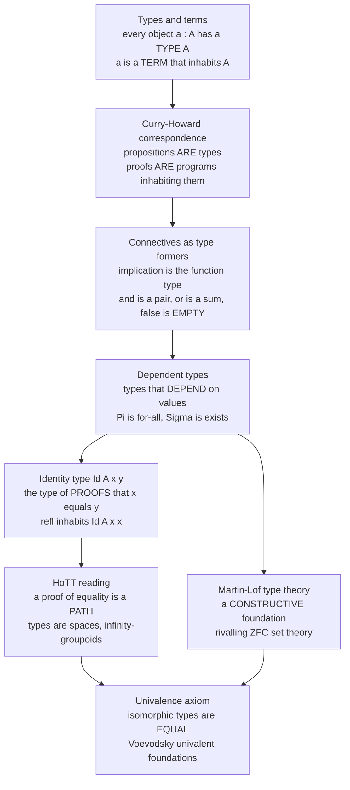

# 🧩 Type Theory and the Foundations of Mathematics

> [!abstract] TL;DR
> **Type theory** is a rival to set theory as *the* foundation of mathematics. Where ZFC says *everything is a **set*** and the only primitive relation is membership (`∈`), type theory says *everything is a **term** of a **type***, and the primitive judgment is `a : A` ("`a` has type `A`"). Its power comes from the **Curry–Howard correspondence**: a **proposition IS a type**, and a **proof IS a program** (a term) that inhabits it — so proving a theorem and writing a well-typed program are *literally the same act*, and proof-checking becomes **type-checking**. Adding **dependent types** (types that vary with values, giving the quantifiers `∀` = `Π` and `∃` = `Σ`) yields **Martin-Löf type theory (MLTT)**, a fully constructive foundation and the engine of proof assistants like **Coq, Agda, and Lean**. Its modern form, **Homotopy Type Theory (HoTT)** with Voevodsky's **univalence axiom**, makes a startling discovery: a proof that `x = y` is a **path**, types behave like **spaces** (∞-groupoids), and logic has a hidden **geometry**. The lineage runs Russell's **ramified types** → Church's **simply-typed λ-calculus** → Martin-Löf's **dependent types** → **univalent foundations**.

---

## Intuition

**Analogy — two blueprints for the same building.** For a century, mathematics has stood on **set theory**: everything is a *set*, and the only question you may ask of two objects is "does this one **belong to** that one?" (`x ∈ y`). It is like a world made of one material — pebbles in bags in bags in bags — where the sole fact about anything is which bag it sits in. This is the ZFC picture developed in the sibling note *Axiomatic_Set_Theory_ZFC*.

Type theory offers a **rival blueprint**. Instead of asking *"what sets is this built from?"*, it asks *"what **kind** of thing is this?"* Every object carries a **type** the way every value in a well-designed programming language does: `3 : ℕ` ("3 is a natural number"), `sort : List → List`. You can never even *ask* the paradoxical question "is `x` a member of itself?" — it is not a well-typed sentence, so **Russell's paradox is blocked by grammar, not by an axiom**. (This is exactly why Russell invented types in the first place, in 1908, to rescue *Principia Mathematica*.)

Then comes the miracle that makes type theory a *foundation* and not just a bookkeeping trick — the **Curry–Howard correspondence**. A mathematical **proposition** turns out to be nothing more than a **type**, and a **proof** of it is nothing more than a **program** (a term) of that type. "If `A` then `B`" is the type of *functions* `A → B`; a proof is a function turning any proof of `A` into a proof of `B`. To prove a theorem is to *construct a witness*; a proposition with **no proof** is a type with **no elements** — an *empty* type. Mathematics becomes inherently **computational and machine-checkable**, and its most modern form, **homotopy type theory**, reveals the final twist: proofs that two things are *equal* behave like **paths** in a space, and logic itself turns out to have a **shape**.

---

## How It Works

### Core Mechanics

Type theory is built from **judgments**, not propositions-plus-a-membership-relation. The four basic judgments are: `A type` (`A` is a well-formed type), `a : A` (`a` is a term of type `A`), `A ≡ B` (definitional equality of types), and `a ≡ b : A` (definitional equality of terms). Crucially, `a : A` is a **judgment you *check***, decidably, by an algorithm — not a *proposition you prove*. This is the deepest structural break from set theory, where `x ∈ y` is itself a proposition that can be true, false, or independent.

The system is generated by giving, for each **type former**, four coordinated rules: **formation** (when is the type well-formed?), **introduction** (how do you *build* a term — a proof?), **elimination** (how do you *use* one?), and **computation** (how does a use of an introduction reduce — β-reduction). The whole edifice grows by iterating this recipe.

1. **Simple types (Church, 1940).** Start with base types and the **function type** `A → B`. Terms are the **simply-typed λ-calculus**: variables, abstractions `λx:A. t`, and applications `f a`. Type-checking is a short recursive walk over the term (implemented in the demo). This fragment already realizes the **implicational** core of logic.

2. **Propositions as types (Curry–Howard).** Read each type former as a logical connective — the **dictionary** below. A **term of type `A`** is a **proof of proposition `A`**. Proving is programming.

   | Logic | Type theory | Constructor (proof / program) |
   |---|---|---|
   | `A ⇒ B` (implication) | `A → B` (function type) | `λ`-abstraction |
   | `A ∧ B` (and) | `A × B` (product / pair) | `(a, b)` |
   | `A ∨ B` (or) | `A + B` (sum / tagged union) | `inl a` / `inr b` |
   | `⊤` (true) | `Unit` (one element) | `()` |
   | `⊥` (false) | `Empty` (no elements) | *— none —* |
   | `¬A` | `A → Empty` | function into the empty type |
   | `∀x. P(x)` | `Π(x:A). P(x)` (dependent function) | `λ`-abstraction |
   | `∃x. P(x)` | `Σ(x:A). P(x)` (dependent pair) | `(witness, proof)` |
   | `x = y` | `Id_A(x, y)` (identity type) | `refl` |

3. **Proof normalization = program evaluation.** Simplifying a proof (Gentzen's **cut elimination**) is *exactly* running the program (**β-reduction**). "Logic" and "computation" are two faces of one object — the same identity that *Formal_Systems_and_Proof_Calculi* records on the proof-theory side. This is why the tradition is **constructive/intuitionistic** (see *Intuitionistic_and_Constructive_Logic*): a proof must *compute a witness*, so the law of excluded middle `A ∨ ¬A` is not free.

4. **Dependent types (Martin-Löf, 1970s).** Let a type **depend on a value**: `Vec(ℕ, n)` is the type of lists of length exactly `n`. Now the **quantifiers** appear as type formers — `Π` (dependent function = "for all") and `Σ` (dependent pair = "there exists a witness *and* a proof"). This is **MLTT**, expressive enough to serve as a **complete foundation** and the basis of Coq, Agda, Lean, and Idris.

5. **Identity types and univalence (HoTT).** The identity type `Id_A(x, y)` collects *proofs that `x` equals `y`*. In MLTT its only obvious inhabitant is `refl : Id_A(x, x)`. Voevodsky's insight: interpret `Id_A(x, y)` as the space of **paths** from `x` to `y`. Then types are **spaces** (∞-groupoids), equality proofs are paths, proofs-between-proofs are homotopies, and the **univalence axiom** — "isomorphic types are equal" — becomes a natural principle, turning informal "identify structures up to isomorphism" into a *formal law*.

### Flow / Architecture



---

## Key Concepts

### Secondary Level

**A type is a "kind of thing".** In set theory the only question is *which bag* an object sits in (`x ∈ y`). In type theory every object comes stamped with a **type** — `3 : ℕ`, `true : Bool` — and you may only combine things in type-respecting ways, exactly like a typed programming language rejecting `3 + "hello"`. The stamp is checked *mechanically*.

**Why this kills Russell's paradox for free.** Russell's paradox needs the sentence "the set of all sets that are **not members of themselves**". In type theory `x : x` is **ungrammatical** — a term and its type live at different levels — so the paradoxical set can't even be *written*. Russell invented **types** in 1908 precisely for this (*Principia Mathematica*'s "ramified theory of types").

**A proof is a thing you build.** The headline idea: a **proposition is a type**, and to **prove** it is to **construct an element** of that type. Proving "if `A` then `B`" means writing a *machine* that converts any proof of `A` into a proof of `B`. A proposition that is **false** corresponds to a type with **no elements at all** — the *empty* type. There is no proof precisely because there is nothing to build.

### Undergraduate Level

**The historical staircase.** (1) **Russell's ramified types** (1908) stratify objects into levels to outlaw self-reference. (2) **Church's simply-typed λ-calculus** (1940) strips this to base types plus `A → B`, giving a clean typed programming language — see [[Simply_Typed_Lambda_Calculus]]. (3) **Curry & Howard** (1958–69) notice that its typing rules *are* the proof rules of intuitionistic implicational logic. (4) **Martin-Löf** (1972 onward) adds **dependent types**, producing a full constructive foundation, MLTT. (5) **Voevodsky** (2009) adds the **homotopy** interpretation and **univalence**.

**The full dictionary (propositions-as-types).** Implication ↦ function type `→`; conjunction ↦ product `×`; disjunction ↦ sum `+`; truth ↦ `Unit`; falsity ↦ `Empty`; negation `¬A` ↦ `A → Empty`; universal `∀` ↦ dependent function `Π`; existential `∃` ↦ dependent pair `Σ`; equality ↦ identity type `Id`. Every logical rule is a programming construct and vice-versa. This is the **same triangle** that [[Curry_Howard_Lambek_Correspondence]] completes on the category-theory side (cartesian closed categories).

**Normalization = evaluation.** Gentzen's **cut-elimination** for natural deduction *is* **β-reduction** of λ-terms. A proof that takes a detour ("prove `A`, then use it to prove `B`") normalizes to a direct proof exactly as `(λx. t) a` reduces to `t[a/x]`. Consistency of the logic = **strong normalization** of the calculus: every proof/program halts at a canonical form, and there is *no* closed term of the empty type, so `⊥` is unprovable.

**Dependent types and the quantifiers.** `Π(x:A). B(x)` is the type of functions whose *output type depends on the input* — read as `∀x:A. B(x)`. `Σ(x:A). B(x)` is the type of pairs `(a, b)` with `b : B(a)` — read as `∃x:A. B(x)`, and note it is **stronger** than classical `∃`: it hands you the **witness**, not just its bare existence. Canonical example: `Vec(A, n)`, length-indexed vectors, so `head : Π(n:ℕ). Vec(A, n+1) → A` is *provably* never applied to an empty vector. This is the content of [[Dependent_Types_and_Advanced_Type_Systems]].

### Graduate Level

**Type theory as a self-standing foundation.** MLTT needs **no set theory underneath**: types, terms, and judgmental equality are primitive. To avoid a *type-theoretic* Russell paradox — a universe `Type : Type` reproduces **Girard's paradox** and makes everything provable — one stratifies universes `Type₀ : Type₁ : Type₂ : …`, a direct echo of ZFC's rank hierarchy. Numbers, structures, and even propositions all live as terms of types. Constructivity is the default; classical mathematics is recovered by *adding* excluded middle as an axiom, cleanly isolating exactly where non-constructive reasoning is used.

**Intensional vs extensional equality; the identity type.** MLTT keeps **definitional** equality (`a ≡ b`, decidable, "same by computation") distinct from **propositional** equality (`Id_A(a, b)`, a *type* you must prove inhabited). In the **intensional** theory, `Id` can have *more than one* inhabitant, and — the pivotal observation — **function extensionality is not provable**. Hofmann and Streicher (1994) built the **groupoid model** showing a type behaves like a groupoid whose morphisms are its equality-proofs; iterating gives an **∞-groupoid**.

**HoTT and univalence.** Read `Id_A(x, y)` as the **path space** from `x` to `y` in the "space" `A`; `refl` is the constant path; transitivity/symmetry of equality are path concatenation/reversal; higher identity types are homotopies. **Voevodsky's univalence axiom** states `(A = B) ≃ (A ≃ B)` — the identity type between two types *is equivalent to* the type of equivalences between them, i.e. **"isomorphic types are equal."** With **higher inductive types** (constructors for points *and* paths) one can define circles, spheres, and quotients directly, doing **synthetic homotopy theory** inside the logic. This is the **univalent foundations** program; models exist in **simplicial sets** (Voevodsky) and, computationally, in **cubical type theory** — see [[Homotopy_Type_Theory]].

**The foundational trilemma.** Three candidates compete for "the" foundation: **set theory** (ZFC — objects and membership; classical; see *Axiomatic_Set_Theory_ZFC*), **type theory** (objects with types; constructive; univalent), and **category / topos theory** (morphisms and universal properties; see [[Categorical_Logic_and_Type_Theory]], [[Cartesian_Closed_and_Topos_Theory]], and the sibling *Category_Theoretic_Logic_and_Topos_Theory*). They are deeply linked: **cartesian closed categories ≙ typed λ-calculi** (Curry–Howard–Lambek), and an **elementary topos** is a universe of "sets" with an **intuitionistic** internal logic. Type theory's distinctive selling point is that it is **computational by construction**, which is why computer science and the formalized-mathematics movement have embraced it over ZFC.

**Relation to incompleteness.** Type theory does not escape [[Godels_Incompleteness_Theorems]]: any consistent, effectively-axiomatized system strong enough for arithmetic — MLTT included — cannot prove its own consistency, and the consistency of strong type theories is itself measured by **proof-theoretic ordinals** (the concern of the sibling *Proof_Theory_and_Ordinal_Analysis*).

---

## Python Demo

```python
"""
PROPOSITIONS AS TYPES: a tiny type checker for the simply-typed lambda calculus,
made concrete as the CURRY-HOWARD correspondence.

(a) TYPE CHECKER: given a lambda term + a context, INFER its type. A well-typed
    closed term of type  A -> B -> A  IS a proof of the proposition A => (B => A):
    the K combinator. We type-check I, K, S, B (composition) and read off the
    tautology each one proves.

(b) INHABITATION SEARCH (a decision procedure for the implicational fragment of
    intuitionistic logic): does a proposition have ANY proof/program? Tautologies
    come back INHABITED (a term is found); a non-tautology like  A -> B  and the
    classically-valid-but-constructively-unprovable  Peirce's law  come back EMPTY.

(c) Schematic of a DEPENDENT type (Pi/Sigma = for-all/exists) and the
    IDENTITY-TYPE-AS-PATH idea of homotopy type theory.

Plot: (left) the typing-derivation tree for K = a proof of A->B->A;
      (right) inhabited (has a proof/program) vs empty (no proof) types.
Needs: numpy, matplotlib.
"""

import itertools
import numpy as np
import matplotlib.pyplot as plt
from matplotlib.patches import Rectangle

# --- Types:  base type, or an arrow A -> B -----------------------------------
def base(n):     return ("base", n)
def arrow(a, b): return ("arrow", a, b)
A, B, C = base("A"), base("B"), base("C")

def typ_str(t):
    if t[0] == "base":
        return t[1]
    l = typ_str(t[1])
    if t[1][0] == "arrow":          # left of -> needs parens (right-assoc.)
        l = "(" + l + ")"
    return l + "->" + typ_str(t[2])

# --- Terms:  var / lambda (Church-typed) / application ------------------------
def var(n):          return ("var", n)
def lam(v, ty, bod): return ("lam", v, ty, bod)
def app(f, x):       return ("app", f, x)

def term_str(t):
    if t[0] == "var": return t[1]
    if t[0] == "lam": return f"λ{t[1]}:{typ_str(t[2])}. {term_str(t[3])}"
    f, x = term_str(t[1]), term_str(t[2])
    if t[2][0] != "var": x = "(" + x + ")"
    return f"{f} {x}"

# --- (a) THE TYPE CHECKER:  infer the type of a term in a context -------------
def infer(ctx, t):
    if t[0] == "var":
        return ctx.get(t[1])
    if t[0] == "lam":
        _, v, ty, bod = t
        c2 = dict(ctx); c2[v] = ty
        bt = infer(c2, bod)
        return arrow(ty, bt) if bt is not None else None
    if t[0] == "app":
        ft, xt = infer(ctx, t[1]), infer(ctx, t[2])
        if ft and xt and ft[0] == "arrow" and ft[1] == xt:
            return ft[2]           # A->B applied to A  gives  B
        return None

# The classic combinators, Church-typed  ->  each IS a proof of a tautology.
I = lam("x", A, var("x"))                                        # A -> A
K = lam("x", A, lam("y", B, var("x")))                           # A -> B -> A
S = lam("x", arrow(A, arrow(B, C)),
        lam("y", arrow(A, B),
            lam("z", A, app(app(var("x"), var("z")),
                            app(var("y"), var("z"))))))          # (A->B->C)->(A->B)->A->C
Bc = lam("f", arrow(A, B),
         lam("g", arrow(B, C),
             lam("x", A, app(var("g"), app(var("f"), var("x")))))) # (A->B)->(B->C)->A->C

print("=== (a) CURRY-HOWARD: a well-typed program IS a proof ===")
for name, term in [("I", I), ("K", K), ("S", S), ("B", Bc)]:
    ty = infer({}, term)
    print(f"  {name} = {term_str(term)}")
    print(f"      : {typ_str(ty)}      <- the proposition it proves")

# --- (b) INHABITATION: is a proposition provable at all? ----------------------
_fresh = itertools.count()
def fresh(): return "h" + str(next(_fresh))

def spine(ty):                     # decompose  A1->A2->...->R  into ([A1,A2,...], R)
    args = []
    while ty[0] == "arrow":
        args.append(ty[1]); ty = ty[2]
    return args, ty

def inhabit(ctx, goal, depth):
    """Complete decision procedure for the implicational fragment:
       to prove an arrow, INTRODUCE (lambda); to prove an atom, USE a hypothesis."""
    if depth < 0:
        return None
    if goal[0] == "arrow":                          # ->introduction
        v = fresh()
        sub = inhabit(ctx + [(v, goal[1])], goal[2], depth - 1)
        return ("lam", v, goal[1], sub) if sub is not None else None
    for name, ty in ctx:                            # ->elimination (apply a hypothesis)
        args, result = spine(ty)
        if result == goal:
            subs, ok = [], True
            for a in args:
                s = inhabit(ctx, a, depth - 1)
                if s is None: ok = False; break
                subs.append(s)
            if ok:
                term = ("var", name)
                for s in subs: term = ("app", term, s)
                return term
    return None

peirce = arrow(arrow(arrow(A, B), A), A)            # ((A->B)->A)->A  -- classical only
tests = [
    ("A -> A",                     arrow(A, A)),
    ("A -> B -> A",                arrow(A, arrow(B, A))),
    ("(A->B->C)->(A->B)->A->C",    infer({}, S)),
    ("(A->B)->(B->C)->A->C",       infer({}, Bc)),
    ("A -> B",                     arrow(A, B)),
    ("((A->B)->A)->A  [Peirce]",   peirce),
]

print("\n=== (b) INHABITED (has a proof) vs EMPTY (no proof) ===")
rows = []
for label, ty in tests:
    proof = inhabit([], ty, 12)
    ok = proof is not None
    term = term_str(proof) if ok else "no term - not intuitionistically provable"
    rows.append((label, term, ok))
    tag = "INHABITED" if ok else "EMPTY   "
    print(f"  [{tag}] {label:<28} {term[:46]}")

# --- (c) Dependent type & identity-type-as-path, schematically ----------------
print("\n=== (c) Beyond simple types (schematic) ===")
print("  Dependent function  Pi(n:Nat). Vec A n -> Vec A n     ~  forall n. ...")
print("  Dependent pair      Sigma(n:Nat). Vec A n             ~  exists n. ...")
print("  Identity / path     Id_A(x,y) : Type   with  refl : Id_A(x,x)")
print("     HoTT: a proof of x = y is a PATH x ~~> y in the space A;")
print("     univalence:  (A = B)  is equivalent to  (A ~= B)  [iso types are equal].")

# --- Visualization -----------------------------------------------------------
fig, (axL, axR) = plt.subplots(1, 2, figsize=(14, 5.6))

# LEFT: natural-deduction / typing derivation tree for K : A -> B -> A
axL.axis("off")
axL.set_xlim(0, 1); axL.set_ylim(0, 1)
yT, yM, yB = 0.74, 0.50, 0.26
axL.text(0.5, yT, "x:A,  y:B   ⊢   x : A", ha="center", va="center", fontsize=12)
axL.plot([0.10, 0.74], [yT - 0.075, yT - 0.075], color="0.25", lw=1.4)
axL.text(0.77, yT - 0.075, "Var", va="center", fontsize=9, style="italic", color="0.35")
axL.text(0.5, yM, "x:A   ⊢   λy:B. x : B→A", ha="center", va="center", fontsize=12)
axL.plot([0.06, 0.80], [yM - 0.075, yM - 0.075], color="0.25", lw=1.4)
axL.text(0.83, yM - 0.075, "→I", va="center", fontsize=9, style="italic", color="0.35")
axL.text(0.5, yB, "⊢   λx:A. λy:B. x : A→B→A",
         ha="center", va="center", fontsize=12.5, fontweight="bold", color="#1b5e20")
axL.set_title("Typing derivation = PROOF of  A → B → A\n"
              "the program  λx.λy.x  (K combinator)  IS the proof", fontsize=11)

# RIGHT: inhabited (green = has a proof/program) vs empty (red = no proof)
axR.axis("off")
axR.set_xlim(0, 1); axR.set_ylim(0, 1)
axR.set_title("Propositions-as-types:  inhabited  vs  EMPTY", fontsize=11)
ys = np.linspace(0.90, 0.08, len(rows))
for y, (label, term, ok) in zip(ys, rows):
    face = "#c8e6c9" if ok else "#ffcdd2"
    edge = "#2e7d32" if ok else "#c62828"
    axR.add_patch(Rectangle((0.02, y - 0.058), 0.96, 0.108,
                            facecolor=face, edgecolor=edge, lw=1.5))
    axR.text(0.05, y + 0.014, label, ha="left", va="center",
             fontsize=9.5, fontweight="bold")
    status = ("proof: " + term) if ok else ("NO PROOF — uninhabited type")
    axR.text(0.05, y - 0.026, status[:52], ha="left", va="center",
             fontsize=7.7, color=edge)

fig.suptitle("Curry–Howard: proofs ARE programs, propositions ARE types",
             fontsize=13, fontweight="bold")
plt.tight_layout(rect=[0, 0, 1, 0.95])
plt.savefig("type_theory_curry_howard.png", dpi=120, bbox_inches="tight")
plt.show()
```

**Expected output:**

```
=== (a) CURRY-HOWARD: a well-typed program IS a proof ===
  I = λx:A. x
      : A->A      <- the proposition it proves
  K = λx:A. λy:B. x
      : A->B->A      <- the proposition it proves
  S = λx:A->B->C. λy:A->B. λz:A. x z (y z)
      : (A->B->C)->(A->B)->A->C      <- the proposition it proves
  B = λf:A->B. λg:B->C. λx:A. g (f x)
      : (A->B)->(B->C)->A->C      <- the proposition it proves

=== (b) INHABITED (has a proof) vs EMPTY (no proof) ===
  [INHABITED] A -> A                       λh0:A. h0
  [INHABITED] A -> B -> A                  λh1:A. λh2:B. h1
  [INHABITED] (A->B->C)->(A->B)->A->C      λh3:A->B->C. λh4:A->B. λh5:A. ...
  [INHABITED] (A->B)->(B->C)->A->C         λh...:A->B. ...
  [EMPTY   ] A -> B                        no term - not intuitionistically provable
  [EMPTY   ] ((A->B)->A)->A  [Peirce]      no term - not intuitionistically provable
```

The lesson is exact and mechanical. The **K combinator** `λx.λy.x` is *nothing but* a proof of `A ⇒ (B ⇒ A)`: "given `A`, and then given `B`, return the `A` you already have." **Peirce's law** `((A→B)→A)→A` is a **classical tautology** yet the search finds **no lambda term** — it is *constructively unprovable*, which is precisely why propositions-as-types is intuitionistic and the law of excluded middle must be *added* as an axiom rather than derived. And `A → B` (distinct atoms) is an **empty type**: you cannot conjure a `B` from an `A`, so there is no program and no proof.

---

## Real-World Applications

> **Machine-checked mathematics.** The landmark formal proofs all run on type theory. The **Four Color Theorem** (Gonthier, 2005) and the **Feit–Thompson Odd-Order Theorem** (Gonthier et al., 2012) were fully formalized in **Coq**, whose kernel is the Calculus of Inductive Constructions — a dependent type theory. **Lean 4** and its library **Mathlib** now formalize graduate-level mathematics collaboratively; the **Liquid Tensor Experiment** (2021) verified a hard theorem of Peter Scholze's in Lean, a watershed for research-level formalization.

> **Verified compilers and operating systems.** Because a program's specification is a *type* and its correctness is *inhabitation of that type*, dependently-typed proof assistants underpin high-assurance software. **CompCert** is a C compiler verified in Coq (a miscompilation-free toolchain — see [[Formal_Semantics_and_Verified_Compilers]]); **seL4** is a formally verified microkernel. The trust bottoms out in a small **trusted type-checking kernel** rather than in testing.

> **Programming languages as proof languages.** **Agda**, **Idris**, and **Lean** are simultaneously programming languages and logics. Dependent types let a length-indexed `Vec` make `head []` a *compile-time type error*, or let a sorting function carry a proof that its output is sorted. **Cubical Agda** implements cubical type theory, so **univalence computes**: you can transport programs across an isomorphism and *run* the result.

> **Foundations research and the univalent program.** Voevodsky's **univalent foundations** — after he found errors in his own published homotopy-theory papers — aims to make *all* of mathematics both univalent and computer-verifiable, treating "equal up to isomorphism" as literal equality. This is an active reframing of what the foundation of mathematics *is*, complementing rather than replacing the ZFC picture of *Axiomatic_Set_Theory_ZFC*.

---

## Common Pitfalls

- **Thinking type theory is "just set theory with types."** They are *rival foundations* with different primitives. In ZFC, `x ∈ y` is a **proposition** (provable, refutable, or independent). In type theory, `a : A` is a **judgment** you *check* by an algorithm — never something you prove *inside* the theory. Membership is global and unrestricted; typing is structural and decidable. Elements of a type are not "members of a set" but *terms with a construction*.

- **Confusing intensional and extensional equality.** MLTT separates **definitional** equality `a ≡ b` (same by computation, decidable) from **propositional** equality `Id_A(a, b)` (a *type* whose inhabitant is a *proof*). In the **intensional** theory, `Id` can have many inhabitants and **function extensionality is not provable** — "pointwise-equal functions are equal" must be *assumed* (or derived from univalence). Assuming these are the same equality, as in naive set theory, leads to wrong expectations.

- **Forgetting that propositions-as-types is constructive.** Curry–Howard delivers **intuitionistic** logic, not classical. The excluded middle `A ∨ ¬A`, double-negation elimination `¬¬A → A`, and **Peirce's law** have **no closed terms** — the demo confirms it. Classical mathematics is recovered only by *adding* excluded middle as an axiom, which then blocks the automatic extraction of witnesses/programs from proofs.

- **Treating univalence as harmless.** In *book* HoTT, univalence is an **axiom** with no computational rule, so it breaks **canonicity** (a closed term of `ℕ` might not reduce to a numeral). Restoring computation required a genuinely new theory — **cubical type theory** — where univalence is a *theorem* with reduction behavior. Don't assume "isomorphic = equal" comes for free with the right operational semantics.

- **Trusting a proof assistant blindly.** Machine-checked ≠ infallible. Correctness rests on a **trusted kernel** (a bug there voids everything), on the **consistency of the type theory** (a naive universe `Type : Type` reproduces **Girard's paradox** and proves `⊥`), and on any **axioms** you postulate (excluded middle, choice, or an *inconsistent* combination). The theorem statement itself must also faithfully capture the intended claim — a mis-stated `Prop` can be "proved" while meaning nothing.

---

## Related Concepts

- [[The_Curry_Howard_Correspondence]] — the propositions-as-types / proofs-as-programs isomorphism at the heart of this note, developed from the programming-language side.
- [[Intuitionistic_Logic_and_Constructive_Proofs]] — the constructive logic that Curry–Howard makes computational; explains why excluded middle and Peirce's law lack proof terms.
- [[Dependent_Types_and_Advanced_Type_Systems]] — the `Π`/`Σ` machinery (types depending on values) that turns simple type theory into a full foundation and powers Coq/Agda/Lean/Idris.
- [[Simply_Typed_Lambda_Calculus]] — Church's typed calculus implemented in the demo; the implicational core where the K/S/I combinators become tautologies.
- [[Polymorphism_and_System_F]] — the impredicative next rung (types quantifying over types) between STLC and full dependent theory; Girard's system that also gives a taste of the universe-consistency issue.
- [[Homotopy_Type_Theory]] — the geometric reading: identity types as paths, types as ∞-groupoids, univalence, and higher inductive types.
- [[Proof_Assistants_and_Dependent_Type_Theory]] — how Coq/Agda/Lean turn this theory into working tools for machine-checked mathematics and verified software.
- [[Categorical_Logic_and_Type_Theory]] — the categorical semantics of type theory; the third leg of the foundational trilemma.
- [[Cartesian_Closed_and_Topos_Theory]] — CCCs model typed λ-calculi (Curry–Howard–Lambek) and toposes give a set-like universe with intuitionistic internal logic.
- [[Curry_Howard_Lambek_Correspondence]] — the full logic ↔ computation ↔ category triangle that situates type theory among foundations.
- [[Godels_Incompleteness_Theorems]] — the limits that type-theoretic foundations share with ZFC: no strong consistent system proves its own consistency.
- [[First_Order_Predicate_Logic]] — the classical logic type theory reinterprets; contrast its truth-conditional semantics with proof-relevant propositions-as-types.
- [[Mathematical_Logic_and_Set_Theory]] — the advanced-topics overview that frames the ZFC-vs-type-theory-vs-category-theory foundational debate.
- [[Formal_Semantics_and_Verified_Compilers]] — where dependent types cash out as verified systems software (CompCert), a flagship real-world payoff.
- [[Mathematical_Logic_Overview]] — the section map placing this frontier note next to set theory, model theory, computability, and proof theory.

---

## Review Questions

### Secondary

1. In one sentence, contrast set theory's primitive ("everything is a set, related by `∈`") with type theory's primitive ("everything is a term of a type, related by `:`"). Why can Russell's paradox not even be *stated* in the type-theoretic language?
2. Under propositions-as-types, what type corresponds to the proposition "if `A` then `B`"? What does a *proof* of it look like, described as a program?
3. Explain why a **false** proposition corresponds to an **empty** type. Give the type-theory reading of "there is no proof of `⊥`".

### Undergraduate

1. Type-check the **K combinator** `λx:A. λy:B. x` by hand and read off the proposition it proves. Then explain, in Curry–Howard terms, why `A → B` (with `A`, `B` distinct atoms) has **no** closed inhabitant.
2. State the propositions-as-types dictionary for `∧`, `∨`, `∀`, and `∃`, naming the type former and the constructor for each. Why is the type-theoretic `Σ(x:A). P(x)` *stronger* than a classical existential claim?
3. Explain the slogan "**proof normalization = program evaluation**." What is the type-theoretic counterpart of Gentzen's cut-elimination, and how does strong normalization relate to the consistency of the logic?

### Graduate

1. In intensional MLTT, distinguish **definitional** equality `a ≡ b` from **propositional** equality `Id_A(a, b)`. Why is function extensionality *not* provable, and how does the **groupoid model** (Hofmann–Streicher) show that identity types can carry non-trivial structure?
2. State Voevodsky's **univalence axiom** and explain the sense in which it formalizes "isomorphic types are equal." Why does adding it as an axiom to book HoTT break **canonicity**, and how does **cubical type theory** repair this?
3. Compare **set theory (ZFC)**, **type theory (MLTT/HoTT)**, and **category/topos theory** as candidate foundations along three axes: their primitive notion, whether their internal logic is classical or intuitionistic, and their suitability for machine-checked mathematics. Which considerations lead computer science to favor type theory, and what does Girard's paradox teach about the price of an unrestricted universe?

---

## Sources

- [Martin-Löf, P. (1984). *Intuitionistic Type Theory* (Bibliopolis).](https://plato.stanford.edu/entries/type-theory-intuitionistic/) — the founding text of dependent/intuitionistic type theory (MLTT); Stanford Encyclopedia entry summarizes and links it.
- [The Univalent Foundations Program (2013). *Homotopy Type Theory: Univalent Foundations of Mathematics* (the "HoTT Book").](https://homotopytypetheory.org/book/) — the collaborative, freely available standard reference on HoTT, univalence, and higher inductive types.
- [Wadler, P. (2015). "Propositions as Types." *Communications of the ACM* 58(12).](https://homepages.inf.ed.ac.uk/wadler/papers/propositions-as-types/propositions-as-types.pdf) — the definitive accessible essay on the Curry–Howard correspondence and its history.
- [Whitehead, A. N. & Russell, B. (1910–13). *Principia Mathematica* — the ramified theory of types.](https://plato.stanford.edu/entries/principia-mathematica/) — the historical origin of type theory as a device to escape the paradoxes.
- [Awodey, S. & Warren, M. (2009). "Homotopy theoretic models of identity types," and Voevodsky's Univalent Foundations program.](https://plato.stanford.edu/entries/type-theory-univalent/) — the homotopy interpretation of identity types and the origin of univalence (Stanford Encyclopedia overview).

---

#mathematical-logic #type-theory #foundations #curry-howard #homotopy-type-theory
