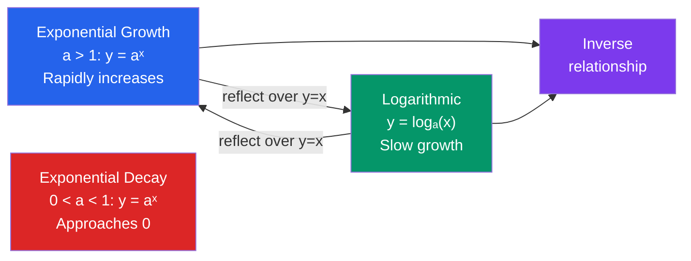

# 📐 Exponential and Logarithmic Functions

> [!abstract] TL;DR
> Exponential functions model growth and decay with a constant percentage rate — they grow faster than any polynomial. Logarithms are their inverses, compressing multiplicative scale into additive steps. Together, $e^x$ and $\ln(x)$ are the most important function pair in all of analysis.

## Intuition — analogy FIRST

**Exponential growth** is like a chain letter: each person tells 2 friends, those 2 tell 2 each (4 total), then 8, 16, 32… After just 30 steps you have over a billion people. The number multiplies by the same factor each step — not by the same amount.

**Logarithm** is the inverse question: "How many times do I multiply 2 by itself to get 1024?" Answer: $\log_2(1024) = 10$.

Think of log as your **Google Maps for scale** — it converts astronomical multiplicative distances (bacteria count from 1 to $10^{15}$) into manageable additive steps (0 to 15).

---

## How It Works

---

## Key Concepts / Details

### Exponential Function $a^x$

For base $a > 0,\; a \neq 1$:
- **Domain:** $\mathbb{R}$, **Range:** $(0, \infty)$
- **Key point:** $a^0 = 1$ (always passes through $(0, 1)$)
- $a > 1$: increasing (growth); $0 < a < 1$: decreasing (decay)
- Horizontal asymptote at $y = 0$ as $x \to -\infty$ (for $a > 1$)

**Laws of Exponents:**
$$a^m \cdot a^n = a^{m+n}, \quad \frac{a^m}{a^n} = a^{m-n}, \quad (a^m)^n = a^{mn}$$
$$a^0 = 1, \quad a^{-n} = \frac{1}{a^n}, \quad a^{1/n} = \sqrt[n]{a}$$

---

### Euler's Number $e$

$$e = \lim_{n \to \infty} \left(1 + \frac{1}{n}\right)^n \approx 2.71828182845\ldots$$

$e$ is irrational and transcendental. It arises naturally as the base for which $\frac{d}{dx}[e^x] = e^x$ — the unique base whose derivative equals itself.

Alternative definition: $e = \sum_{n=0}^{\infty} \frac{1}{n!} = 1 + 1 + \frac{1}{2} + \frac{1}{6} + \cdots$

---

### Natural Logarithm $\ln(x)$

$$\ln(x) = \log_e(x) \iff e^{\ln(x)} = x$$

- **Domain:** $(0, \infty)$, **Range:** $\mathbb{R}$
- Passes through $(1, 0)$ since $e^0 = 1$.
- Vertical asymptote at $x = 0$.
- Grows without bound but very slowly: $\ln(e^{100}) = 100$.

**Change of Base Formula:**
$$\log_a(x) = \frac{\ln(x)}{\ln(a)} = \frac{\log(x)}{\log(a)}$$

---

### Laws of Logarithms

| Law | Formula |
|-----|---------|
| Product | $\log_a(xy) = \log_a(x) + \log_a(y)$ |
| Quotient | $\log_a\!\left(\frac{x}{y}\right) = \log_a(x) - \log_a(y)$ |
| Power | $\log_a(x^n) = n \cdot \log_a(x)$ |
| Identity | $\log_a(a) = 1$; $\log_a(1) = 0$ |
| Inverse | $a^{\log_a(x)} = x$; $\log_a(a^x) = x$ |

---

### Financial Applications

**Compound Interest** (compounded $n$ times per year):
$$A = P\left(1 + \frac{r}{n}\right)^{nt}$$

**Continuous Compounding** (limit as $n \to \infty$):
$$A = Pe^{rt}$$

This uses the definition $e = \lim_{n\to\infty}(1+1/n)^n$.

**Doubling Time:** If $A = 2P$, then $e^{rt} = 2$, so $t = \frac{\ln 2}{r} \approx \frac{0.693}{r}$.

**Rule of 72 (approximation):** Doubling time $\approx \frac{72}{r\%}$ years.

---

### Radioactive Decay

$$N(t) = N_0 e^{-\lambda t}$$

where $\lambda > 0$ is the **decay constant**. Half-life $t_{1/2} = \frac{\ln 2}{\lambda}$.

---

## Real-World Notes

- **Finance / compound interest**: your savings account effectively compounds continuously in theory; understanding $Pe^{rt}$ is the foundation of quantitative finance.
- **Information theory**: $\log_2(n)$ measures information in bits — how many binary questions you need to identify one of $n$ equiprobable items.
- **Earthquake magnitude** (Richter scale) and **sound intensity** (decibels) are logarithmic scales: a magnitude-7 earthquake is 10× stronger than magnitude-6.
- **Machine learning**: the natural log appears in cross-entropy loss: $-\sum y_i \ln(\hat{y}_i)$; sigmoid activation uses $e^x$.

---

## Common Pitfalls

- **$\log(a + b) \neq \log(a) + \log(b)$** — the product law only: $\log(a \cdot b) = \log(a) + \log(b)$.
- **$\log(a - b) \neq \log(a) - \log(b)$** — the quotient law: $\log(a/b) = \log(a) - \log(b)$.
- **Domain of $\ln(x)$**: you cannot take the log of zero or a negative number in real analysis. $\ln(x^2) = 2\ln|x|$ (note absolute value).
- **$e^{a+b} = e^a \cdot e^b$**, not $e^a + e^b$. Exponent addition becomes multiplication.

---

## Related Concepts

- [[_MOC_Pre_Calculus|↑ Pre-Calculus MOC]]
- [[Functions_and_Graphs]] — $e^x$ and $\ln(x)$ are inverses; reflect over $y = x$
- [[Differentiation]] — $\frac{d}{dx}[e^x] = e^x$ and $\frac{d}{dx}[\ln x] = \frac{1}{x}$ are fundamental
- [[Techniques_of_Integration]] — $\int \frac{1}{x}\,dx = \ln|x| + C$
- [[Applications_of_Integration]] — exponential growth/decay ODEs, logistic growth

---

## Review Questions

1. Solve for $x$: $3^{2x-1} = 27^{x+2}$.
2. A radioactive substance has a half-life of 5 years. What fraction remains after 20 years? Write your answer in terms of $e$ and as a decimal.
3. Prove the change-of-base formula $\log_a(b) = \frac{\ln b}{\ln a}$ starting from the definition of logarithm.
4. You invest \$1,000 at 6% annual interest. How long until your investment doubles under (a) annual compounding and (b) continuous compounding?

---

## Sources

- Stewart, *Precalculus: Mathematics for Calculus*, Ch. 5
- Strang, *Calculus*, Ch. 6
- Apostol, *Calculus Vol. 1*, Ch. 6

#exponentials #logarithms #eulers-number #compound-interest #pre-calculus #mathematics #natural-log
