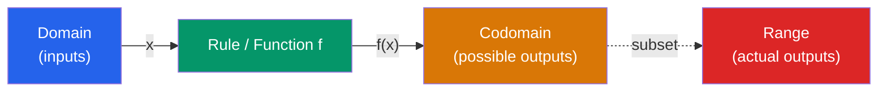
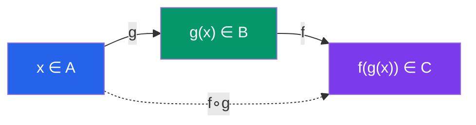

# 📐 Functions and Graphs

> [!abstract] TL;DR
> A function is a rule that assigns exactly one output to every input. Understanding functions — their domains, transformations, inverses, and compositions — is the language in which all of calculus and higher mathematics is written.

## Intuition — analogy FIRST

A function is a **vending machine**: you press a button (input), and you always get exactly one snack (output). The same button always gives the same snack — no randomness. The set of available buttons is the domain; the set of possible snacks is the codomain; the snacks that actually come out are the range.

A relation that gives *two different snacks* for the same button is **not** a function.

---

## How It Works

**Composition:**

---

## Key Concepts / Details

### Formal Definition

A **function** $f: A \to B$ is a relation that assigns to each element $x \in A$ exactly one element $f(x) \in B$.

- **Domain** $A$: the set of all valid inputs.
- **Codomain** $B$: the set of all possible outputs (declared in advance).
- **Range** (image): $\{f(x) \mid x \in A\} \subseteq B$ — the outputs that actually occur.

**Vertical Line Test:** A curve in the $xy$-plane represents a function if and only if every vertical line intersects it at most once.

---

### Types of Functions

| Type | Condition | Meaning |
|------|-----------|---------|
| **Injective** (one-to-one) | $f(x_1) = f(x_2) \Rightarrow x_1 = x_2$ | No two inputs give the same output |
| **Surjective** (onto) | $\forall b \in B,\; \exists a \in A: f(a)=b$ | Every codomain element is hit |
| **Bijective** | Both injective and surjective | Perfect pairing between $A$ and $B$ |

**Horizontal Line Test:** $f$ is injective iff every horizontal line meets the graph at most once.

---

### Transformations

Starting from a base function $f(x)$:

| Transformation | Formula | Effect |
|----------------|---------|--------|
| Vertical shift up $c$ | $f(x) + c$ | Moves graph up $c$ units |
| Vertical shift down $c$ | $f(x) - c$ | Moves graph down $c$ units |
| Horizontal shift right $c$ | $f(x - c)$ | Moves graph right $c$ units |
| Horizontal shift left $c$ | $f(x + c)$ | Moves graph left $c$ units |
| Vertical stretch by $c > 1$ | $c\,f(x)$ | Stretches vertically |
| Vertical compression $0 < c < 1$ | $c\,f(x)$ | Compresses vertically |
| Horizontal stretch/compression | $f(cx)$ | Compresses horizontally by $c$ |
| Reflection over $x$-axis | $-f(x)$ | Flips vertically |
| Reflection over $y$-axis | $f(-x)$ | Flips horizontally |

> [!tip] Order matters
> Apply horizontal transformations from the inside out, and vertical from the outside in.

---

### Inverse Functions

A function $f$ has an inverse $f^{-1}$ **if and only if** $f$ is **bijective**.

$$f^{-1}(y) = x \iff f(x) = y$$

**Properties:**
- $(f^{-1} \circ f)(x) = x$ for all $x$ in the domain of $f$.
- The graph of $f^{-1}$ is the reflection of the graph of $f$ over the line $y = x$.

**Finding $f^{-1}$:** Swap $x$ and $y$, then solve for $y$.

Example: $f(x) = 2x + 3$. Set $y = 2x + 3$, swap: $x = 2y + 3$, solve: $y = \frac{x-3}{2}$. So $f^{-1}(x) = \frac{x-3}{2}$.

> [!warning] Inverse vs. Reciprocal
> $\sin^{-1}(x)$ means the **inverse function** of $\sin$, NOT $\frac{1}{\sin(x)}$ (which is $\csc(x)$). This is one of the most common notational confusions in mathematics.

---

### Composition of Functions

$$(f \circ g)(x) = f(g(x))$$

The **domain** of $f \circ g$ is the set of all $x$ in the domain of $g$ such that $g(x)$ is in the domain of $f$.

Example: $f(x) = \sqrt{x}$, $g(x) = x - 1$.
$(f \circ g)(x) = \sqrt{x-1}$, domain: $x \geq 1$.
$(g \circ f)(x) = \sqrt{x} - 1$, domain: $x \geq 0$.

Note: $f \circ g \neq g \circ f$ in general — composition is **not commutative**.

---

### Even and Odd Functions

- **Even:** $f(-x) = f(x)$ for all $x$ (symmetric about $y$-axis). Example: $x^2$, $\cos x$.
- **Odd:** $f(-x) = -f(x)$ for all $x$ (symmetric about origin). Example: $x^3$, $\sin x$.

---

## Real-World Notes

- **Computer functions / procedures** directly mirror mathematical functions — same input always gives same output (pure functions). Side effects break this analogy.
- **Physics**: velocity is a function of time $v(t)$; position is a function of time $x(t)$. Composition appears in chain rule calculations.
- **Economics**: demand $Q = f(P)$ is a function of price; utility is a function of quantities consumed.
- **Image processing**: every pixel transformation is a function from input color values to output color values. Composition of functions = pipeline of filters.

---

## Common Pitfalls

- **Domain restrictions**: $f(x) = \sqrt{x-2}$ requires $x \geq 2$; $g(x) = \frac{1}{x+3}$ requires $x \neq -3$. Always check before computing.
- **Inverse only when bijective**: $f(x) = x^2$ on all of $\mathbb{R}$ is not injective, so it has no inverse unless you restrict the domain to $[0, \infty)$.
- **$f^{-1}(x) \neq 1/f(x)$**: Inverse notation reuses the ${}^{-1}$ superscript but means something completely different from a reciprocal.
- **Composition order**: $(f \circ g)(x) = f(g(x))$ — apply $g$ first, then $f$. The notation reads right to left.

---

## Related Concepts

- [[_MOC_Pre_Calculus|↑ Pre-Calculus MOC]]
- [[Number_Systems_and_Real_Line]] — domain and codomain are subsets of number systems
- [[Polynomial_and_Rational_Functions]] — special classes of functions
- [[Exponential_and_Logarithmic_Functions]] — exponential and log are inverses of each other
- [[Trigonometry]] — trig functions and their inverses (arcsin, arccos, arctan)

---

## Review Questions

1. Let $f(x) = x^2$ and $g(x) = x + 1$. Find $(f \circ g)(x)$ and $(g \circ f)(x)$. Are they equal?
2. Explain why $f(x) = x^2$ is not invertible on $\mathbb{R}$ but is invertible on $[0, \infty)$. Find its inverse on that restricted domain.
3. Given $f(x) = 3f(x-2) + 1$, describe in words what transformations were applied to the base function $f$, and in what order.
4. Show that the composition of two injective functions is injective.

---

## Sources

- Stewart, *Precalculus: Mathematics for Calculus*, Ch. 2–3
- Spivak, *Calculus*, Ch. 3
- Axler, *Algebra and Trigonometry*, Ch. 2

#functions #graphs #transformations #inverse-functions #composition #pre-calculus #mathematics
