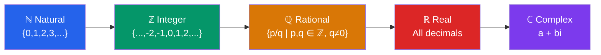

# 📐 Number Systems and the Real Line

> [!abstract] TL;DR
> Numbers come in nested families — Natural ⊂ Integer ⊂ Rational ⊂ Real ⊂ Complex — each extending the last to solve new problems. The real line is a continuous, ordered set where every point corresponds to exactly one real number.

## Intuition — analogy FIRST

Think of number systems like **Russian nesting dolls**. The smallest doll is the counting numbers (1, 2, 3…). Wrap it in integers to handle debt (−5). Wrap that in rationals to handle splitting a pizza (3/4). Wrap that in reals to handle the diagonal of a unit square (√2). Finally, wrap everything in complex numbers to handle rotating vectors (i).

Each layer was invented to solve a problem the previous layer could not.

---

## How It Works

---

## Key Concepts / Details

### Natural Numbers ℕ
The counting numbers: $\mathbb{N} = \{0, 1, 2, 3, \ldots\}$ (some definitions exclude 0).
- Closed under addition and multiplication.
- Cannot represent debts or parts.

### Integers ℤ
$\mathbb{Z} = \{\ldots, -3, -2, -1, 0, 1, 2, 3, \ldots\}$
- Closed under addition, subtraction, and multiplication.
- Motivation: solving $x + 5 = 2$.

### Rational Numbers ℚ
$\mathbb{Q} = \left\{ \frac{p}{q} \;\middle|\; p, q \in \mathbb{Z},\; q \neq 0 \right\}$
- Every rational number has a **terminating or repeating** decimal expansion.
- Motivation: solving $3x = 2$.
- Dense in $\mathbb{R}$: between any two reals there is a rational.

### Irrational Numbers
Real numbers that **cannot** be written as $p/q$. Examples: $\sqrt{2}$, $\pi$, $e$.

**Proof that $\sqrt{2}$ is irrational (by contradiction):**
Assume $\sqrt{2} = p/q$ in lowest terms. Then $2q^2 = p^2$, so $p^2$ is even, so $p$ is even — write $p = 2k$. Then $2q^2 = 4k^2$, so $q^2 = 2k^2$, so $q$ is even. But then $p$ and $q$ share factor 2, contradicting lowest terms. $\square$

### Real Numbers ℝ
Every point on the number line. Formally completed via Dedekind cuts or Cauchy sequences.
- Every real number has a (possibly non-terminating, non-repeating) decimal expansion.
- **Completeness**: every bounded, non-empty subset of $\mathbb{R}$ has a least upper bound (supremum).

### Complex Numbers ℂ
$\mathbb{C} = \{a + bi \mid a, b \in \mathbb{R},\; i^2 = -1\}$
- Motivation: solving $x^2 + 1 = 0$.
- Not ordered (no notion of "less than").

---

### The Real Line and Absolute Value

The real line is a geometric model of $\mathbb{R}$: each real number maps to exactly one point.

**Absolute value:**
$$|x| = \begin{cases} x & \text{if } x \geq 0 \\ -x & \text{if } x < 0 \end{cases}$$

Geometric meaning: $|x|$ is the **distance** from $x$ to the origin; $|x - a|$ is the distance from $x$ to $a$.

**Triangle Inequality:**
$$|x + y| \leq |x| + |y|$$

This generalizes to: the length of one side of a triangle is at most the sum of the other two.

---

### Intervals

| Notation | Meaning | Graph |
|----------|---------|-------|
| $(a, b)$ | $a < x < b$ | open endpoints |
| $[a, b]$ | $a \leq x \leq b$ | closed endpoints |
| $[a, b)$ | $a \leq x < b$ | half-open |
| $(a, \infty)$ | $x > a$ | unbounded right |
| $(-\infty, b]$ | $x \leq b$ | unbounded left |

**Inequalities and intervals:** $|x - a| < r$ means $x \in (a - r,\; a + r)$, a ball of radius $r$ around $a$.

---

### Key Theorems

**Archimedean Property (informal):** For any real number $x > 0$, there exists a natural number $n$ such that $n > x$. In other words, $\mathbb{N}$ is unbounded in $\mathbb{R}$.

**Density of Rationals:** Between any two distinct real numbers $a < b$ there exists a rational number $q$ with $a < q < b$.

**0.999… = 1:** Let $s = 0.999\ldots$. Then $10s = 9.999\ldots = 9 + s$, so $9s = 9$, giving $s = 1$. There is no "gap" between $0.999\ldots$ and $1$.

---

## Real-World Notes

- **GPS coordinates** are real numbers (latitude 40.7128°, longitude −74.0060°); irrational values arise naturally from trigonometric computations.
- **Cryptography (RSA)** operates entirely in $\mathbb{Z}$ — specifically with very large integers and modular arithmetic; the rational/irrational distinction is irrelevant.
- **Financial rounding** happens because computers store rationals with finite precision (floating-point), not true reals — $0.1 + 0.2 \neq 0.3$ in IEEE 754.
- **Signal processing** uses complex numbers to represent amplitude and phase simultaneously via Euler's formula $e^{i\theta} = \cos\theta + i\sin\theta$.

---

## Common Pitfalls

- **$\sqrt{2}$ is irrational**, not just "a long decimal." No fraction equals it exactly.
- **$0.999\ldots = 1$ exactly** — this is a theorem, not an approximation. They are the same real number.
- **Infinity ($\infty$) is not a real number** — it is a symbol representing unboundedness; you cannot do arithmetic like $\infty - \infty$ or $\infty / \infty$.
- **"Dense" does not mean "every point"** — rationals are dense in $\mathbb{R}$ yet the irrationals far outnumber them (in the sense of measure/cardinality).

---

## Related Concepts

- [[_MOC_Pre_Calculus|↑ Pre-Calculus MOC]]
- [[Functions_and_Graphs]] — functions are defined on number sets (domain and codomain)
- [[Polynomial_and_Rational_Functions]] — polynomials live in $\mathbb{R}[x]$; roots may require $\mathbb{C}$

---

## Review Questions

1. Prove that $\sqrt{3}$ is irrational using a proof by contradiction.
2. Express the set $\{x \in \mathbb{R} : |2x - 3| \leq 5\}$ as an interval and on a number line.
3. Is the set of irrationals closed under addition? Give a proof or counterexample.
4. Explain why the Completeness Axiom distinguishes $\mathbb{R}$ from $\mathbb{Q}$.

---

## Sources

- Stewart, *Precalculus: Mathematics for Calculus*, Ch. 1
- Rudin, *Principles of Mathematical Analysis*, Ch. 1
- Apostol, *Calculus Vol. 1*, Ch. 1

#number-systems #real-numbers #pre-calculus #mathematics #intervals #absolute-value
