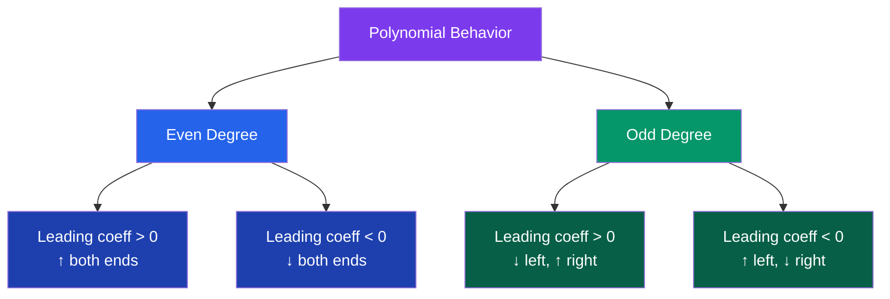

# 📐 Polynomial and Rational Functions

> [!abstract] TL;DR
> Polynomials are the simplest non-trivial functions — sums of power terms. Rational functions are ratios of polynomials and introduce asymptotes and holes. The Fundamental Theorem of Algebra guarantees that every polynomial of degree $n$ has exactly $n$ complex roots (counted with multiplicity).

## Intuition — analogy FIRST

Think of polynomials as **building with Lego blocks**: each term $a_n x^n$ is a brick, and you stack them to build any smooth, wavy curve you want. The degree is how tall your structure can be, and the leading coefficient determines whether it points up or down at the extremes.

Rational functions add **division** — now your function can blow up to infinity or flatten out, like a rocket trajectory that grazes a vertical wall (asymptote) or levels off at cruise altitude (horizontal asymptote).

---

## How It Works

---

## Key Concepts / Details

### Polynomial Definition

A **polynomial** of degree $n$ is:
$$p(x) = a_n x^n + a_{n-1} x^{n-1} + \cdots + a_1 x + a_0, \quad a_n \neq 0$$

- $a_n$ is the **leading coefficient**; $a_0$ is the **constant term**.
- Degree 0: constant; Degree 1: linear; Degree 2: quadratic; Degree 3: cubic.

### Roots (Zeros)

A number $r$ is a **root** of $p(x)$ if $p(r) = 0$.

**Factor Theorem:** $r$ is a root of $p(x)$ if and only if $(x - r)$ is a factor of $p(x)$.

**Remainder Theorem:** When $p(x)$ is divided by $(x - r)$, the remainder equals $p(r)$.

**Fundamental Theorem of Algebra:** Every polynomial of degree $n \geq 1$ with complex coefficients has exactly $n$ roots in $\mathbb{C}$ (counted with multiplicity).

---

### Polynomial Division

**Long division** mirrors integer long division:

$$\frac{x^3 - 2x^2 + 1}{x - 1} = x^2 - x - 1 + \frac{0}{x-1}$$

**Synthetic division** is a shorthand when dividing by $(x - r)$: use the root $r$ and the coefficients of $p(x)$.

---

### Partial Fraction Decomposition

For a proper rational function $\frac{P(x)}{Q(x)}$ (degree of $P$ < degree of $Q$), decompose into simpler fractions:

$$\frac{3x+1}{(x-1)(x+2)} = \frac{A}{x-1} + \frac{B}{x+2}$$

Multiply through by the denominator and solve for $A$, $B$ by substituting convenient values of $x$.

For **repeated factors**: $\frac{1}{(x-2)^2} \to \frac{A}{x-2} + \frac{B}{(x-2)^2}$

For **irreducible quadratic factors**: $\frac{1}{x^2+1} \to \frac{Ax+B}{x^2+1}$

---

### Rational Functions and Asymptotes

A **rational function** is $f(x) = \frac{P(x)}{Q(x)}$ where $P$ and $Q$ are polynomials.

**Vertical Asymptotes:** Occur where $Q(x) = 0$ and $P(x) \neq 0$. The graph approaches $\pm\infty$.

**Holes (Removable Discontinuities):** Occur where both $P(x) = 0$ and $Q(x) = 0$ (common factor cancels).

**Horizontal Asymptotes:** Determined by comparing degrees of $P$ and $Q$:

| Degrees | Horizontal Asymptote |
|---------|---------------------|
| $\deg P < \deg Q$ | $y = 0$ |
| $\deg P = \deg Q$ | $y = \frac{a_n}{b_n}$ (ratio of leading coefficients) |
| $\deg P > \deg Q$ | No horizontal asymptote (oblique or no asymptote) |

**Oblique Asymptote:** When $\deg P = \deg Q + 1$, perform polynomial division to find $y = mx + b$.

Example:
$$f(x) = \frac{x^2 - 1}{x - 2} = x + 2 + \frac{3}{x-2}$$
Oblique asymptote: $y = x + 2$.

---

### Graphing Rational Functions — Checklist

1. Factor numerator and denominator.
2. Identify domain (exclude zeros of denominator).
3. Find holes (common factors).
4. Find vertical asymptotes (remaining denominator zeros).
5. Find horizontal or oblique asymptote.
6. Find $x$-intercepts (numerator zeros after canceling).
7. Find $y$-intercept ($f(0)$, if in domain).
8. Check sign in each interval between critical points.

---

## Real-World Notes

- **Bézier curves** in computer graphics and font rendering are polynomial curves (cubic Bézier uses degree-3 polynomials), allowing smooth vector shapes.
- **Polynomial interpolation** (Lagrange, Newton) fits a polynomial through $n+1$ data points — used in numerical analysis and data fitting.
- **Electrical engineering**: rational functions model impedance in AC circuits; poles (vertical asymptotes) of the transfer function determine resonant frequencies.
- **Economics**: total cost curves are often modeled as polynomials; average cost $C(x)/x$ is a rational function whose minimum is the break-even point.

---

## Common Pitfalls

- **Forgetting holes**: if $(x-2)$ cancels in numerator and denominator, $x=2$ is a **hole**, not a vertical asymptote. The graph has a missing point, not a blow-up.
- **Degree comparison for asymptotes**: $\frac{x^3 + 1}{x^3 - 1} \to y = 1$ (not $y = 0$). Compare leading coefficients when degrees are equal.
- **Multiplicity and tangency**: a root of even multiplicity means the graph **touches** (but does not cross) the $x$-axis; odd multiplicity means it **crosses**.
- **Partial fractions require proper fractions**: if $\deg P \geq \deg Q$, do polynomial long division first, then decompose the remainder.

---

## Related Concepts

- [[_MOC_Pre_Calculus|↑ Pre-Calculus MOC]]
- [[Functions_and_Graphs]] — polynomials are a special class of functions
- [[Number_Systems_and_Real_Line]] — complex roots require $\mathbb{C}$; real coefficients give conjugate complex root pairs
- [[Limits_and_Continuity]] — rational functions and their limits near asymptotes
- [[Techniques_of_Integration]] — partial fractions are the key integration technique for rational functions

---

## Review Questions

1. Find all real and complex roots of $p(x) = x^4 - 5x^2 + 4$ and factor completely.
2. Find the vertical asymptotes, holes, horizontal asymptote, and sketch $f(x) = \frac{x^2 - 4}{x^2 - x - 2}$.
3. Decompose $\frac{5x - 3}{(x+1)(x-2)}$ into partial fractions.
4. A polynomial $p(x)$ has degree 5, positive leading coefficient, roots at $x = -1$ (multiplicity 2), $x = 0$, and $x = 3$ (multiplicity 2). Describe the end behavior and whether the graph crosses or touches the $x$-axis at each root.

---

## Sources

- Stewart, *Precalculus: Mathematics for Calculus*, Ch. 3–4
- Larson, *Precalculus with Limits*, Ch. 2
- Burden & Faires, *Numerical Analysis*, Ch. 3 (interpolation)

#polynomials #rational-functions #asymptotes #roots #partial-fractions #pre-calculus #mathematics
