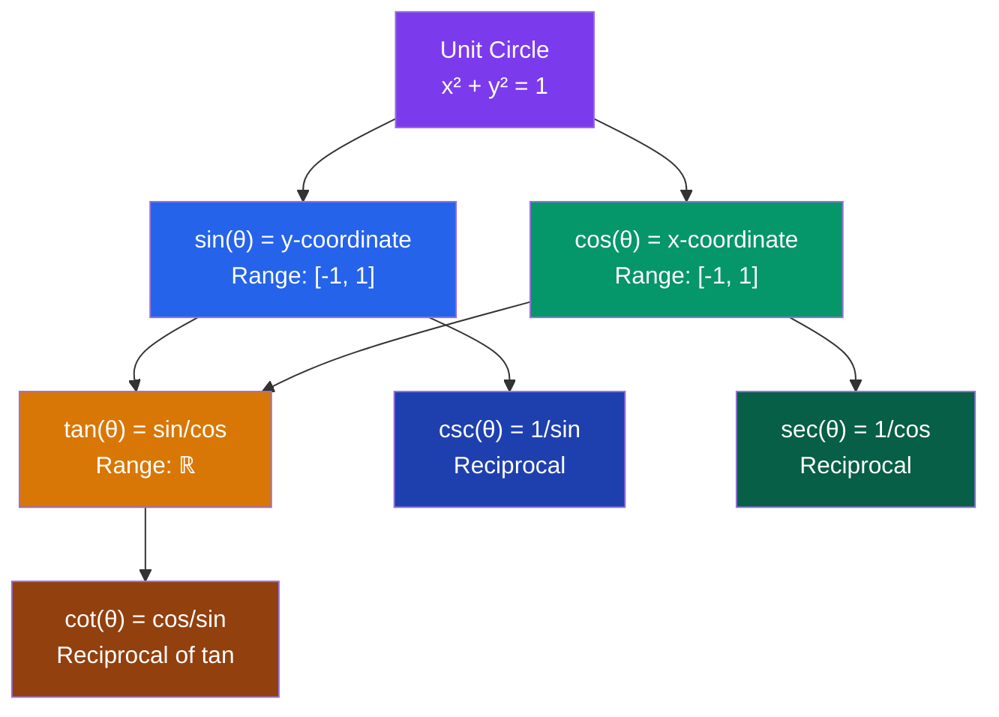

# 📐 Trigonometry

> [!abstract] TL;DR
> Trigonometry studies the relationships between angles and sides in triangles and, more powerfully, describes all periodic phenomena through the unit circle. The six trig functions (sin, cos, tan, sec, csc, cot) and their identities are indispensable tools throughout calculus and physics.

## Intuition — analogy FIRST

Imagine a person walking around a circular track of radius 1. Their **horizontal position** at any moment is $\cos(\theta)$ and their **vertical position** is $\sin(\theta)$, where $\theta$ is the angle they've walked from the starting point (east side). As they loop around forever, these values oscillate between $-1$ and $1$ — describing any wave, sound, or signal in nature.

Trigonometry is the mathematics of **circles and repetition**.

---

## How It Works

---

## Key Concepts / Details

### Radian Measure

**Radian:** The angle subtended at the center of a circle by an arc equal in length to the radius.

$$\theta_{\text{rad}} = \frac{\theta_{\deg} \cdot \pi}{180}, \qquad \theta_{\deg} = \frac{\theta_{\text{rad}} \cdot 180}{\pi}$$

One full revolution = $2\pi$ radians = $360°$.

---

### Unit Circle Key Values

| Angle (deg) | Angle (rad) | $\sin\theta$ | $\cos\theta$ | $\tan\theta$ |
|-------------|-------------|--------------|--------------|--------------|
| $0°$ | $0$ | $0$ | $1$ | $0$ |
| $30°$ | $\pi/6$ | $1/2$ | $\sqrt{3}/2$ | $1/\sqrt{3}$ |
| $45°$ | $\pi/4$ | $\sqrt{2}/2$ | $\sqrt{2}/2$ | $1$ |
| $60°$ | $\pi/3$ | $\sqrt{3}/2$ | $1/2$ | $\sqrt{3}$ |
| $90°$ | $\pi/2$ | $1$ | $0$ | undefined |
| $180°$ | $\pi$ | $0$ | $-1$ | $0$ |
| $270°$ | $3\pi/2$ | $-1$ | $0$ | undefined |

Memory trick for $\sin$: $\frac{\sqrt{0}}{2}, \frac{\sqrt{1}}{2}, \frac{\sqrt{2}}{2}, \frac{\sqrt{3}}{2}, \frac{\sqrt{4}}{2}$ for $0°, 30°, 45°, 60°, 90°$.

---

### Fundamental Identities

**Pythagorean Identities:**
$$\sin^2\theta + \cos^2\theta = 1$$
$$1 + \tan^2\theta = \sec^2\theta$$
$$1 + \cot^2\theta = \csc^2\theta$$

**Reciprocal Identities:**
$$\csc\theta = \frac{1}{\sin\theta}, \quad \sec\theta = \frac{1}{\cos\theta}, \quad \cot\theta = \frac{1}{\tan\theta}$$

**Quotient Identities:**
$$\tan\theta = \frac{\sin\theta}{\cos\theta}, \quad \cot\theta = \frac{\cos\theta}{\sin\theta}$$

---

### Sum and Difference Formulas

$$\sin(A \pm B) = \sin A \cos B \pm \cos A \sin B$$
$$\cos(A \pm B) = \cos A \cos B \mp \sin A \sin B$$
$$\tan(A \pm B) = \frac{\tan A \pm \tan B}{1 \mp \tan A \tan B}$$

---

### Double Angle Formulas

$$\sin(2A) = 2\sin A \cos A$$
$$\cos(2A) = \cos^2 A - \sin^2 A = 2\cos^2 A - 1 = 1 - 2\sin^2 A$$
$$\tan(2A) = \frac{2\tan A}{1 - \tan^2 A}$$

---

### Half-Angle Formulas

$$\sin^2\theta = \frac{1 - \cos(2\theta)}{2}, \qquad \cos^2\theta = \frac{1 + \cos(2\theta)}{2}$$

These are crucial for integrating powers of $\sin$ and $\cos$.

---

### Inverse Trigonometric Functions

| Function | Domain | Range |
|----------|--------|-------|
| $\arcsin(x) = \sin^{-1}(x)$ | $[-1, 1]$ | $[-\pi/2, \pi/2]$ |
| $\arccos(x) = \cos^{-1}(x)$ | $[-1, 1]$ | $[0, \pi]$ |
| $\arctan(x) = \tan^{-1}(x)$ | $(-\infty, \infty)$ | $(-\pi/2, \pi/2)$ |

These are the **restricted inverse** functions — $\sin$ restricted to $[-\pi/2, \pi/2]$ is injective.

---

### Law of Sines and Cosines

For a triangle with sides $a, b, c$ and opposite angles $A, B, C$:

**Law of Sines:**
$$\frac{a}{\sin A} = \frac{b}{\sin B} = \frac{c}{\sin C}$$

**Law of Cosines:**
$$c^2 = a^2 + b^2 - 2ab\cos C$$

(Generalization of the Pythagorean theorem: when $C = 90°$, $\cos C = 0$.)

---

## Real-World Notes

- **Sound and light waves**: $y(t) = A\sin(2\pi f t + \phi)$ models oscillations; amplitude $A$, frequency $f$, phase shift $\phi$.
- **Navigation and GPS**: bearing calculations require law of sines/cosines to compute distances on a spherical earth (haversine formula uses trig).
- **Signal processing / Fourier analysis**: any periodic signal decomposes into a sum of $\sin$ and $\cos$ terms — the entire field rests on trig functions.
- **Robotics and computer graphics**: rotation matrices use $\sin$ and $\cos$ to rotate vectors in 2D and 3D space.

---

## Common Pitfalls

- **Degree vs. radian**: most calculus formulas (derivatives, Taylor series) require radians. Always convert before computing: $\sin(30) \neq \sin(30°)$ in a calculator on radian mode.
- **Range restrictions on inverse trig**: $\arcsin(\sin(3\pi/4)) \neq 3\pi/4$ because $3\pi/4$ is outside the principal range $[-\pi/2, \pi/2]$. The correct answer is $\pi/4$.
- **$\sin^2(x) \neq \sin(x^2)$**: the exponent $\sin^2 x$ means $(\sin x)^2$, not $\sin(x^2)$.
- **$\sin^{-1}(x) \neq \frac{1}{\sin(x)}$**: the ${}^{-1}$ superscript denotes the inverse function, not the reciprocal ($\csc x$).

---

## Related Concepts

- [[_MOC_Pre_Calculus|↑ Pre-Calculus MOC]]
- [[Functions_and_Graphs]] — trig functions as special periodic functions; inverse trig requires restricted domains
- [[Differentiation]] — $\frac{d}{dx}[\sin x] = \cos x$, $\frac{d}{dx}[\cos x] = -\sin x$, and derivatives of all six trig functions
- [[Techniques_of_Integration]] — trig substitution, trig integrals using half-angle formulas
- [[Sequences_and_Series]] — Taylor series for $\sin x$ and $\cos x$

---

## Review Questions

1. Using only the Pythagorean identity $\sin^2\theta + \cos^2\theta = 1$, derive the identity $1 + \tan^2\theta = \sec^2\theta$.
2. Find the exact value of $\cos(75°)$ using the sum formula for cosine. Express in simplified radical form.
3. A 50-foot ladder leans against a wall making an angle of $72°$ with the ground. How high up the wall does the ladder reach? How far from the wall is the base?
4. Solve for $x \in [0, 2\pi)$: $2\sin^2(x) - \sin(x) - 1 = 0$.

---

## Sources

- Stewart, *Precalculus: Mathematics for Calculus*, Ch. 6–8
- Larson, *Algebra and Trigonometry*, Ch. 4–5
- Strang, *Calculus*, Ch. 1 (trig review)

#trigonometry #unit-circle #trig-identities #sine #cosine #inverse-trig #pre-calculus #mathematics
