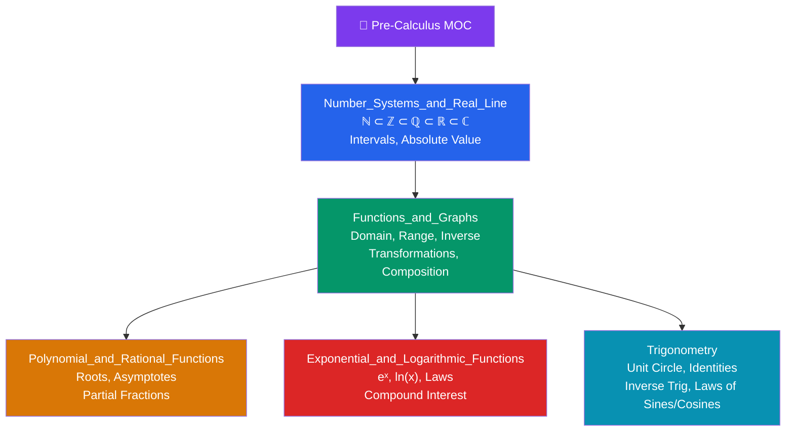

# 📐 Pre-Calculus — Map of Content

> [!abstract] About This Section
> Senior secondary school mathematics: number systems, functions, polynomials, exponentials, and trigonometry — the essential toolkit before calculus. This section assumes arithmetic fluency and builds the algebraic and analytic foundations required for single-variable calculus. Difficulty: **Beginner**.

---

## Notes in This Section

| Note | Topics | Difficulty |
|------|--------|------------|
| [[Number_Systems_and_Real_Line]] | ℕ, ℤ, ℚ, ℝ, ℂ; number line; absolute value; intervals; inequalities; Archimedean property | Beginner |
| [[Functions_and_Graphs]] | Function definition; domain/range; transformations; inverse functions; composition; injective/surjective | Beginner |
| [[Polynomial_and_Rational_Functions]] | Degree; roots; Factor Theorem; polynomial division; partial fractions; vertical/horizontal asymptotes; holes | Beginner |
| [[Exponential_and_Logarithmic_Functions]] | $a^x$; Euler's number $e$; $\ln(x)$; log laws; compound interest; radioactive decay | Beginner |
| [[Trigonometry]] | Unit circle; radian measure; six trig functions; key values; Pythagorean/sum/double-angle identities; inverse trig; law of sines/cosines | Beginner |

---

## Learning Path

$$\text{[[Number_Systems_and_Real_Line]]} \;\to\; \text{[[Functions_and_Graphs]]} \;\to\; \begin{cases} \text{[[Polynomial_and_Rational_Functions]]} \\ \text{[[Exponential_and_Logarithmic_Functions]]} \\ \text{[[Trigonometry]]} \end{cases}$$

All three terminal topics depend on a solid understanding of functions. The three can be studied in any order after Functions.

---

## Key Takeaways from Pre-Calculus

1. **Real numbers form a complete ordered field** — they fill the number line with no gaps.
2. **Functions are the fundamental object** of calculus — calculus studies how functions change.
3. **Polynomials and rational functions** are the algebraic workhorses; partial fractions appear in integration.
4. **Exponentials and logarithms** are inverses and model constant-percentage-rate change.
5. **Trigonometry** models periodicity and is the backbone of Fourier analysis, wave physics, and complex analysis.

---

## Prerequisites

- Arithmetic with fractions and decimals
- Basic algebraic manipulation (solving linear and quadratic equations)
- Coordinate geometry (plotting points, distance formula)

## What Comes Next

- [[_MOC_Calculus|→ 02 Calculus MOC]] — single-variable calculus builds directly on all five topics here

---

## External Resources

- Khan Academy — Pre-calculus course (free, video-based)
- 3Blue1Brown — "Essence of Calculus" series (visual intuition)
- Paul's Online Math Notes — Algebra / Trig review

#MOC #pre-calculus #mathematics #number-systems #functions #polynomials #exponentials #trigonometry
