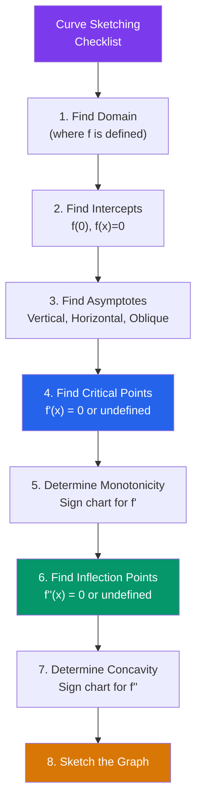

# ∫ Applications of Derivatives

> [!abstract] TL;DR
> Derivatives answer practical questions: where does a function peak or trough? How does a curve bend? What is the optimal solution? The Mean Value Theorem provides the theoretical backbone, while L'Hôpital's rule resolves indeterminate limits that appear throughout analysis.

## Intuition — analogy FIRST

Imagine hiking a mountain. You're at a **local maximum** when you can't step uphill in any direction — the slope is zero and you're at the top of a ridge. You're at a **saddle point** when going east is uphill but going north is downhill. The **second derivative** tells you whether a flat spot is a peak (bowl-down) or a valley (bowl-up) or a saddle.

**Optimization** is finding the highest peak or deepest valley — the answer to every engineering and economics problem that asks "what's the best?"

---

## How It Works

---

## Key Concepts / Details

### Critical Points and Extrema

A **critical point** of $f$ is a number $c$ in the domain where $f'(c) = 0$ or $f'(c)$ does not exist.

**Fermat's Theorem:** If $f$ has a local extremum at $c$ and $f'(c)$ exists, then $f'(c) = 0$.

**Extreme Value Theorem:** A continuous function on a closed interval $[a, b]$ attains its absolute maximum and minimum.

To find absolute extrema on $[a, b]$:
1. Find all critical points in $(a, b)$.
2. Evaluate $f$ at critical points and at endpoints $a$, $b$.
3. The largest value is the absolute max; the smallest is the absolute min.

---

### First Derivative Test

If $c$ is a critical point:
- If $f'$ changes from $+$ to $-$ at $c$: **local maximum**.
- If $f'$ changes from $-$ to $+$ at $c$: **local minimum**.
- If $f'$ does not change sign: **neither** (e.g., inflection point).

---

### Second Derivative Test

If $f'(c) = 0$:
- $f''(c) > 0$: **local minimum** (concave up — valley).
- $f''(c) < 0$: **local maximum** (concave down — peak).
- $f''(c) = 0$: **inconclusive** — use first derivative test.

---

### Concavity and Inflection Points

- **Concave up** on $(a,b)$ if $f''(x) > 0$ on $(a,b)$ (curve bends like a cup $\cup$).
- **Concave down** on $(a,b)$ if $f''(x) < 0$ on $(a,b)$ (curve bends like a cap $\cap$).
- **Inflection point** at $c$ if $f''$ changes sign at $c$ (concavity reverses).

---

### Mean Value Theorem (MVT)

> **MVT:** If $f$ is continuous on $[a,b]$ and differentiable on $(a,b)$, then there exists $c \in (a,b)$ such that:
> $$f'(c) = \frac{f(b) - f(a)}{b - a}$$

**Geometric meaning:** There is at least one point where the tangent line is parallel to the secant line connecting $(a, f(a))$ and $(b, f(b))$.

**Rolle's Theorem** (special case): If additionally $f(a) = f(b)$, then $f'(c) = 0$ for some $c \in (a,b)$.

**Corollary:** If $f'(x) = 0$ on an interval, then $f$ is constant. If $f'(x) = g'(x)$, then $f - g$ is constant.

---

### L'Hôpital's Rule

For indeterminate forms $\frac{0}{0}$ or $\frac{\infty}{\infty}$:
$$\lim_{x \to a} \frac{f(x)}{g(x)} = \lim_{x \to a} \frac{f'(x)}{g'(x)}$$

provided the right-hand limit exists (or is $\pm\infty$).

**Other indeterminate forms** — convert first:
- $0 \cdot \infty$: rewrite as $\frac{0}{1/\infty}$ or $\frac{\infty}{1/0}$
- $\infty - \infty$: find common denominator
- $0^0$, $1^\infty$, $\infty^0$: take the natural log first

**Example:**
$$\lim_{x \to 0} \frac{\sin x}{x} \overset{L'H}{=} \lim_{x \to 0} \frac{\cos x}{1} = 1$$

---

### Optimization — Problem Strategy

1. **Identify** what to maximize/minimize (the **objective function**).
2. **Identify** any constraints.
3. **Express** the objective as a function of a single variable using the constraint.
4. **Find critical points** by setting $f' = 0$.
5. **Verify** the critical point is a max/min using first or second derivative test (or check endpoints).

**Classic example — Open box:** From a square sheet of side $s$, cut corner squares of side $x$ and fold up. Volume $V = x(s-2x)^2$. Maximize over $x \in (0, s/2)$.

---

### Related Rates

When two or more quantities change with time, differentiate both sides of the relating equation with respect to $t$.

**Example:** A 5-meter ladder slides down a wall. If the bottom moves away at 1 m/s, how fast is the top sliding down?
$$x^2 + y^2 = 25 \implies 2x\frac{dx}{dt} + 2y\frac{dy}{dt} = 0 \implies \frac{dy}{dt} = -\frac{x}{y}\frac{dx}{dt}$$

---

## Real-World Notes

- **Engineering design**: minimizing material to build a cylindrical can of fixed volume $V$ — minimize surface area $2\pi r^2 + 2\pi r h$ subject to $\pi r^2 h = V$.
- **Economics**: profit $\pi(q) = R(q) - C(q)$ is maximized where $R'(q) = C'(q)$, i.e., marginal revenue = marginal cost.
- **Physics (Snell's Law of refraction)**: light traveling between media minimizes travel time (Fermat's Principle); the refraction angle is found by optimizing the time function.
- **Machine learning**: gradient descent follows $-\nabla f$ (the steepest descent direction) to minimize a loss function.

---

## Common Pitfalls

- **Critical points are not automatically extrema**: $f(x) = x^3$ has $f'(0) = 0$ but no local extremum at $x = 0$ — it's an inflection point.
- **Closed interval method**: for absolute extrema on $[a,b]$, you must check endpoints too, not just critical points in the interior.
- **L'Hôpital misuse**: only apply when the form is truly $0/0$ or $\infty/\infty$. Applying it to $\frac{1}{\sin x}$ as $x\to 0$ (form $1/0$, not $0/0$) gives a wrong answer.
- **MVT requires both conditions**: continuity on $[a,b]$ AND differentiability on $(a,b)$. Missing either condition invalidates the theorem.

---

## Related Concepts

- [[_MOC_Calculus|↑ Calculus MOC]]
- [[Differentiation]] — derivative rules needed to find $f'$ and $f''$
- [[Limits_and_Continuity]] — L'Hôpital's rule applies limit theory to indeterminate forms
- [[Riemann_Integration]] — MVT for integrals is the integral analogue of MVT for derivatives
- [[Applications_of_Integration]] — optimization problems often require both differentiation and integration

---

## Review Questions

1. Find all local and absolute extrema of $f(x) = x^4 - 4x^3$ on $[-1, 4]$.
2. Use L'Hôpital's Rule to evaluate $\lim_{x \to 0} \frac{e^x - 1 - x}{x^2}$.
3. A farmer has 200 m of fencing and wants to enclose a rectangular area, with one side along a barn (needing no fence). What dimensions maximize the enclosed area?
4. Explain geometrically why the Mean Value Theorem must hold for a smooth curve, and give an example of a function on $[0,1]$ for which it fails and why.

---

## Sources

- Stewart, *Calculus: Early Transcendentals*, Ch. 4
- Spivak, *Calculus*, Ch. 11–12
- Apostol, *Calculus Vol. 1*, Ch. 6

#optimization #critical-points #MVT #lhopitals-rule #curve-sketching #calculus #mathematics
