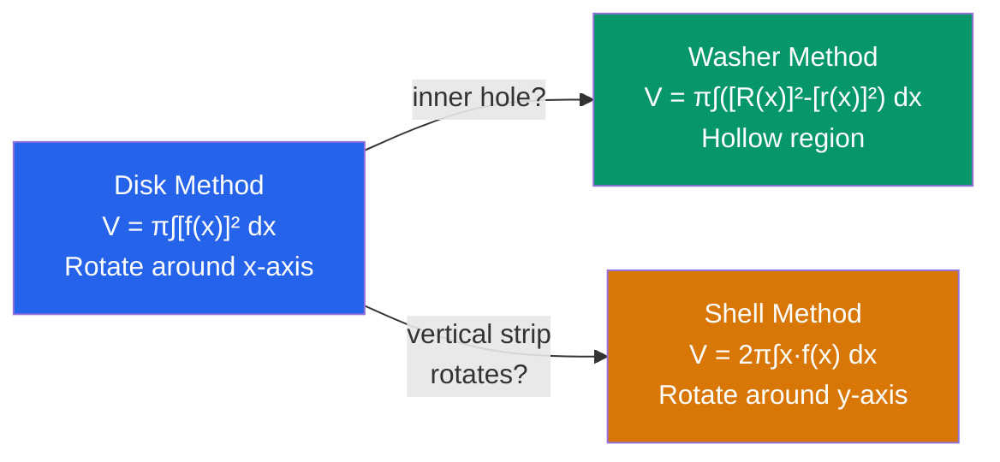

# ∫ Applications of Integration

> [!abstract] TL;DR
> Integration measures accumulation — area, volume, length, work, mass, probability. This note covers geometric applications (areas, volumes of revolution, arc length) and physical/modeling applications (work, center of mass, separable differential equations including exponential and logistic growth).

## Intuition — analogy FIRST

The integral is a **universal accumulator**: slice the quantity into infinitesimally thin pieces, compute each piece, then sum (integrate). This works for:
- **Area**: slice into vertical strips of width $dx$, height $f(x) - g(x)$.
- **Volume**: slice into thin disks or cylindrical shells of thickness $dx$.
- **Arc length**: slice the curve into tiny hypotenuses $\sqrt{dx^2 + dy^2}$.
- **Work**: slice into tiny force-times-distance increments.

The power of integration is that any continuous accumulation reduces to the same framework.

---

## How It Works

---

## Key Concepts / Details

### Area Between Curves

If $f(x) \geq g(x)$ on $[a, b]$:
$$A = \int_a^b [f(x) - g(x)]\,dx$$

If the curves intersect, split at intersection points and take absolute value in each sub-region.

For curves expressed as functions of $y$ ($x = f(y)$, $x = g(y)$):
$$A = \int_c^d [f(y) - g(y)]\,dy$$

---

### Volumes of Revolution

**Disk Method** (region rotated about $x$-axis, no hole):
$$V = \pi \int_a^b [f(x)]^2\,dx$$

**Washer Method** (region between two curves, rotated about $x$-axis):
$$V = \pi \int_a^b \left([f(x)]^2 - [g(x)]^2\right)\,dx$$
where $f(x) \geq g(x) \geq 0$.

**Shell Method** (region rotated about $y$-axis, using vertical strips):
$$V = 2\pi \int_a^b x \cdot f(x)\,dx$$

General shell formula (distance from axis $\times$ height $\times$ thickness):
$$V = 2\pi \int_a^b \text{(radius)(height)}\,dx$$

> [!tip] Which method?
> Use **disk/washer** when slices are perpendicular to the axis of rotation. Use **shells** when slices are parallel to the axis.

---

### Arc Length

For $y = f(x)$ on $[a, b]$ (with $f'$ continuous):
$$L = \int_a^b \sqrt{1 + [f'(x)]^2}\,dx$$

For parametric curves $x = x(t)$, $y = y(t)$ on $[\alpha, \beta]$:
$$L = \int_\alpha^\beta \sqrt{\left(\frac{dx}{dt}\right)^2 + \left(\frac{dy}{dt}\right)^2}\,dt$$

---

### Surface Area of Revolution

Rotating $y = f(x)$ about the $x$-axis:
$$S = 2\pi \int_a^b f(x)\,\sqrt{1 + [f'(x)]^2}\,dx$$

---

### Physical Applications

**Work:**
$$W = \int_a^b F(x)\,dx$$
Spring force: $F(x) = kx$ (Hooke's Law), so $W = \int_0^d kx\,dx = \frac{1}{2}kd^2$.

**Hydrostatic pressure** on a submerged plate at depth $h$: $dF = \rho g h\,dA$, integrate over the plate.

**Center of Mass** of a thin plate with density $\rho(x)$ on $[a, b]$:
$$\bar{x} = \frac{\int_a^b x\,\rho(x)\,dx}{\int_a^b \rho(x)\,dx}$$

---

### Separable Differential Equations

A differential equation $\frac{dy}{dx} = f(x)g(y)$ is **separable** — rearrange and integrate both sides:
$$\frac{dy}{g(y)} = f(x)\,dx \implies \int \frac{dy}{g(y)} = \int f(x)\,dx$$

---

### Exponential Growth and Decay

$$\frac{dy}{dt} = ky \implies y(t) = y_0 e^{kt}$$

- $k > 0$: exponential growth (bacteria, compound interest).
- $k < 0$: exponential decay (radioactive decay, Newton's law of cooling).

**Newton's Law of Cooling:** $\frac{dT}{dt} = k(T - T_{\text{env}})$, solution: $T(t) = T_{\text{env}} + (T_0 - T_{\text{env}})e^{kt}$ with $k < 0$.

---

### Logistic Growth

$$\frac{dy}{dt} = ky\left(1 - \frac{y}{M}\right)$$

where $M$ is the **carrying capacity**. Solution:
$$y(t) = \frac{M}{1 + \left(\frac{M - y_0}{y_0}\right)e^{-kt}}$$

- When $y \ll M$: grows exponentially (like $ky$).
- When $y \to M$: growth slows to zero (S-curve / sigmoid shape).

---

## Real-World Notes

- **Industrial design (wine glass / vase)**: the volume of a glass is the volume of revolution of its profile curve — computed by disk/washer method. CAD software does this numerically.
- **Population ecology**: logistic growth accurately models real population dynamics with limited resources (food, space). The carrying capacity $M$ represents environmental limits.
- **Cable engineering**: arc length formulas compute the exact length of a hanging cable (catenary $y = a\cosh(x/a)$) needed to span a bridge.
- **Newton's Law of Cooling (forensics)**: the time of death is estimated by solving the cooling ODE, given the body temperature at time of discovery and ambient room temperature.

---

## Common Pitfalls

- **Disk vs. shell — perpendicular to axis**: disk method slices perpendicular to the axis; shell method slices parallel. Choosing the wrong method leads to an integral you cannot evaluate.
- **Arc length underestimation**: the straight-line distance $b - a$ is always less than arc length $L$; the integrand $\sqrt{1 + [f']^2} \geq 1$ confirms this.
- **Logistic vs. exponential**: early in growth they look identical, but logistic always saturates at $M$ while exponential grows without bound. Confusing them leads to wildly wrong long-run forecasts.
- **Separable ODE — missing initial condition**: the general solution has a constant $C$; always apply the initial condition $y(t_0) = y_0$ to pin down $C$.

---

## Related Concepts

- [[_MOC_Calculus|↑ Calculus MOC]]
- [[Riemann_Integration]] — all geometric applications flow from the definite integral
- [[Techniques_of_Integration]] — disk/washer/shell integrals often require u-substitution or trig sub
- [[Differentiation]] — separable ODEs involve both differentiation and integration
- [[Sequences_and_Series]] — logistic growth solution involves $e^{kt}$ which connects to the exponential series

---

## Review Questions

1. Find the volume of the solid formed by revolving $y = \sqrt{x}$ on $[0, 4]$ about the $x$-axis using the disk method.
2. Find the arc length of $y = \frac{x^2}{2} - \frac{\ln x}{4}$ on $[1, e]$. (Hint: $1 + [f'(x)]^2$ simplifies nicely.)
3. A 1 kg object is placed in a room at $20°C$; its initial temperature is $80°C$. After 10 minutes it is $50°C$. Find $k$ and predict the temperature after 30 minutes.
4. A population of 100 fish in a pond follows logistic growth with $k = 0.3$ per year and carrying capacity $M = 1000$. How long until the population reaches 500?

---

## Sources

- Stewart, *Calculus: Early Transcendentals*, Ch. 6, 8, 9
- Apostol, *Calculus Vol. 1*, Ch. 7
- Strang, *Calculus*, Ch. 8

#volumes-of-revolution #arc-length #disk-method #shell-method #differential-equations #logistic-growth #calculus #mathematics
