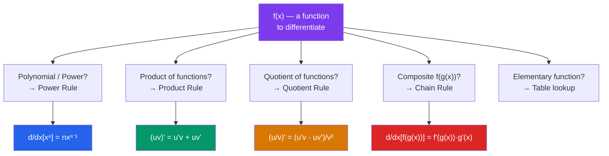

# ∫ Differentiation

> [!abstract] TL;DR
> The derivative measures the instantaneous rate of change of a function — the slope of the tangent line at a point. Defined as a limit of a difference quotient, differentiation follows a set of elegant rules (power, product, quotient, chain) that let us differentiate any combination of elementary functions.

## Intuition — analogy FIRST

Think of a car's speedometer. Your position $s(t)$ tells you *where* you are; the derivative $s'(t) = v(t)$ tells you *how fast you're changing position* right now. The speedometer doesn't average over your whole trip — it measures the instantaneous rate.

Geometrically: zoom in on a smooth curve enough and it looks like a straight line. The **slope** of that line is the derivative.

---

## How It Works

---

## Key Concepts / Details

### The Derivative — Formal Definition

$$f'(x) = \lim_{h \to 0} \frac{f(x+h) - f(x)}{h}$$

This is the **difference quotient** limit. $f'(a)$ is the slope of the tangent line to the graph of $f$ at the point $(a, f(a))$.

**Notation:**
- Lagrange: $f'(x)$, $f''(x)$, $f^{(n)}(x)$
- Leibniz: $\frac{dy}{dx}$, $\frac{d^2y}{dx^2}$, $\frac{d^n y}{dx^n}$
- Newton (physics): $\dot{x}$, $\ddot{x}$ (for time derivatives)
- Operator: $Df(x)$, $D^2 f(x)$

**Differentiability implies continuity**, but not vice versa: $|x|$ is continuous at 0 but not differentiable there.

---

### Differentiation Rules

**Power Rule:**
$$\frac{d}{dx}[x^n] = nx^{n-1} \quad \text{(for any real } n\text{)}$$

**Sum/Difference Rule:**
$$\frac{d}{dx}[f(x) \pm g(x)] = f'(x) \pm g'(x)$$

**Constant Multiple:**
$$\frac{d}{dx}[c \cdot f(x)] = c \cdot f'(x)$$

**Product Rule:**
$$\frac{d}{dx}[u \cdot v] = u'v + uv'$$

**Quotient Rule:**
$$\frac{d}{dx}\left[\frac{u}{v}\right] = \frac{u'v - uv'}{v^2}$$

**Chain Rule:**
$$\frac{d}{dx}[f(g(x))] = f'(g(x)) \cdot g'(x)$$

In Leibniz notation: $\frac{dy}{dx} = \frac{dy}{du} \cdot \frac{du}{dx}$

---

### Table of Common Derivatives

| Function $f(x)$ | Derivative $f'(x)$ |
|-----------------|---------------------|
| $c$ (constant) | $0$ |
| $x^n$ | $nx^{n-1}$ |
| $e^x$ | $e^x$ |
| $a^x$ | $a^x \ln a$ |
| $\ln x$ | $1/x$ |
| $\log_a x$ | $\frac{1}{x \ln a}$ |
| $\sin x$ | $\cos x$ |
| $\cos x$ | $-\sin x$ |
| $\tan x$ | $\sec^2 x$ |
| $\sec x$ | $\sec x \tan x$ |
| $\csc x$ | $-\csc x \cot x$ |
| $\cot x$ | $-\csc^2 x$ |
| $\arcsin x$ | $\frac{1}{\sqrt{1-x^2}}$ |
| $\arccos x$ | $\frac{-1}{\sqrt{1-x^2}}$ |
| $\arctan x$ | $\frac{1}{1+x^2}$ |

> [!warning] Common error
> $\frac{d}{dx}[a^x] = a^x \ln(a)$, **not** $x \cdot a^{x-1}$. The power rule applies to $x^a$ (variable base, constant exponent), not $a^x$ (constant base, variable exponent).

---

### Higher Derivatives

$$f''(x) = \frac{d^2 f}{dx^2} = \frac{d}{dx}[f'(x)]$$

- $f''(x) > 0$: concave up; $f''(x) < 0$: concave down.
- In physics: $s(t)$ is position, $s'(t) = v(t)$ is velocity, $s''(t) = a(t)$ is acceleration.

---

### Implicit Differentiation

When $y$ is defined implicitly by $F(x, y) = 0$, differentiate both sides with respect to $x$, treating $y$ as a function of $x$ and applying the chain rule whenever $y$ appears.

**Example:** Find $\frac{dy}{dx}$ for $x^2 + y^2 = 25$.
$$2x + 2y\frac{dy}{dx} = 0 \implies \frac{dy}{dx} = -\frac{x}{y}$$

---

### Logarithmic Differentiation

Useful for products/quotients of many terms or for $[f(x)]^{g(x)}$ forms.

1. Take $\ln$ of both sides.
2. Differentiate implicitly.
3. Multiply back by $y$.

**Example:** $y = x^x$. Then $\ln y = x \ln x$. Differentiate: $\frac{1}{y}\frac{dy}{dx} = \ln x + 1$. So $\frac{dy}{dx} = x^x(\ln x + 1)$.

---

## Real-World Notes

- **Physics**: velocity $v(t) = \frac{ds}{dt}$ and acceleration $a(t) = \frac{dv}{dt} = \frac{d^2s}{dt^2}$. Newton's second law is $F = ma = m\frac{d^2x}{dt^2}$.
- **Economics (marginal analysis)**: marginal cost $MC = C'(q)$ is the derivative of total cost. Profit is maximized where $MR = MC$.
- **Machine learning (backpropagation)**: gradient descent requires computing $\frac{\partial L}{\partial w}$ for each weight — the chain rule applied repeatedly through a computational graph.
- **Engineering (control systems)**: PID controllers compute the derivative of the error signal to anticipate future behavior.

---

## Common Pitfalls

- **Forgetting the chain rule**: $\frac{d}{dx}[\sin(x^2)] = \cos(x^2) \cdot 2x$, not just $\cos(x^2)$.
- **$d/dx[a^x] \neq x \cdot a^{x-1}$**: power rule requires a constant exponent. For variable exponent: $\frac{d}{dx}[a^x] = a^x \ln a$.
- **Product rule, not arithmetic**: $\frac{d}{dx}[f(x)g(x)] \neq f'(x)g'(x)$.
- **Quotient rule sign**: numerator is $u'v - uv'$ (not $uv' - u'v$). Denominator is $v^2$.

---

## Related Concepts

- [[_MOC_Calculus|↑ Calculus MOC]]
- [[Limits_and_Continuity]] — derivative is defined as a limit; differentiability implies continuity
- [[Applications_of_Derivatives]] — using derivatives to find extrema, sketch curves, apply L'Hôpital's rule
- [[Riemann_Integration]] — Fundamental Theorem of Calculus connects derivatives and integrals
- [[Techniques_of_Integration]] — integration reverses differentiation

---

## Review Questions

1. Using the limit definition, find the derivative of $f(x) = x^3$.
2. Differentiate $h(x) = \frac{e^{2x}\sin(x)}{x^2 + 1}$ using the product, quotient, and chain rules.
3. Use implicit differentiation to find $\frac{dy}{dx}$ for $xy^2 + \sin(y) = x^3$.
4. Find $\frac{d}{dx}[x^{\sin x}]$ using logarithmic differentiation.

---

## Sources

- Stewart, *Calculus: Early Transcendentals*, Ch. 3
- Spivak, *Calculus*, Ch. 9–11
- Apostol, *Calculus Vol. 1*, Ch. 4–5

#derivatives #differentiation #chain-rule #product-rule #quotient-rule #implicit-differentiation #calculus #mathematics
