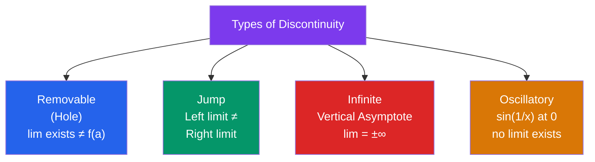

# ∫ Limits and Continuity

> [!abstract] TL;DR
> A limit describes what value a function approaches — not necessarily equals — as the input nears a point. Continuity means there are no breaks, jumps, or holes. Limits are the rigorous foundation on which derivatives and integrals are built.

## Intuition — analogy FIRST

Imagine driving toward a tunnel. The **limit** is the value you'd reach if you kept going — even if the tunnel is sealed (function undefined there). What matters is where you're *heading*, not whether you can actually arrive.

**Continuity** is like a road with no potholes, bridges with no gaps, and no teleportation: you can draw the function without lifting your pen.

---

## How It Works

---

## Key Concepts / Details

### Intuitive Definition

$$\lim_{x \to a} f(x) = L$$

means: as $x$ gets arbitrarily close to $a$ (but $x \neq a$), $f(x)$ gets arbitrarily close to $L$.

**One-sided limits:**
- $\lim_{x \to a^-} f(x) = L^-$ (approaching from the left)
- $\lim_{x \to a^+} f(x) = L^+$ (approaching from the right)

The two-sided limit exists $\iff$ $L^- = L^+$.

---

### Formal $\varepsilon$-$\delta$ Definition

$$\lim_{x \to a} f(x) = L \iff \forall\varepsilon > 0,\; \exists\delta > 0 : 0 < |x - a| < \delta \Rightarrow |f(x) - L| < \varepsilon$$

Reading: "For any target accuracy $\varepsilon$, I can find a tolerance $\delta$ on the input such that inputs within $\delta$ of $a$ produce outputs within $\varepsilon$ of $L$."

---

### Limit Laws

If $\lim_{x\to a} f(x) = L$ and $\lim_{x\to a} g(x) = M$, then:

| Law | Formula |
|-----|---------|
| Sum | $\lim[f \pm g] = L \pm M$ |
| Product | $\lim[f \cdot g] = L \cdot M$ |
| Quotient | $\lim[f/g] = L/M$, provided $M \neq 0$ |
| Power | $\lim[f(x)^n] = L^n$ |
| Composition | $\lim_{x\to a} f(g(x)) = f(M)$, if $f$ is continuous at $M$ |

---

### Special Limits

$$\lim_{x \to 0} \frac{\sin x}{x} = 1 \qquad \lim_{x \to 0} \frac{1 - \cos x}{x} = 0$$
$$\lim_{n \to \infty} \left(1 + \frac{1}{n}\right)^n = e \qquad \lim_{x \to 0} \frac{e^x - 1}{x} = 1$$

---

### Continuity

$f$ is **continuous at $a$** if all three conditions hold:
1. $f(a)$ is defined.
2. $\lim_{x \to a} f(x)$ exists.
3. $\lim_{x \to a} f(x) = f(a)$.

$f$ is continuous on an interval if it is continuous at every point of that interval.

**Continuous functions**: polynomials, rational functions (on their domains), exponentials, logarithms, trig functions, and all their compositions.

---

### Squeeze Theorem

If $g(x) \leq f(x) \leq h(x)$ near $a$ and $\lim_{x \to a} g(x) = \lim_{x \to a} h(x) = L$, then $\lim_{x \to a} f(x) = L$.

**Application**: $\lim_{x \to 0} x^2 \sin(1/x) = 0$ because $-x^2 \leq x^2 \sin(1/x) \leq x^2$ and both bounds go to 0.

---

### Intermediate Value Theorem (IVT)

> **IVT:** If $f$ is continuous on $[a, b]$ and $N$ is any value between $f(a)$ and $f(b)$, then there exists $c \in (a, b)$ such that $f(c) = N$.

**Geometric meaning:** A continuous curve connecting two points must cross every horizontal line between those heights.

**Application (Bolzano):** If $f(a) < 0 < f(b)$ and $f$ is continuous on $[a, b]$, then $f$ has at least one root in $(a, b)$. This proves $\sqrt{2}$ exists: $f(x) = x^2 - 2$ is continuous, $f(1) = -1 < 0$, $f(2) = 2 > 0$, so there's a root in $(1,2)$.

---

## Real-World Notes

- **Electrical engineering**: step functions (like switching a circuit on) create jump discontinuities; Heaviside function $H(t)$.
- **Numerical root-finding**: bisection method is a direct application of IVT — repeatedly halve an interval $[a,b]$ where the sign changes.
- **Physics**: velocity is a limit of average velocities over shrinking time intervals; the derivative concept flows directly from limits.
- **Computer graphics**: pixel rendering and anti-aliasing compute limits of color values at sub-pixel boundaries.

---

## Common Pitfalls

- **A limit can exist even when the function is undefined at that point**: $\lim_{x \to 0} \frac{\sin x}{x} = 1$ even though $\frac{\sin 0}{0}$ is $0/0$.
- **$\lim f(x)g(x) \neq \lim f \cdot \lim g$ when both limits are $0$ or $\pm\infty$**: indeterminate forms require L'Hôpital's rule or algebraic manipulation.
- **Limits at infinity vs. infinite limits**: $\lim_{x \to \infty} f(x)$ (horizontal asymptote) is different from $\lim_{x \to a} f(x) = \infty$ (vertical asymptote).
- **Continuity at a single point is local**: a function can be continuous at $x = 0$ but discontinuous everywhere else (e.g., $f(x) = x$ if $x \in \mathbb{Q}$, $0$ otherwise).

---

## Related Concepts

- [[_MOC_Calculus|↑ Calculus MOC]]
- [[Differentiation]] — derivative is defined as a limit of a difference quotient
- [[Riemann_Integration]] — the definite integral is defined as a limit of Riemann sums
- [[Sequences_and_Series]] — sequence convergence uses the same $\varepsilon$-$N$ definition
- [[Applications_of_Derivatives]] — L'Hôpital's rule handles $0/0$ and $\infty/\infty$ indeterminate limits

---

## Review Questions

1. Use the $\varepsilon$-$\delta$ definition to prove $\lim_{x \to 3} (2x - 1) = 5$.
2. For $f(x) = \frac{x^2 - 4}{x - 2}$, find $\lim_{x \to 2} f(x)$. Is $f$ continuous at $x = 2$? Can you define $f(2)$ to make it continuous?
3. Use the Squeeze Theorem to find $\lim_{x \to 0} x^2 \cos(1/x)$.
4. Use IVT to show that $e^x = 3 - x$ has a solution in $[0, 2]$.

---

## Sources

- Stewart, *Calculus: Early Transcendentals*, Ch. 2
- Spivak, *Calculus*, Ch. 5–6
- Apostol, *Calculus Vol. 1*, Ch. 3

#limits #continuity #epsilon-delta #IVT #squeeze-theorem #calculus #mathematics
