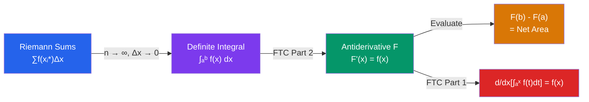

# ∫ Riemann Integration

> [!abstract] TL;DR
> The definite integral measures the signed area under a curve, defined rigorously as the limit of Riemann sums. The Fundamental Theorem of Calculus (FTC) is the central result of single-variable calculus: it reveals that differentiation and integration are inverse operations, linking geometry to algebra.

## Intuition — analogy FIRST

To find the area under a curve, slice the region into thin vertical **rectangles**. Each rectangle has width $\Delta x$ and height $f(x_i)$. Sum all areas: $\sum f(x_i)\,\Delta x$. As the rectangles get thinner ($\Delta x \to 0$), this sum converges to the exact area — the **integral**.

**The great insight** (FTC): the "accumulation function" $A(x) = \int_a^x f(t)\,dt$ has derivative $A'(x) = f(x)$. Accumulating area is the inverse of finding instantaneous rate.

---

## How It Works

---

## Key Concepts / Details

### Riemann Sums

Partition $[a, b]$ into $n$ subintervals of width $\Delta x = \frac{b-a}{n}$. Choose sample points $x_i^*$ in each subinterval:

$$\sum_{i=1}^{n} f(x_i^*)\,\Delta x$$

- **Left Riemann sum**: $x_i^* = x_{i-1}$ (left endpoint of each subinterval)
- **Right Riemann sum**: $x_i^* = x_i$ (right endpoint)
- **Midpoint rule**: $x_i^* = \frac{x_{i-1} + x_i}{2}$

---

### The Definite Integral

$$\int_a^b f(x)\,dx = \lim_{n \to \infty} \sum_{i=1}^{n} f(x_i^*)\,\Delta x$$

This limit exists (and the function is called **Riemann integrable**) if $f$ is continuous on $[a,b]$ (also if $f$ is bounded with finitely many discontinuities).

**Signed area:** $\int_a^b f(x)\,dx$ counts area above the $x$-axis as positive and below as negative.

---

### Properties of the Definite Integral

| Property | Formula |
|----------|---------|
| Linearity | $\int_a^b [cf(x) + g(x)]\,dx = c\int_a^b f(x)\,dx + \int_a^b g(x)\,dx$ |
| Interval additivity | $\int_a^b f\,dx = \int_a^c f\,dx + \int_c^b f\,dx$ |
| Reversed limits | $\int_b^a f\,dx = -\int_a^b f\,dx$ |
| Zero-width | $\int_a^a f\,dx = 0$ |
| Comparison | If $f(x) \leq g(x)$ on $[a,b]$: $\int_a^b f\,dx \leq \int_a^b g\,dx$ |
| Bound | $\left|\int_a^b f\,dx\right| \leq \int_a^b |f|\,dx$ |

---

### Fundamental Theorem of Calculus

**FTC Part 1 (Differentiation of an Integral):**
$$\frac{d}{dx}\left[\int_a^x f(t)\,dt\right] = f(x)$$

if $f$ is continuous near $x$. The accumulation function is an antiderivative of $f$.

**FTC Part 2 (Evaluation Theorem):**
$$\int_a^b f(x)\,dx = F(b) - F(a)$$

where $F$ is any antiderivative of $f$ (i.e., $F' = f$). Notation: $\Big[F(x)\Big]_a^b = F(b) - F(a)$.

---

### Antiderivatives

$F$ is an **antiderivative** of $f$ if $F'(x) = f(x)$. Antiderivatives are unique up to a constant: if $F'(x) = G'(x)$, then $F(x) = G(x) + C$.

**Indefinite integral** (most general antiderivative):
$$\int f(x)\,dx = F(x) + C$$

**Basic antiderivatives:**

| $f(x)$ | $\int f(x)\,dx$ |
|--------|----------------|
| $x^n\;(n\neq-1)$ | $\frac{x^{n+1}}{n+1} + C$ |
| $\frac{1}{x}$ | $\ln|x| + C$ |
| $e^x$ | $e^x + C$ |
| $a^x$ | $\frac{a^x}{\ln a} + C$ |
| $\sin x$ | $-\cos x + C$ |
| $\cos x$ | $\sin x + C$ |
| $\sec^2 x$ | $\tan x + C$ |
| $\frac{1}{\sqrt{1-x^2}}$ | $\arcsin x + C$ |
| $\frac{1}{1+x^2}$ | $\arctan x + C$ |

---

### Average Value of a Function

$$f_{\text{avg}} = \frac{1}{b-a}\int_a^b f(x)\,dx$$

**Mean Value Theorem for Integrals:** If $f$ is continuous on $[a,b]$, there exists $c \in [a,b]$ such that $f(c) = f_{\text{avg}}$.

---

### Area Between Curves

$$\text{Area} = \int_a^b |f(x) - g(x)|\,dx$$

When $f(x) \geq g(x)$ on $[a,b]$: $\int_a^b [f(x) - g(x)]\,dx$. Split at intersection points otherwise.

---

## Real-World Notes

- **Physics (work)**: work done by force $F(x)$ over displacement from $a$ to $b$: $W = \int_a^b F(x)\,dx$. Spring force: $F = kx$, so $W = \int_0^d kx\,dx = \frac{1}{2}kd^2$.
- **Net displacement vs. distance**: $\int_a^b v(t)\,dt$ gives net displacement (signed); $\int_a^b |v(t)|\,dt$ gives total distance traveled.
- **Accumulated rainfall / population growth**: if rate of change is $r(t)$, total change over $[a,b]$ is $\int_a^b r(t)\,dt$ — the "net change theorem" directly from FTC Part 2.
- **Probability theory**: for a continuous random variable $X$ with density $f$, $P(a \leq X \leq b) = \int_a^b f(x)\,dx$.

---

## Common Pitfalls

- **Forgetting $+C$ in indefinite integrals**: $\int 2x\,dx = x^2 + C$, not just $x^2$. The constant matters in initial-value problems.
- **Signed area confusion**: $\int_0^{2\pi} \sin x\,dx = 0$ because the positive and negative areas cancel. For total area, integrate $|\sin x|$.
- **FTC Part 1 with chain rule**: $\frac{d}{dx}\int_a^{x^2} f(t)\,dt = f(x^2) \cdot 2x$ (apply chain rule to the upper limit).
- **Antiderivative vs. integral**: $\int f(x)\,dx$ (indefinite) is a family of functions; $\int_a^b f(x)\,dx$ (definite) is a number.

---

## Related Concepts

- [[_MOC_Calculus|↑ Calculus MOC]]
- [[Differentiation]] — FTC shows integration is the inverse of differentiation
- [[Limits_and_Continuity]] — the definite integral is a limit of Riemann sums; continuity guarantees integrability
- [[Techniques_of_Integration]] — methods for computing antiderivatives of complex functions
- [[Applications_of_Integration]] — area, volume, arc length, work, differential equations

---

## Review Questions

1. Use the right Riemann sum with $n = 4$ subintervals to approximate $\int_0^2 x^2\,dx$. Then compute the exact value.
2. Find $\frac{d}{dx}\int_1^{x^3} \cos(t^2)\,dt$ using FTC Part 1 and the chain rule.
3. Evaluate $\int_0^{\pi} \sin(x)\,dx$ using FTC Part 2. Interpret the result geometrically.
4. Find the average value of $f(x) = e^x$ on $[0, 2]$ and the value of $c$ guaranteed by the MVT for integrals.

---

## Sources

- Stewart, *Calculus: Early Transcendentals*, Ch. 5
- Apostol, *Calculus Vol. 1*, Ch. 1–2 (Riemann sums)
- Spivak, *Calculus*, Ch. 13–14

#riemann-integration #FTC #definite-integral #antiderivatives #calculus #mathematics
