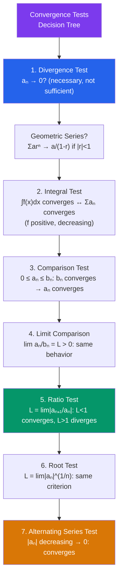

# ∫ Sequences and Series

> [!abstract] TL;DR
> A sequence is an ordered list of numbers; a series is the sum of a sequence. The central question is convergence: does the infinite sum settle down to a finite value? Taylor series represent functions as infinite polynomials — the capstone result connecting differentiation, limits, and approximation.

## Intuition — analogy FIRST

Imagine Zeno's paradox: to walk 1 meter, first walk 1/2, then 1/4, then 1/8, and so on. You never "finish" in finite steps, yet the **total distance is exactly 1**. That is a convergent series: $\frac{1}{2} + \frac{1}{4} + \frac{1}{8} + \cdots = 1$.

A **Taylor series** is even more remarkable: it says you can approximate *any* smooth function using nothing but powers of $(x - a)$ — infinitely many polynomial terms that collectively reproduce the function exactly.

---

## How It Works

---

## Key Concepts / Details

### Sequences

A **sequence** $\{a_n\}$ is a function $\mathbb{N} \to \mathbb{R}$. It **converges** to $L$ if:
$$\lim_{n \to \infty} a_n = L$$

- **Monotone Convergence Theorem:** A monotone bounded sequence converges.
- **Geometric sequence:** $a_n = ar^{n-1}$; converges iff $|r| < 1$ (to 0) or $r = 1$ (to $a$).
- **Arithmetic sequence:** $a_n = a + (n-1)d$; diverges unless $d = 0$.

---

### Series and Partial Sums

The **series** $\sum_{n=1}^\infty a_n$ converges to $S$ if the partial sums $S_N = \sum_{n=1}^N a_n \to S$ as $N \to \infty$.

---

### Key Series

**Geometric Series:**
$$\sum_{n=0}^\infty ar^n = \frac{a}{1-r}, \quad |r| < 1$$
Diverges when $|r| \geq 1$.

**Harmonic Series:** $\sum_{n=1}^\infty \frac{1}{n}$ **diverges** (despite $a_n \to 0$).

**p-Series:** $\sum_{n=1}^\infty \frac{1}{n^p}$ converges iff $p > 1$.

---

### Convergence Tests Summary

| Test | When to use | Convergence condition |
|------|-------------|----------------------|
| **Divergence** | Always first | If $a_n \not\to 0$: diverges. (If $a_n \to 0$: inconclusive) |
| **Geometric** | $ar^n$ form | $|r| < 1$ |
| **Integral** | $a_n = f(n)$, $f$ positive & decreasing | $\int_1^\infty f(x)\,dx$ converges |
| **Comparison** | Similar to known series | $0 \leq a_n \leq b_n$; $\sum b_n$ converges $\Rightarrow \sum a_n$ converges |
| **Limit Comparison** | Rational-type terms | $\lim \frac{a_n}{b_n} = L \in (0,\infty)$; same fate as $\sum b_n$ |
| **Ratio** | Factorials, exponentials | $L = \lim\left|\frac{a_{n+1}}{a_n}\right| < 1$ converges; $> 1$ diverges |
| **Root** | $a_n = (b_n)^n$ form | $L = \lim|a_n|^{1/n} < 1$ converges; $> 1$ diverges |
| **Alternating Series** | $(-1)^n b_n$, $b_n > 0$ | $b_n$ decreasing to 0 $\Rightarrow$ converges |

**Absolute vs. Conditional Convergence:**
- $\sum a_n$ **absolutely converges** if $\sum |a_n|$ converges.
- $\sum a_n$ **conditionally converges** if $\sum a_n$ converges but $\sum |a_n|$ diverges.
- Absolute convergence implies convergence.

---

### Power Series

A **power series** centered at $a$:
$$\sum_{n=0}^\infty c_n (x-a)^n$$

**Radius of convergence** $R$: the series converges absolutely for $|x - a| < R$ and diverges for $|x - a| > R$.

Find $R$ via Ratio Test: $R = \lim_{n\to\infty}\left|\frac{c_n}{c_{n+1}}\right|$ (if the limit exists).

At the endpoints $x = a \pm R$: check separately (may converge, diverge, or conditionally converge).

---

### Taylor and Maclaurin Series

**Taylor series** of $f$ centered at $a$:
$$f(x) = \sum_{n=0}^\infty \frac{f^{(n)}(a)}{n!}(x-a)^n = f(a) + f'(a)(x-a) + \frac{f''(a)}{2!}(x-a)^2 + \cdots$$

**Maclaurin series**: Taylor series centered at $a = 0$.

**Key Maclaurin Series:**

| Function | Series | Radius |
|----------|--------|--------|
| $e^x$ | $\sum_{n=0}^\infty \frac{x^n}{n!}$ | $\infty$ |
| $\sin x$ | $\sum_{n=0}^\infty \frac{(-1)^n x^{2n+1}}{(2n+1)!}$ | $\infty$ |
| $\cos x$ | $\sum_{n=0}^\infty \frac{(-1)^n x^{2n}}{(2n)!}$ | $\infty$ |
| $\ln(1+x)$ | $\sum_{n=1}^\infty \frac{(-1)^{n+1} x^n}{n}$ | $(-1,1]$ |
| $\frac{1}{1-x}$ | $\sum_{n=0}^\infty x^n$ | $(-1,1)$ |
| $(1+x)^k$ | $\sum_{n=0}^\infty \binom{k}{n} x^n$ | $(-1,1)$ |

**Taylor Remainder:** $f(x) = T_n(x) + R_n(x)$ where $R_n(x) = \frac{f^{(n+1)}(c)}{(n+1)!}(x-a)^{n+1}$ for some $c$ between $a$ and $x$ (Lagrange form). This bounds the approximation error.

---

## Real-World Notes

- **Euler's identity**: $e^{i\pi} + 1 = 0$ follows directly from substituting $ix$ into the Maclaurin series of $e^x$ and recognizing the sine/cosine series.
- **Numerical computing**: calculators and computers evaluate $\sin(x)$, $e^x$, $\ln(x)$ using truncated Taylor series; the Taylor remainder controls the rounding error.
- **Signal processing**: Fourier series decompose periodic functions into $\sum (a_n \cos(nx) + b_n \sin(nx))$ — the connection between Taylor series and Fourier analysis.
- **Finance**: present value of a perpetuity (infinite payment stream) is a geometric series: $PV = \sum_{t=1}^\infty \frac{C}{(1+r)^t} = \frac{C}{r}$.

---

## Common Pitfalls

- **Divergence Test is not sufficient**: $a_n \to 0$ does NOT imply $\sum a_n$ converges — the harmonic series is the canonical counterexample.
- **Radius vs. interval of convergence**: $R$ tells you the radius; you must separately check the two endpoints to determine the full interval.
- **Absolute vs. conditional convergence**: $\sum \frac{(-1)^n}{n}$ converges conditionally (alternating series test) but $\sum \frac{1}{n}$ diverges — so it does NOT converge absolutely.
- **Ratio test is inconclusive at $L = 1$**: when the ratio limit equals 1, the test gives no information. Use a different test.

---

## Related Concepts

- [[_MOC_Calculus|↑ Calculus MOC]]
- [[Limits_and_Continuity]] — sequence convergence uses the same $\varepsilon$-$N$ framework as function limits
- [[Differentiation]] — Taylor series are built from successive derivatives at a point
- [[Riemann_Integration]] — power series can be integrated term by term within radius of convergence
- [[Techniques_of_Integration]] — some integrals are computed most easily via Taylor series expansion

---

## Review Questions

1. Determine whether $\sum_{n=1}^\infty \frac{n^2}{e^n}$ converges using the Ratio Test.
2. Find the radius and interval of convergence of $\sum_{n=1}^\infty \frac{(-1)^n x^n}{n \cdot 3^n}$.
3. Use the Maclaurin series for $e^x$ to compute $\int_0^1 e^{-x^2}\,dx$ as an infinite series. (This integral has no closed form in elementary functions.)
4. Find the Taylor series for $f(x) = \frac{1}{x}$ centered at $a = 1$ and determine its radius of convergence.

---

## Sources

- Stewart, *Calculus: Early Transcendentals*, Ch. 11
- Apostol, *Calculus Vol. 1*, Ch. 10–11
- Rudin, *Principles of Mathematical Analysis*, Ch. 3

#sequences #series #convergence-tests #taylor-series #power-series #maclaurin #calculus #mathematics
