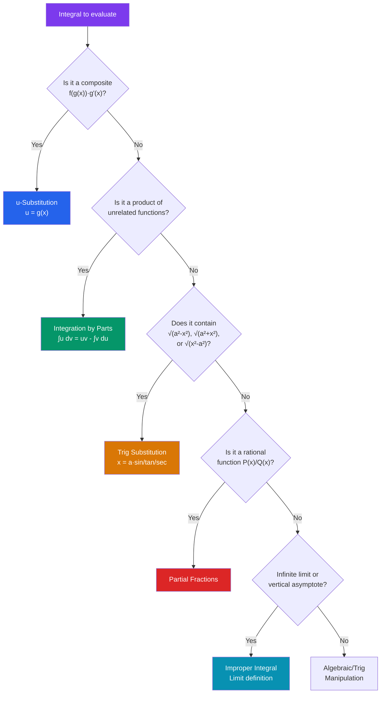

# ∫ Techniques of Integration

> [!abstract] TL;DR
> Most integrals cannot be solved by pattern-matching alone. This note covers the systematic toolkit: u-substitution (reverse chain rule), integration by parts (reverse product rule), trigonometric substitution, partial fraction decomposition, and improper integrals. Knowing which technique to reach for — and when — is the core skill.

## Intuition — analogy FIRST

Integration techniques are like **locks and keys**: each integral has a hidden structure, and each technique is a specialized key. The skill is pattern recognition — seeing $f(g(x))g'(x)$ and reaching for $u$-sub, or seeing $\int \ln(x)\,dx$ and recognizing you need to invent a product for parts.

When all else fails, the decision tree below guides the choice.

---

## How It Works

---

## Key Concepts / Details

### 1. u-Substitution

**Goal:** Recognize $\int f(g(x))\,g'(x)\,dx$ and substitute $u = g(x)$, $du = g'(x)\,dx$.

$$\int f(g(x))\,g'(x)\,dx = \int f(u)\,du$$

**Procedure:**
1. Choose $u = g(x)$ (usually the "inside" of a composite function).
2. Compute $du = g'(x)\,dx$.
3. Rewrite the integral entirely in terms of $u$.
4. Integrate with respect to $u$.
5. Back-substitute $u = g(x)$.

**Example:**
$$\int 2x\,e^{x^2}\,dx \;\xrightarrow{u=x^2,\; du=2x\,dx}\; \int e^u\,du = e^u + C = e^{x^2} + C$$

**Definite integral with substitution:** Change the limits when substituting:
$$\int_0^1 2x\,e^{x^2}\,dx = \int_0^1 e^u\,du = [e^u]_0^1 = e - 1$$

---

### 2. Integration by Parts

**Formula** (reverse product rule):
$$\int u\,dv = uv - \int v\,du$$

**LIATE mnemonic** — choose $u$ as the first type present:
1. **L**ogarithmic ($\ln x$, $\log x$)
2. **I**nverse trigonometric ($\arcsin$, $\arctan$)
3. **A**lgebraic (polynomials: $x^n$)
4. **T**rigonometric ($\sin x$, $\cos x$)
5. **E**xponential ($e^x$, $a^x$)

**Example 1:** $\int x e^x\,dx$. Let $u = x$ (A), $dv = e^x\,dx$ (E). Then $du = dx$, $v = e^x$.
$$\int x e^x\,dx = xe^x - \int e^x\,dx = xe^x - e^x + C = e^x(x-1) + C$$

**Example 2 (circular):** $\int e^x\sin x\,dx$. Apply parts twice; the integral recurs. Solve algebraically:
$$\int e^x \sin x\,dx = \frac{e^x(\sin x - \cos x)}{2} + C$$

**Example 3 (log alone):** $\int \ln x\,dx = x\ln x - x + C$ (let $u = \ln x$, $dv = dx$).

---

### 3. Trigonometric Integrals

For $\int \sin^m x\,\cos^n x\,dx$:

- If $m$ is **odd**: save one $\sin x$, convert rest to $\cos$ via $\sin^2 x = 1 - \cos^2 x$, then $u = \cos x$.
- If $n$ is **odd**: save one $\cos x$, convert rest to $\sin$, then $u = \sin x$.
- If both are **even**: use half-angle formulas $\sin^2 x = \frac{1-\cos 2x}{2}$, $\cos^2 x = \frac{1+\cos 2x}{2}$.

For $\int \sec^m x\,\tan^n x\,dx$:
- If $m$ is **even**: save $\sec^2 x$, convert to $\tan$, $u = \tan x$.
- If $n$ is **odd**: save $\sec x\tan x$, convert to $\sec$, $u = \sec x$.

---

### 4. Trigonometric Substitution

| Integrand contains | Substitution | Identity used |
|-------------------|--------------|---------------|
| $\sqrt{a^2 - x^2}$ | $x = a\sin\theta$ | $1 - \sin^2\theta = \cos^2\theta$ |
| $\sqrt{a^2 + x^2}$ | $x = a\tan\theta$ | $1 + \tan^2\theta = \sec^2\theta$ |
| $\sqrt{x^2 - a^2}$ | $x = a\sec\theta$ | $\sec^2\theta - 1 = \tan^2\theta$ |

After substituting, integrate in $\theta$, then back-substitute using a right triangle.

**Example:** $\int \frac{dx}{\sqrt{4-x^2}}$. Let $x = 2\sin\theta$, $dx = 2\cos\theta\,d\theta$, $\sqrt{4-x^2} = 2\cos\theta$.
$$\int \frac{2\cos\theta\,d\theta}{2\cos\theta} = \int d\theta = \theta + C = \arcsin\!\left(\frac{x}{2}\right) + C$$

---

### 5. Partial Fraction Decomposition

For $\int \frac{P(x)}{Q(x)}\,dx$ where $\deg P < \deg Q$:

Decompose $Q(x)$ into linear and irreducible quadratic factors, then:

$$\frac{P(x)}{(x-a)^k} \to \frac{A_1}{x-a} + \frac{A_2}{(x-a)^2} + \cdots + \frac{A_k}{(x-a)^k}$$
$$\frac{P(x)}{(x^2+bx+c)^k} \to \frac{A_1 x + B_1}{x^2+bx+c} + \cdots$$

**Useful integrals:**
$$\int \frac{1}{x-a}\,dx = \ln|x-a| + C, \quad \int \frac{1}{x^2+a^2}\,dx = \frac{1}{a}\arctan\!\left(\frac{x}{a}\right) + C$$

---

### 6. Improper Integrals

**Type I** (infinite limits):
$$\int_a^\infty f(x)\,dx = \lim_{t \to \infty} \int_a^t f(x)\,dx$$

**Type II** (vertical asymptote at $c \in [a,b]$):
$$\int_a^b f(x)\,dx = \lim_{t \to c^-} \int_a^t f(x)\,dx + \lim_{t \to c^+} \int_t^b f(x)\,dx$$

An improper integral **converges** if the limit is finite; otherwise it **diverges**.

**Key example:** $\int_1^\infty \frac{1}{x^p}\,dx$ converges iff $p > 1$, giving $\frac{1}{p-1}$.

**Comparison Test:** If $0 \leq f(x) \leq g(x)$ and $\int g$ converges, then $\int f$ converges. If $\int f$ diverges, so does $\int g$.

---

## Real-World Notes

- **Probability distributions**: moments of distributions require integration by parts (e.g., $E[X] = \int_{-\infty}^\infty x f(x)\,dx$ for the normal distribution involves completing the square and substitution).
- **Fourier transforms**: computing $\hat{f}(\omega) = \int_{-\infty}^\infty f(t)e^{-2\pi i\omega t}\,dt$ routinely requires parts and substitution.
- **Control systems**: Laplace transforms $\mathcal{L}\{f(t)\} = \int_0^\infty e^{-st}f(t)\,dt$ are improper integrals; partial fractions appear in the inverse transform.
- **Physics (electrostatics)**: computing electric potential $V = \int \frac{kq}{r}\,dr$ uses substitution; fields from extended charge distributions require trig substitution.

---

## Common Pitfalls

- **Forgetting $+C$** in indefinite integrals, especially after long computations.
- **Wrong $u$ choice in substitution**: if $g'(x)$ doesn't appear (up to a constant) in the integrand, $u$-sub won't simplify — try a different technique.
- **Improper integrals that look proper**: $\int_0^1 \frac{1}{\sqrt{x}}\,dx$ has a vertical asymptote at $x = 0$ — it must be treated as improper (it converges to 2).
- **Assuming all improper integrals diverge**: $\int_1^\infty \frac{1}{x^2}\,dx = 1$ converges, but $\int_1^\infty \frac{1}{x}\,dx$ diverges. The difference in exponent (1 vs. 2) is critical.

---

## Related Concepts

- [[_MOC_Calculus|↑ Calculus MOC]]
- [[Riemann_Integration]] — fundamental theorem gives the framework these techniques work within
- [[Differentiation]] — u-substitution reverses the chain rule; parts reverses the product rule
- [[Polynomial_and_Rational_Functions]] — partial fractions decompose rational functions for integration
- [[Trigonometry]] — trig identities and substitutions are essential throughout
- [[Applications_of_Integration]] — all these techniques appear in area, volume, arc-length computations

---

## Review Questions

1. Evaluate $\int x^2\ln(x)\,dx$ using integration by parts.
2. Compute $\int_0^2 \sqrt{4-x^2}\,dx$ using trigonometric substitution. Verify geometrically (it should be a quarter-circle area).
3. Evaluate $\int \frac{2x+1}{(x-1)(x^2+1)}\,dx$ using partial fractions.
4. Determine whether $\int_0^\infty xe^{-x}\,dx$ converges. If so, find its value using integration by parts.

---

## Sources

- Stewart, *Calculus: Early Transcendentals*, Ch. 7
- Apostol, *Calculus Vol. 1*, Ch. 5–6
- Strang, *Calculus*, Ch. 7

#u-substitution #integration-by-parts #trig-substitution #partial-fractions #improper-integrals #calculus #mathematics
