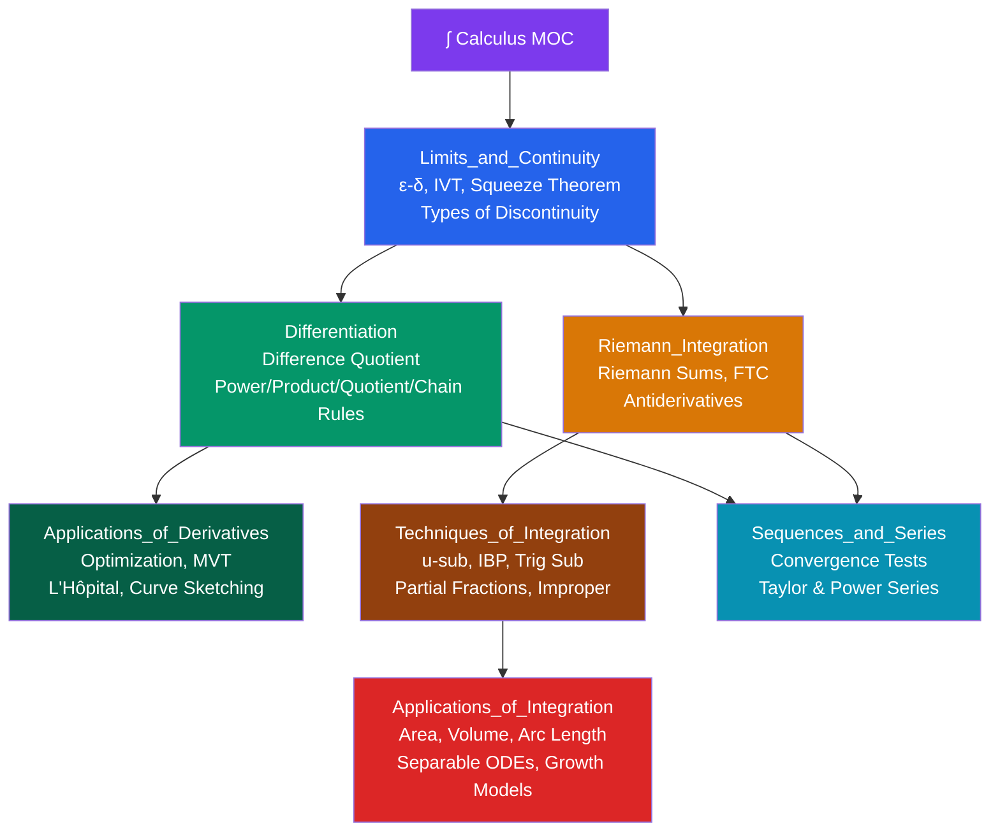

# ∫ Calculus — Map of Content

> [!abstract] About This Section
> Single-variable calculus from limits through series: the backbone of mathematical analysis and the gateway to advanced mathematics. This section covers limits and continuity, differential calculus (derivatives and their applications), integral calculus (Riemann integration and techniques), and infinite series including Taylor series. Difficulty: **Beginner to Intermediate**.

---

## Notes in This Section

| Note | Topics | Difficulty |
|------|--------|------------|
| [[Limits_and_Continuity]] | Intuitive & ε-δ limits, limit laws, special limits, continuity, IVT, Squeeze Theorem | Beginner |
| [[Differentiation]] | Difference quotient, notation, power/product/quotient/chain rules, implicit & log differentiation | Beginner |
| [[Applications_of_Derivatives]] | Critical points, first/second derivative tests, MVT, L'Hôpital's rule, optimization, related rates | Beginner |
| [[Riemann_Integration]] | Riemann sums, definite integral, FTC Parts 1 & 2, antiderivatives, average value | Beginner |
| [[Techniques_of_Integration]] | u-substitution, integration by parts (LIATE), trig integrals, trig substitution, partial fractions, improper integrals | Intermediate |
| [[Sequences_and_Series]] | Sequence convergence, series, convergence tests (7 tests), power series, Taylor/Maclaurin series | Intermediate |
| [[Applications_of_Integration]] | Area, volumes of revolution (disk/washer/shell), arc length, work, separable ODEs, exponential & logistic growth | Intermediate |

---

## Learning Paths

### Standard Path (first calculus course)
[[Limits_and_Continuity]] → [[Differentiation]] → [[Applications_of_Derivatives]] → [[Riemann_Integration]] → [[Techniques_of_Integration]] → [[Applications_of_Integration]]

### Accelerated Path (with strong pre-calculus)
[[Limits_and_Continuity]] → [[Differentiation]] → [[Riemann_Integration]] → [[Techniques_of_Integration]] → [[Applications_of_Derivatives]] → [[Sequences_and_Series]] → [[Applications_of_Integration]]

### Series Path (if focusing on analysis)
[[Limits_and_Continuity]] → [[Sequences_and_Series]] — series convergence builds on limit intuition

---

## Key Theorems at a Glance

| Theorem | Statement | Location |
|---------|-----------|----------|
| **IVT** | Continuous $f$ on $[a,b]$ hits every value between $f(a)$ and $f(b)$ | [[Limits_and_Continuity]] |
| **Squeeze Theorem** | $g \leq f \leq h$, $g,h \to L$ $\Rightarrow$ $f \to L$ | [[Limits_and_Continuity]] |
| **FTC Part 1** | $\frac{d}{dx}\int_a^x f(t)\,dt = f(x)$ | [[Riemann_Integration]] |
| **FTC Part 2** | $\int_a^b f\,dx = F(b) - F(a)$ | [[Riemann_Integration]] |
| **MVT** | $\exists c \in (a,b): f'(c) = \frac{f(b)-f(a)}{b-a}$ | [[Applications_of_Derivatives]] |
| **L'Hôpital** | $\lim \frac{f}{g} = \lim \frac{f'}{g'}$ for $0/0$ or $\infty/\infty$ | [[Applications_of_Derivatives]] |
| **Taylor** | $f(x) = \sum \frac{f^{(n)}(a)}{n!}(x-a)^n$ | [[Sequences_and_Series]] |

---

## Prerequisites

From [[_MOC_Pre_Calculus]]:
- Functions, domain, range, transformations
- Polynomial, rational, exponential, and logarithmic functions
- Trigonometry (unit circle, identities, inverse trig)
- Algebraic fluency (factoring, completing the square, partial fractions setup)

## What Comes Next

- **Multivariable Calculus** — partial derivatives, multiple integrals, gradient, divergence, curl
- **Differential Equations** — building on separable ODEs introduced in [[Applications_of_Integration]]
- **Real Analysis** — the rigorous $\varepsilon$-$\delta$ treatment of everything here (Rudin, Spivak)
- **Linear Algebra** — the other foundation of advanced mathematics

---

## External Resources

- 3Blue1Brown, *Essence of Calculus* (YouTube) — exceptional visual intuition
- Paul's Online Math Notes — calculus.lamar.edu (free, comprehensive)
- MIT OpenCourseWare 18.01 — full calculus course with problem sets
- Spivak, *Calculus* — rigorous and beautiful, for those who want the full story

#MOC #calculus #mathematics #limits #derivatives #integration #series #single-variable
