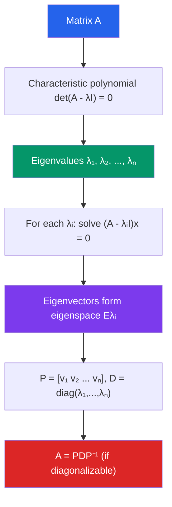

# 🔢 Eigenvalues and Eigenvectors

> [!abstract] TL;DR
> An eigenvector of a matrix is a special direction that the matrix only stretches or flips — it does not rotate. The eigenvalue is the stretch factor. Diagonalization rewrites a matrix in terms of its eigenvectors, turning complex matrix powers and exponentials into simple scalar operations.

## Intuition — analogy FIRST
Push a piece of taffy in every direction at once — most points move in complicated curved paths. But there are a few special straight-line directions that deform purely by stretching or shrinking along the same line. Those directions are the eigenvectors; the amount of stretch is the eigenvalue.

For a rotation matrix, for instance, the only real eigenvector is along the axis of rotation (eigenvalue = 1). For a projection matrix, the eigenvectors are the directions you're projecting onto (eigenvalue = 1) and the perpendicular directions (eigenvalue = 0).

---

## How It Works

## Key Concepts / Details

### The Eigenvalue Equation
$\mathbf{v} \neq \mathbf{0}$ is an **eigenvector** of $A$ with **eigenvalue** $\lambda$ if:
$$A\mathbf{v} = \lambda \mathbf{v}$$

Rearranging: $(A - \lambda I)\mathbf{v} = \mathbf{0}$. This system has a nontrivial solution iff:
$$\det(A - \lambda I) = 0 \qquad \text{(characteristic equation)}$$

### Characteristic Polynomial
Expanding $\det(A - \lambda I)$ gives a polynomial of degree $n$ in $\lambda$ — the **characteristic polynomial**. Its roots are the eigenvalues.

For $2 \times 2$: $\lambda^2 - \text{tr}(A)\lambda + \det(A) = 0$, so eigenvalues sum to $\text{tr}(A)$ and multiply to $\det(A)$.

### Eigenspaces
The **eigenspace** for eigenvalue $\lambda$ is:
$$E_\lambda = \ker(A - \lambda I) = \{\mathbf{v} : A\mathbf{v} = \lambda\mathbf{v}\}$$

Eigenspaces are subspaces of $\mathbb{R}^n$.

### Algebraic vs. Geometric Multiplicity
- **Algebraic multiplicity** of $\lambda$: the number of times $\lambda$ appears as a root of the characteristic polynomial.
- **Geometric multiplicity** of $\lambda$: $\dim(E_\lambda)$.

Always: $1 \leq \text{geometric} \leq \text{algebraic}$.

### Diagonalization
$A$ is **diagonalizable** if it has $n$ linearly independent eigenvectors. Then:
$$A = PDP^{-1}$$
where $D = \text{diag}(\lambda_1, \ldots, \lambda_n)$ and $P$ has eigenvectors as columns.

**Sufficient condition:** $n$ distinct eigenvalues always give $n$ independent eigenvectors.

**Matrix powers become easy:**
$$A^k = PD^kP^{-1}, \qquad D^k = \text{diag}(\lambda_1^k, \ldots, \lambda_n^k)$$

### Symmetric Matrices (Spectral Theorem)
Real symmetric matrices ($A = A^T$) are always diagonalizable, and moreover:
- All eigenvalues are **real**
- Eigenvectors for distinct eigenvalues are **orthogonal**
- There exists an orthonormal basis of eigenvectors: $A = QDQ^T$

### Applications
| Application | Role of Eigenvalues/Eigenvectors |
|-------------|----------------------------------|
| **Google PageRank** | Steady-state page rank is the dominant eigenvector of the web link matrix |
| **PCA in ML** | Principal components = eigenvectors of the covariance matrix |
| **Markov chains** | Long-run distribution is the eigenvector for eigenvalue 1 |
| **Vibration analysis** | Natural frequencies of a structure are eigenvalues of the stiffness/mass matrix |
| **Quantum mechanics** | Observable values are eigenvalues of Hermitian operators |

---

## Real-World Notes
- **Image compression (PCA):** The $k$ eigenvectors with the largest eigenvalues of the covariance matrix capture the $k$ most important "directions" of variation in images, enabling low-dimensional representation.
- **Population dynamics:** In a Leslie matrix (age-structured population model), the dominant eigenvalue is the long-run population growth rate.
- **Differential equations:** The solution to $\mathbf{x}' = A\mathbf{x}$ is $\mathbf{x}(t) = e^{At}\mathbf{x}_0$; using diagonalization, $e^{At} = Pe^{Dt}P^{-1}$ where $e^{Dt}$ is diagonal with entries $e^{\lambda_i t}$.
- **Stability analysis:** Eigenvalues with negative real parts indicate stable systems; positive real parts indicate instability.

---

## Common Pitfalls
- Eigenvalues can be **complex** even for real matrices (e.g., rotation matrices). Complex eigenvalues come in conjugate pairs for real $A$.
- The **zero vector is never an eigenvector** by definition; $A\mathbf{0} = \lambda\mathbf{0}$ holds trivially for any $\lambda$ and is excluded.
- Diagonalizability fails when geometric multiplicity < algebraic multiplicity for some eigenvalue — the matrix is called **defective** and requires Jordan normal form.
- Similar matrices $A = PBP^{-1}$ share eigenvalues, determinant, and trace, but **not** necessarily eigenvectors.

---

## Related Concepts
- [[_MOC_Linear_Algebra|↑ Linear Algebra MOC]]
- [[Matrices_and_Determinants]] — determinant used to find eigenvalues
- [[Linear_Transformations]] — eigenvalues characterize the scaling behavior of a transformation
- [[Inner_Product_Spaces]] — symmetric matrices have orthogonal eigenvectors (spectral theorem)
- [[Singular_Value_Decomposition]] — SVD generalizes eigendecomposition to non-square matrices

---

## Review Questions
1. Find the eigenvalues and eigenvectors of $A = \begin{pmatrix}4 & 1 \\ 2 & 3\end{pmatrix}$. Is $A$ diagonalizable?
2. Prove that eigenvectors for distinct eigenvalues are linearly independent.
3. If $A$ has eigenvalue $\lambda$, what is an eigenvalue of $A^2$? Of $A^{-1}$ (assuming $A$ is invertible)? Of $A + 3I$?

---

## Sources
- Lay, *Linear Algebra and Its Applications*, Ch. 5
- Strang, *Introduction to Linear Algebra*, Ch. 6
- Horn & Johnson, *Matrix Analysis*, Ch. 1

#linear-algebra #eigenvalues #eigenvectors #diagonalization #spectral-theorem
