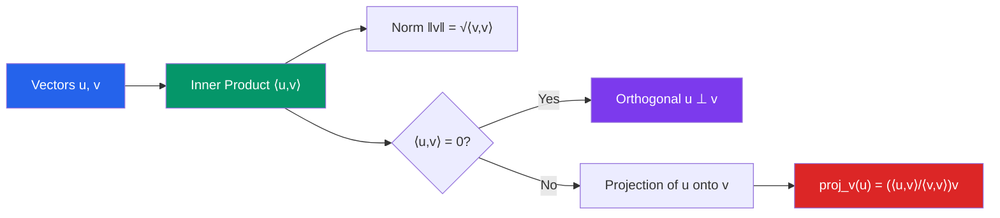

# 🔢 Inner Product Spaces

> [!abstract] TL;DR
> An inner product adds geometry to a vector space by defining length, angle, and distance. Orthogonality — when two vectors are perpendicular — is the key concept enabling projections, least squares regression, and signal decomposition into independent components.

## Intuition — analogy FIRST
The dot product in 2D measures how much two arrows "agree in direction." Perpendicular arrows have zero dot product: they carry completely independent information. This is why GPS signals use orthogonal waveforms — each satellite's signal can be extracted cleanly without interfering with others.

The Gram-Schmidt process is like building a set of perfectly square walls: starting from crooked sticks, you repeatedly remove the component of each new stick that overlaps with the ones already placed, until every wall is perpendicular to every other.

---

## How It Works

## Key Concepts / Details

### Inner Product — Definition
An **inner product** on a real vector space $V$ is a function $\langle \cdot, \cdot \rangle: V \times V \to \mathbb{R}$ satisfying:
1. **Positivity:** $\langle \mathbf{v}, \mathbf{v} \rangle \geq 0$, with equality iff $\mathbf{v} = \mathbf{0}$
2. **Linearity (first argument):** $\langle c\mathbf{u} + d\mathbf{v}, \mathbf{w} \rangle = c\langle \mathbf{u}, \mathbf{w} \rangle + d\langle \mathbf{v}, \mathbf{w} \rangle$
3. **Symmetry:** $\langle \mathbf{u}, \mathbf{v} \rangle = \langle \mathbf{v}, \mathbf{u} \rangle$

**Standard dot product in $\mathbb{R}^n$:**
$$\mathbf{u} \cdot \mathbf{v} = \sum_{i=1}^n u_i v_i = \mathbf{u}^T \mathbf{v}$$

**Geometric interpretation:**
$$\mathbf{u} \cdot \mathbf{v} = \|\mathbf{u}\| \|\mathbf{v}\| \cos\theta$$

### Norm and Distance
$$\|\mathbf{v}\| = \sqrt{\langle \mathbf{v}, \mathbf{v} \rangle}, \qquad d(\mathbf{u}, \mathbf{v}) = \|\mathbf{u} - \mathbf{v}\|$$

### Cauchy-Schwarz Inequality
$$|\langle \mathbf{u}, \mathbf{v} \rangle| \leq \|\mathbf{u}\| \|\mathbf{v}\|$$
Equality holds iff $\mathbf{u}$ and $\mathbf{v}$ are linearly dependent (parallel).

### Orthogonality
$\mathbf{u} \perp \mathbf{v}$ if $\langle \mathbf{u}, \mathbf{v} \rangle = 0$.

A set $\{\mathbf{e}_1, \ldots, \mathbf{e}_k\}$ is **orthonormal** if $\langle \mathbf{e}_i, \mathbf{e}_j \rangle = \delta_{ij}$ (Kronecker delta).

**Pythagorean theorem:** If $\mathbf{u} \perp \mathbf{v}$, then $\|\mathbf{u} + \mathbf{v}\|^2 = \|\mathbf{u}\|^2 + \|\mathbf{v}\|^2$.

### Orthogonal Projection
The projection of $\mathbf{u}$ onto $\mathbf{v}$ (a single vector):
$$\text{proj}_{\mathbf{v}}(\mathbf{u}) = \frac{\langle \mathbf{u}, \mathbf{v} \rangle}{\langle \mathbf{v}, \mathbf{v} \rangle} \mathbf{v}$$

The projection of $\mathbf{u}$ onto a subspace $W$ with orthonormal basis $\{\mathbf{e}_1, \ldots, \mathbf{e}_k\}$:
$$\text{proj}_{W}(\mathbf{u}) = \sum_{i=1}^k \langle \mathbf{u}, \mathbf{e}_i \rangle \mathbf{e}_i$$

### Gram-Schmidt Process
Given any basis $\{\mathbf{v}_1, \ldots, \mathbf{v}_k\}$, produce an orthonormal basis $\{\mathbf{e}_1, \ldots, \mathbf{e}_k\}$:

$$\mathbf{u}_1 = \mathbf{v}_1, \quad \mathbf{u}_j = \mathbf{v}_j - \sum_{i=1}^{j-1} \frac{\langle \mathbf{v}_j, \mathbf{u}_i \rangle}{\langle \mathbf{u}_i, \mathbf{u}_i \rangle} \mathbf{u}_i, \quad \mathbf{e}_j = \frac{\mathbf{u}_j}{\|\mathbf{u}_j\|}$$

### QR Decomposition
Gram-Schmidt applied to the columns of $A$ yields:
$$A = QR$$
where $Q$ has orthonormal columns (orthogonal matrix if square) and $R$ is upper triangular with positive diagonal entries. QR is numerically stable and central to solving least-squares problems.

**Least-squares:** For overdetermined $Ax \approx b$, the solution $\hat{x} = R^{-1}Q^Tb$ minimizes $\|Ax - b\|^2$.

---

## Real-World Notes
- **Signal processing:** Fourier analysis decomposes a signal into orthogonal sinusoidal components; the coefficients are inner products $\langle f, e^{i\omega t} \rangle$.
- **Least squares regression:** Fitting a line to data minimizes $\|Ax - b\|^2$; the optimal solution is the projection of $b$ onto the column space of $A$.
- **Quantum mechanics:** States are unit vectors in a Hilbert space; measurement probabilities are squared inner products $|\langle \phi, \psi \rangle|^2$.
- **Machine learning (kernels):** The kernel trick replaces dot products $\mathbf{x}^T \mathbf{y}$ with general inner products $K(\mathbf{x}, \mathbf{y})$ to handle nonlinear decision boundaries in SVMs.

---

## Common Pitfalls
- The **angle formula** $\cos\theta = \mathbf{u}\cdot\mathbf{v}/(\|\mathbf{u}\|\|\mathbf{v}\|)$ requires both vectors to be nonzero.
- An **orthogonal set is automatically linearly independent**, but a linearly independent set need not be orthogonal — this is why Gram-Schmidt is needed.
- **Orthonormal ≠ orthogonal matrix.** An orthonormal set of vectors satisfies $\langle \mathbf{e}_i, \mathbf{e}_j\rangle = \delta_{ij}$; an orthogonal matrix has orthonormal columns AND rows (for square matrices).
- The Gram-Schmidt algorithm is mathematically correct but numerically unstable for nearly parallel vectors; **modified Gram-Schmidt** or Householder reflections should be used in practice.

---

## Related Concepts
- [[_MOC_Linear_Algebra|↑ Linear Algebra MOC]]
- [[Vectors_and_Vector_Spaces]] — inner products enrich vector spaces with geometry
- [[Eigenvalues_and_Eigenvectors]] — symmetric matrices have orthogonal eigenvectors (spectral theorem)
- [[Singular_Value_Decomposition]] — SVD uses QR and orthogonal decomposition ideas

---

## Review Questions
1. Use the Gram-Schmidt process to orthonormalize $\{(1,1,0), (1,0,1), (0,1,1)\}$ in $\mathbb{R}^3$ with the standard dot product.
2. Find the projection of $\mathbf{b} = (1,1,1)$ onto the subspace spanned by $(1,0,0)$ and $(0,1,0)$. What is the orthogonal complement component?
3. Prove the Cauchy-Schwarz inequality using the fact that $\|\mathbf{u} - t\mathbf{v}\|^2 \geq 0$ for all real $t$.

---

## Sources
- Lay, *Linear Algebra and Its Applications*, Ch. 6
- Axler, *Linear Algebra Done Right*, Ch. 6
- Strang, *Introduction to Linear Algebra*, Ch. 4

#linear-algebra #inner-products #orthogonality #gram-schmidt #qr-decomposition
