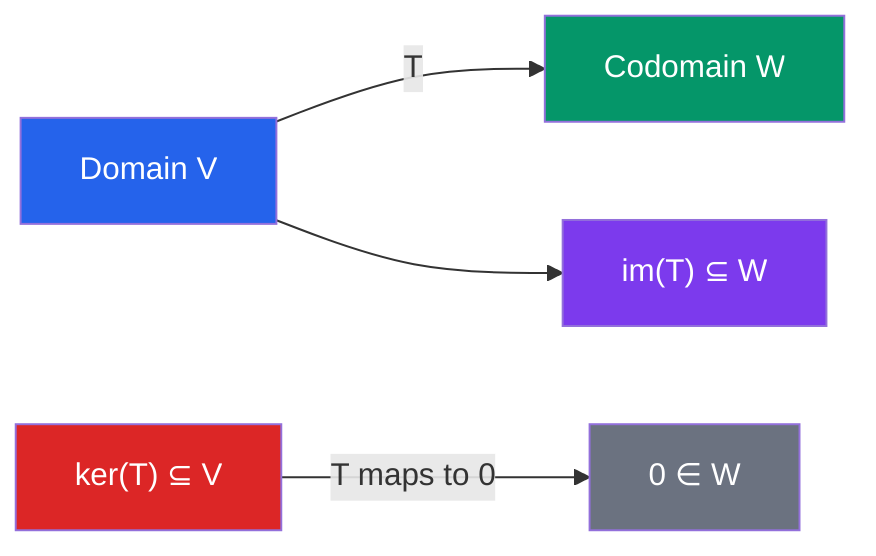

# 🔢 Linear Transformations

> [!abstract] TL;DR
> A linear transformation is a function between vector spaces that preserves vector addition and scalar multiplication. Every such map on finite-dimensional spaces is represented by a matrix, and its geometry is captured by two key subspaces: the kernel (inputs sent to zero) and the image (outputs actually reachable).

## Intuition — analogy FIRST
A linear transformation is a machine that bends, stretches, or projects space without curving it. Straight lines stay straight, the origin stays fixed, and parallel lines remain parallel. A projection onto a wall is linear: if you add two shadows first and then project, or project first and then add, you get the same result.

The **kernel** is the set of all inputs whose shadow is zero — inputs that the machine flattens completely. The **image** is the set of all possible outputs — what the machine can actually produce.

---

## How It Works

## Key Concepts / Details

### Definition
A function $T: V \to W$ between vector spaces is a **linear transformation** if for all $\mathbf{u}, \mathbf{v} \in V$ and scalar $c$:
$$T(\mathbf{u} + \mathbf{v}) = T(\mathbf{u}) + T(\mathbf{v}) \qquad \text{(additivity)}$$
$$T(c\mathbf{u}) = cT(\mathbf{u}) \qquad \text{(homogeneity)}$$

Equivalently: $T(c\mathbf{u} + d\mathbf{v}) = cT(\mathbf{u}) + dT(\mathbf{v})$ (superposition).

**Important consequence:** $T(\mathbf{0}) = \mathbf{0}$ always — any linear map sends the zero vector to zero.

### Matrix Representation
For $T: \mathbb{R}^n \to \mathbb{R}^m$, there exists a unique $m \times n$ matrix $A$ such that:
$$T(\mathbf{x}) = A\mathbf{x} \quad \forall\, \mathbf{x} \in \mathbb{R}^n$$

The matrix $A$ is built by computing $T$ on each standard basis vector:
$$A = \begin{pmatrix} T(\mathbf{e}_1) & T(\mathbf{e}_2) & \cdots & T(\mathbf{e}_n) \end{pmatrix}$$

### Kernel and Image
$$\ker(T) = \{\mathbf{v} \in V : T(\mathbf{v}) = \mathbf{0}\} \subseteq V$$
$$\text{im}(T) = \{T(\mathbf{v}) : \mathbf{v} \in V\} \subseteq W$$

Both are subspaces (of $V$ and $W$ respectively).

### Rank-Nullity Theorem
$$\dim(\ker T) + \dim(\text{im}\, T) = \dim(V)$$

In matrix form: $\text{nullity}(A) + \text{rank}(A) = n$.

### Injective, Surjective, Bijective
| Property | Condition | Matrix condition |
|----------|-----------|-----------------|
| **Injective** (one-to-one) | $\ker(T) = \{\mathbf{0}\}$ | $\text{rank}(A) = n$ (full column rank) |
| **Surjective** (onto) | $\text{im}(T) = W$ | $\text{rank}(A) = m$ (full row rank) |
| **Bijective** (isomorphism) | Injective + surjective | Square matrix, $\det(A) \neq 0$ |

### Change of Basis
The matrix representation of $T$ depends on the choice of basis. Given bases $\mathcal{B}$ and $\mathcal{B}'$ for $V$, the matrix changes via:
$$[T]_{\mathcal{B}'} = P^{-1} [T]_{\mathcal{B}} P$$

where $P$ is the **change-of-basis matrix** whose columns are the $\mathcal{B}$-coordinates of the $\mathcal{B}'$ basis vectors.

Two matrices related this way are called **similar**: $A \sim B$ if $B = P^{-1}AP$. Similar matrices represent the same linear transformation in different bases and share the same eigenvalues, determinant, and rank.

---

## Real-World Notes
- **Image processing:** Convolution with a kernel is a linear transformation on the vector space of pixel arrays. Blur, sharpen, and edge-detection filters are all linear.
- **Neural network layers:** A fully connected layer computes $T(\mathbf{x}) = W\mathbf{x} + \mathbf{b}$; the $W\mathbf{x}$ part is linear. Understanding the kernel and image informs which inputs the layer can distinguish.
- **Fourier transform:** The DFT is a linear transformation (specifically a bijection) from time-domain signals to frequency-domain representations; the DFT matrix is orthogonal (up to scaling).
- **Computer graphics:** Rotation by angle $\theta$ in 2D is the linear map with matrix $\begin{pmatrix}\cos\theta & -\sin\theta \\ \sin\theta & \cos\theta\end{pmatrix}$; all affine transforms used in rendering decompose into a linear part plus a translation.

---

## Common Pitfalls
- $T(\mathbf{0}) = \mathbf{0}$ is a **necessary** condition for linearity — any function that maps the origin to something else is not linear. Use this as a quick check.
- A linear transformation is determined by its action on a **basis** — you only need to specify $T(\mathbf{b}_i)$ for each basis vector; linearity does the rest. Specifying it on other vectors is redundant.
- **Injective ≠ invertible unless also surjective:** An injective map from $\mathbb{R}^2$ to $\mathbb{R}^3$ has a left inverse but not a full inverse.
- Change-of-basis and similarity apply to the same transformation in different bases; **not** to different transformations.

---

## Related Concepts
- [[_MOC_Linear_Algebra|↑ Linear Algebra MOC]]
- [[Vectors_and_Vector_Spaces]] — domain and codomain of linear transformations
- [[Matrices_and_Determinants]] — matrix representation of linear maps
- [[Eigenvalues_and_Eigenvectors]] — special vectors that linear maps only scale

---

## Review Questions
1. Let $T: \mathbb{R}^3 \to \mathbb{R}^2$ be defined by $T(x,y,z) = (x+y, y-z)$. Find the matrix of $T$, its kernel, and its image.
2. Show that the composition of two linear maps is linear. What is the matrix of $T \circ S$ in terms of the matrices of $T$ and $S$?
3. If $T: V \to V$ has $\dim(V) = 5$ and $\dim(\ker T) = 2$, is $T$ surjective? What is $\dim(\text{im}(T))$?

---

## Sources
- Lay, *Linear Algebra and Its Applications*, Ch. 4
- Axler, *Linear Algebra Done Right*, Ch. 3
- Strang, *Introduction to Linear Algebra*, Ch. 7

#linear-algebra #linear-transformations #kernel #image #rank-nullity #change-of-basis
