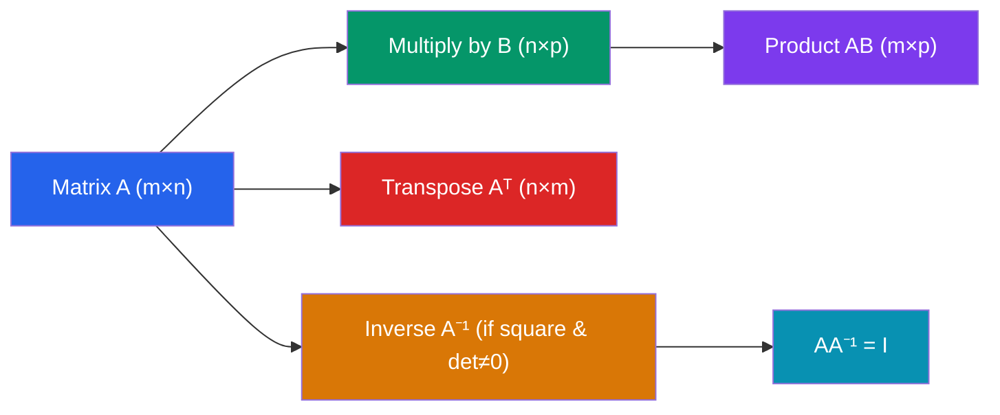

# 🔢 Matrices and Determinants

> [!abstract] TL;DR
> A matrix is a rectangular array of numbers encoding a linear transformation or a system of equations. The determinant is a single scalar that measures how the transformation scales volume and whether the matrix is invertible.

## Intuition — analogy FIRST
Think of a matrix as a machine that takes input vectors and transforms them — stretching, rotating, shearing, or projecting. The determinant is the "volume amplifier" of that machine: a 2×2 matrix with determinant 3 triples areas; determinant −1 flips orientation. When the determinant is zero, the machine crushes all of space into a lower-dimensional shape, losing information — the transformation is irreversible.

---

## How It Works

## Key Concepts / Details

### Matrix Notation
An $m \times n$ matrix $A$ has $m$ rows and $n$ columns:
$$A = \begin{pmatrix} a_{11} & a_{12} & \cdots & a_{1n} \\ a_{21} & a_{22} & \cdots & a_{2n} \\ \vdots & & \ddots & \vdots \\ a_{m1} & a_{m2} & \cdots & a_{mn} \end{pmatrix}$$

### Matrix Multiplication
The product $C = AB$ where $A$ is $m \times n$ and $B$ is $n \times p$ gives a $m \times p$ matrix:
$$c_{ij} = \sum_{k=1}^{n} a_{ik} b_{kj}$$

Key properties: **not commutative** ($AB \neq BA$ in general), but associative $(AB)C = A(BC)$.

### Special Matrices
| Matrix | Definition | Symbol |
|--------|-----------|--------|
| Identity | $a_{ii}=1$, all other entries $0$ | $I_n$ |
| Zero | all entries $0$ | $0$ |
| Diagonal | $a_{ij}=0$ for $i\neq j$ | $\text{diag}(d_1,\ldots,d_n)$ |
| Symmetric | $A = A^T$ | — |
| Orthogonal | $A^T A = I$ (columns form orthonormal set) | $Q$ |

### Transpose
$(A^T)_{ij} = A_{ji}$. Key identities:
$$\left(AB\right)^T = B^T A^T, \qquad \left(A^T\right)^T = A$$

### Determinant
**2×2 case:**
$$\det\begin{pmatrix}a & b \\ c & d\end{pmatrix} = ad - bc$$

**3×3 and larger** — cofactor expansion along row $i$:
$$\det(A) = \sum_{j=1}^{n} (-1)^{i+j} a_{ij} M_{ij}$$
where $M_{ij}$ is the minor (determinant of the submatrix obtained by deleting row $i$ and column $j$).

**Key properties:**
- $\det(AB) = \det(A)\det(B)$
- $\det(A^T) = \det(A)$
- $\det(A^{-1}) = 1/\det(A)$
- $\det(cA) = c^n \det(A)$ for $n \times n$ matrix
- $\det(A) = 0$ if and only if $A$ is singular (non-invertible)
- Row-swapping flips the sign; scaling a row by $c$ multiplies determinant by $c$

### Matrix Inverse
For a square matrix $A$, $A^{-1}$ exists iff $\det(A) \neq 0$:
$$AA^{-1} = A^{-1}A = I$$

**2×2 formula:**
$$\begin{pmatrix}a & b \\ c & d\end{pmatrix}^{-1} = \frac{1}{ad-bc}\begin{pmatrix}d & -b \\ -c & a\end{pmatrix}$$

For larger matrices: Gauss-Jordan elimination on $[A | I]$ to produce $[I | A^{-1}]$.

**Cramer's Rule:** For $Ax = b$ with $\det(A) \neq 0$, the solution is $x_i = \det(A_i)/\det(A)$ where $A_i$ replaces column $i$ with $b$. Practical only for small systems.

---

## Real-World Notes
- **Computer graphics:** Rotation matrices, scaling matrices, and shear matrices are applied to 3D coordinate vectors to transform objects. The composition of transforms is matrix multiplication.
- **Covariance matrices in statistics:** A symmetric positive semi-definite matrix encodes the variance and correlation structure of a multivariate dataset.
- **Economics (Leontief input-output model):** Solving $(I - A)x = d$ for production quantities $x$ given demand $d$ requires computing the inverse of $(I-A)$.
- **Quantum mechanics:** Observables are Hermitian matrices; their eigenvalues are the measurable quantities.

---

## Common Pitfalls
- Matrix multiplication is **not commutative**: $AB \neq BA$ in general; always check the order.
- The product $AB$ is defined only when the **inner dimensions match**: $A$ is $m \times n$, $B$ must be $n \times p$.
- A matrix inverse exists only if the matrix is **square AND non-singular** ($\det \neq 0$).
- $(AB)^{-1} = B^{-1}A^{-1}$, **not** $A^{-1}B^{-1}$ — the order reverses, just like the transpose.

---

## Related Concepts
- [[_MOC_Linear_Algebra|↑ Linear Algebra MOC]]
- [[Vectors_and_Vector_Spaces]] — matrices act on vectors
- [[Systems_of_Linear_Equations]] — matrices encode linear systems as $Ax = b$
- [[Eigenvalues_and_Eigenvectors]] — eigenvalues found via $\det(A - \lambda I) = 0$

---

## Review Questions
1. Given $A = \begin{pmatrix}2 & 1 \\ 5 & 3\end{pmatrix}$, compute $A^{-1}$ and verify $AA^{-1} = I$.
2. Prove that $\det(AB) = \det(A)\det(B)$ for the specific case $A = \begin{pmatrix}1 & 2 \\ 0 & 1\end{pmatrix}$, $B = \begin{pmatrix}3 & 0 \\ 1 & 4\end{pmatrix}$.
3. A matrix $A$ satisfies $A^2 = A$. What are the possible values of $\det(A)$?

---

## Sources
- Lay, *Linear Algebra and Its Applications*, Ch. 2–3
- Strang, *Introduction to Linear Algebra*, Ch. 1
- Horn & Johnson, *Matrix Analysis*, Ch. 0

#linear-algebra #matrices #determinants #matrix-inverse
