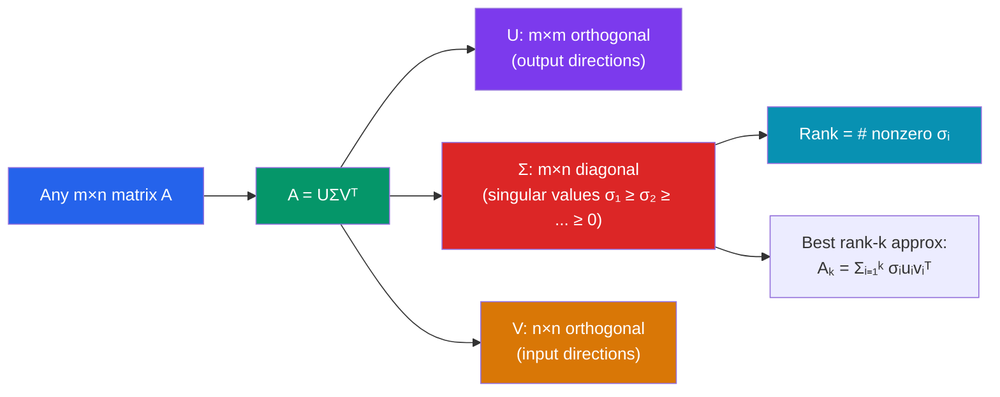

# 🔢 Singular Value Decomposition

> [!abstract] TL;DR
> SVD decomposes any matrix as a rotation, followed by a stretch, followed by another rotation: $A = U\Sigma V^T$. It is the most informative factorization in linear algebra, revealing rank, best low-rank approximations, and the generalized inverse of any matrix — square, rectangular, singular, or not.

## Intuition — analogy FIRST
Every linear transformation, no matter how complicated, does three things: rotate the input, stretch or shrink along certain axes, then rotate the output into the final frame. SVD separates these cleanly. The columns of $V$ are the input directions; the columns of $U$ are the output directions; and $\Sigma$ tells you how much each input direction is stretched.

Think of compressing a photograph. Most of the visual information lives in a few dominant "stretching directions." Keeping only the top-10 singular values and throwing away the rest gives a blurry but recognizable image at a fraction of the storage cost.

---

## How It Works

## Key Concepts / Details

### Spectral Theorem (Prerequisite)
Every real symmetric matrix $A = A^T$ has a factorization:
$$A = QDQ^T = \sum_{i=1}^n \lambda_i \mathbf{q}_i \mathbf{q}_i^T$$
where $Q$ is orthogonal (columns $\mathbf{q}_i$ are orthonormal eigenvectors) and $D = \text{diag}(\lambda_1,\ldots,\lambda_n)$.

### SVD — Statement
For any real $m \times n$ matrix $A$ with rank $r$:
$$A = U \Sigma V^T$$

- $U$ is $m \times m$ **orthogonal** (columns $\mathbf{u}_i$ are **left singular vectors**)
- $\Sigma$ is $m \times n$ **diagonal** with entries $\sigma_1 \geq \sigma_2 \geq \cdots \geq \sigma_r > \sigma_{r+1} = \cdots = 0$ (**singular values**)
- $V$ is $n \times n$ **orthogonal** (columns $\mathbf{v}_i$ are **right singular vectors**)

### Computing Singular Values
$$\sigma_i = \sqrt{\lambda_i(A^T A)} = \sqrt{\lambda_i(AA^T)}$$

The right singular vectors $\mathbf{v}_i$ are eigenvectors of $A^T A$; the left singular vectors $\mathbf{u}_i$ are eigenvectors of $AA^T$.

### Geometric Interpretation
The unit sphere in $\mathbb{R}^n$ is mapped by $A$ to an **ellipsoid** in $\mathbb{R}^m$. The ellipsoid's semi-axis lengths are $\sigma_1 \geq \sigma_2 \geq \cdots \geq \sigma_r$, aligned with the left singular vectors $\mathbf{u}_i$.

### Rank via SVD
$$\text{rank}(A) = \text{number of nonzero singular values}$$

This gives a numerically robust way to compute rank (compare to row reduction, which can be unstable).

### Low-Rank Approximation (Eckart-Young Theorem)
The best rank-$k$ approximation to $A$ in both the Frobenius and spectral norms is:
$$A_k = \sum_{i=1}^k \sigma_i \mathbf{u}_i \mathbf{v}_i^T$$

The approximation error is:
$$\|A - A_k\|_F^2 = \sum_{i=k+1}^r \sigma_i^2, \qquad \|A - A_k\|_2 = \sigma_{k+1}$$

### Pseudoinverse
For any matrix $A = U\Sigma V^T$, the **Moore-Penrose pseudoinverse** is:
$$A^+ = V \Sigma^+ U^T$$
where $\Sigma^+$ replaces each nonzero $\sigma_i$ with $1/\sigma_i$ and leaves zeros as zeros.

The pseudoinverse solves the least-squares problem: $\hat{x} = A^+ b$ minimizes $\|Ax - b\|$ and has minimum norm among all minimizers.

---

## Real-World Notes
- **Image/video compression:** Each video frame is a matrix; keeping the top-$k$ singular triplets $(\sigma_i, \mathbf{u}_i, \mathbf{v}_i)$ gives a compact representation. The Netflix collaborative filtering challenge was won using SVD-based matrix factorization.
- **Latent Semantic Analysis (NLP):** A term-document matrix $A$ has SVD $U\Sigma V^T$; the top singular vectors capture latent topics. Words and documents are embedded in a low-dimensional "semantic space."
- **PCA is SVD:** PCA on centered data $X$ is equivalent to SVD of $X/\sqrt{n-1}$. The right singular vectors of $X$ are the principal components; the singular values determine variance explained.
- **Numerical conditioning:** The **condition number** $\kappa(A) = \sigma_1/\sigma_r$ measures how sensitive $Ax=b$ is to perturbations in $b$. Large $\kappa$ means the system is ill-conditioned.

---

## Common Pitfalls
- SVD always exists for **any** matrix — square, rectangular, singular, even the zero matrix. This is unlike eigendecomposition which may fail.
- **Singular values are always non-negative;** eigenvalues can be negative or complex. Do not confuse the two.
- The **thin SVD** (economy SVD) drops the surplus columns of $U$ or $V$ to produce an $m \times r$ matrix $U$, an $r \times r$ matrix $\Sigma$, and an $n \times r$ matrix $V$. This is equivalent and more memory-efficient.
- Low-rank approximation is optimal in Frobenius/spectral norm, but not necessarily in other norms (e.g., max-entry norm). Choosing the right norm matters for applications.

---

## Related Concepts
- [[_MOC_Linear_Algebra|↑ Linear Algebra MOC]]
- [[Eigenvalues_and_Eigenvectors]] — singular values come from eigenvalues of $A^TA$
- [[Inner_Product_Spaces]] — orthogonality of $U$ and $V$ relies on inner product structure
- [[Linear_Transformations]] — SVD reveals the geometric action of any linear map

---

## Review Questions
1. Find the SVD of $A = \begin{pmatrix}3 & 0 \\ 0 & 2 \\ 0 & 0\end{pmatrix}$. What is the rank and pseudoinverse of $A$?
2. Explain why the best rank-1 approximation to a matrix $A$ is $\sigma_1 \mathbf{u}_1 \mathbf{v}_1^T$. What would a rank-1 image look like visually?
3. If $A$ is square and invertible, show that $A^+ = A^{-1}$. What happens to the pseudoinverse when $A$ is symmetric positive semi-definite?

---

## Sources
- Strang, *Introduction to Linear Algebra*, Ch. 7
- Golub & Van Loan, *Matrix Computations*, Ch. 2
- Trefethen & Bau, *Numerical Linear Algebra*, Lecture 4–5

#linear-algebra #SVD #singular-value-decomposition #spectral-theorem #low-rank #pseudoinverse
