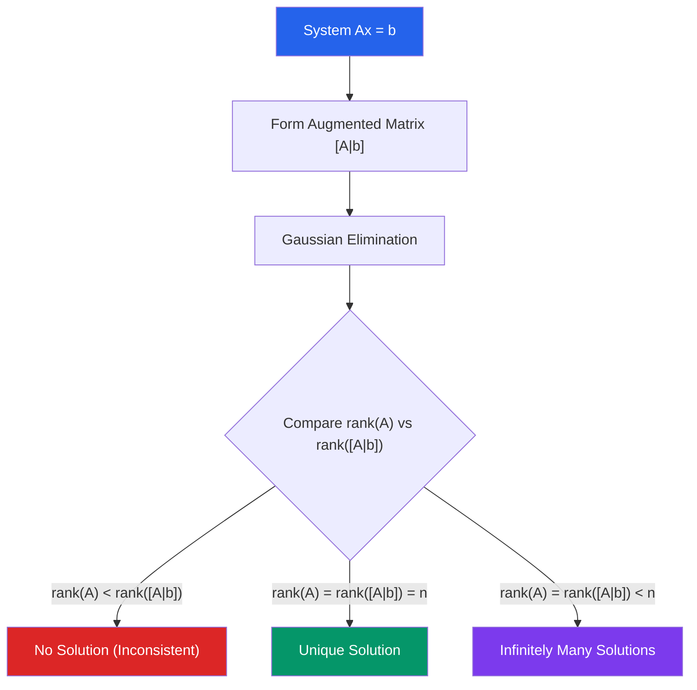

# 🔢 Systems of Linear Equations

> [!abstract] TL;DR
> A system of linear equations $Ax = b$ has exactly one solution, no solution, or infinitely many solutions depending on how the column space of $A$ relates to $b$. Gaussian elimination reduces the system to row echelon form, revealing pivot variables, free variables, and the full solution set.

## Intuition — analogy FIRST
Imagine two friends meeting at a point on a map. Each person walks along a straight road (a linear equation). If the roads intersect, there is exactly one meeting point. If the roads are parallel (inconsistent system), they never meet. If the roads are the same path (dependent system), every point on that road is a valid meeting spot.

In higher dimensions, $n$ equations with $n$ unknowns is like $n$ hyperplanes meeting in $\mathbb{R}^n$. Row reduction is the process of systematically simplifying these planes until the answer is obvious.

---

## How It Works

## Key Concepts / Details

### The Matrix Equation $Ax = b$
A system of $m$ equations in $n$ unknowns:
$$\begin{cases} a_{11}x_1 + \cdots + a_{1n}x_n = b_1 \\ \vdots \\ a_{m1}x_1 + \cdots + a_{mn}x_n = b_m \end{cases}$$
is written compactly as $Ax = b$ where $A$ is $m \times n$, $x \in \mathbb{R}^n$, $b \in \mathbb{R}^m$.

### Row Operations
Three elementary row operations preserve the solution set:
1. **Swap** two rows: $R_i \leftrightarrow R_j$
2. **Scale** a row by a nonzero constant: $R_i \leftarrow cR_i$
3. **Add** a multiple of one row to another: $R_i \leftarrow R_i + cR_j$

### Gaussian Elimination and RREF
Apply row operations to the **augmented matrix** $[A \mid b]$:
- **Row Echelon Form (REF):** leading entries (pivots) shift right in each row; zeros below each pivot.
- **Reduced Row Echelon Form (RREF):** additionally, zeros above each pivot and each pivot equals 1. RREF is unique.

Variables corresponding to pivot columns are **basic (pivot) variables**; remaining variables are **free variables**. Free variables parameterize infinitely many solutions.

### Example: Parametric Solution
$$\begin{pmatrix}1 & 2 & 0 & | & 3\\ 0 & 0 & 1 & | & 5\end{pmatrix}$$
Pivot columns: 1 and 3. Free variable: $x_2 = t$. Solution:
$$x_1 = 3 - 2t, \quad x_2 = t, \quad x_3 = 5, \quad t \in \mathbb{R}$$

### Fundamental Subspaces
For an $m \times n$ matrix $A$:
| Subspace | Definition | Lives in |
|----------|-----------|---------|
| Column space $\text{col}(A)$ | Span of columns of $A$ | $\mathbb{R}^m$ |
| Row space $\text{row}(A)$ | Span of rows of $A$ | $\mathbb{R}^n$ |
| Null space $\text{null}(A)$ | $\{x : Ax = 0\}$ | $\mathbb{R}^n$ |
| Left null space | $\{y : A^Ty = 0\}$ | $\mathbb{R}^m$ |

### Rank and Rank-Nullity Theorem
The **rank** of $A$ is $\text{rank}(A) = \dim(\text{col}(A)) = \dim(\text{row}(A))$.

$$\boxed{\text{rank}(A) + \text{nullity}(A) = n}$$

where nullity$(A) = \dim(\text{null}(A))$ = number of free variables.

### Consistency Condition
$Ax = b$ is consistent (has a solution) if and only if $b \in \text{col}(A)$, i.e., $b$ can be expressed as a linear combination of the columns of $A$.

Equivalently: $\text{rank}(A) = \text{rank}([A \mid b])$.

---

## Real-World Notes
- **Circuit analysis (Kirchhoff's laws):** Node-voltage and mesh-current methods produce linear systems. A circuit with $n$ nodes and $m$ independent loops yields a system solvable by Gaussian elimination.
- **3D graphics (ray-object intersections):** Finding where a ray hits a plane or other surface reduces to solving a small linear system.
- **Economics (supply-demand equilibrium):** Multiple markets with linear supply and demand curves give a simultaneous linear system.
- **GPS positioning:** Determining location from satellite time-difference data solves a linear system (after linearization) with rank conditions governing accuracy.

---

## Common Pitfalls
- **Free variables ≠ zero:** When free variables appear, they are parameters ranging over all real numbers, not forced to be zero. Setting free variables to zero gives one particular solution but misses the full solution space.
- **RREF is unique; REF is not:** Multiple correct REFs exist for the same matrix, but the RREF is uniquely determined.
- **Homogeneous vs. non-homogeneous:** The system $Ax = 0$ always has the trivial solution $x = 0$; the interesting question is whether there are non-trivial solutions (equivalently, whether $\text{rank}(A) < n$).
- **Rank test for consistency:** Even if rank$(A) = $ rank$(A)$, the *number* of free variables is $n - \text{rank}(A)$, not the rank itself.

---

## Related Concepts
- [[_MOC_Linear_Algebra|↑ Linear Algebra MOC]]
- [[Matrices_and_Determinants]] — matrix operations and invertibility
- [[Vectors_and_Vector_Spaces]] — column space, null space are subspaces
- [[Linear_Transformations]] — Ax=b is the equation T(x)=b for the linear map T given by A

---

## Review Questions
1. Solve the system and express the solution in parametric form: $x + 2y - z = 4$, $2x + 4y - 2z = 8$, $3x + 6y - 3z = 12$. Identify all free variables.
2. A matrix $A$ is $4 \times 6$ with rank 3. What is the dimension of the null space? Can $Ax = b$ have a unique solution?
3. Prove that the null space of a matrix $A$ is always a subspace of $\mathbb{R}^n$.

---

## Sources
- Lay, *Linear Algebra and Its Applications*, Ch. 1–2
- Strang, *Introduction to Linear Algebra*, Ch. 2–3
- Anton & Rorres, *Elementary Linear Algebra*, Ch. 1

#linear-algebra #linear-systems #gaussian-elimination #rref #rank-nullity
