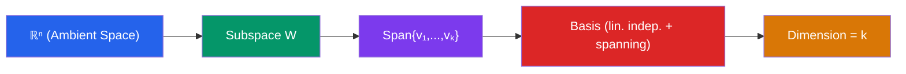

# 🔢 Vectors and Vector Spaces

> [!abstract] TL;DR
> A vector space is a set of objects (vectors) that can be added together and scaled by numbers, obeying eight fundamental axioms. Subspaces, span, linear independence, and basis are the building blocks that describe the geometry and structure of these spaces.

## Intuition — analogy FIRST
Think of arrows in physical space. You can stretch an arrow (scalar multiplication) and combine two arrows tip-to-tail (vector addition). The eight axioms are just the rules that make this arrow-arithmetic consistent — things like "adding two arrows in either order gives the same result." A vector space is any collection where these rules hold, even if the "vectors" are polynomials or functions rather than geometric arrows.

A **basis** is the minimum set of directions you need to describe every possible arrow. In 3D space, you need exactly three independent directions; any more is redundant, any fewer is incomplete.

---

## How It Works

## Key Concepts / Details

### Vectors in ℝⁿ
A vector $\mathbf{v} \in \mathbb{R}^n$ is an ordered n-tuple:
$$\mathbf{v} = \begin{pmatrix} v_1 \\ v_2 \\ \vdots \\ v_n \end{pmatrix}$$

**Operations:**
- **Addition:** $\mathbf{u} + \mathbf{v} = (u_1+v_1, \ldots, u_n+v_n)$
- **Scalar multiplication:** $c\mathbf{v} = (cv_1, \ldots, cv_n)$

### The Eight Vector Space Axioms
For all $\mathbf{u}, \mathbf{v}, \mathbf{w} \in V$ and scalars $c, d$:
1. **Closure under addition:** $\mathbf{u} + \mathbf{v} \in V$
2. **Commutativity:** $\mathbf{u} + \mathbf{v} = \mathbf{v} + \mathbf{u}$
3. **Associativity:** $(\mathbf{u} + \mathbf{v}) + \mathbf{w} = \mathbf{u} + (\mathbf{v} + \mathbf{w})$
4. **Additive identity:** $\exists \mathbf{0}: \mathbf{v} + \mathbf{0} = \mathbf{v}$
5. **Additive inverse:** $\exists (-\mathbf{v}): \mathbf{v} + (-\mathbf{v}) = \mathbf{0}$
6. **Closure under scalar mult:** $c\mathbf{v} \in V$
7. **Distributivity (vector):** $c(\mathbf{u} + \mathbf{v}) = c\mathbf{u} + c\mathbf{v}$
8. **Distributivity (scalar):** $(c+d)\mathbf{v} = c\mathbf{v} + d\mathbf{v}$

### Subspaces
A subset $W \subseteq V$ is a **subspace** if and only if:
- $\mathbf{0} \in W$ (contains the zero vector)
- Closed under addition: $\mathbf{u}, \mathbf{v} \in W \Rightarrow \mathbf{u} + \mathbf{v} \in W$
- Closed under scalar multiplication: $\mathbf{v} \in W, c \in \mathbb{R} \Rightarrow c\mathbf{v} \in W$

*Examples:* Any line through the origin in $\mathbb{R}^2$; any plane through the origin in $\mathbb{R}^3$; $\{\mathbf{0}\}$ (trivial subspace).

### Span
The **span** of vectors $\{\mathbf{v}_1, \ldots, \mathbf{v}_k\}$ is the set of all linear combinations:
$$\text{span}\{\mathbf{v}_1, \ldots, \mathbf{v}_k\} = \left\{ c_1\mathbf{v}_1 + c_2\mathbf{v}_2 + \cdots + c_k\mathbf{v}_k \;\middle|\; c_i \in \mathbb{R} \right\}$$

The span of any set of vectors always forms a subspace.

### Linear Independence
Vectors $\{\mathbf{v}_1, \ldots, \mathbf{v}_k\}$ are **linearly independent** if:
$$c_1\mathbf{v}_1 + c_2\mathbf{v}_2 + \cdots + c_k\mathbf{v}_k = \mathbf{0} \implies c_1 = c_2 = \cdots = c_k = 0$$

Geometrically: no vector in the set lies in the span of the others.

### Basis and Dimension
A **basis** for a vector space $V$ is a set of vectors that is:
- Linearly independent, AND
- Spans $V$

The **dimension** $\dim(V)$ is the number of vectors in any basis (all bases have the same size).

**Coordinate vectors:** Given basis $\mathcal{B} = \{\mathbf{b}_1, \ldots, \mathbf{b}_n\}$, every $\mathbf{v} \in V$ has a unique representation $\mathbf{v} = c_1\mathbf{b}_1 + \cdots + c_n\mathbf{b}_n$. The vector $[\mathbf{v}]_\mathcal{B} = (c_1, \ldots, c_n)$ is its coordinate vector relative to $\mathcal{B}$.

---

## Real-World Notes
- **Color spaces:** RGB colors are 3D vectors in $[0,1]^3$; color mixing is vector addition; changing color models (RGB → HSV) is a change of basis.
- **Machine learning (PCA):** Covariance matrices operate on vector spaces; principal components form an orthogonal basis that captures maximum variance.
- **PageRank:** The web is modeled as a vector space; the rank vector is found as an eigenvector of a matrix acting on that space.
- **Physics:** Forces, velocities, and fields are all vectors that satisfy the vector space axioms, making calculus and superposition principled.

---

## Common Pitfalls
- A subspace **must contain the zero vector**. The set $\{(x,y): x+y=1\}$ in $\mathbb{R}^2$ is a line but NOT a subspace (the zero vector $(0,0)$ does not satisfy $0+0=1$).
- Linear dependence does **not** mean one vector equals another — it means one is a linear combination of the others, which is subtler.
- The **dimension** of a space is a property of the space, not of a particular basis. However, $\dim(\mathbb{R}^n) = n$ always holds.
- Span of the empty set is $\{\mathbf{0}\}$, not $\emptyset$ — the only linear combination with no vectors is the empty sum, which equals $\mathbf{0}$.

---

## Related Concepts
- [[_MOC_Linear_Algebra|↑ Linear Algebra MOC]]
- [[Matrices_and_Determinants]] — matrices represent linear maps between vector spaces
- [[Linear_Transformations]] — structure-preserving maps between vector spaces
- [[Inner_Product_Spaces]] — adding geometry (length, angle) to vector spaces

---

## Review Questions
1. Is the set $W = \{(x, y, z) \in \mathbb{R}^3 : 2x - y + z = 0\}$ a subspace of $\mathbb{R}^3$? Justify using the three subspace criteria.
2. Determine whether $\{(1,2,0), (0,1,-1), (1,3,-1)\}$ is linearly independent. What is the dimension of its span?
3. The set $\mathcal{B} = \{1, x, x^2\}$ is a basis for the polynomial space $P_2$. Express $p(x) = 3 - 2x + 5x^2$ as a coordinate vector relative to $\mathcal{B}$.

---

## Sources
- Lay, *Linear Algebra and Its Applications*, Ch. 1–4
- Strang, *Introduction to Linear Algebra*, Ch. 2–3
- Axler, *Linear Algebra Done Right*, Ch. 1–2

#linear-algebra #vectors #vector-spaces #basis #dimension
