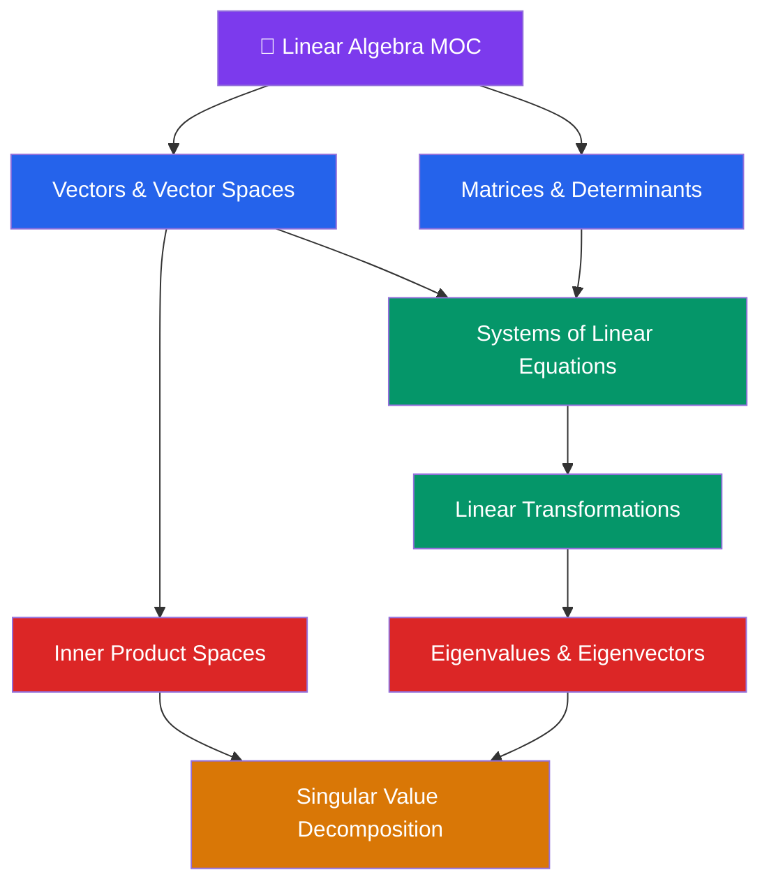

# 🔢 Linear Algebra — Map of Content

> [!abstract] About This Section
> Linear algebra from vectors to SVD: the mathematical language of machine learning, computer graphics, data science, and physics. This section covers the seven core topics that build from abstract vector spaces up to the most powerful matrix factorization in applied mathematics.

## Notes in This Section

| Note | Topics | Difficulty |
|------|--------|------------|
| [[Vectors_and_Vector_Spaces]] | Vectors in ℝⁿ, vector spaces, subspaces, span, linear independence, basis, dimension | Intermediate |
| [[Matrices_and_Determinants]] | Matrix operations, multiplication, transpose, inverse, determinant, special matrices | Intermediate |
| [[Systems_of_Linear_Equations]] | Ax=b, Gaussian elimination, RREF, column/null space, Rank-Nullity theorem | Intermediate |
| [[Linear_Transformations]] | Linear maps, kernel, image, matrix representation, change of basis, isomorphisms | Intermediate |
| [[Eigenvalues_and_Eigenvectors]] | Characteristic polynomial, eigenspaces, diagonalization, spectral theorem for symmetric matrices | Intermediate |
| [[Inner_Product_Spaces]] | Dot product, norm, Cauchy-Schwarz, orthogonality, projection, Gram-Schmidt, QR | Intermediate |
| [[Singular_Value_Decomposition]] | SVD, spectral theorem, singular values, low-rank approximation, pseudoinverse | Advanced |

## Learning Path

**Foundation:** [[Vectors_and_Vector_Spaces]] → [[Matrices_and_Determinants]] → [[Systems_of_Linear_Equations]]

**Transformations:** [[Linear_Transformations]] → [[Eigenvalues_and_Eigenvectors]]

**Geometry:** [[Inner_Product_Spaces]] → [[Singular_Value_Decomposition]]

## Key Theorems at a Glance

| Theorem | Statement |
|---------|-----------|
| **Rank-Nullity** | $\text{rank}(A) + \text{nullity}(A) = n$ |
| **Spectral Theorem** | Real symmetric $A = QDQ^T$ with orthonormal eigenvectors |
| **Eckart-Young** | Best rank-$k$ approx via top-$k$ singular triplets |
| **Invertible Matrix** | 12+ equivalent conditions for $A$ being invertible |
| **Cauchy-Schwarz** | $\|\langle \mathbf{u},\mathbf{v}\rangle\| \leq \|\mathbf{u}\|\|\mathbf{v}\|$ |

## Applications Map

| Application Domain | Key Tools |
|-------------------|-----------|
| Machine Learning | Eigenvalues (PCA), SVD (matrix factorization), least squares |
| Computer Graphics | Transformation matrices, rotation/scaling/projection |
| Data Science | Covariance matrices, regression, dimensionality reduction |
| Signal Processing | Orthogonal projections, Fourier (inner products) |
| Quantum Mechanics | Hermitian operators, eigenvalues as observables |

#linear-algebra #MOC #mathematics
