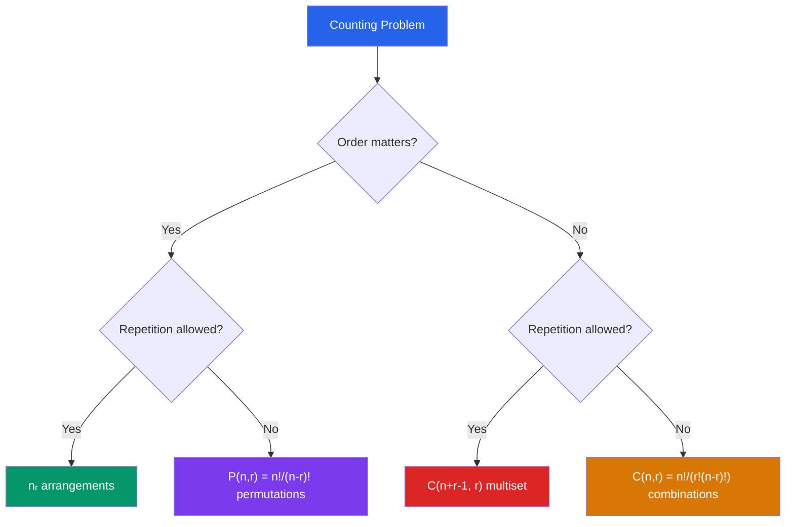

# 🔗 Combinatorics

> [!abstract] TL;DR
> Combinatorics is the art of counting structured arrangements — how many ways to choose, arrange, or distribute objects. The binomial coefficient, inclusion-exclusion principle, and pigeonhole principle are the core tools that power probability, algorithm analysis, and cryptography.

## Intuition — analogy FIRST
Imagine you have 10 books and want to fill a 3-shelf bookcase. How many arrangements are there? The answer depends on whether the shelves are distinguishable (order matters) and whether you can repeat (repetition allowed). Combinatorics systematizes exactly these distinctions.

The **pigeonhole principle** is almost embarrassingly obvious — if you have more letters than mailboxes, some mailbox gets more than one letter — yet it implies deep results, like the fact that in any group of 13 people, at least two share a birth month.

---

## How It Works

## Key Concepts / Details

### Basic Counting Principles
- **Addition principle:** If task A can be done in $m$ ways and task B in $n$ ways, and they are mutually exclusive, then A or B can be done in $m + n$ ways.
- **Multiplication principle:** If task A can be done in $m$ ways and (independently) task B in $n$ ways, then both can be done in $m \cdot n$ ways.

### Permutations
**Permutation:** an ordered arrangement of objects.

Number of ways to arrange $r$ objects chosen from $n$ distinct objects:
$$P(n, r) = \frac{n!}{(n-r)!} = n(n-1)(n-2)\cdots(n-r+1)$$

All $n$ objects: $P(n, n) = n!$

**Permutations with repetition:** arrangements of $n$ objects with $n_1$ of type 1, $n_2$ of type 2, ..., $n_k$ of type $k$ (where $n_1 + \cdots + n_k = n$):
$$\frac{n!}{n_1! n_2! \cdots n_k!}$$

### Combinations
**Combination:** an unordered selection (subset) of $r$ objects from $n$.

$$\binom{n}{r} = C(n, r) = \frac{n!}{r!(n-r)!}$$

Key identities:
- $\binom{n}{r} = \binom{n}{n-r}$ (symmetry)
- $\binom{n}{0} = \binom{n}{n} = 1$
- $\binom{n}{r} = \binom{n-1}{r-1} + \binom{n-1}{r}$ (Pascal's identity)

### Binomial Theorem
$$(x + y)^n = \sum_{k=0}^n \binom{n}{k} x^k y^{n-k}$$

*Corollaries:* Setting $x=y=1$ gives $\sum_k \binom{n}{k} = 2^n$ (total subsets). Setting $x=1, y=-1$ gives $\sum_k (-1)^k\binom{n}{k} = 0$.

### Stars and Bars (Combinations with Repetition)
Number of ways to choose $r$ items from $n$ types with repetition (multiset of size $r$ from $n$ types):
$$\binom{n+r-1}{r}$$
Equivalently: non-negative integer solutions to $x_1 + x_2 + \cdots + x_n = r$.

### Inclusion-Exclusion Principle (PIE)
$$|A \cup B| = |A| + |B| - |A \cap B|$$

General form for $n$ sets:
$$\left|\bigcup_{i=1}^n A_i\right| = \sum|A_i| - \sum|A_i \cap A_j| + \sum|A_i \cap A_j \cap A_k| - \cdots + (-1)^{n+1}|A_1 \cap \cdots \cap A_n|$$

### Pigeonhole Principle
If $n+1$ or more objects are placed in $n$ boxes, at least one box contains $\geq 2$ objects.

**Generalized:** If $N$ objects are in $k$ boxes, some box contains at least $\lceil N/k \rceil$ objects.

*Applications:* In any group of 13 people, 2 share a birth month. In any set of $n+1$ integers, two are congruent modulo $n$. Any sequence of $n^2+1$ distinct numbers has a monotone subsequence of length $n+1$.

### Derangements
A **derangement** is a permutation where no element appears in its original position.
$$D_n = n! \sum_{k=0}^n \frac{(-1)^k}{k!} \approx \frac{n!}{e}$$

For large $n$, the probability that a random permutation is a derangement approaches $1/e \approx 0.368$.

### Catalan Numbers
$$C_n = \frac{1}{n+1}\binom{2n}{n}$$

Count: valid parenthesizations of $n+1$ factors, binary trees with $n$ internal nodes, monotone lattice paths, non-crossing partitions.

---

## Real-World Notes
- **Lottery odds:** A 6-from-49 lottery has $\binom{49}{6} = 13{,}983{,}816$ possible tickets — less than 1-in-14-million chance of winning.
- **Password security:** An 8-character alphanumeric password ($62^8 \approx 2 \times 10^{14}$ possibilities) is far more secure than a 12-letter dictionary word ($\approx 10^4$ common words) — multiplication principle.
- **Birthday paradox:** With 23 people, the probability that two share a birthday exceeds 50% (pigeonhole applies exactly at 366, but probability reaches 50% far sooner due to counting).
- **Algorithm analysis:** Counting comparisons in sorting, paths in recursion trees, and subsets for exponential-time algorithms all use combinatorial reasoning.

---

## Common Pitfalls
- **Order vs. no order:** "How many ways to choose 3 from 10" is $C(10,3)=120$, not $P(10,3)=720$. Always ask whether arrangement matters.
- **Overcounting:** Adding cases naively can double-count overlaps — PIE exists precisely to correct this. "How many integers 1–100 divisible by 2 or 3" requires subtracting those divisible by both.
- **Stars and bars requires distinguishable types:** The formula $\binom{n+r-1}{r}$ counts selections when the $n$ types are distinguishable but the chosen items of each type are not.
- **Derangements vs. permutations:** The hat-check problem (every person gets the wrong hat) gives $D_n$, not $n!$ — don't confuse all permutations with those having no fixed points.

---

## Related Concepts
- [[_MOC_Discrete_Mathematics|↑ Discrete Mathematics MOC]]
- [[Set_Theory_and_Relations]] — combinations count subsets of a set
- [[Number_Theory_Elementary]] — binomial coefficients have number-theoretic properties (Lucas' theorem)
- [[Generating_Functions_and_Recurrences]] — generating functions encode combinatorial sequences

---

## Review Questions
1. How many 5-card poker hands contain exactly 2 aces? Use the multiplication and combination principles.
2. A class has 30 students. Prove using the pigeonhole principle that at least two students scored the same grade on a 100-point test (where grades are integers 0–100) — wait, that's 101 values, so this fails. How would you modify the statement to make it true?
3. Find the number of non-negative integer solutions to $x_1 + x_2 + x_3 = 10$ using stars and bars, then verify using generating functions by expanding $(1 + x + x^2 + \cdots)^3$.

---

## Sources
- Rosen, *Discrete Mathematics and Its Applications*, Ch. 6
- Stanley, *Enumerative Combinatorics*, Vol. 1
- Graham, Knuth & Patashnik, *Concrete Mathematics*, Ch. 1–5

#discrete-mathematics #combinatorics #counting #permutations #combinations #inclusion-exclusion #pigeonhole
