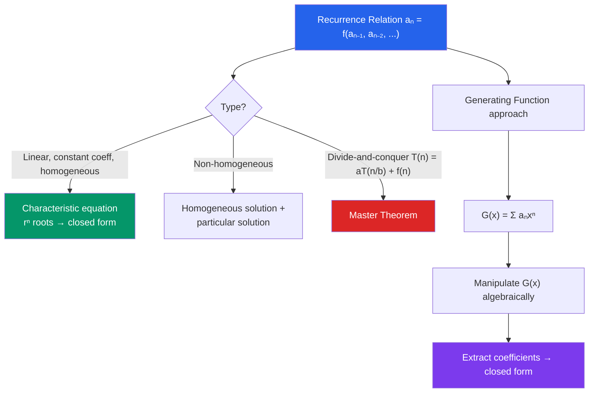

# 🔗 Generating Functions and Recurrences

> [!abstract] TL;DR
> A recurrence relation defines a sequence in terms of earlier terms; solving it means finding a closed form. Generating functions are the power tool: encode a sequence as the coefficients of a power series, manipulate the series algebraically, and extract the closed form. The master theorem handles the specific recurrences that arise in divide-and-conquer algorithms.

## Intuition — analogy FIRST
A recurrence is like compound interest: "next year's balance = this year's balance × growth factor + new deposit." You can compute it step by step, but a closed formula tells you the balance in year $n$ directly without simulating $n$ steps.

A generating function converts a sequence $(a_0, a_1, a_2, \ldots)$ into a single function $G(x) = a_0 + a_1 x + a_2 x^2 + \cdots$. The sequence is hidden inside the coefficients; algebraic manipulations of the function correspond to operations on the sequence. It is like converting a recipe (sequence) into a code (function) that can be manipulated more easily.

---

## How It Works

## Key Concepts / Details

### Recurrence Relations
A **recurrence relation** defines $a_n$ in terms of $a_{n-1}, a_{n-2}, \ldots$

**Examples:**
- Fibonacci: $F_n = F_{n-1} + F_{n-2}$, $F_0 = 0$, $F_1 = 1$
- Factorial: $n! = n \cdot (n-1)!$, $0! = 1$
- Tower of Hanoi: $T_n = 2T_{n-1} + 1$, $T_1 = 1$

### Linear Homogeneous Recurrences with Constant Coefficients
Form: $a_n = c_1 a_{n-1} + c_2 a_{n-2} + \cdots + c_k a_{n-k}$

**Step 1:** Write the **characteristic equation**: $r^k = c_1 r^{k-1} + c_2 r^{k-2} + \cdots + c_k$

**Step 2:** Find the roots $r_1, r_2, \ldots$

**Step 3:** General solution:
- Distinct roots $r_1 \neq r_2$: $a_n = A_1 r_1^n + A_2 r_2^n$
- Repeated root $r$ with multiplicity $m$: $(A_0 + A_1 n + \cdots + A_{m-1} n^{m-1}) r^n$

**Step 4:** Solve for constants using initial conditions.

### Fibonacci Closed Form (Binet's Formula)
Characteristic equation of $F_n = F_{n-1} + F_{n-2}$: $r^2 = r + 1 \Rightarrow r^2 - r - 1 = 0$.

Roots: $\varphi = \dfrac{1 + \sqrt{5}}{2} \approx 1.618$ (golden ratio) and $\psi = \dfrac{1-\sqrt{5}}{2} \approx -0.618$.

$$\boxed{F_n = \frac{\varphi^n - \psi^n}{\sqrt{5}}}$$

Since $|\psi| < 1$, $F_n$ is the nearest integer to $\varphi^n / \sqrt{5}$.

### Non-Homogeneous Recurrences
Form: $a_n = c_1 a_{n-1} + \cdots + c_k a_{n-k} + f(n)$

Solution: $a_n^{(h)} + a_n^{(p)}$ where $a_n^{(h)}$ is the homogeneous solution and $a_n^{(p)}$ is a **particular solution**.

*Undetermined coefficients:* For $f(n) = d^n$, try $a_n^{(p)} = C \cdot d^n$; for $f(n) = $ polynomial, try polynomial of same degree.

*Tower of Hanoi:* $T_n = 2T_{n-1} + 1$ — homogeneous solution $A \cdot 2^n$; particular solution: try $T_n^{(p)} = C$, gives $C = 2C + 1$, so $C = -1$. General: $T_n = A \cdot 2^n - 1$. Using $T_1 = 1$: $A = 1$. So $T_n = 2^n - 1$.

### Master Theorem for Divide-and-Conquer
For $T(n) = aT(n/b) + f(n)$, $a \geq 1$, $b > 1$:

Let $c = \log_b a$ (critical exponent).

| Case | Condition | Result |
|------|-----------|--------|
| Case 1 | $f(n) = O(n^{c-\varepsilon})$ | $T(n) = \Theta(n^c)$ |
| Case 2 | $f(n) = \Theta(n^c \log^k n)$ | $T(n) = \Theta(n^c \log^{k+1} n)$ |
| Case 3 | $f(n) = \Omega(n^{c+\varepsilon})$ and regularity | $T(n) = \Theta(f(n))$ |

*Examples:*
- Merge sort: $T(n) = 2T(n/2) + \Theta(n)$ → Case 2 with $k=0$: $T(n) = \Theta(n \log n)$
- Binary search: $T(n) = T(n/2) + O(1)$ → Case 2 with $k=0$: $T(n) = O(\log n)$

### Ordinary Generating Functions (OGFs)
The OGF of sequence $(a_0, a_1, a_2, \ldots)$ is:
$$G(x) = \sum_{n=0}^\infty a_n x^n$$

Key OGFs: $\dfrac{1}{1-x} = \sum_{n \geq 0} x^n$; $\dfrac{1}{(1-x)^k} = \sum_{n \geq 0} \binom{n+k-1}{k-1} x^n$

**Using OGF to solve Fibonacci:**
$G(x) = F_0 + F_1 x + \sum_{n \geq 2} (F_{n-1} + F_{n-2}) x^n$

After algebra: $G(x) = \dfrac{x}{1 - x - x^2}$. Partial fractions give Binet's formula.

### Exponential Generating Functions (EGFs)
$$\hat{G}(x) = \sum_{n=0}^\infty a_n \frac{x^n}{n!}$$

EGFs are natural for **labeled** counting (permutations). Key: $e^x = \sum x^n/n!$ is the EGF for the all-ones sequence.

### Catalan Numbers via GF
$C_n = \dfrac{1}{n+1}\binom{2n}{n}$; the OGF satisfies $C(x) = \dfrac{1 - \sqrt{1 - 4x}}{2x}$.

---

## Real-World Notes
- **Algorithm complexity analysis:** Merge sort, quicksort, Strassen's matrix multiplication — their time complexities arise from divide-and-conquer recurrences solved by the master theorem.
- **Financial mathematics:** Compound interest $A_n = (1+r)A_{n-1} + d$ (with regular deposits $d$) is a linear recurrence with closed-form solution.
- **Population genetics:** Hardy-Weinberg equilibrium and allele frequency dynamics are modeled by recurrences.
- **Computer science (dynamic programming):** Memoized DP computes recurrences efficiently; understanding the structure (overlapping subproblems, optimal substructure) requires recognizing the recurrence type.

---

## Common Pitfalls
- **Initial conditions uniquely determine the solution:** The characteristic equation gives a family of solutions; initial conditions pin down the specific one. Forgetting to apply initial conditions leaves undetermined constants.
- **Master theorem has gaps:** It does not apply to all functions $f(n)$. If $f(n) = n / \log n$, the theorem fails to classify — use the Akra-Bazzi method instead.
- **OGFs treat sequences formally:** Convergence questions are irrelevant in the formal power series approach (we never evaluate at specific $x$). However, for analytic purposes, the radius of convergence matters.
- **EGFs vs OGFs:** Confusing the two changes the meaning. OGFs count unlabeled/unordered structures; EGFs count labeled/ordered ones. Using the wrong type gives wrong combinatorial identities.

---

## Related Concepts
- [[_MOC_Discrete_Mathematics|↑ Discrete Mathematics MOC]]
- [[Combinatorics]] — generating functions encode combinatorial sequences; Catalan numbers arise in counting
- [[Number_Theory_Elementary]] — Dirichlet series generalize OGFs for number-theoretic functions
- [[Logic_and_Proof_Techniques]] — recurrence proofs often use mathematical induction

---

## Review Questions
1. Solve the recurrence $a_n = 5a_{n-1} - 6a_{n-2}$ with $a_0 = 0$, $a_1 = 1$. Express the solution in closed form.
2. Apply the Master Theorem to determine the asymptotic complexity of an algorithm satisfying $T(n) = 3T(n/4) + n\log n$.
3. Find the OGF for the sequence $a_n = n + 1$. Use it to verify the formula $\sum_{n=0}^N (n+1) = (N+1)(N+2)/2$.

---

## Sources
- Rosen, *Discrete Mathematics and Its Applications*, Ch. 8
- Wilf, *generatingfunctionology*, Ch. 1–3 (free online)
- Graham, Knuth & Patashnik, *Concrete Mathematics*, Ch. 6–7

#discrete-mathematics #recurrences #generating-functions #master-theorem #fibonacci #catalan
