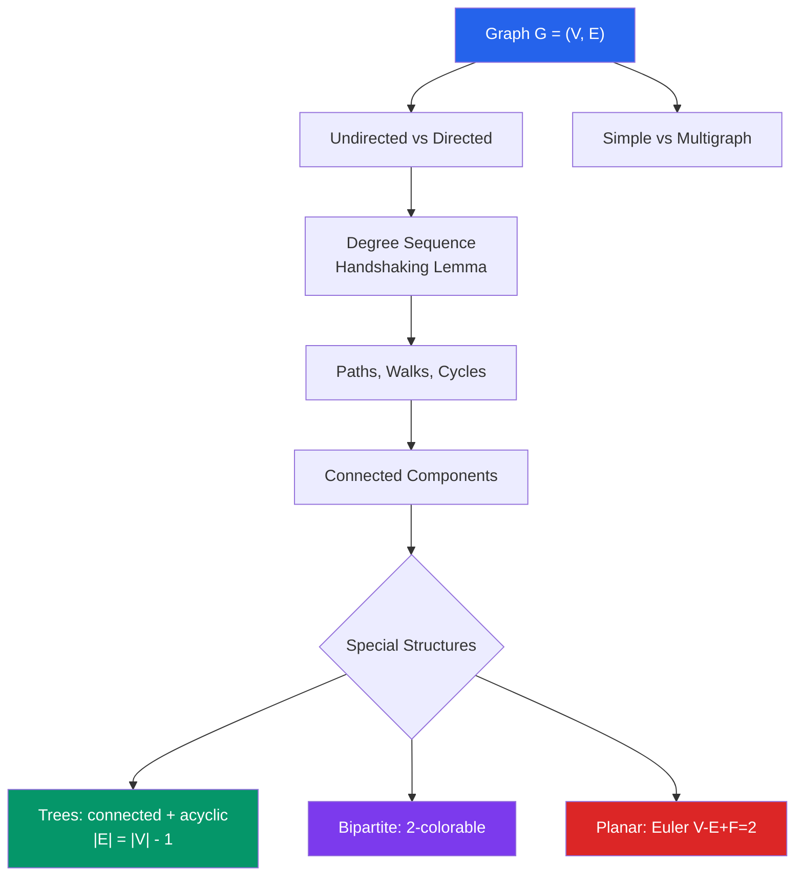

# 🔗 Graph Theory

> [!abstract] TL;DR
> A graph is a set of vertices connected by edges — the minimal abstraction for modeling networks, relationships, and maps. Graph theory studies reachability, cycles, colorability, and planarity, providing the mathematical foundation for social networks, GPS routing, and compiler optimization.

## Intuition — analogy FIRST
Think of a city map: intersections are vertices, roads are edges. "Can I drive from A to B?" is a connectivity question. "Can I travel every road exactly once?" is the Eulerian path question — the one that started graph theory when Euler asked whether the seven bridges of Königsberg could each be crossed exactly once.

A social network is a graph: people are vertices, friendships are edges. The "six degrees of separation" claim is a statement about graph diameter. Finding who influences whom most is about centrality measures — all graph theory.

---

## How It Works

## Key Concepts / Details

### Basic Definitions
A **graph** $G = (V, E)$ consists of a **vertex set** $V$ and an **edge set** $E \subseteq \binom{V}{2}$ (for undirected) or $E \subseteq V \times V$ (for directed/digraph).

- **Simple graph:** no multi-edges, no self-loops
- **Degree** $\deg(v)$: number of edges incident to $v$

**Handshaking Lemma:** $\sum_{v \in V} \deg(v) = 2|E|$

*Corollary:* The number of odd-degree vertices is always even.

### Paths and Connectivity
- **Walk:** sequence $v_0, e_1, v_1, \ldots, e_k, v_k$; edges may repeat
- **Path:** walk with no repeated vertices (and hence no repeated edges)
- **Cycle:** path with $v_0 = v_k$

A graph is **connected** if there is a path between every pair of vertices. Connected components are maximal connected subgraphs.

### Trees
A **tree** is a connected acyclic graph. Equivalent conditions (any one implies all others for connected graphs):
- $|E| = |V| - 1$
- Any two vertices are connected by exactly one path
- Removing any edge disconnects the graph
- Adding any edge creates exactly one cycle

A **spanning tree** of $G$ is a tree subgraph containing all vertices.

### Special Graphs
| Graph | Notation | Description |
|-------|----------|-------------|
| Complete | $K_n$ | Every pair of vertices connected; $|E| = \binom{n}{2}$ |
| Bipartite | $K_{m,n}$ | Vertices in two parts; edges only across parts |
| Cycle | $C_n$ | Single cycle on $n$ vertices |
| Path | $P_n$ | Path on $n$ vertices |
| Wheel | $W_n$ | $C_{n-1}$ plus a hub vertex connected to all |

### Graph Representations
- **Adjacency matrix:** $A_{ij} = 1$ if $\{i,j\} \in E$; symmetric for undirected graphs. $O(V^2)$ space.
- **Adjacency list:** for each vertex, store a list of neighbors. $O(V + E)$ space — preferred for sparse graphs.
- **Incidence matrix:** $M_{ij} = 1$ if vertex $i$ is incident to edge $j$.

### Eulerian Paths and Circuits
An **Eulerian path** traverses every edge exactly once. An **Eulerian circuit** is an Eulerian path starting and ending at the same vertex.

**Königsberg bridge problem (Euler, 1736):** The seven bridges of Königsberg cannot all be crossed exactly once because all four landmasses have odd degree.

**Conditions:**
- **Eulerian circuit:** connected graph with all vertices of even degree
- **Eulerian path (not circuit):** connected graph with exactly two odd-degree vertices (the path starts and ends at those vertices)

### Hamiltonian Paths and Circuits
A **Hamiltonian path** visits every vertex exactly once. Unlike Eulerian paths, determining whether one exists is **NP-complete** — no efficient general algorithm is known.

Dirac's sufficient condition: if every vertex has degree $\geq n/2$, a Hamiltonian circuit exists.

### Graph Coloring
A **proper $k$-coloring** assigns $k$ colors to vertices so no two adjacent vertices share a color. The **chromatic number** $\chi(G)$ is the minimum $k$ needed.

- **2-colorable $\Leftrightarrow$ bipartite**
- **Four color theorem:** Every planar graph is 4-colorable ($\chi(G) \leq 4$ for planar $G$). Proved in 1976 with computer assistance.
- **Brook's theorem:** $\chi(G) \leq \Delta(G)$ (max degree) unless $G$ is a complete graph or odd cycle.

**Applications:** Register allocation in compilers (assign registers = colors to variables = vertices, edges = simultaneous liveness), exam scheduling (courses = vertices, shared students = edges).

### Planarity
A graph is **planar** if it can be drawn in the plane without edge crossings.

**Euler's formula:** For any connected planar graph, $V - E + F = 2$ (where $F$ = number of faces, including the outer infinite face).

**Kuratowski's theorem:** A graph is planar if and only if it contains no subdivision of $K_5$ or $K_{3,3}$.

For simple planar graphs: $E \leq 3V - 6$; bipartite planar: $E \leq 2V - 4$.

---

## Real-World Notes
- **Navigation (Google Maps, GPS):** Road networks are weighted directed graphs. Dijkstra's algorithm finds shortest paths; A* uses heuristics for faster practical routing.
- **Social networks:** Facebook, Twitter/X, LinkedIn model relationships as graphs. Community detection (finding clusters) uses graph partitioning algorithms.
- **Internet routing:** BGP (Border Gateway Protocol) uses shortest-path algorithms on the graph of autonomous systems.
- **Compiler register allocation:** Live variable analysis builds an interference graph; coloring this graph with $k$ colors assigns registers, minimizing spills.

---

## Common Pitfalls
- An **Eulerian path/circuit** is about edges; a **Hamiltonian path/circuit** is about vertices. Eulerian has elegant characterizations; Hamiltonian is NP-complete. Don't confuse the two.
- The **degree** of a vertex in an undirected graph counts incident edges, not neighbors for multigraphs. For simple graphs, degree = number of neighbors.
- **Trees vs. forests:** A forest is an acyclic graph (not necessarily connected); a tree is a connected forest. A spanning tree of $G$ exists iff $G$ is connected.
- Euler's formula $V - E + F = 2$ applies to **connected** planar graphs. For $k$ connected components: $V - E + F = 1 + k$.

---

## Related Concepts
- [[_MOC_Discrete_Mathematics|↑ Discrete Mathematics MOC]]
- [[Set_Theory_and_Relations]] — a graph is a relation (set of pairs); graph theory is applied relation theory
- [[Combinatorics]] — counting spanning trees (Cayley's formula: $n^{n-2}$ labeled trees on $n$ vertices)
- [[Number_Theory_Elementary]] — graph theory used in number-theoretic proofs (e.g., Ramsey theory)

---

## Review Questions
1. Prove the handshaking lemma: for any graph $G = (V, E)$, $\sum_{v \in V} \deg(v) = 2|E|$. Deduce that the number of odd-degree vertices is even.
2. A graph has 10 vertices and 12 edges. Could it be: (a) a tree? (b) connected? (c) planar? Justify each.
3. Determine whether the Petersen graph (10 vertices, each of degree 3, $K_5$ with a 5-cycle inside) has an Eulerian circuit, an Eulerian path, or neither.

---

## Sources
- West, *Introduction to Graph Theory*, Ch. 1–5
- Diestel, *Graph Theory*, Ch. 1–5 (free online)
- Rosen, *Discrete Mathematics and Its Applications*, Ch. 10–11

#discrete-mathematics #graph-theory #graphs #euler #hamilton #planarity #coloring
