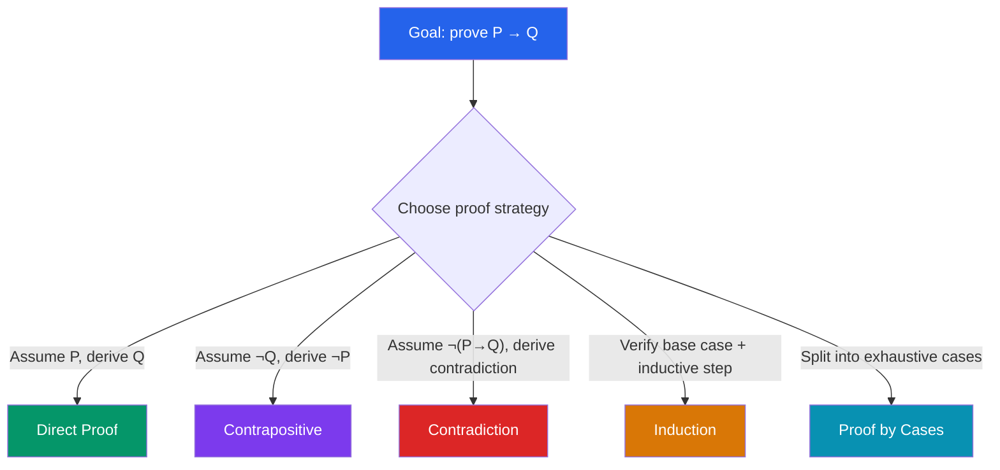

# 🔗 Logic and Proof Techniques

> [!abstract] TL;DR
> Mathematical logic provides the precise language for expressing and verifying mathematical truths. Proof techniques — direct proof, contradiction, contrapositive, and induction — are the tools for establishing those truths with absolute certainty, forming the bedrock of all mathematics.

## Intuition — analogy FIRST
Logic is the "grammar" of mathematics: just as English grammar rules prevent ambiguous sentences, logical rules prevent ambiguous arguments. A proof is a legal document — every statement must follow necessarily from prior statements or accepted axioms, with no gaps allowed.

Think of proof by contradiction like a detective: assume the suspect is innocent, then show this assumption leads to an impossible situation (they couldn't have been at the scene), so the assumption must be false — the suspect is guilty. The contradiction is the "smoking gun."

---

## How It Works

## Key Concepts / Details

### Propositions and Connectives
A **proposition** is a statement that is either true or false. Connectives combine propositions:

| Symbol | Name | Meaning |
|--------|------|---------|
| $\neg P$ | Negation | "not P" |
| $P \wedge Q$ | Conjunction | "P and Q" |
| $P \vee Q$ | Disjunction | "P or Q" |
| $P \rightarrow Q$ | Implication | "if P then Q" |
| $P \leftrightarrow Q$ | Biconditional | "P if and only if Q" |

A **tautology** is always true; a **contradiction** is always false.

### Key Logical Equivalences
- **De Morgan's laws:** $\neg(P \wedge Q) \equiv \neg P \vee \neg Q$; $\neg(P \vee Q) \equiv \neg P \wedge \neg Q$
- **Contrapositive:** $P \rightarrow Q \equiv \neg Q \rightarrow \neg P$
- **Double negation:** $\neg\neg P \equiv P$
- **Implication as disjunction:** $P \rightarrow Q \equiv \neg P \vee Q$

### Predicates and Quantifiers
A **predicate** $P(x)$ becomes a proposition when $x$ is assigned a value.
- **Universal:** $\forall x\, P(x)$ — "P(x) holds for all x"
- **Existential:** $\exists x\, P(x)$ — "there exists x such that P(x)"

**Negation of quantifiers:**
$$\neg(\forall x\, P(x)) \equiv \exists x\, \neg P(x)$$
$$\neg(\exists x\, P(x)) \equiv \forall x\, \neg P(x)$$

### Proof Techniques

**Direct Proof:** Assume $P$, use definitions and theorems to derive $Q$.

**Proof by Contradiction:** Assume $\neg P$ (or $\neg(P \rightarrow Q)$). Derive a statement that contradicts a known truth. Conclude $P$ is true.
*Classic example:* $\sqrt{2}$ is irrational. Assume $\sqrt{2} = p/q$ in lowest terms. Then $2 = p^2/q^2$, so $p^2 = 2q^2$, so $p$ is even. Write $p = 2k$. Then $4k^2 = 2q^2$, so $q^2 = 2k^2$, so $q$ is even. But then $p/q$ is not in lowest terms — contradiction.

**Proof by Contrapositive:** Prove $\neg Q \rightarrow \neg P$ instead of $P \rightarrow Q$ (logically equivalent).

**Mathematical Induction:**
1. **Base case:** Verify $P(n_0)$ for initial value $n_0$ (usually $n_0 = 0$ or $1$).
2. **Inductive step:** Assume $P(k)$ (inductive hypothesis); prove $P(k+1)$.

*Classic example:* $\sum_{i=1}^n i = \dfrac{n(n+1)}{2}$.
- Base case: $n=1$: $1 = 1 \cdot 2/2 = 1$. ✓
- Inductive step: assume true for $k$; then $\sum_{i=1}^{k+1} i = \frac{k(k+1)}{2} + (k+1) = \frac{(k+1)(k+2)}{2}$. ✓

**Strong Induction:** Assume $P(n_0), P(n_0+1), \ldots, P(k)$ all hold, then prove $P(k+1)$.

**Proof by Cases:** When $P$ splits naturally into a finite exhaustive set of subcases, prove each subcase separately.

*Classic example:* There are infinitely many primes (contradiction). Assume finitely many: $p_1, \ldots, p_k$. Let $N = p_1 p_2 \cdots p_k + 1$. Then $N$ is divisible by none of the $p_i$ (remainder 1). But $N > 1$ must have a prime factor — contradiction.

---

## Real-World Notes
- **Formal software verification:** Tools like Coq and Isabelle mechanize these proof techniques to certify that programs are bug-free (used in critical systems like compilers and cryptographic protocols).
- **Circuit design:** Boolean algebra uses the same logical connectives; De Morgan's laws let engineers convert AND gates to OR gates and vice versa, minimizing circuit complexity.
- **Cryptography:** Security proofs rely on proof by contradiction: "if an adversary breaks this scheme, then they can solve a problem assumed hard (like factoring)."
- **Type systems in programming:** The Curry-Howard correspondence links type theory to logic: types are propositions, programs are proofs.

---

## Common Pitfalls
- **Converse ≠ contrapositive:** The contrapositive of $P \rightarrow Q$ is $\neg Q \rightarrow \neg P$ (equivalent); the converse $Q \rightarrow P$ is a different statement and may be false.
- **Induction requires both parts:** Forgetting the base case or assuming the inductive hypothesis without justification are common errors. A missing base case can "prove" false statements.
- **Existential proofs need a witness:** To prove $\exists x\, P(x)$, you must exhibit a specific $x$ or a construction. Saying "there must exist one" without showing one is not valid.
- **Vacuous truth:** $P \rightarrow Q$ is true whenever $P$ is false, regardless of $Q$. This surprises many beginners: "All unicorns are blue" is vacuously true.

---

## Related Concepts
- [[_MOC_Discrete_Mathematics|↑ Discrete Mathematics MOC]]
- [[Set_Theory_and_Relations]] — set theory uses logical notation (∀, ∃, ∈)
- [[Number_Theory_Elementary]] — many number theory results proven by contradiction or induction
- [[Combinatorics]] — double counting arguments are a combinatorial proof technique

---

## Review Questions
1. Construct truth tables for $P \rightarrow Q$ and $\neg Q \rightarrow \neg P$. Verify they are logically equivalent. Are $P \rightarrow Q$ and $Q \rightarrow P$ equivalent?
2. Prove by strong induction that every integer $n \geq 2$ can be written as a product of primes.
3. Prove or disprove: "If $n^2$ is odd, then $n$ is odd." Which proof technique is most natural here?

---

## Sources
- Rosen, *Discrete Mathematics and Its Applications*, Ch. 1–5
- Velleman, *How to Prove It*, Ch. 1–6
- Polya, *How to Solve It*, Part II

#discrete-mathematics #logic #proofs #induction #contradiction
