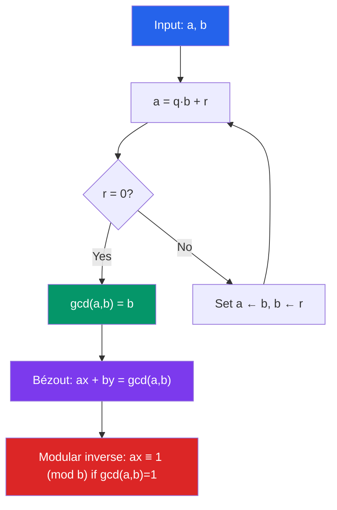

# 🔗 Elementary Number Theory

> [!abstract] TL;DR
> Number theory studies the integers — divisibility, primes, and modular arithmetic. These elementary ideas underpin all of modern cryptography: RSA encryption relies directly on Euler's theorem, the Chinese Remainder Theorem, and the difficulty of factoring large primes.

## Intuition — analogy FIRST
Modular arithmetic is "clock arithmetic." On a 12-hour clock, $10 + 5 = 3$ because we wrap around after 12. The integers modulo $n$ are just the numbers $\{0, 1, \ldots, n-1\}$ where you always take the remainder after dividing by $n$.

The Euclidean algorithm for GCD is like finding the largest tile that perfectly tiles a room: if the room is $252 \times 105$, start with the larger side modulo the smaller. The algorithm's elegance — it runs in $O(\log \min(a,b))$ steps — has made it one of the oldest and most used algorithms in history.

---

## How It Works

## Key Concepts / Details

### Divisibility
$a \mid b$ (read "$a$ divides $b$") means $\exists k \in \mathbb{Z}$ such that $b = ak$.

**Properties:**
- $a \mid b$ and $a \mid c$ $\Rightarrow$ $a \mid (mb + nc)$ for any integers $m, n$
- $a \mid b$ and $b \mid c$ $\Rightarrow$ $a \mid c$ (transitivity)

### Division Algorithm
For any integers $a$ and $b > 0$, there exist unique $q, r$ with $0 \leq r < b$ such that:
$$a = qb + r$$
$q$ is the quotient, $r = a \bmod b$ is the remainder.

### GCD and Euclidean Algorithm
The **greatest common divisor** $\gcd(a,b)$ is the largest positive integer dividing both.

**Euclidean algorithm:** Apply $\gcd(a,b) = \gcd(b, a \bmod b)$ repeatedly until remainder is 0.

*Example:* $\gcd(252, 105)$:
$$252 = 2 \cdot 105 + 42 \;\to\; 105 = 2 \cdot 42 + 21 \;\to\; 42 = 2 \cdot 21 + 0$$
So $\gcd(252,105) = 21$.

**Bézout's Identity:** There exist integers $x, y$ such that $ax + by = \gcd(a, b)$. Found via the **extended Euclidean algorithm** (back-substitution).

### LCM
$$\text{lcm}(a, b) = \frac{|ab|}{\gcd(a,b)}$$

### Primes and Fundamental Theorem of Arithmetic
A **prime** $p > 1$ has no divisors other than 1 and $p$.

**Fundamental Theorem of Arithmetic:** Every integer $n > 1$ has a unique factorization into primes (up to ordering):
$$n = p_1^{e_1} p_2^{e_2} \cdots p_k^{e_k}$$

**Infinitely many primes:** Proven by Euclid via contradiction (see [[Logic_and_Proof_Techniques]]).

### Modular Arithmetic
$a \equiv b \pmod{n}$ if $n \mid (a - b)$.

**Congruence classes** $[a]_n = \{a + kn : k \in \mathbb{Z}\}$; there are exactly $n$ classes forming $\mathbb{Z}_n$.

**Arithmetic in $\mathbb{Z}_n$:** addition and multiplication are well-defined modulo $n$. Multiplicative inverse of $[a]$ exists iff $\gcd(a, n) = 1$.

### Fermat's Little Theorem
If $p$ is prime and $\gcd(a, p) = 1$:
$$a^{p-1} \equiv 1 \pmod{p}$$

Equivalently, $a^p \equiv a \pmod{p}$ for all $a$.

*Application:* Fast computation of $a^k \bmod p$ via repeated squaring; primality testing.

### Euler's Theorem and Totient Function
**Euler's totient** $\phi(n)$ = number of integers in $\{1, \ldots, n\}$ coprime to $n$.

$$\phi(p^k) = p^k - p^{k-1}, \qquad \phi(mn) = \phi(m)\phi(n) \text{ if } \gcd(m,n)=1$$

**Euler's theorem:** For $\gcd(a, n) = 1$:
$$a^{\phi(n)} \equiv 1 \pmod{n}$$

Fermat's little theorem is the special case $n = p$ prime (since $\phi(p) = p-1$).

### Chinese Remainder Theorem (CRT)
If $m_1, m_2, \ldots, m_k$ are pairwise coprime, then the system:
$$x \equiv a_1 \pmod{m_1}, \quad x \equiv a_2 \pmod{m_2}, \quad \ldots$$
has a unique solution modulo $M = m_1 m_2 \cdots m_k$.

### RSA Encryption Outline
1. Choose distinct primes $p$, $q$; set $n = pq$.
2. Compute $\phi(n) = (p-1)(q-1)$.
3. Choose $e$ with $\gcd(e, \phi(n)) = 1$; find $d = e^{-1} \bmod \phi(n)$ (via extended Euclidean).
4. **Public key:** $(n, e)$. **Private key:** $d$.
5. Encrypt: $c = m^e \bmod n$. Decrypt: $m = c^d \bmod n$.
6. Correctness: Euler's theorem guarantees $m^{ed} \equiv m \pmod{n}$.

---

## Real-World Notes
- **RSA cryptography:** Every HTTPS connection uses RSA (or elliptic-curve variants). Security relies on the difficulty of factoring $n = pq$ when $p, q$ are large primes (currently $\geq 1024$ bits).
- **Hash functions:** MD5, SHA-256 use modular arithmetic extensively. Hash collisions relate to the birthday paradox from combinatorics.
- **Random number generation:** Linear congruential generators compute $x_{n+1} = (ax_n + c) \bmod m$ — modular arithmetic is the engine of pseudorandomness.
- **Calendar arithmetic:** "What day of the week is January 1, 2030?" reduces to modular arithmetic (Doomsday algorithm, Zeller's congruence).

---

## Common Pitfalls
- $\gcd(a, 0) = a$ for any $a > 0$ — the GCD of a positive number and zero is the number itself. This is the base case of the Euclidean algorithm.
- **Fermat's little theorem requires $p$ prime.** The composite analog can fail: $2^{340} \equiv 1 \pmod{341}$ but $341 = 11 \times 31$ is not prime (341 is a Fermat pseudoprime).
- **$\phi$ is multiplicative but not additive:** $\phi(mn) = \phi(m)\phi(n)$ only when $\gcd(m,n)=1$. For $m = n = p$: $\phi(p^2) = p^2 - p \neq \phi(p)^2 = (p-1)^2$.
- CRT guarantees existence and uniqueness modulo $M$, but only when the moduli are **pairwise coprime** — a condition easy to overlook.

---

## Related Concepts
- [[_MOC_Discrete_Mathematics|↑ Discrete Mathematics MOC]]
- [[Logic_and_Proof_Techniques]] — proofs about primes (infinitely many, Fermat's theorem) use contradiction and direct proof
- [[Combinatorics]] — Fermat's little theorem counts using combinatorics ($a^p$ counts $p$-letter words, the non-periodic ones are multiples of $p$)
- [[Generating_Functions_and_Recurrences]] — Dirichlet series are generating functions for number-theoretic functions

---

## Review Questions
1. Use the Euclidean algorithm to find $\gcd(1071, 462)$ and express it as a linear combination $1071x + 462y$.
2. Find all integers $x$ satisfying $7x \equiv 3 \pmod{11}$. Use Fermat's little theorem to find the modular inverse of 7 mod 11.
3. Outline how to encrypt and decrypt the message $m = 5$ using RSA with $p = 11$, $q = 13$, $e = 7$. Verify that decryption recovers $m = 5$.

---

## Sources
- Rosen, *Discrete Mathematics and Its Applications*, Ch. 4
- Hardy & Wright, *An Introduction to the Theory of Numbers*, Ch. 1–5
- Silverman, *A Friendly Introduction to Number Theory*, Ch. 1–15

#discrete-mathematics #number-theory #modular-arithmetic #gcd #primes #fermat #euler #RSA
