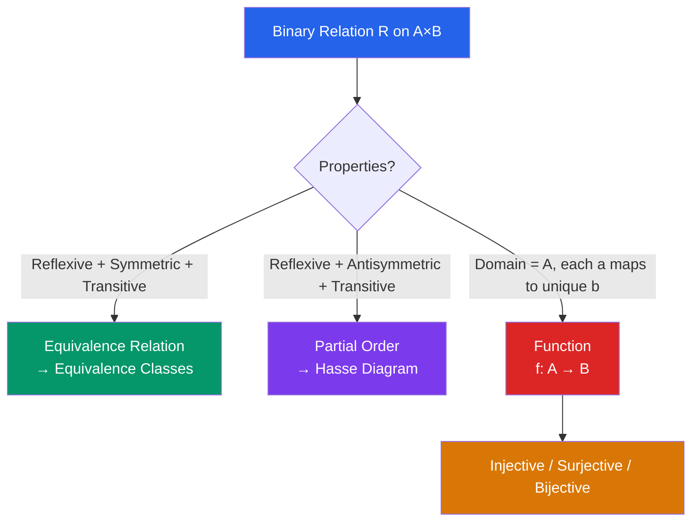

# 🔗 Set Theory and Relations

> [!abstract] TL;DR
> Set theory provides the foundational language of all mathematics: a set is a collection of objects, and relations describe how elements across sets connect. Equivalence relations partition sets into classes; partial orders provide a structured hierarchy; cardinality extends the notion of "size" to infinite sets.

## Intuition — analogy FIRST
A set is a bag of objects — no duplicates, no ordering. The operations (union, intersection, difference) are like merging bags, finding common items, and removing items. A Venn diagram makes this visual.

A relation is a rule for pairing elements from two sets — like a friendship graph on a social network. An equivalence relation is a perfect "same-category" rule: grouping people by birth year creates equivalence classes (everyone born in the same year is "equivalent" under this relation). A partial order is a "preference ranking" that may have incomparable elements — like a file system hierarchy.

---

## How It Works

## Key Concepts / Details

### Sets and Notation
- $x \in A$: $x$ is an element of $A$
- $A \subseteq B$: every element of $A$ is in $B$ (subset); $A \subsetneq B$: proper subset
- $\emptyset$: the empty set; $U$: the universal set (context-dependent)
- Set-builder notation: $\{x \in \mathbb{Z} : x > 0\} = \{1, 2, 3, \ldots\}$

### Set Operations
| Operation | Symbol | Definition |
|-----------|--------|-----------|
| Union | $A \cup B$ | $\{x : x \in A \text{ or } x \in B\}$ |
| Intersection | $A \cap B$ | $\{x : x \in A \text{ and } x \in B\}$ |
| Difference | $A \setminus B$ | $\{x : x \in A \text{ and } x \notin B\}$ |
| Complement | $A^c$ | $U \setminus A$ |
| Cartesian product | $A \times B$ | $\{(a,b) : a \in A, b \in B\}$ |

**Power set:** $\mathcal{P}(A) = \{S : S \subseteq A\}$. If $|A| = n$, then $|\mathcal{P}(A)| = 2^n$.

### Relations
A **binary relation** $R$ from $A$ to $B$ is a subset $R \subseteq A \times B$. We write $aRb$ if $(a,b) \in R$.

**Properties of a relation $R$ on $A$:**
- **Reflexive:** $\forall a \in A: aRa$
- **Symmetric:** $aRb \Rightarrow bRa$
- **Antisymmetric:** $aRb \wedge bRa \Rightarrow a = b$
- **Transitive:** $aRb \wedge bRc \Rightarrow aRc$

### Equivalence Relations
$R$ is an **equivalence relation** if it is reflexive, symmetric, and transitive.

The **equivalence class** of $a$ is $[a] = \{x \in A : xRa\}$.

Key theorem: The equivalence classes partition $A$ into disjoint nonempty subsets. The collection of all classes is the **quotient set** $A/{\sim}$.

*Example:* $a \equiv b \pmod{n}$ defines an equivalence relation on $\mathbb{Z}$; the quotient set $\mathbb{Z}/n\mathbb{Z} = \{[0],[1],\ldots,[n-1]\}$.

### Partial Orders
$R$ is a **partial order** if it is reflexive, antisymmetric, and transitive. A set with a partial order is a **poset** (partially ordered set).

**Hasse diagram:** Represents the poset with edges showing "covers" (immediate successors), omitting transitive edges and drawing larger elements higher.

*Example:* Divisibility on $\{1,2,3,4,6,12\}$: $a \preceq b$ if $a \mid b$.

A **total order** (or linear order) additionally requires every pair to be comparable: $\forall a,b: aRb \text{ or } bRa$.

### Functions
A function $f: A \to B$ is a relation where every $a \in A$ maps to exactly one $b \in B$.
- **Injective (one-to-one):** $f(a_1) = f(a_2) \Rightarrow a_1 = a_2$
- **Surjective (onto):** $\forall b \in B, \exists a \in A: f(a) = b$
- **Bijective:** injective + surjective (one-to-one correspondence)

### Cardinality
$|A|$ denotes the number of elements in $A$. For infinite sets:
- **Countably infinite:** same cardinality as $\mathbb{N}$ (can list elements $a_1, a_2, a_3, \ldots$). Examples: $\mathbb{Z}$, $\mathbb{Q}$.
- **Uncountably infinite:** strictly larger cardinality. Example: $\mathbb{R}$.

**Cantor's diagonal argument:** $\mathbb{R}$ is uncountable. Suppose all reals in $(0,1)$ were listed as $r_1, r_2, \ldots$. Construct $d$ whose $n$-th decimal digit differs from the $n$-th digit of $r_n$. Then $d$ is not on the list — contradiction.

---

## Real-World Notes
- **Database design:** Tables are relations ($R \subseteq$ domain × range); relational algebra (select, project, join) mirrors set operations.
- **Type hierarchies in programming:** Class inheritance is a partial order; the Liskov Substitution Principle says $A \preceq B$ means $A$ can be used wherever $B$ is expected.
- **Routing protocols:** Link-state routing builds a graph (relation) of network nodes; shortest paths rely on partial orders on path lengths.
- **Cryptography:** The integers modulo $n$ form a quotient set; modular arithmetic (an equivalence relation) underpins RSA and AES.

---

## Common Pitfalls
- $\emptyset$ is a subset of **every** set ($\emptyset \subseteq A$ for all $A$) but it may not be an element — $\emptyset \in A$ only if $\emptyset$ is explicitly an element.
- **$A \subseteq B$ vs $A \in B$:** subsets and elements are different. $\{1\} \subseteq \{1,2\}$ but $\{1\} \notin \{1,2\}$ (unless the set explicitly contains the set $\{1\}$).
- An equivalence relation and a partial order look similar but differ on symmetry vs. antisymmetry — these are opposite requirements.
- Cantor's result shows **not all infinities are equal**: $|\mathbb{R}| > |\mathbb{N}|$. This shocks many students who assume all infinite sets have the same size.

---

## Related Concepts
- [[_MOC_Discrete_Mathematics|↑ Discrete Mathematics MOC]]
- [[Logic_and_Proof_Techniques]] — proofs use $\forall$, $\exists$, and set membership throughout
- [[Combinatorics]] — counting uses set size and Cartesian products
- [[Graph_Theory]] — graphs are defined as sets $G = (V, E)$ with $E \subseteq V \times V$

---

## Review Questions
1. For $A = \{1,2,3\}$ and $B = \{a,b\}$, list all elements of $A \times B$. How many subsets does $A \times B$ have?
2. Is the relation $R = \{(a,b) \in \mathbb{Z}^2 : a^2 = b^2\}$ an equivalence relation? If so, describe the equivalence classes.
3. Use Cantor's diagonal argument outline to explain why the power set $\mathcal{P}(\mathbb{N})$ has strictly greater cardinality than $\mathbb{N}$.

---

## Sources
- Rosen, *Discrete Mathematics and Its Applications*, Ch. 2, 9
- Halmos, *Naive Set Theory*, Ch. 1–10
- Enderton, *Elements of Set Theory*, Ch. 1–3

#discrete-mathematics #sets #relations #equivalence-relations #partial-orders #cardinality
