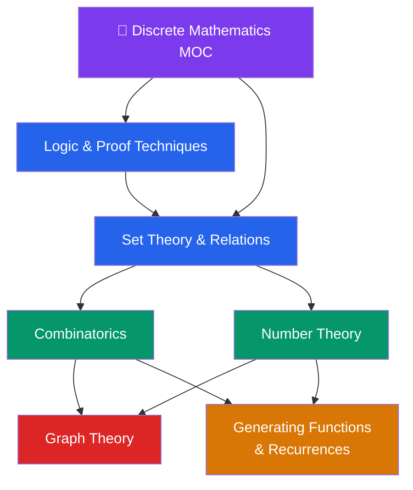

# 🔗 Discrete Mathematics — Map of Content

> [!abstract] About This Section
> Discrete mathematics from logic and proofs through combinatorics, graph theory, and number theory — the mathematical backbone of computer science. This section covers the six core areas that underlie algorithm design, cryptography, formal verification, and network analysis.

## Notes in This Section

| Note | Topics | Difficulty |
|------|--------|------------|
| [[Logic_and_Proof_Techniques]] | Propositions, connectives, quantifiers, direct proof, contradiction, contrapositive, induction | Beginner |
| [[Set_Theory_and_Relations]] | Sets, operations, relations, equivalence relations, partial orders, cardinality, Cantor's argument | Beginner |
| [[Combinatorics]] | Permutations, combinations, binomial theorem, PIE, pigeonhole, derangements, Catalan numbers | Intermediate |
| [[Graph_Theory]] | Graph definitions, trees, Eulerian/Hamiltonian, coloring, planarity, Euler's formula | Intermediate |
| [[Number_Theory_Elementary]] | Divisibility, GCD, Euclidean algorithm, modular arithmetic, Fermat/Euler theorems, RSA | Intermediate |
| [[Generating_Functions_and_Recurrences]] | Recurrences, characteristic equations, Binet's formula, Master Theorem, OGFs, EGFs | Advanced |

## Learning Path

**Foundation:** [[Logic_and_Proof_Techniques]] → [[Set_Theory_and_Relations]]

**Counting and Algebra:** [[Combinatorics]] → [[Number_Theory_Elementary]]

**Structures:** [[Graph_Theory]]

**Advanced:** [[Generating_Functions_and_Recurrences]]

## Key Theorems at a Glance

| Theorem | Statement |
|---------|-----------|
| **Fermat's Little Theorem** | $a^{p-1} \equiv 1 \pmod{p}$ for prime $p$, $\gcd(a,p)=1$ |
| **Euler's Theorem** | $a^{\phi(n)} \equiv 1 \pmod{n}$ for $\gcd(a,n)=1$ |
| **Master Theorem** | Solves $T(n) = aT(n/b) + f(n)$ in 3 cases |
| **Binet's Formula** | $F_n = (\varphi^n - \psi^n)/\sqrt{5}$ |
| **Euler's Formula** | $V - E + F = 2$ for connected planar graphs |
| **Handshaking Lemma** | $\sum \deg(v) = 2|E|$ |
| **PIE** | $|A_1 \cup \cdots \cup A_n| = \sum|A_i| - \sum|A_i\cap A_j| + \cdots$ |

## Applications Map

| Application Domain | Key Tools |
|-------------------|-----------|
| Cryptography | Modular arithmetic, Euler's theorem, CRT → RSA |
| Algorithm Analysis | Recurrences, Master Theorem, generating functions |
| Network Design | Graph theory: connectivity, spanning trees, flows |
| Formal Verification | Propositional logic, predicate logic, proof systems |
| Combinatorics/Probability | Permutations, PIE, generating functions |

#discrete-mathematics #MOC #mathematics
