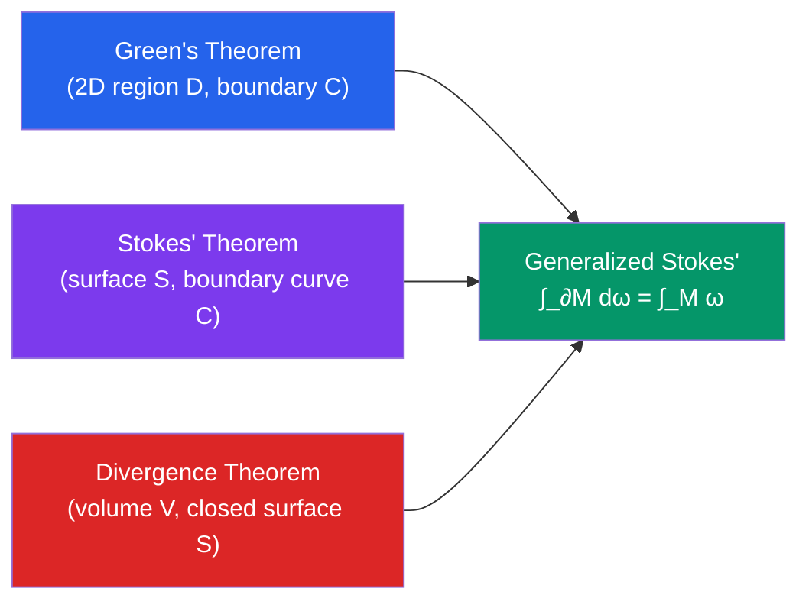

# 📊 Integral Theorems

> [!abstract] TL;DR
> Green's, Stokes', and the Divergence theorems each convert an integral over a domain's **boundary** into an integral over the **interior** (or vice versa). They are all special cases of the generalized Stokes' theorem and form the mathematical backbone of Maxwell's equations, fluid mechanics, and continuum physics.

## Intuition — analogy FIRST
Think of a city (a 2D region). Green's theorem says: instead of walking every street inside the city to measure total "rotation" (curl), you only need to walk the city's perimeter. Stokes' theorem extends this to a 3D soap bubble (a curved surface): the total spinning captured by the surface equals the circulation around the bubble's rim. The Divergence theorem is different: to find the total "leakage" (sources minus sinks) inside a region, just measure how much fluid crosses the outer surface — inside vs. outside boundary, perfectly balanced.

---

## How It Works

## Key Concepts / Details

### Green's Theorem
Relates a line integral around a **closed curve** $C$ (oriented counterclockwise) bounding a region $D$ to a double integral over $D$:

$$\oint_C P\,dx + Q\,dy = \iint_D \left(\frac{\partial Q}{\partial x} - \frac{\partial P}{\partial y}\right)dA$$

Equivalently, using the 2D curl (scalar): $\oint_C \mathbf{F}\cdot d\mathbf{r} = \iint_D (\nabla\times\mathbf{F})\cdot\mathbf{k}\,dA$.

**Area formula** (special case $P=-y/2$, $Q=x/2$):
$$A = \frac{1}{2}\oint_C (x\,dy - y\,dx)$$

**Normal form** (flux-divergence version):
$$\oint_C \mathbf{F}\cdot\mathbf{n}\,ds = \iint_D \nabla\cdot\mathbf{F}\,dA$$

### Stokes' Theorem
Generalizes Green's theorem to a surface $S$ in $\mathbb{R}^3$ with boundary curve $C$:
$$\oint_C \mathbf{F}\cdot d\mathbf{r} = \iint_S (\nabla\times\mathbf{F})\cdot d\mathbf{S}$$

where $d\mathbf{S} = \mathbf{n}\,dS$ is the outward normal surface element. Orientation: right-hand rule — curl the fingers of the right hand in the direction of $C$, and the thumb points in the direction of $\mathbf{n}$.

**Special case**: When $S$ is flat and lies in the $xy$-plane, Stokes' theorem reduces to Green's theorem.

### Surface Integrals (flux)
For a surface $\mathbf{r}(u,v)$, the surface element is:
$$d\mathbf{S} = \left(\frac{\partial\mathbf{r}}{\partial u}\times\frac{\partial\mathbf{r}}{\partial v}\right)du\,dv$$

**Flux of $\mathbf{F}$ through $S$**:
$$\iint_S \mathbf{F}\cdot d\mathbf{S} = \iint_S \mathbf{F}\cdot\mathbf{n}\,dS$$

### Divergence Theorem (Gauss's Theorem)
Relates flux through a **closed surface** $S$ bounding a volume $V$ to the divergence inside:
$$\oiint_S \mathbf{F}\cdot d\mathbf{S} = \iiint_V (\nabla\cdot\mathbf{F})\,dV$$

$\nabla\cdot\mathbf{F} > 0$ at a point means it is a source; $\nabla\cdot\mathbf{F} < 0$ means it is a sink.

**Corollary**: If $\nabla\cdot\mathbf{F} = 0$ everywhere (divergence-free / solenoidal field), then the net flux through any closed surface is zero.

### Unifying Framework
All three are instances of the **generalized Stokes' theorem** from differential geometry:
$$\int_{\partial M} \omega = \int_M d\omega$$

where $M$ is a manifold with boundary $\partial M$, $\omega$ is a differential form, and $d$ is the exterior derivative. This single statement encompasses:
- Fundamental Theorem of Calculus ($M$ = interval, $\omega$ = function)
- Green's Theorem ($M$ = 2D region)
- Stokes' Theorem ($M$ = surface)
- Divergence Theorem ($M$ = 3D volume)

### Maxwell's Equations — a taste
The four Maxwell equations in integral form are direct applications of these theorems:
- Gauss's law: $\oiint_S \mathbf{E}\cdot d\mathbf{S} = Q_{\text{enc}}/\varepsilon_0$ (Divergence Theorem)
- Faraday's law: $\oint_C \mathbf{E}\cdot d\mathbf{r} = -d\Phi_B/dt$ (Stokes' Theorem)

---

## Real-World Notes
- **Electromagnetics**: Maxwell's equations in differential form ($\nabla\cdot\mathbf{E} = \rho/\varepsilon_0$, $\nabla\times\mathbf{B} = \mu_0\mathbf{J}$, etc.) follow directly from the integral forms via these theorems.
- **Fluid mechanics**: The continuity equation for incompressible flow $\nabla\cdot\mathbf{v} = 0$ (derived via Divergence Theorem) guarantees mass conservation; vorticity $\nabla\times\mathbf{v}$ is analyzed with Stokes' theorem.
- **Heat transfer**: Fourier's law $\mathbf{q} = -k\nabla T$ combined with the Divergence Theorem gives the heat equation $\partial T/\partial t = k\nabla^2 T$.
- **Planimetry**: Green's theorem area formula $A = \frac{1}{2}\oint(x\,dy - y\,dx)$ is used in surveying to compute land area from GPS boundary traces.

---

## Common Pitfalls
- **Orientation**: Green's theorem requires the boundary curve $C$ to be traversed counterclockwise (positive orientation). Stokes' theorem requires consistent orientation between surface normal and boundary curve via the right-hand rule. Wrong orientation flips the sign.
- **Closed vs. open surfaces**: The Divergence Theorem requires a **closed** surface (a surface with no boundary). Stokes' theorem requires an **open** surface **with** a boundary curve. Confusing these is the most common error.
- **Simply connected domain for Stokes'**: The surface should not pass through singularities of $\mathbf{F}$.
- **Don't forget the Jacobian**: When parameterizing surfaces to compute $d\mathbf{S} = \mathbf{r}_u\times\mathbf{r}_v$, the cross product already includes the scaling — do not add a separate Jacobian.

---

## Related Concepts
- [[_MOC_Multivariable_Calculus|↑ Multivariable Calculus MOC]]
- [[Vector_Fields_and_Line_Integrals]] — line integrals and curl/divergence are the building blocks here
- [[Multiple_Integrals]] — double and triple integrals appear on the "interior" side of each theorem
- [[Partial_Derivatives]] — all differential operators (curl, divergence) use partial derivatives

---

## Review Questions
1. Use Green's theorem to evaluate $\oint_C (y^2\,dx + x^2\,dy)$ where $C$ is the unit circle oriented counterclockwise.
2. Use Stokes' theorem to compute $\iint_S (\nabla\times\mathbf{F})\cdot d\mathbf{S}$ where $\mathbf{F} = \langle y, z, x \rangle$ and $S$ is the upper hemisphere $x^2+y^2+z^2=1$, $z\ge 0$ with upward normal.
3. Use the Divergence Theorem to find the flux of $\mathbf{F} = \langle x^3, y^3, z^3 \rangle$ outward through the sphere of radius $R$.
4. Explain in words why the net flux through a closed surface must be zero for an incompressible fluid, using the Divergence Theorem.

---

## Sources
- Stewart, *Multivariable Calculus*, Ch. 16
- Marsden & Tromba, *Vector Calculus*, Ch. 8
- Spivak, *Calculus on Manifolds* (for the generalized Stokes' theorem)

#multivariable-calculus #greens-theorem #stokes-theorem #divergence-theorem #flux
