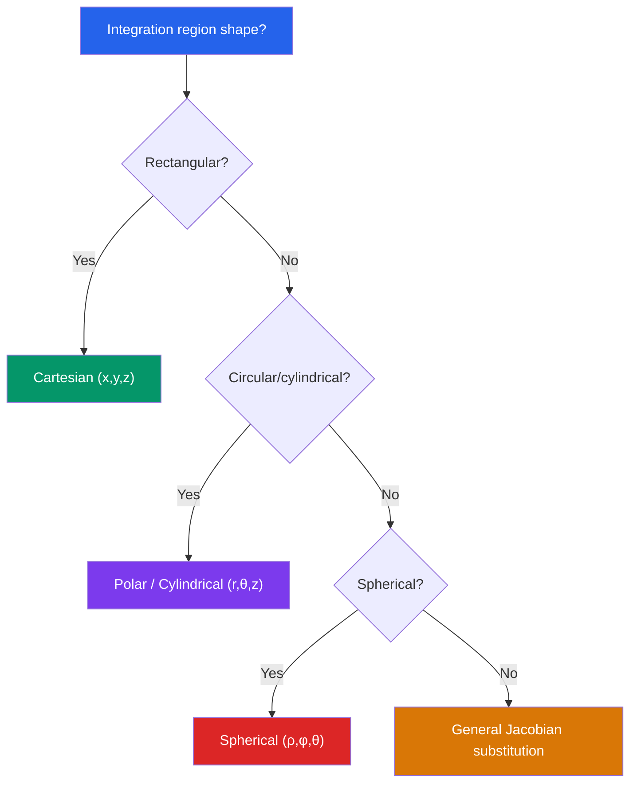

# 📊 Multiple Integrals

> [!abstract] TL;DR
> Double and triple integrals extend single-variable integration to functions of two or three variables, allowing computation of volumes, masses, and averages over 2D and 3D regions. The Jacobian enables coordinate changes (polar, cylindrical, spherical) that often simplify the geometry of the integration region dramatically.

## Intuition — analogy FIRST
A single integral sums infinitely thin strips under a curve to get area. A double integral sums infinitely thin columns over a 2D region to get volume — imagine covering a landscape with a tarp and finding the total "air space" underneath based on terrain height $f(x,y)$. When the region is circular (like a lake) or spherical (like a planet), switching to polar or spherical coordinates turns a messy rectangular grid into a clean, symmetric one — much like switching to a round pizza cutter instead of a square one to cut a circular pizza.

---

## How It Works

## Key Concepts / Details

### Double Integrals
$$\iint_D f(x,y)\,dA = \int_a^b \int_{g_1(x)}^{g_2(x)} f(x,y)\,dy\,dx$$

**Fubini's theorem**: If $f$ is continuous on $D = [a,b]\times[c,d]$, the order of integration can be switched:
$$\int_a^b\int_c^d f(x,y)\,dy\,dx = \int_c^d\int_a^b f(x,y)\,dx\,dy$$

For non-rectangular regions, carefully set up limits based on the region's description.

### Change of Variables — Jacobian
For substitution $x = x(u,v)$, $y = y(u,v)$:
$$\iint_D f(x,y)\,dA = \iint_{D^*} f(x(u,v),y(u,v))\,|J|\,du\,dv$$

where the **Jacobian determinant** is:
$$J = \frac{\partial(x,y)}{\partial(u,v)} = \begin{vmatrix} \partial x/\partial u & \partial x/\partial v \\ \partial y/\partial u & \partial y/\partial v \end{vmatrix} = \frac{\partial x}{\partial u}\frac{\partial y}{\partial v} - \frac{\partial x}{\partial v}\frac{\partial y}{\partial u}$$

### Polar Coordinates for Double Integrals
With $x = r\cos\theta$, $y = r\sin\theta$, the Jacobian is $|J| = r$:
$$\iint_D f(x,y)\,dA = \int_{\alpha}^{\beta}\int_{r_1(\theta)}^{r_2(\theta)} f(r\cos\theta, r\sin\theta)\cdot r\,dr\,d\theta$$

The extra factor of $r$ is crucial — area elements in polar coordinates scale with $r$.

### Triple Integrals
$$\iiint_V f(x,y,z)\,dV = \int\int\int f(x,y,z)\,dz\,dy\,dx$$

**Cylindrical coordinates** (best for cylinders, cones): $dV = r\,dr\,d\theta\,dz$
$$\iiint_V f\,dV = \int\int\int f(r\cos\theta, r\sin\theta, z)\,r\,dr\,d\theta\,dz$$

**Spherical coordinates** (best for spheres, cones from origin): $dV = \rho^2\sin\phi\,d\rho\,d\phi\,d\theta$
$$\iiint_V f\,dV = \int\int\int f(\rho\sin\phi\cos\theta, \rho\sin\phi\sin\theta, \rho\cos\phi)\,\rho^2\sin\phi\,d\rho\,d\phi\,d\theta$$

### Applications

**Volume**: $V = \iint_D [f_{\text{top}}(x,y) - f_{\text{bottom}}(x,y)]\,dA$

**Mass** (with density $\rho(x,y,z)$): $m = \iiint_V \rho\,dV$

**Center of mass**:
$$\bar{x} = \frac{1}{m}\iiint_V x\rho\,dV, \quad \bar{y} = \frac{1}{m}\iiint_V y\rho\,dV, \quad \bar{z} = \frac{1}{m}\iiint_V z\rho\,dV$$

**Moment of inertia** about $z$-axis: $I_z = \iiint_V (x^2+y^2)\rho\,dV$

**Average value**: $f_{\text{avg}} = \dfrac{1}{\text{Volume}} \iiint_V f\,dV$

---

## Real-World Notes
- **Non-uniform objects**: Mass of a solid sphere with density $\rho(r) = 1 + r^2$ (denser at center) requires a triple integral in spherical coordinates; impossible with simple formulas.
- **Joint probability distributions**: If $f(x,y)$ is a joint PDF, then $P(a \le X \le b, c \le Y \le d) = \int_a^b\int_c^d f(x,y)\,dy\,dx$ — double integrals compute probabilities over 2D regions.
- **Fluid volume**: Volume of water in an irregularly shaped reservoir with depth function $z = d(x,y)$ is $\iint d(x,y)\,dA$.
- **Image processing**: 2D convolutions (filtering) are essentially double integrals of a function weighted by a kernel.

---

## Common Pitfalls
- **Forgetting the Jacobian factor**: In polar coordinates, $dA = r\,dr\,d\theta$, NOT $dr\,d\theta$. In spherical, $dV = \rho^2\sin\phi\,d\rho\,d\phi\,d\theta$. Missing the $r$ or $\rho^2\sin\phi$ is the most common error.
- **Wrong integration order for non-rectangular regions**: Always sketch the region first. For $D = \{(x,y): 0 \le x \le 1,\, x^2 \le y \le x\}$, the $y$-limits depend on $x$.
- **Attempting rectangular coordinates for circular regions**: Integrating $\sqrt{x^2+y^2}$ over a disk in Cartesian coordinates creates messy square roots; switching to polar makes it trivial.
- **Fubini's condition**: Fubini's theorem requires $f$ to be (at minimum) integrable. For improper integrals, check convergence before switching order.

---

## Related Concepts
- [[_MOC_Multivariable_Calculus|↑ Multivariable Calculus MOC]]
- [[Vectors_and_3D_Geometry]] — cylindrical and spherical coordinate systems defined here
- [[Partial_Derivatives]] — Jacobian involves partial derivatives; change of variables
- [[Integral_Theorems]] — Green's and divergence theorems convert between line/surface and area/volume integrals

---

## Review Questions
1. Set up (but do not evaluate) the double integral of $f(x,y) = x + y$ over the region bounded by $y = x^2$ and $y = 2x$ in both $dy\,dx$ and $dx\,dy$ order.
2. Use polar coordinates to evaluate $\iint_D e^{-(x^2+y^2)}\,dA$ where $D$ is the disk $x^2+y^2 \le 4$.
3. Find the mass of the solid ball $\rho = \sqrt{x^2+y^2+z^2} \le 1$ with density $\delta(x,y,z) = 2z^2$. Use spherical coordinates.
4. What is the Jacobian of the transformation $x = u^2 - v^2$, $y = 2uv$? Where does this transformation fail to be invertible?

---

## Sources
- Stewart, *Multivariable Calculus*, Ch. 15
- Marsden & Tromba, *Vector Calculus*, Ch. 5–6
- Williamson, Crowell & Trotter, *Calculus of Vector Functions*

#multivariable-calculus #multiple-integrals #jacobian #polar-coordinates #change-of-variables
