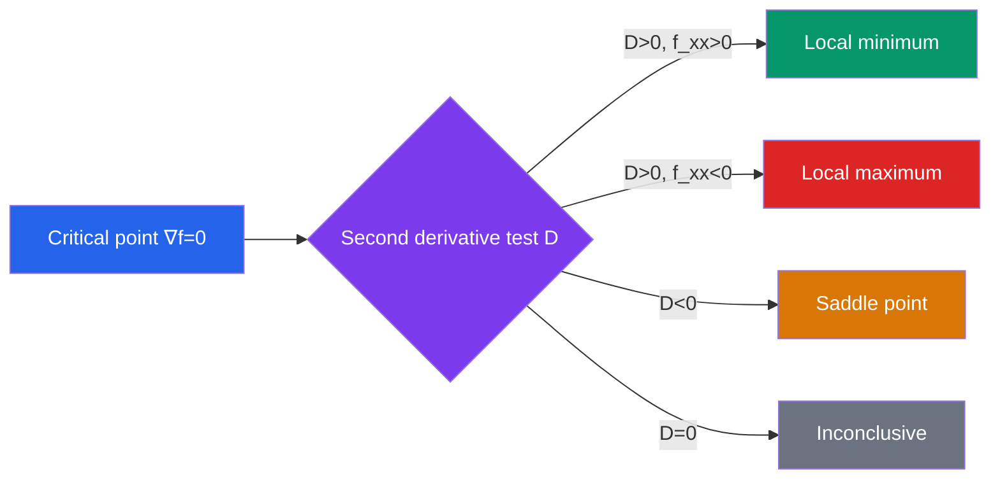

# 📊 Partial Derivatives

> [!abstract] TL;DR
> Partial derivatives measure how a multivariable function changes in one direction while all other variables are held fixed. The gradient collects these into a single vector pointing in the direction of steepest ascent, and Lagrange multipliers extend optimization to constrained problems.

## Intuition — analogy FIRST
Imagine standing on a hilly terrain where your location is given by coordinates $(x, y)$. A partial derivative $\partial f/\partial x$ tells you the slope of the hill if you walk **only east-west** — north-south position frozen. The gradient $\nabla f$ is the compass needle: it always points uphill in the steepest direction and its length tells you how steep that climb is. Gradient descent in machine learning is literally walking downhill on a loss-function landscape, one small step at a time.

---

## How It Works

## Key Concepts / Details

### Functions of Several Variables
A function $f: \mathbb{R}^n \to \mathbb{R}$ maps a point $(x_1,\ldots,x_n)$ to a real number. Visualizing $f: \mathbb{R}^2 \to \mathbb{R}$:
- **Graph**: surface $z = f(x,y)$ in $\mathbb{R}^3$
- **Level curves**: curves $f(x,y) = c$ in the $xy$-plane (like topographic contours)

### Partial Derivatives
$$\frac{\partial f}{\partial x} = f_x = \lim_{h\to 0}\frac{f(x+h,y) - f(x,y)}{h}$$

Treat all other variables as constants and differentiate normally.

**Higher-order partials**: $f_{xx} = \partial^2 f/\partial x^2$, $f_{xy} = \partial^2 f/\partial x \partial y$, etc.

**Clairaut's theorem**: If $f_{xy}$ and $f_{yx}$ are both continuous, then $f_{xy} = f_{yx}$ (mixed partials are equal).

### Gradient
$$\nabla f = \left\langle \frac{\partial f}{\partial x},\; \frac{\partial f}{\partial y},\; \frac{\partial f}{\partial z} \right\rangle$$

Key facts:
- Points in the direction of **steepest increase**
- $\|\nabla f\|$ = maximum rate of increase
- $\nabla f \perp$ level surfaces of $f$

### Directional Derivative
The rate of change of $f$ in direction $\hat{\mathbf{u}}$ (unit vector):
$$D_{\hat{\mathbf{u}}}f = \nabla f \cdot \hat{\mathbf{u}}$$

This is maximized when $\hat{\mathbf{u}}$ is in the direction of $\nabla f$, giving $D_{\nabla f/\|\nabla f\|}f = \|\nabla f\|$.

### Tangent Plane
For $z = f(x,y)$ at point $(x_0, y_0, z_0)$:
$$z - z_0 = f_x(x_0,y_0)(x - x_0) + f_y(x_0,y_0)(y - y_0)$$

The linear function $L(x,y) = z_0 + f_x(x_0,y_0)(x-x_0) + f_y(x_0,y_0)(y-y_0)$ is the **linearization** of $f$ near $(x_0,y_0)$.

### Chain Rule (Multivariable)
If $z = f(x,y)$ and $x = x(t)$, $y = y(t)$:
$$\frac{dz}{dt} = \frac{\partial z}{\partial x}\frac{dx}{dt} + \frac{\partial z}{\partial y}\frac{dy}{dt}$$

More generally for $z = f(x_1, \ldots, x_n)$ with $x_i = x_i(t_1,\ldots,t_m)$:
$$\frac{\partial z}{\partial t_j} = \sum_{i=1}^n \frac{\partial z}{\partial x_i}\frac{\partial x_i}{\partial t_j}$$

### Implicit Differentiation
For $F(x,y) = 0$:
$$\frac{dy}{dx} = -\frac{F_x}{F_y}$$

For $F(x,y,z) = 0$:
$$\frac{\partial z}{\partial x} = -\frac{F_x}{F_z}, \quad \frac{\partial z}{\partial y} = -\frac{F_y}{F_z}$$

### Critical Points and the Second Derivative Test
A critical point occurs where $\nabla f = \mathbf{0}$ (i.e., $f_x = 0$ and $f_y = 0$).

Define the **discriminant** (Hessian determinant):
$$D = f_{xx}f_{yy} - (f_{xy})^2$$

| $D$ | $f_{xx}$ | Conclusion |
|-----|----------|------------|
| $D > 0$ | $> 0$ | Local minimum |
| $D > 0$ | $< 0$ | Local maximum |
| $D < 0$ | any | Saddle point |
| $D = 0$ | any | Test inconclusive |

### Lagrange Multipliers
To optimize $f(x,y,z)$ subject to constraint $g(x,y,z) = 0$:
$$\nabla f = \lambda \nabla g$$

This gives the system: $f_x = \lambda g_x$, $f_y = \lambda g_y$, $f_z = \lambda g_z$, plus $g(x,y,z) = 0$. Solve for $(x,y,z,\lambda)$.

For two constraints $g_1 = 0$, $g_2 = 0$: $\nabla f = \lambda \nabla g_1 + \mu \nabla g_2$.

---

## Real-World Notes
- **ML gradient descent**: The gradient of the loss function $\nabla_\theta \mathcal{L}(\theta)$ points toward increasing loss; subtract it to descend: $\theta \leftarrow \theta - \alpha \nabla_\theta \mathcal{L}$.
- **Heat distribution**: Temperature $T(x,y,z,t)$ evolves by the heat equation $\partial T/\partial t = k\nabla^2 T$; partial derivatives in both space and time appear naturally.
- **Economics — constrained optimization**: Maximize utility $U(x,y)$ subject to budget $p_x x + p_y y = I$; Lagrange multiplier $\lambda$ is the marginal utility of income.
- **Computer vision**: Image gradients $(\partial I/\partial x, \partial I/\partial y)$ detect edges; the gradient magnitude indicates edge strength.

---

## Common Pitfalls
- **Partial $\neq$ total derivative**: $\partial f/\partial x$ only captures variation along $x$; the total derivative accounts for all dependencies via the chain rule.
- **Critical point $\neq$ extremum**: Saddle points satisfy $\nabla f = 0$ but are neither maxima nor minima. Always apply the second derivative test.
- **Clairaut's requires continuity**: Mixed partial equality $f_{xy} = f_{yx}$ can fail if the mixed partials are not continuous — rare but important to remember.
- **Lagrange multiplier $\lambda$ is not an extremal value**: $\lambda$ is the rate of change of the optimal objective per unit relaxation of the constraint, not the optimal value itself.

---

## Related Concepts
- [[_MOC_Multivariable_Calculus|↑ Multivariable Calculus MOC]]
- [[Vectors_and_3D_Geometry]] — gradient is a vector in ℝ³; directional derivative uses dot product
- [[Multiple_Integrals]] — partial derivatives appear in Jacobians for change of variables
- [[Vector_Fields_and_Line_Integrals]] — gradient fields are a special class of conservative vector fields

---

## Review Questions
1. Compute $\nabla f$ for $f(x,y,z) = x^2y + e^{xz}\sin(y)$. In which direction is $f$ increasing most rapidly at $(1,0,0)$?
2. Find all critical points of $f(x,y) = x^3 - 3x + y^2 - 4y$ and classify them using the second derivative test.
3. Use Lagrange multipliers to find the maximum and minimum values of $f(x,y) = x^2 + y^2$ subject to the constraint $x + y = 1$.
4. If $z = f(x,y)$ where $x = r\cos\theta$ and $y = r\sin\theta$, express $\partial z/\partial r$ using the chain rule.

---

## Sources
- Stewart, *Multivariable Calculus*, Ch. 14
- Marsden & Tromba, *Vector Calculus*, Ch. 2–3
- Goodfellow et al., *Deep Learning*, Ch. 4 (gradient-based optimization)

#multivariable-calculus #partial-derivatives #gradient #lagrange-multipliers #optimization
