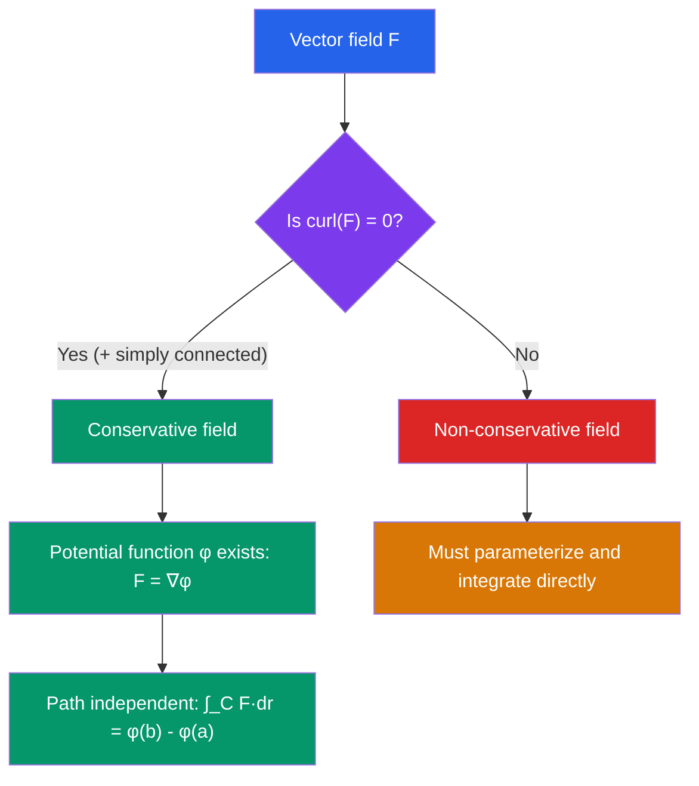

# 📊 Vector Fields and Line Integrals

> [!abstract] TL;DR
> A vector field assigns a vector to every point in space; line integrals measure accumulated quantities (work, flux, circulation) along curves through such fields. Conservative fields — those with a potential function — make work path-independent, a fact characterized algebraically by zero curl and computationally by finding the potential.

## Intuition — analogy FIRST
Picture a river. At every point on the surface, the water has a velocity — that is a vector field. If you drop a leaf, it follows the flow. The line integral along the leaf's path accumulates how much the current helps or fights its motion. If you swim in a whirlpool (non-conservative field), you do work that depends on the path. But in a calm, source-free stream (conservative field), the energy expended depends only on where you start and end — like potential energy in gravity.

---

## How It Works

## Key Concepts / Details

### Vector Fields
A vector field $\mathbf{F}: \mathbb{R}^n \to \mathbb{R}^n$ assigns a vector $\mathbf{F}(\mathbf{r})$ to each point $\mathbf{r}$.

In $\mathbb{R}^3$: $\mathbf{F}(x,y,z) = P(x,y,z)\,\mathbf{i} + Q(x,y,z)\,\mathbf{j} + R(x,y,z)\,\mathbf{k}$

Examples: gravitational field $\mathbf{F} = -Gm/r^3 \mathbf{r}$, electric field $\mathbf{E}$, fluid velocity $\mathbf{v}$.

### Line Integral of a Scalar Function
$$\int_C f\,ds = \int_a^b f(\mathbf{r}(t))\,\|\mathbf{r}'(t)\|\,dt$$

This integrates $f$ with respect to arc length — useful for mass of a wire with density $f$.

### Line Integral of a Vector Field (Work)
$$\int_C \mathbf{F}\cdot d\mathbf{r} = \int_a^b \mathbf{F}(\mathbf{r}(t))\cdot\mathbf{r}'(t)\,dt$$

This equals $\int_C P\,dx + Q\,dy + R\,dz$ and computes the **work** done by force $\mathbf{F}$ along curve $C$.

**Parameterization**: for curve $C$ from $t=a$ to $t=b$, compute $\mathbf{r}'(t)$ and substitute.

### Conservative Vector Fields
$\mathbf{F}$ is conservative if $\mathbf{F} = \nabla\varphi$ for some scalar **potential function** $\varphi$.

**Equivalent conditions** (in simply connected domain):
1. $\mathbf{F} = \nabla\varphi$ (potential exists)
2. $\oint_C \mathbf{F}\cdot d\mathbf{r} = 0$ for every closed curve $C$
3. $\int_C \mathbf{F}\cdot d\mathbf{r}$ depends only on endpoints (path independent)
4. $\nabla\times\mathbf{F} = \mathbf{0}$ (curl is zero)

**Fundamental theorem for line integrals**:
$$\int_C \nabla\varphi\cdot d\mathbf{r} = \varphi(\mathbf{b}) - \varphi(\mathbf{a})$$

**Finding the potential**: Integrate $\partial\varphi/\partial x = P$ with respect to $x$, then determine the "constant" (function of $y,z$) by matching $\partial\varphi/\partial y = Q$ and $\partial\varphi/\partial z = R$.

### Curl
$$\nabla\times\mathbf{F} = \begin{vmatrix} \mathbf{i} & \mathbf{j} & \mathbf{k} \\ \partial/\partial x & \partial/\partial y & \partial/\partial z \\ P & Q & R \end{vmatrix} = \left\langle \frac{\partial R}{\partial y}-\frac{\partial Q}{\partial z},\; \frac{\partial P}{\partial z}-\frac{\partial R}{\partial x},\; \frac{\partial Q}{\partial x}-\frac{\partial P}{\partial y} \right\rangle$$

Curl measures the **local rotation** of a vector field. In fluid mechanics, $\nabla\times\mathbf{v}$ is the vorticity (twice the angular velocity of fluid elements).

**Key fact**: If $\mathbf{F} = \nabla\varphi$, then $\nabla\times\mathbf{F} = \mathbf{0}$ (curl of a gradient is zero).

### Divergence
$$\nabla\cdot\mathbf{F} = \frac{\partial P}{\partial x} + \frac{\partial Q}{\partial y} + \frac{\partial R}{\partial z}$$

Divergence measures the **net outflow** per unit volume at a point — positive at sources, negative at sinks.

**Key identity**: $\nabla\cdot(\nabla\times\mathbf{F}) = 0$ (divergence of curl is always zero).

---

## Real-World Notes
- **Gravitational potential energy**: $\mathbf{F}_{\text{grav}} = -\nabla U$ where $U = mgh$. Since gravity is conservative, work done lifting an object depends only on height change, not path — that is why roller coasters work!
- **Electrostatics**: The electric field satisfies $\nabla\times\mathbf{E} = 0$, so $\mathbf{E} = -\nabla V$ where $V$ is electric potential. Volt meters measure this potential.
- **Fluid dynamics**: The curl of velocity field is vorticity — tornadoes and hurricanes are regions of high vorticity. Divergence-free fields ($\nabla\cdot\mathbf{v} = 0$) model incompressible fluids.
- **Computer graphics — flow simulation**: Particle systems simulate smoke and fire by numerically integrating trajectories through carefully designed velocity vector fields.

---

## Common Pitfalls
- **Simply connected domain matters**: $\nabla\times\mathbf{F} = 0$ implies $\mathbf{F}$ is conservative only in simply connected domains. The classic counterexample $\mathbf{F} = \langle -y/(x^2+y^2), x/(x^2+y^2) \rangle$ has zero curl but is not conservative on $\mathbb{R}^2 \setminus\{0\}$ (domain has a hole).
- **Arc length vs work integral**: $\int_C f\,ds$ uses $\|\mathbf{r}'(t)\|$ (arc length element), while $\int_C \mathbf{F}\cdot d\mathbf{r}$ uses $\mathbf{r}'(t)$ (vector). Mixing these up is a common error.
- **Orientation matters**: Reversing the direction of $C$ changes the sign of $\int_C \mathbf{F}\cdot d\mathbf{r}$ but not $\int_C f\,ds$.
- **Checking for a potential**: Even if curl is zero, always verify the domain is simply connected. On non-simply-connected domains, use the full machinery of de Rham cohomology.

---

## Related Concepts
- [[_MOC_Multivariable_Calculus|↑ Multivariable Calculus MOC]]
- [[Partial_Derivatives]] — curl and divergence are built from partial derivatives; gradient gives conservative fields
- [[Integral_Theorems]] — Green's theorem relates line integrals to curl; Divergence theorem relates flux to divergence
- [[Vectors_and_3D_Geometry]] — dot and cross products appear in work integrals and curl computation

---

## Review Questions
1. Determine whether $\mathbf{F}(x,y,z) = \langle yz, xz, xy \rangle$ is conservative. If so, find its potential function $\varphi$.
2. Compute $\int_C \mathbf{F}\cdot d\mathbf{r}$ where $\mathbf{F}(x,y) = \langle x^2, xy \rangle$ and $C$ is the parabola $y = x^2$ from $(0,0)$ to $(1,1)$.
3. Compute $\nabla\times\mathbf{F}$ and $\nabla\cdot\mathbf{F}$ for $\mathbf{F}(x,y,z) = \langle xy, yz, xz \rangle$.
4. Explain why the work done by gravity in moving a particle from the ground to height $h$ is $mgh$ regardless of path, using the concept of a conservative field and potential function.

---

## Sources
- Stewart, *Multivariable Calculus*, Ch. 16
- Marsden & Tromba, *Vector Calculus*, Ch. 7
- Griffiths, *Introduction to Electrodynamics*, Ch. 1–2

#multivariable-calculus #vector-fields #line-integrals #curl #divergence #conservative-fields
