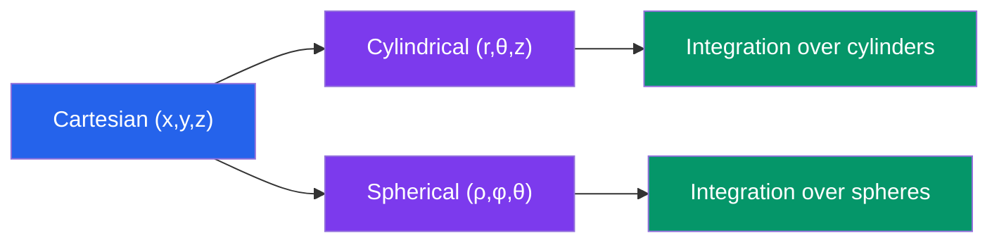

# 📊 Vectors and 3D Geometry

> [!abstract] TL;DR
> Vectors in ℝ³ carry both magnitude and direction, unlocking dot products (for angles and projections) and cross products (for perpendiculars and areas). Together with parametric lines, normal-vector planes, and coordinate transformations, they form the geometric language of 3D space used throughout physics, graphics, and engineering.

## Intuition — analogy FIRST
Think of a vector as an arrow drawn in physical space — it tells you which way to go **and** how far. The dot product is your "agreement meter": two arrows pointing the same way give a large positive number, perpendicular arrows give zero, and opposing arrows give a negative number. The cross product, on the other hand, manufactures a brand-new arrow that stands perfectly upright from the plane containing the original two — like the handle of a screwdriver pointing out of the surface you are turning.

---

## How It Works

## Key Concepts / Details

### Vectors in ℝ³
A vector $\mathbf{v} = \langle x, y, z \rangle$ has magnitude

$$\|\mathbf{v}\| = \sqrt{x^2 + y^2 + z^2}$$

Unit vector: $\hat{\mathbf{v}} = \mathbf{v}/\|\mathbf{v}\|$. Standard basis vectors: $\mathbf{i} = \langle 1,0,0 \rangle$, $\mathbf{j} = \langle 0,1,0 \rangle$, $\mathbf{k} = \langle 0,0,1 \rangle$.

### Dot Product
$$\mathbf{u} \cdot \mathbf{v} = u_1v_1 + u_2v_2 + u_3v_3 = \|\mathbf{u}\|\|\mathbf{v}\|\cos\theta$$

- Angle between vectors: $\cos\theta = \dfrac{\mathbf{u}\cdot\mathbf{v}}{\|\mathbf{u}\|\|\mathbf{v}\|}$
- Scalar projection of $\mathbf{u}$ onto $\mathbf{v}$: $\text{comp}_\mathbf{v}\mathbf{u} = \dfrac{\mathbf{u}\cdot\mathbf{v}}{\|\mathbf{v}\|}$
- Vector projection: $\text{proj}_\mathbf{v}\mathbf{u} = \dfrac{\mathbf{u}\cdot\mathbf{v}}{\|\mathbf{v}\|^2}\mathbf{v}$

### Cross Product
$$\mathbf{u} \times \mathbf{v} = \begin{vmatrix} \mathbf{i} & \mathbf{j} & \mathbf{k} \\ u_1 & u_2 & u_3 \\ v_1 & v_2 & v_3 \end{vmatrix}$$

$$= \langle u_2v_3 - u_3v_2,\; u_3v_1 - u_1v_3,\; u_1v_2 - u_2v_1 \rangle$$

Key properties:
- $\mathbf{u}\times\mathbf{v}$ is perpendicular to both $\mathbf{u}$ and $\mathbf{v}$
- $|\mathbf{u}\times\mathbf{v}| = \|\mathbf{u}\|\|\mathbf{v}\|\sin\theta$ = area of parallelogram spanned by $\mathbf{u}$ and $\mathbf{v}$
- **NOT commutative**: $\mathbf{u}\times\mathbf{v} = -\mathbf{v}\times\mathbf{u}$ (anti-commutative)
- $\mathbf{u}\times\mathbf{u} = \mathbf{0}$

### Lines and Planes in 3D

**Parametric line** through $\mathbf{r}_0$ with direction $\mathbf{v}$:
$$\mathbf{r}(t) = \mathbf{r}_0 + t\mathbf{v} = \langle x_0 + at,\; y_0 + bt,\; z_0 + ct \rangle$$

**Plane** with normal $\mathbf{n} = \langle a,b,c \rangle$ through point $\mathbf{r}_0$:
$$\mathbf{n} \cdot (\mathbf{r} - \mathbf{r}_0) = 0 \quad \Longleftrightarrow \quad ax + by + cz = d$$

**Distance from point $(x_0,y_0,z_0)$ to plane $ax+by+cz=d$:**
$$D = \frac{|ax_0 + by_0 + cz_0 - d|}{\sqrt{a^2+b^2+c^2}}$$

### Quadric Surfaces
| Surface | Equation |
|---------|----------|
| Sphere | $x^2+y^2+z^2 = r^2$ |
| Ellipsoid | $x^2/a^2 + y^2/b^2 + z^2/c^2 = 1$ |
| Elliptic paraboloid | $z = x^2/a^2 + y^2/b^2$ |
| Hyperbolic paraboloid | $z = x^2/a^2 - y^2/b^2$ (saddle) |
| Hyperboloid (1 sheet) | $x^2/a^2 + y^2/b^2 - z^2/c^2 = 1$ |

### Coordinate Systems
**Cylindrical** $(r,\theta,z)$: $x = r\cos\theta$, $y = r\sin\theta$, $z = z$; $r^2 = x^2+y^2$

**Spherical** $(\rho,\phi,\theta)$: $x = \rho\sin\phi\cos\theta$, $y = \rho\sin\phi\sin\theta$, $z = \rho\cos\phi$; $\rho^2 = x^2+y^2+z^2$

Here $\phi$ is the polar angle from the $z$-axis and $\theta$ is the azimuthal angle in the $xy$-plane.

---

## Real-World Notes
- **Computer graphics**: Surface normals (computed via cross product) determine how light reflects off 3D objects in rendering engines. The dot product of the normal with the light direction gives the diffuse shading intensity.
- **Physics — Torque**: $\boldsymbol{\tau} = \mathbf{r} \times \mathbf{F}$; the cross product naturally captures both the magnitude and the rotational axis of a torque.
- **GPS triangulation**: Distance formulas in 3D space (based on vector magnitude) underpin trilateration — measuring distances to three satellites to pinpoint a 3D location.
- **Robotics / kinematics**: Parametric line equations describe joint trajectories; planes define collision boundaries and workspace limits.

---

## Common Pitfalls
- **Cross product order matters**: $\mathbf{u}\times\mathbf{v}$ and $\mathbf{v}\times\mathbf{u}$ point in opposite directions. Always use the right-hand rule to determine direction.
- **Confusing $\phi$ and $\theta$ in spherical coordinates**: Different textbooks swap these. Check whether $\phi$ is the polar (from $z$-axis) or azimuthal angle for your source.
- **Dot product is scalar, cross product is vector**: You cannot take the cross product of a scalar result. A common error is writing $(\mathbf{u}\cdot\mathbf{v})\times\mathbf{w}$, which is undefined.
- **Non-zero cross product does not imply non-zero dot product**: Two vectors can be perpendicular (dot product zero) and have a non-zero cross product, or parallel (cross product zero) with non-zero dot product.

---

## Related Concepts
- [[_MOC_Multivariable_Calculus|↑ Multivariable Calculus MOC]]
- [[Partial_Derivatives]] — gradient vectors live in ℝ³ and use dot products for directional derivatives
- [[Multiple_Integrals]] — cylindrical and spherical coordinates directly apply here
- [[Vector_Fields_and_Line_Integrals]] — vector field operations build on cross and dot product intuition

---

## Review Questions
1. Given $\mathbf{u} = \langle 1, 2, -1 \rangle$ and $\mathbf{v} = \langle 3, 0, 4 \rangle$, compute $\mathbf{u}\cdot\mathbf{v}$, the angle between them, and $\mathbf{u}\times\mathbf{v}$.
2. Find the equation of the plane through points $(1,0,0)$, $(0,1,0)$, and $(0,0,1)$. What is the distance from the origin to this plane?
3. Explain why $|\mathbf{u}\times\mathbf{v}|$ equals the area of the parallelogram formed by $\mathbf{u}$ and $\mathbf{v}$, starting from the formula $|\mathbf{u}\times\mathbf{v}| = \|\mathbf{u}\|\|\mathbf{v}\|\sin\theta$.
4. Convert the point $(x,y,z) = (1, 1, \sqrt{2})$ to both cylindrical and spherical coordinates.

---

## Sources
- Stewart, *Multivariable Calculus*, Ch. 12–13
- Anton & Rorres, *Elementary Linear Algebra*, Ch. 3
- Marsden & Tromba, *Vector Calculus*, Ch. 1

#multivariable-calculus #vectors #3d-geometry #dot-product #cross-product
