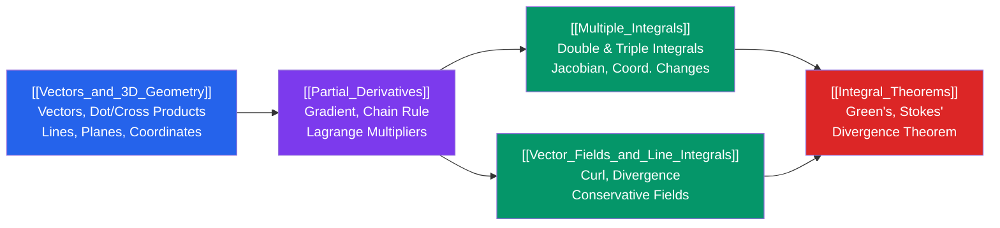

# 📊 Multivariable Calculus — Map of Content

> [!abstract] Overview
> Multivariable calculus extends single-variable tools to higher dimensions: the mathematical language of physics, engineering, and machine learning optimization. Starting from 3D geometry and vectors, it builds through partial derivatives and optimization, integration over 2D/3D regions, vector field theory, and culminates in the grand integral theorems that unify calculus across dimensions.

---

## Learning Path

---

## Notes in This Section

| Note | Difficulty | Core Concept |
|------|-----------|--------------|
| [[Vectors_and_3D_Geometry]] | Intermediate | Vectors, dot/cross products, lines, planes, coordinate systems |
| [[Partial_Derivatives]] | Intermediate | Partial differentiation, gradient, directional derivative, optimization |
| [[Multiple_Integrals]] | Intermediate | Double/triple integrals, Jacobian, polar/cylindrical/spherical coords |
| [[Vector_Fields_and_Line_Integrals]] | Advanced | Vector fields, work integrals, conservative fields, curl, divergence |
| [[Integral_Theorems]] | Advanced | Green's, Stokes', and Divergence theorems; generalized Stokes' |

---

## Key Operators at a Glance

| Operator | Symbol | Input → Output | Meaning |
|----------|--------|---------------|---------|
| Gradient | $\nabla f$ | scalar → vector | Direction of steepest ascent |
| Divergence | $\nabla\cdot\mathbf{F}$ | vector → scalar | Net outflow per unit volume |
| Curl | $\nabla\times\mathbf{F}$ | vector → vector | Local rotation of field |
| Laplacian | $\nabla^2 f$ | scalar → scalar | $\nabla\cdot(\nabla f)$; diffusion/heat |

---

## Integral Theorems Quick Reference

| Theorem | Converts | Statement |
|---------|---------|-----------|
| Green's | Line → Area | $\oint_C \mathbf{F}\cdot d\mathbf{r} = \iint_D (\nabla\times\mathbf{F})\cdot\mathbf{k}\,dA$ |
| Stokes' | Line → Surface | $\oint_C \mathbf{F}\cdot d\mathbf{r} = \iint_S (\nabla\times\mathbf{F})\cdot d\mathbf{S}$ |
| Divergence | Surface → Volume | $\oiint_S \mathbf{F}\cdot d\mathbf{S} = \iiint_V \nabla\cdot\mathbf{F}\,dV$ |

---

## Prerequisites
- Single-variable calculus (derivatives, integrals, chain rule)
- Vectors in $\mathbb{R}^2$ and basic trigonometry
- [[03_Linear_Algebra/_MOC_Linear_Algebra|Linear Algebra]] — matrix determinants (for cross product, Jacobian)

## Connects To
- **Physics**: Classical mechanics, electromagnetism (Maxwell's equations), fluid dynamics
- **Machine Learning**: Gradient descent, backpropagation (chain rule), loss landscape geometry
- **Differential Equations**: PDEs (heat, wave, Laplace equations) use gradient, Laplacian
- **Differential Geometry**: Generalized Stokes' theorem, manifolds

---

## Sources
- Stewart, *Multivariable Calculus*, 8th edition
- Marsden & Tromba, *Vector Calculus*, 6th edition
- Schey, *div, grad, curl, and all that* (intuition-focused companion)

#mathematics #multivariable-calculus #moc
