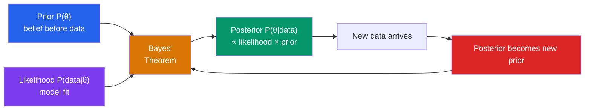

# 🎲 Bayesian Statistics

> [!abstract] TL;DR
> Bayesian statistics treats parameters as random variables with prior distributions, updates them with data via Bayes' theorem to obtain a posterior, and uses the posterior for all inference. This provides a coherent framework for incorporating prior knowledge, quantifying uncertainty, and sequentially updating beliefs as data accumulate.

## Intuition — analogy FIRST
Imagine you are a doctor estimating whether a patient has a rare disease (1-in-10,000 prevalence). A test comes back positive (99% sensitive, 95% specific). A frequentist only sees the $p$-value for the test; a Bayesian starts with the prior belief ($P(\text{disease}) = 0.0001$), multiplies by the likelihood of the positive result given disease, and arrives at a posterior that correctly reflects the rarity: the patient is probably still healthy (about 0.2% chance of disease), despite the positive test. This prior-to-posterior update is the heart of Bayesian reasoning.

---

## How It Works

## Key Concepts / Details

### The Bayesian Paradigm
- **Frequentist**: parameters are fixed, unknown constants; probability refers to long-run frequencies
- **Bayesian**: parameters are random variables with probability distributions reflecting uncertainty; probability refers to degrees of belief

**Bayes' theorem for inference**:
$$\underbrace{P(\theta \mid x)}_{\text{posterior}} = \frac{\underbrace{P(x \mid \theta)}_{\text{likelihood}}\cdot\underbrace{P(\theta)}_{\text{prior}}}{\underbrace{P(x)}_{\text{marginal likelihood}}}$$

Since $P(x) = \int P(x|\theta)P(\theta)\,d\theta$ does not depend on $\theta$:
$$P(\theta \mid x) \propto P(x \mid \theta)\cdot P(\theta)$$

### Prior Distribution
The prior $P(\theta)$ encodes beliefs about $\theta$ before observing data.
- **Informative prior**: encodes genuine prior knowledge (e.g., historical data, expert opinion)
- **Non-informative / vague prior**: minimal assumptions (e.g., Uniform, Jeffreys' prior)
- **Conjugate prior**: chosen so that the posterior is in the same family as the prior (simplifies computation enormously)

### Likelihood
$P(x \mid \theta) = \prod_{i=1}^n f(x_i; \theta)$ — the same object as in MLE, but treated as a function of $\theta$ with $x$ fixed.

### Posterior Distribution
The posterior $P(\theta \mid x)$ is the complete inferential answer. Summaries:
- **Posterior mean**: $E[\theta \mid x] = \int \theta\, P(\theta|x)\,d\theta$
- **Posterior median**: minimizes expected absolute error
- **MAP (Maximum A Posteriori)**: $\hat{\theta}_{\text{MAP}} = \arg\max_\theta P(\theta|x)$; equals MLE when prior is flat
- **Credible interval**: $[\theta_{\text{lo}}, \theta_{\text{hi}}]$ such that $P(\theta_{\text{lo}} \le \theta \le \theta_{\text{hi}} \mid x) = 0.95$ — this has a direct probabilistic interpretation unlike a frequentist CI!

### Conjugate Priors
| Model | Conjugate Prior | Posterior |
|-------|----------------|-----------|
| Binomial$(n,p)$ | Beta$(\alpha,\beta)$ | Beta$(\alpha + k,\, \beta + n - k)$ |
| Poisson$(\lambda)$ | Gamma$(\alpha,\beta)$ | Gamma$(\alpha + \sum x_i,\, \beta + n)$ |
| Normal$(\mu, \sigma^2)$, $\sigma^2$ known | Normal$(\mu_0,\tau_0^2)$ | Normal (updated) |
| Normal$(\mu, \sigma^2)$, both unknown | Normal-Inverse-Gamma | Normal-Inverse-Gamma |

**Beta-Binomial example**: observe $k$ successes in $n$ trials with Beta$(\alpha,\beta)$ prior:
$$\text{Posterior: } \theta \mid k \sim \text{Beta}(\alpha + k, \, \beta + n - k)$$
Posterior mean: $\frac{\alpha + k}{\alpha + \beta + n}$ — a weighted average of the prior mean $\alpha/(\alpha+\beta)$ and MLE $k/n$.

### Bayesian vs. Frequentist
| Aspect | Bayesian | Frequentist |
|--------|----------|-------------|
| Parameters | Random, have distributions | Fixed, unknown constants |
| Probability | Degree of belief | Long-run frequency |
| Inference | Posterior distribution | $p$-values, CIs, point estimates |
| Prior | Required | None |
| "95% CI" | $P(\theta \in [L,U] \mid \text{data}) = 0.95$ | Procedure covers $\theta$ 95% of the time |

### Markov Chain Monte Carlo (MCMC)
For complex models, the posterior $P(\theta|x)$ cannot be computed analytically. MCMC approximates the posterior by constructing a Markov chain whose stationary distribution is the posterior.

**Metropolis-Hastings**: at each step, propose $\theta^*$ from a proposal distribution; accept with probability $\min\!\left(1, \frac{P(\theta^*|x)}{P(\theta^{(t)}|x)}\right)$. The chain converges to samples from the posterior.

**Modern MCMC**: Hamiltonian Monte Carlo (HMC) and NUTS (used in Stan, PyMC) exploit gradient information for efficient sampling in high dimensions.

### Posterior Predictive Distribution
For predicting a new observation $\tilde{x}$:
$$P(\tilde{x} \mid x) = \int P(\tilde{x} \mid \theta)\,P(\theta \mid x)\,d\theta$$

This averages predictions over all plausible parameter values, automatically accounting for parameter uncertainty.

---

## Real-World Notes
- **Spam filtering**: Gmail and similar systems use Bayesian classifiers. The prior is the base rate of spam; the likelihood is the word frequencies given spam/ham; the posterior gives the probability the email is spam.
- **Medical diagnosis with prevalence**: Bayesian updating properly accounts for disease rarity. A positive mammogram for a 40-year-old has a much lower posterior probability of cancer (~10%) than for a 60-year-old with risk factors (~50%), even with the same test.
- **Thompson sampling (multi-armed bandits)**: In online advertising or clinical trials, maintain a Beta posterior for each arm's success probability; sample from posteriors to balance exploration and exploitation. Widely used in recommendation systems.
- **Probabilistic programming**: Libraries like Stan, PyMC, and NumPyro allow practitioners to specify Bayesian models in code and automatically run MCMC or variational inference.

---

## Common Pitfalls
- **Credible intervals $\ne$ confidence intervals**: A Bayesian 95% credible interval directly means "95% probability $\theta$ is in this range (given data and prior)." A frequentist 95% CI does NOT mean this — the distinction matters.
- **Sensitivity to prior in small samples**: With little data, the prior dominates. Always perform sensitivity analysis by varying the prior and checking how much the posterior changes.
- **Flat priors are not "uninformative" after transformation**: A uniform prior on $\theta$ is not uniform on $\theta^2$ or $\log\theta$. Jeffreys' priors are invariant to reparameterization.
- **MCMC convergence is not guaranteed**: Check with Gelman-Rubin $\hat{R}$ statistic, traceplots, and effective sample size. A chain that "looks" converged may not be fully mixing.

---

## Related Concepts
- [[_MOC_Probability_and_Statistics|↑ Probability and Statistics MOC]]
- [[Probability_Theory]] — Bayes' theorem is the foundation; prior/posterior are probability distributions
- [[Common_Probability_Distributions]] — conjugate prior families (Beta, Gamma, Normal) are standard distributions
- [[Statistical_Inference]] — Bayesian and frequentist approaches to inference; MAP vs. MLE comparison
- [[Regression_and_Correlation]] — Bayesian linear regression with priors on $\boldsymbol{\beta}$; Ridge regression = Gaussian prior

---

## Review Questions
1. A biased coin is flipped 10 times, yielding 7 heads. Use a Beta$(2,2)$ prior for the bias $p$. Compute the posterior distribution and the posterior mean. How does it compare to the MLE?
2. Explain the difference between a 95% Bayesian credible interval and a 95% frequentist confidence interval. Give an example where they numerically agree but differ in interpretation.
3. Why does the Beta-Binomial conjugate pair produce a posterior that is a "compromise" between the prior mean and the observed proportion? Derive this analytically.
4. Describe the Metropolis-Hastings algorithm in plain language. Under what condition does the algorithm accept a proposed sample with probability less than 1?

---

## Sources
- Gelman et al., *Bayesian Data Analysis*, 3rd edition
- McElreath, *Statistical Rethinking*, 2nd edition
- Kruschke, *Doing Bayesian Data Analysis*

#statistics #bayesian #bayesian-inference #mcmc #conjugate-priors #posterior
