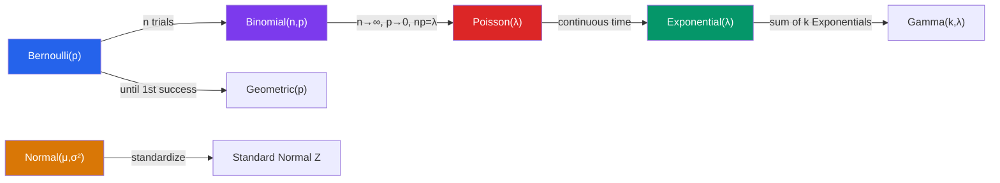

# 🎲 Common Probability Distributions

> [!abstract] TL;DR
> A handful of parametric distributions model the vast majority of random phenomena encountered in practice. Discrete distributions (Bernoulli, Binomial, Geometric, Poisson) model counts and trials; continuous ones (Uniform, Exponential, Normal) model measurements. Understanding their parameters, moments, and relationships enables rapid probabilistic modeling.

## Intuition — analogy FIRST
Think of distributions as probability "shapes." Toss a coin repeatedly and count heads — Binomial. Wait for the first success — Geometric. Count rare events in a fixed window (website hits per minute, typos per page) — Poisson. Measure heights, test scores, or measurement errors from many independent additive sources — Normal (by the CLT). The exponential describes waiting times between Poisson events, just as the geometric describes waiting in discrete steps.

---

## How It Works

## Key Concepts / Details

### Discrete Distributions

#### Bernoulli$(p)$
Single trial: success with probability $p$, failure with $1-p$.
$$P(X=1)=p, \quad P(X=0)=1-p; \quad E[X]=p, \quad \text{Var}(X)=p(1-p)$$

#### Binomial$(n, p)$
Number of successes in $n$ independent Bernoulli$(p)$ trials.
$$P(X=k) = \binom{n}{k}p^k(1-p)^{n-k}, \quad k=0,1,\ldots,n$$
$$E[X] = np, \quad \text{Var}(X) = np(1-p)$$

When $n$ is large and $p$ is not too close to 0 or 1: approximately $\text{Normal}(np, np(1-p))$.

#### Geometric$(p)$
Number of trials until (and including) the first success.
$$P(X=k) = (1-p)^{k-1}p, \quad k=1,2,3,\ldots$$
$$E[X] = \frac{1}{p}, \quad \text{Var}(X) = \frac{1-p}{p^2}$$

**Memoryless property**: $P(X > m+n \mid X > m) = P(X > n)$ — past failures give no information about future waiting time.

#### Poisson$(\lambda)$
Number of events in a fixed interval when events occur at constant rate $\lambda$ independently.
$$P(X=k) = \frac{e^{-\lambda}\lambda^k}{k!}, \quad k=0,1,2,\ldots$$
$$E[X] = \lambda, \quad \text{Var}(X) = \lambda$$

**Poisson limit theorem**: Binomial$(n,p)$ $\to$ Poisson$(np)$ as $n\to\infty$, $p\to 0$, $np\to\lambda$.

Sum of independent Poisson$(\lambda_i)$: $\sum X_i \sim$ Poisson$(\sum\lambda_i)$.

---

### Continuous Distributions

#### Uniform$(a, b)$
Equally likely over $[a,b]$.
$$f(x) = \frac{1}{b-a}, \quad a \le x \le b$$
$$E[X] = \frac{a+b}{2}, \quad \text{Var}(X) = \frac{(b-a)^2}{12}$$

#### Exponential$(\lambda)$
Time until first event in a Poisson process with rate $\lambda$.
$$f(x) = \lambda e^{-\lambda x}, \quad x \ge 0; \quad F(x) = 1 - e^{-\lambda x}$$
$$E[X] = \frac{1}{\lambda}, \quad \text{Var}(X) = \frac{1}{\lambda^2}$$

**Memoryless property**: $P(X > s+t \mid X > s) = P(X > t)$ — the only continuous memoryless distribution.

#### Normal$(\mu, \sigma^2)$
The "bell curve" — arises as the limit of sums of i.i.d. random variables (CLT).
$$f(x) = \frac{1}{\sigma\sqrt{2\pi}}\exp\!\left(-\frac{(x-\mu)^2}{2\sigma^2}\right)$$
$$E[X] = \mu, \quad \text{Var}(X) = \sigma^2$$

**Standard normal**: $Z = (X-\mu)/\sigma \sim N(0,1)$; use tables or $\Phi(z)$ for CDFs.

**68-95-99.7 rule**: $P(\mu - k\sigma < X < \mu + k\sigma) \approx 68\%,\, 95\%,\, 99.7\%$ for $k = 1,2,3$.

**Central Limit Theorem**: For i.i.d. $X_i$ with mean $\mu$ and variance $\sigma^2$:
$$\frac{\bar{X}_n - \mu}{\sigma/\sqrt{n}} \xrightarrow{d} N(0,1) \quad \text{as } n\to\infty$$

#### Gamma$(\alpha, \beta)$ and Beta$(\alpha, \beta)$
- **Gamma**: generalization of Exponential; $\text{Gamma}(\alpha, \beta)$: sum of $\alpha$ independent Exponential$(\beta)$ variables; $E[X] = \alpha/\beta$, $\text{Var}(X) = \alpha/\beta^2$.
- **Beta**: supported on $(0,1)$; conjugate prior for Bernoulli/Binomial in Bayesian inference; $E[X] = \alpha/(\alpha+\beta)$.

---

## Real-World Notes
- **Poisson for rare events**: Website traffic spikes (hits per second), radioactive decay events, customer arrivals at a call center — all modeled as Poisson when events are rare and independent.
- **Normal for measurements**: Heights, test scores, manufactured part dimensions, and returns on many financial assets approximately follow a Normal distribution due to the CLT.
- **Exponential for waiting times**: Time between Poisson events (server request intervals, time between earthquakes above magnitude $M$), hardware failure times (under constant hazard rate assumption).
- **Binomial for polls**: Survey of 1000 voters asking a yes/no question — the count of "yes" responses follows Binomial$(1000, p)$ where $p$ is the true population proportion.

---

## Common Pitfalls
- **Poisson $\lambda$ must be per the same unit**: If the rate is 3 per hour and the interval is 30 minutes, use $\lambda = 1.5$, not 3.
- **Normal approximation to Binomial requires large $n$**: The rule of thumb is $np \ge 5$ and $n(1-p) \ge 5$. For very small $p$, use the Poisson approximation instead.
- **Exponential memorylessness is exact, not approximate**: This follows from the Poisson process assumption. Real-world lifetimes often have increasing hazard rates (aging) — for those, use Weibull or Gamma.
- **Z-scores only work for Normal**: Computing $z = (x - \mu)/\sigma$ and looking up $\Phi(z)$ gives the correct probability only when the distribution is (approximately) Normal.

---

## Related Concepts
- [[_MOC_Probability_and_Statistics|↑ Probability and Statistics MOC]]
- [[Random_Variables]] — all distributions specify a PMF or PDF, with E and Var as derived quantities
- [[Statistical_Inference]] — CLT justifies Normal approximations; t-distribution arises when $\sigma$ is unknown
- [[Bayesian_Statistics]] — conjugate priors: Beta-Binomial, Gamma-Poisson, Normal-Normal

---

## Review Questions
1. Calls arrive at a call center at a rate of 5 per minute (Poisson). What is the probability of receiving exactly 3 calls in a given minute? What is the probability of waiting more than 30 seconds for the next call?
2. A production line has a 2% defect rate. In a batch of 200 items, approximate the probability that exactly 5 are defective using: (a) exact Binomial, (b) Poisson approximation.
3. SAT scores are Normal with $\mu = 1060$, $\sigma = 195$. What score corresponds to the 90th percentile? What fraction of students score between 865 and 1255?
4. Why is the exponential distribution memoryless, and what physical assumption about a process leads to this property?

---

## Sources
- DeGroot & Schervish, *Probability and Statistics*, Ch. 5–6
- Ross, *Introduction to Probability Models*, Ch. 2–3
- Walpole, Myers & Myers, *Probability & Statistics for Engineers and Scientists*, Ch. 5–6

#probability #distributions #normal-distribution #poisson-distribution #binomial #exponential
