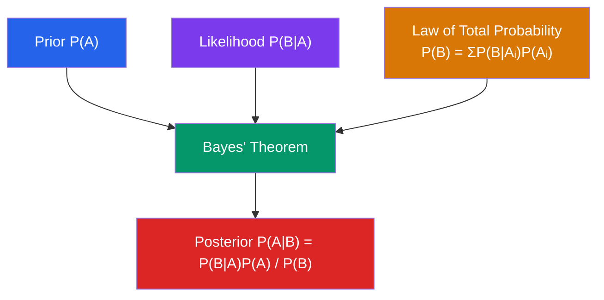

# 🎲 Probability Theory

> [!abstract] TL;DR
> Probability theory provides a rigorous mathematical framework for quantifying uncertainty. Starting from Kolmogorov's three axioms, it builds conditional probability, independence, and Bayes' theorem — the machinery behind spam filters, medical tests, and rational belief updating.

## Intuition — analogy FIRST
Imagine a giant bag containing marbles of different colors — this is your **sample space**. Probability is simply the long-run fraction of times you'd pick a marble of a given color if you drew infinitely many times. Conditional probability is asking: "Now that I know the marble is large, what fraction of large marbles are red?" It restricts your attention to a smaller subset of the bag. Bayes' theorem flips the question: you see the marble is red; what does that tell you about whether it came from the "large" part of the bag?

---

## How It Works

## Key Concepts / Details

### Sample Space and Events
- **Sample space** $\Omega$: the set of all possible outcomes of an experiment
- **Event** $A$: a subset $A \subseteq \Omega$
- **Complement**: $A^c = \Omega \setminus A$ (event $A$ does not occur)
- **Union**: $A \cup B$ (at least one occurs); **Intersection**: $A \cap B$ (both occur)

### Kolmogorov Axioms
A probability measure $P$ on $\Omega$ satisfies:
1. **Non-negativity**: $P(A) \ge 0$ for all events $A$
2. **Normalization**: $P(\Omega) = 1$
3. **Countable additivity**: For mutually disjoint events $A_1, A_2, \ldots$:
$$P\!\left(\bigcup_{i=1}^\infty A_i\right) = \sum_{i=1}^\infty P(A_i)$$

These three axioms imply all other probability rules.

### Basic Rules
$$P(A^c) = 1 - P(A)$$
$$P(A \cup B) = P(A) + P(B) - P(A \cap B) \quad \text{(inclusion-exclusion)}$$

**General inclusion-exclusion** for $n$ events:
$$P\!\left(\bigcup_{i=1}^n A_i\right) = \sum P(A_i) - \sum_{i<j} P(A_i\cap A_j) + \cdots + (-1)^{n+1}P(A_1\cap\cdots\cap A_n)$$

### Conditional Probability
$$P(A \mid B) = \frac{P(A \cap B)}{P(B)}, \quad P(B) > 0$$

This restricts the sample space to outcomes in $B$ and renormalizes.

**Multiplication rule**: $P(A \cap B) = P(A \mid B)\,P(B) = P(B \mid A)\,P(A)$

**Chain rule**: $P(A_1 \cap \cdots \cap A_n) = P(A_1)\,P(A_2|A_1)\,P(A_3|A_1,A_2)\cdots$

### Independence
$A$ and $B$ are **independent** if:
$$P(A \cap B) = P(A)\,P(B) \quad \Longleftrightarrow \quad P(A \mid B) = P(A)$$

Events $A_1, \ldots, A_n$ are **mutually independent** if for every subset $S$:
$$P\!\left(\bigcap_{i\in S} A_i\right) = \prod_{i\in S} P(A_i)$$

Note: **pairwise independence does not imply mutual independence**.

### Law of Total Probability
If $\{B_1, B_2, \ldots, B_n\}$ is a **partition** of $\Omega$ (mutually disjoint, $\bigcup B_i = \Omega$):
$$P(A) = \sum_{i=1}^n P(A \mid B_i)\,P(B_i)$$

### Bayes' Theorem
$$P(A \mid B) = \frac{P(B \mid A)\,P(A)}{P(B)}$$

Expanding $P(B)$ via total probability:
$$P(A_i \mid B) = \frac{P(B \mid A_i)\,P(A_i)}{\sum_j P(B \mid A_j)\,P(A_j)}$$

### Classic Examples
**Birthday problem**: Probability that at least 2 people in a group of 23 share a birthday $\approx 50.7\%$. Computed as $1 - P(\text{all different}) = 1 - \frac{365!/(365-n)!}{365^n}$.

**Monty Hall**: Switching doors wins with probability $2/3$. Conditional probability updates as Monty reveals information.

**Medical testing**: If disease prevalence is 1%, test sensitivity 99%, specificity 95%:
$$P(\text{disease} \mid \text{positive}) = \frac{0.99 \times 0.01}{0.99 \times 0.01 + 0.05 \times 0.99} \approx 16.7\%$$

A positive test from a rare disease is likely a false positive — Bayes' theorem quantifies this.

---

## Real-World Notes
- **Spam filtering (Naive Bayes)**: $P(\text{spam} \mid \text{words}) \propto P(\text{words} \mid \text{spam})\,P(\text{spam})$; each word updates the posterior.
- **Medical diagnosis**: Base rate neglect (ignoring $P(\text{disease})$) is the most common statistical reasoning error in clinical settings.
- **A/B testing**: Observed difference in conversion rates is interpreted probabilistically; $p$-values are conditional probabilities $P(\text{data} \mid H_0)$.
- **Insurance pricing**: Risk is partitioned by age, location, claim history — exactly the conditional probability framework for sub-populations.

---

## Common Pitfalls
- **Confusing $P(A|B)$ with $P(B|A)$**: This is the "prosecutor's fallacy" — $P(\text{evidence}|\text{innocent})$ is not the same as $P(\text{innocent}|\text{evidence})$.
- **Assuming independence carelessly**: Flipping two coins is independent; drawing two cards without replacement is not.
- **Forgetting that $P(\emptyset) = 0$**: The impossible event has zero probability, but zero probability events are not necessarily impossible in continuous settings.
- **Base rate neglect**: In Bayes' theorem, forgetting to include the prior $P(A)$ leads to wildly overconfident posterior estimates.

---

## Related Concepts
- [[_MOC_Probability_and_Statistics|↑ Probability and Statistics MOC]]
- [[Random_Variables]] — random variables are functions on the sample space; PMF/PDF formalize probabilities
- [[Bayesian_Statistics]] — Bayes' theorem applied iteratively for full inference
- [[Statistical_Inference]] — frequentist hypothesis testing also rooted in conditional probability

---

## Review Questions
1. A box contains 3 red and 7 blue balls. Two balls are drawn without replacement. What is the probability that both are red? Use the multiplication rule.
2. Three machines produce 20%, 30%, and 50% of a factory's output. Their defect rates are 1%, 2%, and 3% respectively. If a randomly chosen item is defective, what is the probability it came from machine 3? (Use Bayes' theorem.)
3. Prove that if $A$ and $B$ are independent, then $A$ and $B^c$ are also independent.
4. In the Monty Hall problem, explain step-by-step why switching doors gives probability $2/3$ using conditional probability.

---

## Sources
- Feller, *An Introduction to Probability Theory and Its Applications*, Vol. 1
- DeGroot & Schervish, *Probability and Statistics*, Ch. 1–2
- Jaynes, *Probability Theory: The Logic of Science*, Ch. 1–4

#probability #probability-theory #bayes-theorem #conditional-probability #kolmogorov
