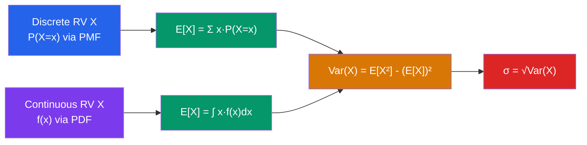

# 🎲 Random Variables

> [!abstract] TL;DR
> A random variable translates probabilistic outcomes into numbers, enabling computation. Expectation gives the "center of mass" of the distribution, variance measures spread, and covariance/correlation captures how two variables move together. These quantities power virtually all of statistics and machine learning.

## Intuition — analogy FIRST
A random variable is like a score function at a game show. The game show (sample space) has many possible outcomes, but you don't care which specific outcome happens — you only care about the number that gets assigned: your winnings. The expected value is what you'd average out to if you played the same game thousands of times. The variance tells you how wild the swings are — a boring slot machine vs. a high-stakes poker table might have the same expected payout but wildly different variances.

---

## How It Works

## Key Concepts / Details

### Random Variables
A **random variable** $X: \Omega \to \mathbb{R}$ is a function that assigns a real number to each outcome in the sample space. Two types:

- **Discrete**: $X$ takes countably many values $\{x_1, x_2, \ldots\}$
- **Continuous**: $X$ takes values in an interval; individual values have zero probability

### Discrete: PMF and CDF
**Probability mass function (PMF)**: $p(x) = P(X = x) \ge 0$, with $\sum_x p(x) = 1$

**Cumulative distribution function (CDF)**: $F(x) = P(X \le x) = \sum_{k \le x} p(k)$

### Continuous: PDF and CDF
**Probability density function (PDF)**: $f(x) \ge 0$, with $\int_{-\infty}^\infty f(x)\,dx = 1$

$$P(a \le X \le b) = \int_a^b f(x)\,dx$$

**CDF**: $F(x) = P(X \le x) = \int_{-\infty}^x f(t)\,dt$; note $f(x) = F'(x)$.

Individual values: $P(X = x) = 0$ for continuous $X$ (zero-width interval).

### Expectation (Mean)
$$E[X] = \begin{cases} \sum_x x\,p(x) & \text{discrete} \\ \int_{-\infty}^\infty x\,f(x)\,dx & \text{continuous} \end{cases}$$

**Properties**:
- **Linearity**: $E[aX + b] = aE[X] + b$
- **Linearity of sum**: $E[X + Y] = E[X] + E[Y]$ (always, regardless of dependence)
- **LOTUS** (Law of the Unconscious Statistician): $E[g(X)] = \sum_x g(x)p(x)$ or $\int g(x)f(x)\,dx$

### Variance and Standard Deviation
$$\text{Var}(X) = E\!\left[(X - \mu)^2\right] = E[X^2] - (E[X])^2$$
$$\sigma = \sqrt{\text{Var}(X)}$$

**Properties**:
- $\text{Var}(aX + b) = a^2\,\text{Var}(X)$
- $\text{Var}(X + Y) = \text{Var}(X) + \text{Var}(Y) + 2\,\text{Cov}(X,Y)$
- If $X, Y$ independent: $\text{Var}(X + Y) = \text{Var}(X) + \text{Var}(Y)$

### Covariance and Correlation
$$\text{Cov}(X,Y) = E[(X-\mu_X)(Y-\mu_Y)] = E[XY] - E[X]E[Y]$$

$$\rho(X,Y) = \frac{\text{Cov}(X,Y)}{\sigma_X\,\sigma_Y}, \quad -1 \le \rho \le 1$$

- $\rho = 1$: perfect positive linear relationship; $\rho = -1$: perfect negative; $\rho = 0$: uncorrelated
- $X, Y$ independent $\Rightarrow$ $\text{Cov}(X,Y) = 0$; converse **false** in general

### Moments and MGF
The $n$-th **moment** is $E[X^n]$; the $n$-th **central moment** is $E[(X-\mu)^n]$.

**Moment generating function (MGF)**:
$$M_X(t) = E[e^{tX}]$$

When it exists: $E[X^n] = M_X^{(n)}(0)$ (take $n$-th derivative at $t=0$). The MGF uniquely determines the distribution and is useful for proving the central limit theorem and computing moments of sums.

### Conditional Expectation
$$E[X \mid Y = y] = \int x\,f_{X|Y}(x \mid y)\,dx$$

**Law of total expectation**: $E[X] = E[E[X \mid Y]]$

**Law of total variance**: $\text{Var}(X) = E[\text{Var}(X|Y)] + \text{Var}(E[X|Y])$

---

## Real-World Notes
- **Finance**: Expected return $E[R]$ and variance $\text{Var}(R)$ of a portfolio; covariance between assets determines diversification benefit (Markowitz portfolio theory).
- **Machine learning**: Loss functions are expectations of per-example losses: $\mathcal{L}(\theta) = E_{(x,y)\sim P}[\ell(f_\theta(x), y)]$. Empirical risk minimization approximates this expectation with a sample mean.
- **Signal processing**: Random noise is modeled as a random variable with $E[\text{noise}] = 0$ and variance $\sigma^2$; SNR = signal power / noise variance.
- **Operations research**: Expected value of a queueing system's wait time, variance used to bound tail probabilities via Chebyshev's inequality.

---

## Common Pitfalls
- **$E[g(X)] \ne g(E[X])$ in general (Jensen's inequality)**: $E[X^2] \ge (E[X])^2$ always; $E[\sqrt{X}] \le \sqrt{E[X]}$ for non-negative $X$. Equality holds iff $g$ is linear.
- **Uncorrelated $\ne$ independent**: $\text{Cov}(X,Y) = 0$ means no linear relationship, but $X$ and $Y$ could still have a non-linear dependence (e.g., $Y = X^2$ with $X$ symmetric around 0).
- **PDF is not a probability**: $f(x)$ can exceed 1 — it is a density. Only $\int f(x)\,dx$ over an interval gives a probability.
- **Zero variance $\Rightarrow$ constant**: If $\text{Var}(X) = 0$, then $X = E[X]$ almost surely. Do not confuse small variance with zero variance.

---

## Related Concepts
- [[_MOC_Probability_and_Statistics|↑ Probability and Statistics MOC]]
- [[Probability_Theory]] — random variables are functions on the sample space defined by probability measures
- [[Common_Probability_Distributions]] — specific PMFs and PDFs and their E/Var formulas
- [[Regression_and_Correlation]] — OLS regression minimizes $E[(Y - \hat{Y})^2]$; correlation coefficient $\rho$ appears directly

---

## Review Questions
1. Let $X$ be the number of heads in 3 fair coin flips. Write down the PMF, compute $E[X]$ and $\text{Var}(X)$.
2. For a continuous RV with PDF $f(x) = 3x^2$ on $[0,1]$, find $E[X]$, $E[X^2]$, and $\text{Var}(X)$.
3. Suppose $X$ and $Y$ have $E[X] = 2$, $E[Y] = 3$, $\text{Var}(X) = 4$, $\text{Var}(Y) = 9$, $\text{Cov}(X,Y) = 2$. Find $E[2X - Y]$ and $\text{Var}(2X - Y)$.
4. Give an example of two random variables that are uncorrelated but not independent.

---

## Sources
- DeGroot & Schervish, *Probability and Statistics*, Ch. 3–4
- Feller, *An Introduction to Probability Theory and Its Applications*, Vol. 2
- Casella & Berger, *Statistical Inference*, Ch. 2

#probability #random-variables #expectation #variance #covariance #correlation
