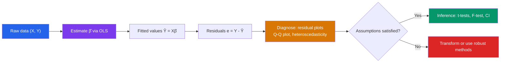

# 🎲 Regression and Correlation

> [!abstract] TL;DR
> Linear regression models the relationship between a response variable and one or more predictors by finding the line (or hyperplane) that minimizes squared residuals. OLS delivers closed-form coefficient estimates; $R^2$ measures explanatory power; and $t$- and $F$-tests assess statistical significance. Understanding the LINE assumptions is essential for valid inference.

## Intuition — analogy FIRST
Picture plotting height on the $x$-axis and weight on the $y$-axis for 100 people. Regression fits the "best straight line" through that cloud of points — "best" meaning it minimizes the total squared vertical distance from each point to the line. The slope tells you: for every extra centimeter of height, weight increases by $\hat{\beta}_1$ kg on average. The intercept anchors the line. Residuals are the leftover scatter the line cannot explain; $R^2$ is what fraction of the total scatter the line does explain.

---

## How It Works

## Key Concepts / Details

### Simple Linear Regression
Model: $Y_i = \beta_0 + \beta_1 X_i + \varepsilon_i$, where $\varepsilon_i \overset{iid}{\sim} N(0, \sigma^2)$.

**OLS estimators** (minimizing $\sum_{i=1}^n (y_i - b_0 - b_1 x_i)^2$):
$$\hat{\beta}_1 = \frac{\sum_{i=1}^n (x_i - \bar{x})(y_i - \bar{y})}{\sum_{i=1}^n (x_i - \bar{x})^2} = \frac{S_{xy}}{S_{xx}}$$
$$\hat{\beta}_0 = \bar{y} - \hat{\beta}_1\bar{x}$$

The fitted line always passes through $(\bar{x}, \bar{y})$.

**Geometric interpretation**: OLS minimizes the sum of squared *vertical* distances (residuals), not perpendicular distances.

### Goodness of Fit: $R^2$
**Total Sum of Squares**: $\text{TSS} = \sum(y_i - \bar{y})^2$

**Regression SS**: $\text{RSS} = \sum(\hat{y}_i - \bar{y})^2$

**Residual SS (error)**: $\text{SSE} = \sum(y_i - \hat{y}_i)^2 = \sum e_i^2$

$$R^2 = 1 - \frac{\text{SSE}}{\text{TSS}} = \frac{\text{RSS}}{\text{TSS}} \in [0, 1]$$

$R^2$ is the proportion of variance in $Y$ explained by $X$. Note: $R = \sqrt{R^2}$ equals the sample correlation coefficient $r$ in simple regression.

**Sample correlation**:
$$r = \frac{S_{xy}}{\sqrt{S_{xx}\,S_{yy}}}, \quad -1 \le r \le 1$$

### Regression Assumptions (LINE)
1. **L**inearity: The true relationship between $X$ and $Y$ is linear
2. **I**ndependence: Observations are independent (especially important in time series)
3. **N**ormality: Errors $\varepsilon_i$ are normally distributed
4. **E**qual variance (homoscedasticity): $\text{Var}(\varepsilon_i) = \sigma^2$ for all $i$

### Multiple Linear Regression
Model: $\mathbf{Y} = \mathbf{X}\boldsymbol{\beta} + \boldsymbol{\varepsilon}$ where $\mathbf{Y}$ is $n\times 1$, $\mathbf{X}$ is the $n\times(p+1)$ design matrix (with a column of 1's), $\boldsymbol{\beta}$ is $(p+1)\times 1$.

**OLS solution** (assuming $\mathbf{X}^T\mathbf{X}$ is invertible):
$$\hat{\boldsymbol{\beta}} = (\mathbf{X}^T\mathbf{X})^{-1}\mathbf{X}^T\mathbf{Y}$$

$\hat{\boldsymbol{\beta}}$ is unbiased and BLUE (Best Linear Unbiased Estimator — Gauss-Markov theorem).

### Inference on Coefficients
Under normality, each coefficient satisfies:
$$\frac{\hat{\beta}_j - \beta_j}{\text{SE}(\hat{\beta}_j)} \sim t_{n-p-1}$$

**$t$-test for individual coefficient**: $H_0: \beta_j = 0$ (tests whether predictor $j$ is useful given others in the model).

**$F$-test for overall model**: $H_0: \beta_1 = \cdots = \beta_p = 0$:
$$F = \frac{\text{RSS}/p}{\text{SSE}/(n-p-1)} \sim F_{p,\, n-p-1}$$

### Residual Analysis
Plot residuals against:
- Fitted values $\hat{y}$: random scatter desired (no pattern = linearity + homoscedasticity OK)
- Predictors: check for non-linearity
- Index/time: check for autocorrelation

**Q-Q plot** of residuals: should follow a straight line if normality holds.

### Extensions
- **Polynomial regression**: Add $X^2, X^3, \ldots$ as predictors — still linear in parameters
- **Ridge regression**: Minimize $\text{SSE} + \lambda\|\boldsymbol{\beta}\|_2^2$ (L2 regularization; shrinks coefficients toward zero, prevents overfitting)
- **Lasso**: Minimize $\text{SSE} + \lambda\|\boldsymbol{\beta}\|_1$ (L1 regularization; performs variable selection by zeroing some coefficients)

---

## Real-World Notes
- **Predicting house prices**: Multiple regression with square footage, bedrooms, location, age as predictors; $F$-test checks if the model is useful overall; individual $t$-tests identify significant predictors.
- **Econometrics**: Estimating the return to education (salary vs. years of schooling) requires controlling for confounders (ability, experience) via multiple regression; omitted variable bias is a central concern.
- **A/B testing with controls**: Adding pre-treatment covariates as regression controls (ANCOVA) reduces residual variance, increasing power to detect treatment effects.
- **Sensor calibration**: Regression maps raw sensor readings to true physical values; residual analysis identifies systematic biases or non-linearities in the sensor.

---

## Common Pitfalls
- **Correlation $\ne$ causation**: $r$ close to $\pm 1$ does not imply a causal relationship — a lurking variable may drive both $X$ and $Y$ (e.g., ice cream sales and drowning rates both rise in summer).
- **Omitted variable bias**: Leaving out a predictor correlated with both $Y$ and included predictors biases all coefficient estimates.
- **Extrapolation**: The model is only valid in the range of $X$ values used to fit it. Predicting far outside this range can be wildly inaccurate.
- **Overfitting**: Adding more predictors always increases $R^2$, even if they are noise. Use **adjusted $R^2$** or AIC/BIC, which penalize for extra parameters.

---

## Related Concepts
- [[_MOC_Probability_and_Statistics|↑ Probability and Statistics MOC]]
- [[Statistical_Inference]] — $t$-tests and $F$-tests on regression coefficients; confidence intervals for predictions
- [[Random_Variables]] — regression model assumes $Y = \mu(X) + \varepsilon$ where $\varepsilon$ is a random variable
- [[Bayesian_Statistics]] — Bayesian linear regression places priors on $\boldsymbol{\beta}$; Ridge regression corresponds to a Gaussian prior

---

## Review Questions
1. For the dataset: $x = (1,2,3,4,5)$, $y = (2,4,5,4,5)$, compute $\hat{\beta}_0$ and $\hat{\beta}_1$ using the OLS formulas. Then compute $R^2$.
2. In multiple regression, explain why adding an irrelevant predictor cannot decrease $R^2$ but will decrease adjusted $R^2$. What does this imply for model selection?
3. A regression of salary (Y) on years of experience (X) gives $\hat{\beta}_1 = 2500$ with $\text{SE} = 600$ and $n = 50$. Test $H_0: \beta_1 = 0$ at $\alpha = 0.05$. Is experience a statistically significant predictor?
4. What is the difference between Ridge regression and Lasso, and why does Lasso produce sparse solutions while Ridge does not?

---

## Sources
- Montgomery, Peck & Vining, *Introduction to Linear Regression Analysis*, 5th ed.
- Freedman, *Statistical Models: Theory and Practice*
- Hastie, Tibshirani & Friedman, *The Elements of Statistical Learning*, Ch. 3

#statistics #regression #linear-regression #ols #r-squared #correlation
