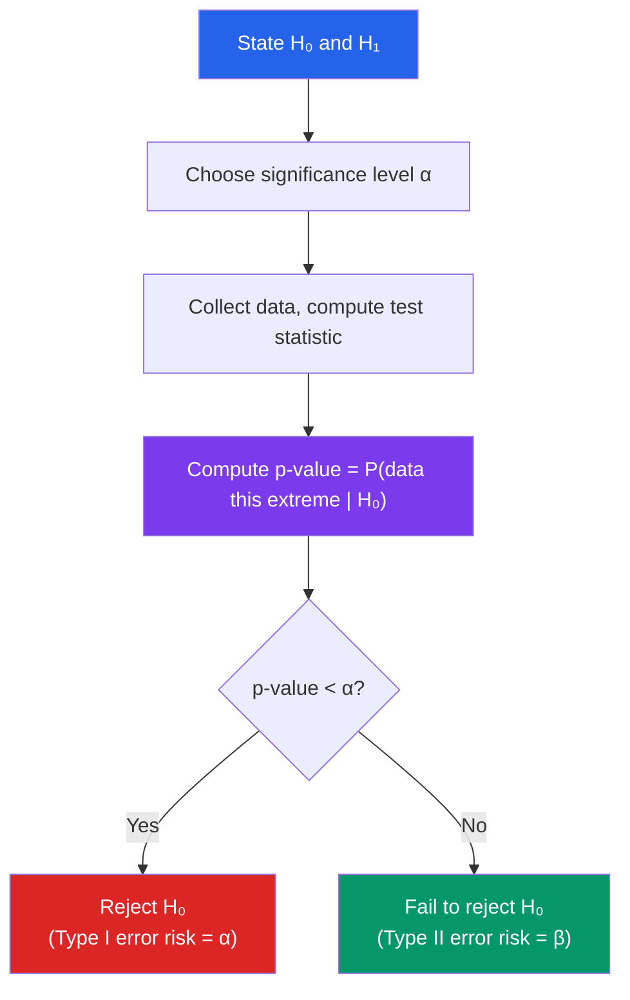

# 🎲 Statistical Inference

> [!abstract] TL;DR
> Statistical inference uses sample data to draw conclusions about an unknown population. Point estimation (especially MLE) produces a single best guess for parameters; confidence intervals quantify uncertainty; hypothesis tests decide whether data supports or refutes a claim, with Type I/II errors measuring the risk of each kind of mistake.

## Intuition — analogy FIRST
Imagine you are a detective. The "population" is an entire city; the "sample" is the 100 witnesses you can interview. You use their testimony (data) to estimate what really happened (population parameter) and assess your certainty. A confidence interval is your range of plausible answers: "The suspect was in this district, 95% confident." A hypothesis test is a verdict: "Based on this evidence, we reject the alibi." The $p$-value is how surprising the evidence would be if the alibi were true — small $p$ means very suspicious.

---

## How It Works

## Key Concepts / Details

### Population vs. Sample
- **Population**: the full set of objects of interest; described by parameters (e.g., $\mu$, $\sigma^2$, $p$)
- **Sample**: observed data $X_1, \ldots, X_n$ drawn from the population; described by statistics

A **statistic** $T = T(X_1,\ldots,X_n)$ is any function of the data. Its probability distribution is the **sampling distribution**.

### Point Estimation
An **estimator** $\hat{\theta}$ of parameter $\theta$ is a statistic used as a "best guess."

**Desirable properties**:
- **Unbiasedness**: $E[\hat{\theta}] = \theta$ (no systematic over/under-estimation)
- **Consistency**: $\hat{\theta} \xrightarrow{p} \theta$ as $n \to \infty$
- **Efficiency**: minimum variance among all unbiased estimators (UMVUE)

The sample mean $\bar{X} = \frac{1}{n}\sum X_i$ is an unbiased estimator of $\mu$ with $\text{Var}(\bar{X}) = \sigma^2/n$.

### Maximum Likelihood Estimation (MLE)
Given data $x_1,\ldots,x_n$ and model $f(x;\theta)$, the MLE maximizes the **likelihood**:
$$\hat{\theta}_{\text{MLE}} = \arg\max_\theta L(\theta) = \arg\max_\theta \prod_{i=1}^n f(x_i;\theta)$$

In practice, maximize the **log-likelihood** (sum instead of product):
$$\hat{\theta}_{\text{MLE}} = \arg\max_\theta \ell(\theta) = \arg\max_\theta \sum_{i=1}^n \log f(x_i;\theta)$$

**Example**: For $X_i \sim N(\mu, \sigma^2)$, the MLE gives $\hat{\mu} = \bar{x}$ and $\hat{\sigma}^2 = \frac{1}{n}\sum(x_i - \bar{x})^2$ (biased; divide by $n-1$ for unbiased).

**Properties of MLE**: consistent, asymptotically normal, asymptotically efficient under regularity conditions.

### Confidence Intervals
A $100(1-\alpha)\%$ **confidence interval** $[L, U]$ satisfies:
$$P(\theta \in [L, U]) = 1 - \alpha$$

This means: if we repeated the experiment many times, $100(1-\alpha)\%$ of intervals would contain the true $\theta$.

**CI for $\mu$ with known $\sigma$** (z-interval):
$$\bar{x} \pm z_{\alpha/2}\frac{\sigma}{\sqrt{n}}$$

For 95% CI, $z_{0.025} = 1.96$.

**CI for $\mu$ with unknown $\sigma$** (t-interval):
$$\bar{x} \pm t_{\alpha/2,\, n-1}\frac{s}{\sqrt{n}}$$

where $s$ is the sample standard deviation and $t_{\alpha/2,n-1}$ is the critical value from the $t$-distribution with $n-1$ degrees of freedom.

### Hypothesis Testing Framework

**Null hypothesis** $H_0$: the default, "nothing interesting" claim (e.g., $\mu = \mu_0$, $\beta = 0$).

**Alternative hypothesis** $H_1$: the claim we want evidence for (one-sided or two-sided).

**Test statistic**: a summary of the data measuring how far the sample is from $H_0$.

**$p$-value**: $P(\text{test statistic} \ge \text{observed} \mid H_0 \text{ true})$. Small $p$ means data is unlikely under $H_0$.

**Decision rule**: reject $H_0$ if $p$-value $< \alpha$ (the **significance level**, typically 0.05).

### Error Types and Power

| | $H_0$ True | $H_0$ False |
|--|------------|-------------|
| **Reject $H_0$** | Type I error (prob $\alpha$) | Correct (power $= 1-\beta$) |
| **Fail to reject $H_0$** | Correct (prob $1-\alpha$) | Type II error (prob $\beta$) |

**Power** $= P(\text{reject } H_0 \mid H_1 \text{ true}) = 1 - \beta$. Power increases with sample size and effect size.

### Common Tests
- **One-sample $z$-test**: $Z = (\bar{X} - \mu_0)/(\sigma/\sqrt{n})$ when $\sigma$ known
- **One-sample $t$-test**: $T = (\bar{X} - \mu_0)/(s/\sqrt{n})$ when $\sigma$ unknown; $T \sim t_{n-1}$ under $H_0$
- **Two-sample $t$-test**: compare means of two groups
- **$\chi^2$ test**: goodness-of-fit, independence in contingency tables; $\chi^2 = \sum (O_i - E_i)^2/E_i$
- **$F$-test**: compare variances; used in ANOVA and regression

### Multiple Testing
Testing $m$ hypotheses simultaneously with $\alpha = 0.05$ each gives expected $0.05m$ false positives. Corrections:
- **Bonferroni**: use $\alpha/m$ per test (conservative, controls familywise error rate)
- **Benjamini-Hochberg**: controls false discovery rate (FDR) at level $q$

---

## Real-World Notes
- **Clinical trials**: Phase III trials use hypothesis testing to determine if a drug reduces mortality. Power calculations determine required sample size upfront to ensure the study can detect a clinically meaningful effect.
- **A/B testing**: Tech companies run experiments where treatment/control groups are compared via $t$-tests or $z$-tests. Multiple testing corrections are critical when testing many features simultaneously.
- **Quality control**: Manufacturing uses hypothesis tests to detect when a process drifts out of specification (Statistical Process Control / control charts).
- **Genome-wide association studies (GWAS)**: Test millions of genetic variants simultaneously; stringent Bonferroni corrections ($\alpha \approx 5 \times 10^{-8}$) are required to control false positives.

---

## Common Pitfalls
- **$p$-value is NOT the probability $H_0$ is true**: It is $P(\text{data} \mid H_0)$, not $P(H_0 \mid \text{data})$. This confusion is widespread even among researchers.
- **Failure to reject $\ne$ acceptance**: "Not enough evidence" does not mean $H_0$ is true. Absence of evidence is not evidence of absence, especially with small samples.
- **Confidence interval misconception**: A 95% CI does not mean "95% probability that $\theta$ is in this specific interval." After data are observed, $\theta$ is either in the interval or not. The 95% refers to the procedure's long-run coverage.
- **$p$-hacking**: Repeatedly testing different subgroups or transformations until $p < 0.05$ is found inflates Type I error. Pre-registration and multiple testing corrections mitigate this.

---

## Related Concepts
- [[_MOC_Probability_and_Statistics|↑ Probability and Statistics MOC]]
- [[Random_Variables]] — sampling distributions of estimators (e.g., $\bar{X}$) and their variance
- [[Common_Probability_Distributions]] — $t$, $\chi^2$, $F$ distributions arise as sampling distributions under the Normal model
- [[Regression_and_Correlation]] — $t$-tests and $F$-tests used to test regression coefficients
- [[Bayesian_Statistics]] — Bayesian alternative where parameters have prior distributions and posteriors replace $p$-values

---

## Review Questions
1. A manufacturer claims their product has a mean lifetime of 1000 hours. A sample of 36 products has $\bar{x} = 980$ hours and $s = 60$ hours. At $\alpha = 0.05$, test $H_0: \mu = 1000$ vs. $H_1: \mu < 1000$ using a $t$-test.
2. Explain the difference between Type I and Type II errors in the context of a medical test for a disease. Which error is more costly, and how does this inform the choice of $\alpha$?
3. Construct a 95% confidence interval for the proportion $p$ of voters who support a candidate, given a random sample of 400 voters with 220 supporting the candidate.
4. If 20 independent hypothesis tests are performed at $\alpha = 0.05$, what is the expected number of Type I errors? How does the Bonferroni correction address this?

---

## Sources
- Casella & Berger, *Statistical Inference*, Ch. 6–9
- Hogg, McKean & Craig, *Introduction to Mathematical Statistics*, Ch. 4–6
- Wainer, *Truth or Truthiness* (p-value misuse examples)

#statistics #inference #hypothesis-testing #mle #confidence-intervals #p-value
