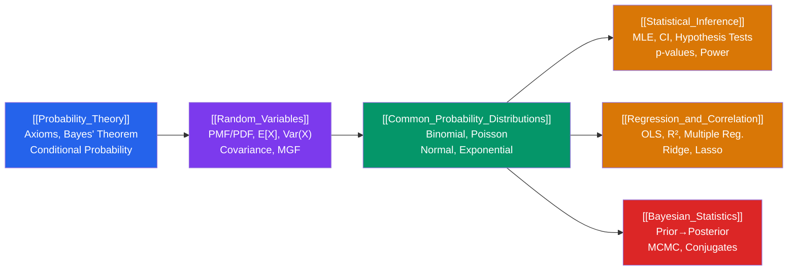

# 🎲 Probability and Statistics — Map of Content

> [!abstract] Overview
> Probability and statistics from Kolmogorov axioms through Bayesian inference: the mathematical foundation for data science, machine learning, and scientific reasoning. This section builds from abstract probability theory through random variable calculus, common distributions, frequentist inference, regression modeling, and finally Bayesian reasoning — the complete toolkit for reasoning under uncertainty.

---

## Learning Path

---

## Notes in This Section

| Note | Difficulty | Core Concept |
|------|-----------|--------------|
| [[Probability_Theory]] | Intermediate | Sample space, Kolmogorov axioms, Bayes' theorem, independence |
| [[Random_Variables]] | Intermediate | PMF/PDF/CDF, expectation, variance, covariance, MGF |
| [[Common_Probability_Distributions]] | Intermediate | Bernoulli, Binomial, Poisson, Normal, Exponential, CLT |
| [[Statistical_Inference]] | Intermediate | MLE, confidence intervals, hypothesis testing, $p$-values |
| [[Regression_and_Correlation]] | Intermediate | OLS regression, $R^2$, multiple regression, regularization |
| [[Bayesian_Statistics]] | Advanced | Prior-posterior, conjugates, credible intervals, MCMC |

---

## Key Formulas at a Glance

| Concept | Formula |
|---------|---------|
| Bayes' theorem | $P(A\mid B) = P(B\mid A)P(A)/P(B)$ |
| Expectation (discrete) | $E[X] = \sum_x x\,P(X=x)$ |
| Variance shortcut | $\text{Var}(X) = E[X^2] - (E[X])^2$ |
| Central Limit Theorem | $(\bar{X}_n - \mu)/(\sigma/\sqrt{n}) \xrightarrow{d} N(0,1)$ |
| 95% z-interval | $\bar{x} \pm 1.96\,\sigma/\sqrt{n}$ |
| OLS slope | $\hat{\beta}_1 = S_{xy}/S_{xx}$ |
| OLS matrix form | $\hat{\boldsymbol{\beta}} = (\mathbf{X}^T\mathbf{X})^{-1}\mathbf{X}^T\mathbf{Y}$ |
| Bayesian posterior | $P(\theta\mid x) \propto P(x\mid\theta)\,P(\theta)$ |

---

## Distribution Quick Reference

| Distribution | PMF/PDF | Mean | Variance |
|-------------|---------|------|---------|
| Bernoulli$(p)$ | $p^x(1-p)^{1-x}$ | $p$ | $p(1-p)$ |
| Binomial$(n,p)$ | $\binom{n}{k}p^k(1-p)^{n-k}$ | $np$ | $np(1-p)$ |
| Poisson$(\lambda)$ | $e^{-\lambda}\lambda^k/k!$ | $\lambda$ | $\lambda$ |
| Uniform$(a,b)$ | $1/(b-a)$ | $(a+b)/2$ | $(b-a)^2/12$ |
| Exponential$(\lambda)$ | $\lambda e^{-\lambda x}$ | $1/\lambda$ | $1/\lambda^2$ |
| Normal$(\mu,\sigma^2)$ | $(1/\sigma\sqrt{2\pi})e^{-(x-\mu)^2/2\sigma^2}$ | $\mu$ | $\sigma^2$ |

---

## Prerequisites
- High-school algebra and basic combinatorics (permutations, combinations)
- Single-variable calculus (for continuous probability — integrals, derivatives)
- [[03_Linear_Algebra/_MOC_Linear_Algebra|Linear Algebra]] — matrix operations for multiple regression

## Connects To
- **Machine Learning**: Loss functions as expectations, gradient descent on likelihood, Naive Bayes classifiers, Bayesian neural networks
- **Econometrics** — [[../Econometrics/_MOC_Econometrics|Econometrics MOC]]: OLS regression, time series, causal inference
- **Time Series Analysis** — [[../Time_Series_Analysis/_MOC_Time_Series_Analysis|Time Series MOC]]: stochastic processes, ARIMA
- **Finance** — [[../Finance/_MOC_Finance|Finance MOC]]: portfolio theory, option pricing (Black-Scholes uses Normal distribution)
- **Quantitative Finance**: risk models, Value-at-Risk, Monte Carlo simulation

---

## Sources
- DeGroot & Schervish, *Probability and Statistics*, 4th edition
- Casella & Berger, *Statistical Inference*, 2nd edition
- Gelman et al., *Bayesian Data Analysis*, 3rd edition
- Ross, *Introduction to Probability Models*, 12th edition

#mathematics #probability #statistics #moc
